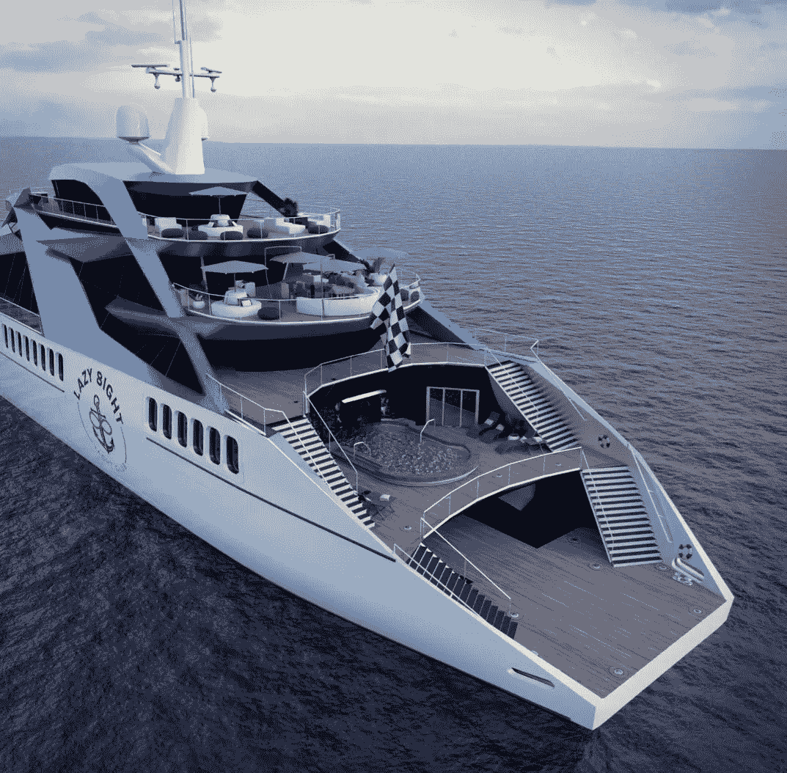

# 五亿美元的游艇，NFT 酒店会员资格，以及即将到来的合并

> 原文：<https://medium.com/coinmonks/a-half-billion-dollar-yacht-nft-hospitality-memberships-an-upcoming-merge-90a84055be4d?source=collection_archive---------27----------------------->

By [Holly Eimer](https://medium.com/u/e25f399c6d84?source=post_page-----90a84055be4d--------------------------------) for [Message in a Bottle Newsletter by Lazy 8ight YC](https://medium.com/u/6dcb932fb22b?source=post_page-----90a84055be4d--------------------------------)

**Crypto，NFTs，&元宇宙**

香港时间上午 8 点，比特币交易价格为 23，347 美元，在过去 24 小时内下跌了 2.16%，以太网下跌了 2.2%，至 1，835 美元。在 CoinMarketCap 排名前十的加密货币中，唯一一种逆势而上的是 XRP，该货币上涨 0.7%，至 0.38 美元，此前该代币的发行者 Ripple 被评为 Inc. 5000 家增长最快的美国私营公司之一。在前 10 名中，Dogecoin 损失最大，下跌 7.4%，至 0.08 美元。此外，柴犬币下跌 6.5%，至 0.00001478 美元。最近的消费者价格指数统计数据显示，美国通胀正在放缓，7 月份的年增长率从 6 月份的 9.1%降至 8.5%。

以太坊工作证明链和股权证明信标链都已于 2020 年 12 月开始运营，将于 9 月合并，届时预计将合并。更新后，以太的新发行总量可能会下降 90%，使硬币具有价值吸引力。这个由比特币基地做出的决定也将暂时停止新以太坊的存款和取款，直到 9 月合并。

根据 Gartner 的数据，元宇宙是 2022 年五大创新技术概念之一。到 2024 年，预计全球在元宇宙技术上的支出将增加近五倍，从大约 150 亿美元增加到近 730 亿美元。今年 5 月，Meta 的国际事务总裁 Nick Clegg 表示，元宇宙有朝一日可能会发展成为一个拥有 77 万名员工、价值 2000 亿美元的行业。因此，Meta 正在投入大量资金来引领这一转变。

游戏、零售、教育、艺术、医疗保健、商业解决方案和区块链领域的领先公司都投资了这个快速发展和崛起的生态系统，摩根大通甚至将其称为“下一个万亿美元的机会”根据花旗的说法，元宇宙可能只是处于起步阶段，但它可能会提供 13 万亿美元的潜在收入，并对主要的 it 公司和加密货币产生重大影响。

纪录片导演乔·亨特上个月发布了他的 HBO Max 纪录片《我们在虚拟现实中相遇》，好评如潮。这部电影讲述了一群真实的人在日常生活中使用虚拟现实软件，参加手语课程，进行公路旅行，举办野外婚礼，并发表感人的悼词。在长达 14 个月的拍摄过程中，Hunting 每周经常花 15 个小时使用 VRChat 应用程序，同时使用 Meta 的 Oculus Quest 耳机。许多元宇宙的反对者思考为什么有人会选择虚构的现实而不是真实的现实。许多人也有类似的担忧，担心那些希望在即将到来的数字生活时代获利的大公司充满行话的元宇宙野心。人们仍然担心数据收集、隐私和数字产品的销售。

所有这些问题的解决方案在《狩猎》或他的电影中都找不到。然而，这部电影确实让我们对人们在虚拟世界中已经体验到的快乐和娱乐有了有趣的一瞥。狩猎是虚拟现实如何改变人们生活的活生生的例子。现年 23 岁的亨特在这部电影的制作过程中确立了自己作为电影制作人的地位，建立了持久的联系，甚至爱上了他现在的搭档。他认为虚拟现实是他 21 世纪生活中必不可少的无缝部分，而不是反乌托邦迷宫或营销计划。他声称，“在虚拟现实中，我感受到了前所未有的真实。经历了这一切，我终于找到了一个家。”

**豪华旅行&款待**

世界第二富豪杰夫·贝索斯将很快拥有一艘刚刚在荷兰建造的价值 5 亿美元的巨型游艇。虽然没有太多关于这艘超级游艇的信息，但在该船制造商的网站和一些媒体报道中可以找到一些细节。然而，人们知道这艘游艇将有 417 英尺(127 米)长，有多层甲板，有三个巨大的黑色桅杆(通过彭博)。据报道，定制造船公司 Oceanco 制造了一些世界上最大、最豪华的游艇，建造了这艘名为 Y721 的船只。Mohammed Al Barwani 是阿曼的百万富翁商人，是该公司的所有者，该公司总部设在荷兰。

据高端出版物《罗伯报告》称，完工后，这艘超豪华游艇有望成为世界上最大的帆船。这位实业家在他的书《解放亚马逊:杰夫·贝索斯和全球帝国的发明》中称他的船是“现存最好的帆船之一”尽管这款豪华游艇最有可能以适合贝佐斯这样的商业大亨的服饰为特色，但它也被宣传为环境可持续发展。该蓝图基于 Oceanco 屡获殊荣的环保黑珍珠号游艇。根据该公司的网站，这艘船可以在不使用任何化石燃料的情况下穿越大西洋，是世界上最大、最环保的帆船之一。

“22 年前，埃及在四季酒店向中东扩张的过程中发挥了重要作用，使其成为一个重要的旅游目的地。全球业务发展和投资组合管理总裁 Bart Carnahan 解释说:“我们的持续扩张证明了我们对该地区的持续奉献以及它为高端游客和房主提供的一切。卢克索位于埃及南部尼罗河畔，是该国最著名的城市之一，被认为是全世界最伟大的古代遗址之一。

这座令人难以置信的历史名城就像一座露天博物馆，突出展示了一些埃及最伟大的古物。它以历史名城底比斯的历史，以及壮观的卡纳克神庙和卢克索神庙遗址而闻名。卢克索四季酒店(Four Seasons Hotel Luxor)的 200 间客房和套房计划于 2025 年首次亮相，每个房间都可以看到尼罗河、国王谷和皇后谷的景观。酒店将坐落在著名的卢克索神庙附近，该神庙建于公元前 1400 年左右。

西棕榈滩现在是 NFT 餐馆热的发源地。南佛罗里达州一家名为乙烯基鱼俱乐部(VFC)的餐厅概念通过“超越用餐体验”提供了一个升级的夜晚外出，增加了一个具有特殊光彩的社交俱乐部的元素。该设置包括音乐和视觉组件，旨在提升你的情绪。您可以通过 NFT 黑胶鱼俱乐部获得社会会员资格，拥有 NFTs 的会员可以获得豪华的礼宾用餐体验。通过使用代币，俱乐部成员购买所有权，并欢迎 NFT 收藏家和市场新人申请会员资格。对 VFC 来说，这是创造一种超越酒店服务的产品的第一步；像许多公用事业代币一样，包含可交易成分的社会成员资格为其提供了有形的和预期的增长价值。

与黑胶鱼俱乐部的酒店会员类似，NFT 和豪华酒店公司 Lazy 8ight Yacht Club (L8YC)正在将 Web0(真实世界)公用事业酒店会员整合到 Web3 领域。除了 Web0 中的私人豪华活动和独一无二的可穿越大型游艇 NFTs，L8YC 还通过其独家酒店合作伙伴关系提供前所未有的游艇服务和独特体验。L8YC 经验丰富的内部销售团队协助满足游艇销售需求，无论是购买第一艘游艇，还是更新换代。L8YC 会员可以在 L8YC 的一艘游艇上享受一日游，起价仅为 300 美元。拥有全天和半天两种选择，持有者可以享受 500 多艘全天包租的游艇，无论是在美国还是在国际上。L8YC 的内部包机经纪人团队帮助规划完美的包机，无论是在米克诺斯岛过夜游览，还是去阿拉斯加旅行一周。Lazy 8ight 设计一切，从路线和活动，下至船只本身，同时协商最佳价格。

此外，Lazy 8ight 还提供私人厨师服务。他们的餐饮合作伙伴，草药厨师，策划了令人难忘的高端之夜，选择 CBD & THC 注入，以改善多菜餐。Chris Sayegh 和他的团队为活动提供豪华餐饮，提供鱼子酱站、生海鲜吧、豪华自助餐、顶级牛肉切肉站、国王三文鱼片等选项。L8YC 现在也很高兴通过他们的合作伙伴 Security & Consulting 以及他们由经验丰富的军事特种作战人员、前执法人员和情报界退休人员组成的团队来提供活动安保。

请务必访问位于[http://L8yachtclub.com](http://L8yachtclub.com)的 Lazy 8ight 游艇俱乐部网站，咨询铸造和豪华酒店服务，或者访问社交媒体上的 Discord、Twitter、Medium 和 Instagram 页面，了解最新的 L8YC 新闻。

> 交易新手？试试[密码交易机器人](/coinmonks/crypto-trading-bot-c2ffce8acb2a)或者[复制交易](/coinmonks/top-10-crypto-copy-trading-platforms-for-beginners-d0c37c7d698c)