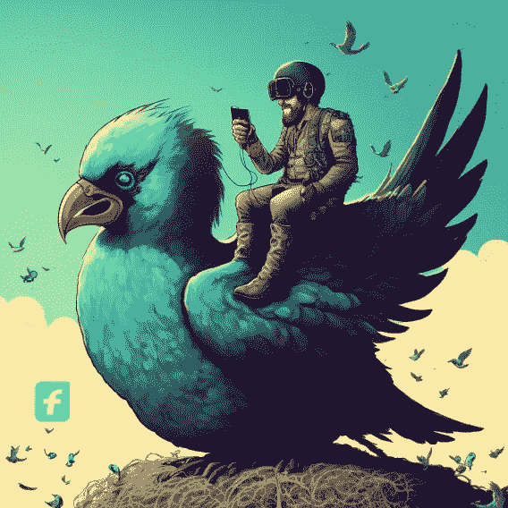

# 社交媒体中的人工智能:营销人员需要知道的 5 个技巧👨🏻‍💻

> 原文：<https://medium.com/coinmonks/a-i-in-social-media-5-tips-marketers-need-to-know-1845d9e61f0?source=collection_archive---------28----------------------->

人工智能从根本上改变了营销人员与客户互动的方式。随着人工智能驱动的软件和服务变得越来越普遍，营销人员需要了解如何利用人工智能来获得优势。人工智能可以自动化日常任务，识别客户需求，并帮助产生线索。它还可以跟踪客户情绪，并就如何改善客户体验提出建议。

在这篇文章中，我们将探讨五个技巧，以帮助营销人员在社交媒体上充分利用人工智能。我们将看看如何使用人工智能来改善客户支持，产生线索，并跟踪情绪。我们还将考虑在社交媒体上使用人工智能的潜在风险，并对人工智能在行业中的未来进行预测。

# 1.使用人工智能自动化客户服务任务

客户服务是任何成功营销战略的重要组成部分。人工智能可以帮助营销人员自动化平凡的客户服务任务，例如回答常见问题，回复消息，以及确定客户需求。这可以腾出时间来关注更有意义的客户互动，并让营销人员提供更好的客户体验。许多公司，如 Spotify 和优步，已经在使用人工智能来自动化客户服务流程。

# 2.利用人工智能产生销售线索

人工智能也可以用来产生线索。人工智能软件可以分析它收集的数据，以识别潜在的线索，并向他们提供个性化的信息。该软件可以跟踪客户互动，洞察客户偏好和兴趣。这可以帮助营销人员锁定正确的客户，增加他们产生销售线索和转化的机会。

# 3.使用人工智能跟踪客户情绪

人工智能可以跟踪客户情绪，并在问题失控之前识别问题。人工智能软件可以分析客户反馈，并确定需要改进的领域。这有助于营销人员在客户担忧成为严重问题之前识别并解决它们。AI 甚至可以更进一步，提供如何改善客户体验的建议。

# 4.利用人工智能进行预测

人工智能还可以用来预测客户的行为。人工智能软件可以分析大量数据，以识别客户趋势，并为营销活动提出建议。这可以帮助营销人员锁定正确的客户，并提高他们营销工作的有效性。

# 5.了解使用人工智能的风险

人工智能是一个强大的工具，但它也有风险。人工智能可以用来操纵客户，传播错误信息，侵犯隐私。营销人员需要意识到这些风险，并采取措施保护客户的数据和隐私。

## 未来的预测

人工智能将继续彻底改变营销人员与客户互动的方式。我们可以期待看到人工智能驱动的软件变得更加广泛，营销人员将需要了解如何利用人工智能。人工智能将变得更加复杂，提供更加个性化的体验，并将用于自动化越来越多的任务。然而，营销人员需要意识到使用人工智能的风险，并采取措施保护客户的数据和隐私。

> *[*WOKEYS*](https://twitter.com/TheWokeys)*来了！！！**

*_ _ _ _ _ _ _ _ _ _ _ _ _ _ _ _ _ _ _ _ _ _ _ _ _ _ _ _ _ _
_ _ _ _ _ _ _ _ _ _ _ _ _ _ _ _ _ _ _ _ _ _ _ _ _ _ _ _ _ _ _*

***永远小心！！！⚠️***

> **这一点我怎么强调都不为过！保持高度警惕，留意你点击的每一个链接、你做的每一笔交易和你接触的每一个人，因为这个领域骗子很多，即使是最好看的项目也会被撤下。**
> 
> *点击所有链接之前，要再三检查，确保它们是你正在寻找的官方链接。此外，在给自己或他人发送任何有价值的东西之前，要再三检查所有的钱包地址。*

> *请将 Polygon Matic 发送到这个 Eth 地址或 Eth Tokens，以支持我和我不断增长的家庭🙏🏼*
> 
> ****0xb 53b 3978333 e 11 c 382 ab 619 f 02 f 469 A8 c 70750 af****
> 
> **或**
> 
> ****买点 Merch！*** *[*https://www . red bubble . com/I/sticker/Mick-And-Rory-Adventure-Time-2-by-多层/131503580ejug 5*](https://www.redbubble.com/i/sticker/Mick-And-Rory-Adventure-Time-2-by-MultiLayered/131503580.EJUG5)**
> 
> ***_ _ _ _ _ _ _ _ _ _ _ _ _ _ _ _ _ _ _ _ _ _ _ _ _ _ _ _ _ _ _ _ _ _ _ _ _ _ _ _ _ _ _ _ _ _ _ _***

> **如果你在 2023 年 1 月 17 日之前订阅了时事通讯，你就有机会赢得来自 WOKEYS 的 1/30 免费 NFT**
> 
> **[*订阅时事通讯！*](https://multilayeredmarketing.beehiiv.com/subscribe) *📰***

****

# **干杯，
Ty**

**[LinkTree 链接](https://linktr.ee/multilayeredmarketing)**

****我的其他一些博文:** [十大 Web3 作家](/coinmonks/top-10-web3-writers-ca995689c17f) [web 3 的 5 个败笔](/coinmonks/5-downfalls-of-web3-cd5dc8ade4fd)
[5 + 5 不和谐的战术](/coinmonks/5-tips-for-a-better-discord-nft-crypto-edition-ff9b039d0359)
[Crypto 101:初学者指南](/coinmonks/crypto-101-a-beginners-guide-345d440bd163)
[NFT 最佳实践(营销&社区成长)](/coinmonks/top-5-nft-best-practices-marketing-and-community-growth-7025e26eb50c)
[Web3 基础知识](/coinmonks/web3-basics-252121357f33)** 

> ***交易新手？试试* [*密码交易机器人*](/coinmonks/crypto-trading-bot-c2ffce8acb2a) *或者* [*复制交易*](/coinmonks/top-10-crypto-copy-trading-platforms-for-beginners-d0c37c7d698c)**
> 
> ***加入 Coinmonks* [*电报频道*](https://t.me/coincodecap) *和* [*Youtube 频道*](https://www.youtube.com/c/coinmonks/videos) *获取每日* [*加密新闻*](http://coincodecap.com/)**

# **另外，阅读**

*   **[复制交易](/coinmonks/top-10-crypto-copy-trading-platforms-for-beginners-d0c37c7d698c) | [加密税务软件](/coinmonks/crypto-tax-software-ed4b4810e338)**
*   **[网格交易](https://coincodecap.com/grid-trading) | [加密硬件钱包](/coinmonks/the-best-cryptocurrency-hardware-wallets-of-2020-e28b1c124069)**
*   **[密码电报信号](/coinmonks/top-3-telegram-channels-for-crypto-traders-in-2021-8385f4411ff4) | [密码交易机器人](/coinmonks/crypto-trading-bot-c2ffce8acb2a)**
*   **[最佳加密交易所](/coinmonks/crypto-exchange-dd2f9d6f3769) | [印度最佳加密交易所](/coinmonks/bitcoin-exchange-in-india-7f1fe79715c9)**
*   **[面向开发人员的最佳加密 API](/coinmonks/best-crypto-apis-for-developers-5efe3a597a9f)**