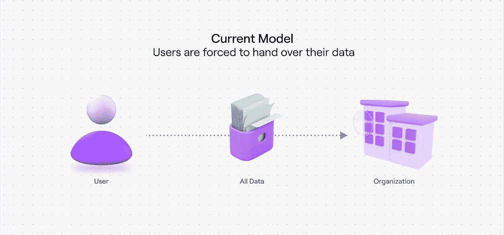
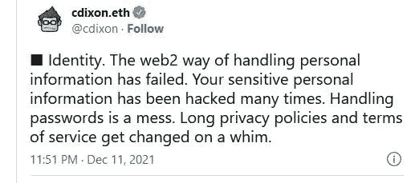
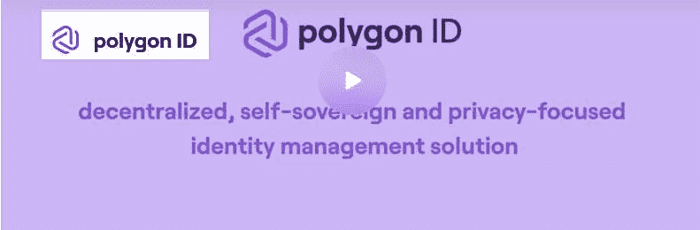
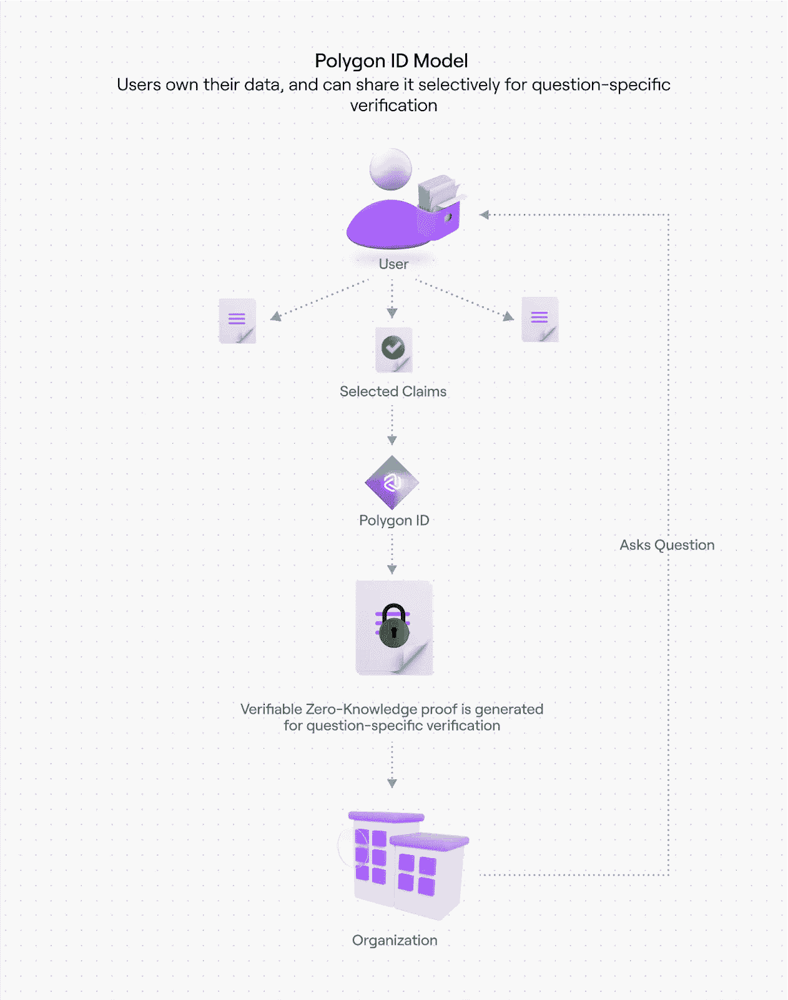
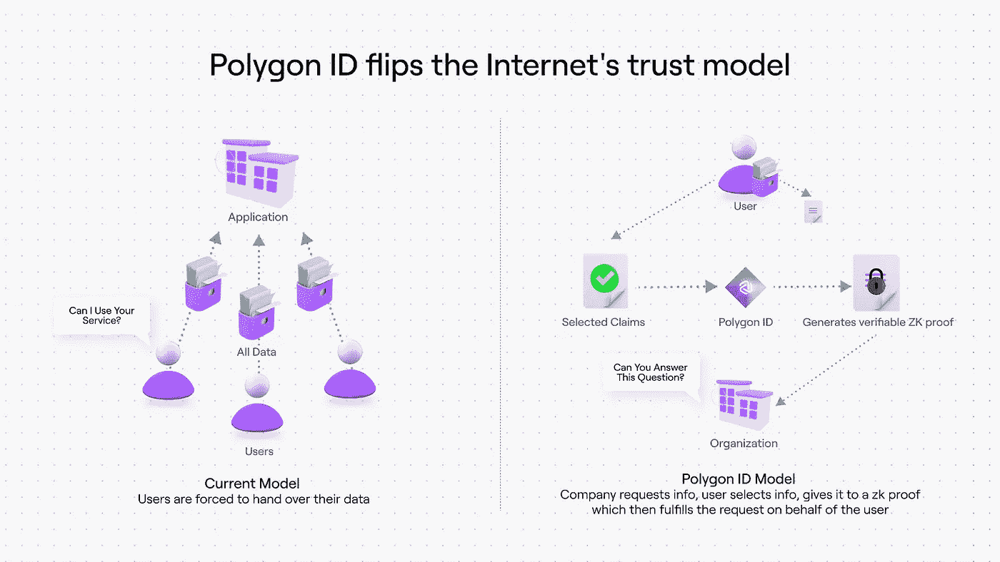
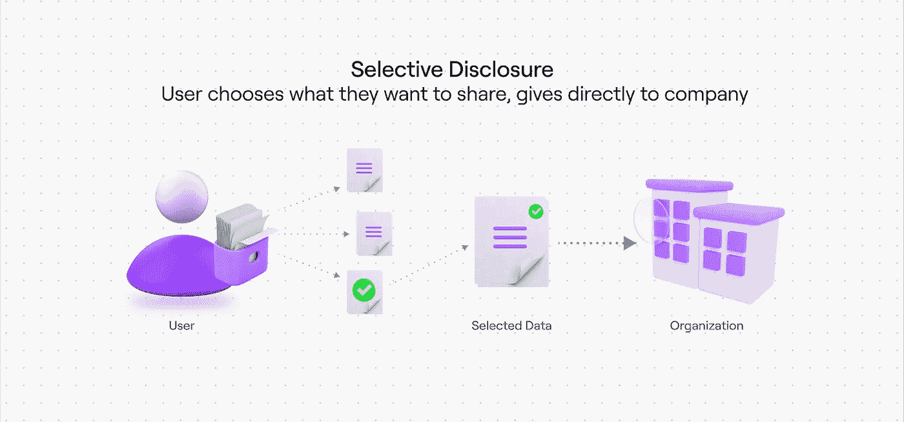

# 使用户能够控制其个人数据(多边形 ID)的身份解决方案

> 原文：<https://medium.com/coinmonks/a-identity-solution-that-empowers-users-with-control-over-their-personal-data-polygon-id-fe951f595eb?source=collection_archive---------14----------------------->

[Source](https://blog.polygon.technology/four-way-polygon-id-will-impact-your-life/)

# 涉及提交我们个人 ID 的身份验证流程会给我们的数据隐私带来风险

如今，我觉得向实体提供我的个人信息很不舒服，为了利用基本的社会和金融服务，每个人都被要求提供他们的身份证件——身份证明、居住证明等，这已经成为一种规范。

[Source](https://blog.polygon.technology/polygon-id-x-polygon-dao-integration-launches-to-create-new-zk-based-governance-frameworks)

即使在加密领域，只有在您向他们提供完整的个人信息，完成了解您的客户(KYC)程序后，集中交换和受监管的点对点平台才允许您使用他们的平台。

今天的问题是，我们知道我们不能信任拥有我们数据的实体，这些数据可以免费提供给政府，出售给第三方，或者被网络犯罪分子窃取。

[Tweet](https://twitter.com/cdixon/status/1469734097966743553?ref_src=twsrc%5Etfw%7Ctwcamp%5Etweetembed%7Ctwterm%5E1469734097966743553%7Ctwgr%5Ed945fc9e548097b07c38d45aa257992e82dab734%7Ctwcon%5Es1_c10&ref_url=https%3A%2F%2Fblog.polygon.technology%2Ffour-way-polygon-id-will-impact-your-life%2F)

在当今时代，政府对人民的敌意是众所周知的，他们因批评政府而成为不公平的目标，一些政府以其绝对残酷的加密法规瞄准加密投资者，所以许多人发现使用不收集我们个人信息的平台更安全。

# 私有身份解决方案，用户可以控制他们的数据，而不是实体

因此，在 Web3 时代，用户需要控制他们的数据而不是实体，私有身份解决方案是当务之急。多边形 ID 就是这样一种身份解决方案。

[Source](https://polygon.technology/polygon-id/)

*Polygon ID 是一个自主的、注重隐私的数字链上身份解决方案，使用零知识证明技术开发，可以在不收集用户个人信息的情况下提供经过验证的数字 ID。*

## 让我们深入研究多边形 ID 解决方案如何保证用户对其数据的控制

用户将必须证明实体要求验证的关于他自己的特定方面。然后，用户以 zkSNARK 证明的形式提交声明，证明其身份，如果在这里可以避免，则不需要提交个人文档。这个 zkSNARK 证明是提交给实体的 id。

例如，如果实体想要验证用户是否超过 18 岁，并且不是当今大多数 dex 所要求的美国居民，那么用户的 ID 卡(比如驾驶执照)的发行者的声明可以只声明用户超过 18 岁并且不是美国居民的事实，而不透露用户的出生日期或居住国、家庭地址、电话号码和所有这些敏感细节。

[Source](https://blog.polygon.technology/polygon-id-x-polygon-dao-integration-launches-to-create-new-zk-based-governance-frameworks)

*因此，使用 Polygon ID，用户不需要向实体提交他/她的所有 ID 文档，并且除了绝对需要向实体公开的内容之外，不需要公开用户的其他细节。*

*用户的验证数据将被存储为哈希数据，其中不包含用户的个人信息。*

在上面提供的例子中，提交的 ZK 证明是一个很好的证明，其中实体不需要信任任何人，除了信任 ID 的发布者正确地完成了验证用户详细信息的工作。

嗯，这是我在这里阅读文章时对多边形 ID 的理解，我觉得它并没有给出一个清晰的图像，但我确信这就是问题所在。

[Polygon ID x Polygon DAO Integration 启动，创建新的 ZK 治理框架](https://blog.polygon.technology/polygon-id-x-polygon-dao-integration-launches-to-create-new-zk-based-governance-frameworks)

# 多边形 ID 一类的 ID 解决方案会给用户数据隐私保护，我们缺乏

想象一下，我们有这种数字身份证像多边形身份证，这将足以让我们登录和交易在 CEX，因为我不需要做 KYC。也许，我们的银行可以在 zkSNARK 证明中发布声明，证明该帐户持有人是真实的，而无需给出我的银行帐户详细信息、家庭地址等，只是一个想法…我会发现它很有价值。

[Source](https://blog.polygon.technology/polygon-id-x-polygon-dao-integration-launches-to-create-new-zk-based-governance-frameworks)

这里的责任是用户可以控制他们的个人信息，并可以选择透露什么。数据隐私是我们的权利，但不幸的是，许多国家并不尊重这一权利。

[Source](https://blog.polygon.technology/polygon-id-x-polygon-dao-integration-launches-to-create-new-zk-based-governance-frameworks)

我们由实体收集的数据一般存储在数据库和集中式服务器中，这些数据很容易被黑客攻击，但存储在区块链中的数据是安全的。

# Web3 世界中的隐私数字标识

即使是 Web3 用户也需要这些自治的链上 id 来进行治理投票等活动，因为他们的身份与钱包等公共标识符相关联。因此，Dao 可以向用户发放这种独立的数字身份证，这样，与他们的链上活动相关的链上身份就可以与他们的公共钱包分开。

***请从这里了解更多多边形 ID-:***

[多边形 ID 影响你生活的四种方式](https://blog.polygon.technology/four-way-polygon-id-will-impact-your-life/)

[Polygon ID x Polygon DAO 整合启动，旨在创建新的 ZK 治理框架](https://blog.polygon.technology/polygon-id-x-polygon-dao-integration-launches-to-create-new-zk-based-governance-frameworks)

[Polygon 网站上的 Polygon ID 信息](https://polygon.technology/polygon-id/)

***结论***

今天，用户需要保护他们的个人数据不被暴露，这可能会导致许多实体出于各种原因不道德地针对我们获取我们的个人信息。

Polygon ID 看起来像一个有前途的链上，自我主权的数字解决方案，它将保护我们的个人数据不被交给强大的实体，政府，他们可以跟踪和监视我们的习惯，活动以及从共享 ID 泄露的个人信息。

***感谢阅读。***

> 加入 Coinmonks [电报频道](https://t.me/coincodecap)和 [Youtube 频道](https://www.youtube.com/c/coinmonks/videos)了解加密交易和投资

# 另外，阅读

*   [Botsfolio vs nap bots vs Mudrex](/coinmonks/botsfolio-vs-napbots-vs-mudrex-c81344970c02)|[gate . io 交流回顾](/coinmonks/gate-io-exchange-review-61bf87b7078f)
*   [CoinFLEX 评论](https://coincodecap.com/coinflex-review) | [AEX 交易所评论](https://coincodecap.com/aex-exchange-review) | [UPbit 评论](https://coincodecap.com/upbit-review)
*   [AscendEx 保证金交易](https://coincodecap.com/ascendex-margin-trading) | [Bitfinex 赌注](https://coincodecap.com/bitfinex-staking) | [bitFlyer 点评](https://coincodecap.com/bitflyer-review)
*   [Bitget 回顾](https://coincodecap.com/bitget-review)|[Gemini vs block fi](https://coincodecap.com/gemini-vs-blockfi)cmd |[OKEx 期货交易](https://coincodecap.com/okex-futures-trading)
*   [AscendEx Staking](https://coincodecap.com/ascendex-staking)|[Bot Ocean Review](https://coincodecap.com/bot-ocean-review)|[最佳比特币钱包](https://coincodecap.com/bitcoin-wallets-india)