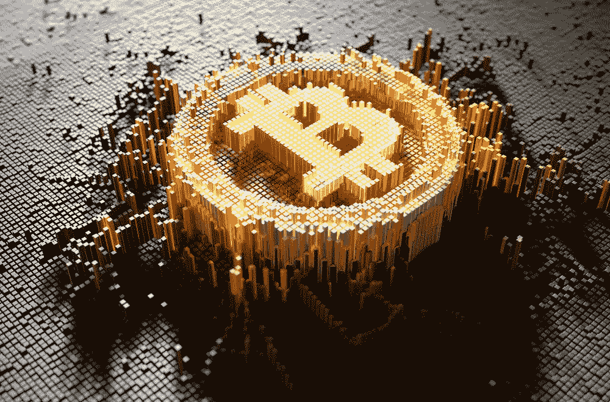

# 帮助你度过比特币熊市的教育资源列表

> 原文：<https://medium.com/coinmonks/a-list-of-educational-resources-to-get-you-through-the-bitcoin-bear-market-1ed2ac6a736f?source=collection_archive---------12----------------------->

# 介绍

目前情况相当令人沮丧，即使你不担心，熊市也相当无聊。我知道，除了每周对比特币进行 DCA 之外，我没做什么。因此，我编制了一份教育资源清单，我的目标是在熊市中度过难关。这主要是为我自己，但我想其他人可能会感兴趣，所以我要在这里分享。

下面你会发现比特币领域广泛推荐的书籍、博客、播客和课程列表。如果我已经阅读或消费了其中的一些内容，我会给出一些意见，但对于这里列出的其他内容，我只会给出一个小的简介。

正如你所知，这个列表是相当比特币 maxi，我不会说我是 100%的 maxi，我仍然持有一些 ETH，当牛市回来时，我会交易 alts，但很多都是为了获得更多的比特币。此外，因为比特币是第一种也是最成熟的加密货币，这意味着它比任何其他加密货币都有更多的相关教育材料。

# 白皮书:

你真的应该读一读。

*   中本聪的比特币白皮书(有多少人真的读过？我强烈建议每个人至少读一遍这本书，因为它确实是革命性的)

> 交易新手？试试[密码交易机器人](/coinmonks/crypto-trading-bot-c2ffce8acb2a)或者[复制交易](/coinmonks/top-10-crypto-copy-trading-platforms-for-beginners-d0c37c7d698c)

# 课程:

有很多关于比特币和加密货币的非常棒的免费课程，我强烈建议每个人在熊市期间至少学一门。

*   塞勒学院——塞勒学院有几门与比特币相关的课程，还有许多其他精彩的话题。我一直在慢慢地学习比特币开发者课程和奥地利经济学课程。
*   [可汗学院](https://www.khanacademy.org/) —可汗学院帮助我度过了大学的前两年，可汗教授复杂的主题并使它们变得简单，完全相同的事情也为[比特币](https://www.khanacademy.org/economics-finance-domain/core-finance/money-and-banking/bitcoin/v/bitcoin-what-is-it)所做。
*   [MOOC:数字货币简介](https://www.unic.ac.cy/blockchain/free-mooc/)——作者安德烈亚斯·安东诺普洛斯，我还没做过这个，但据说非常好。
*   [Udemy —加密货币和区块链简介](https://www.udemy.com/course/introduction-to-cryptocurrencies/)。
*   [Coursera——比特币和加密货币技术](https://www.coursera.org/learn/cryptocurrency#)。
*   还有关于[币安学院](https://academy.binance.com/en)和[比特币基地学](https://www.coinbase.com/learn)的课程虽然我都没做过也没听说过好不好。

# 书籍:

这是列表中最传统的教育形式，我个人没有太多时间阅读，但几乎列表中的所有内容都有有声读物格式，我发现在健身房或路上更容易消化。

*   [明天的价格:为什么通缩是充裕未来的关键](https://www.amazon.co.uk/Price-Tomorrow-Deflation-Abundant-Future/dp/B08724PG5X/ref=sr_1_1?crid=1V68O46D54QWP&keywords=-+The+Price+of+Tomorrow&qid=1657656630&sprefix=the+price+of+tomorrow%2Caps%2C42&sr=8-1)——杰夫·布斯——我读过这本书，发现非常有趣，虽然它与加密货币没有直接关系，但它优雅地提出了为什么我们可能需要一种通缩货币作为世界储备。
*   [主权个人](https://www.amazon.com/The-Sovereign-Individual-audiobook/dp/B07TWNP9NB/ref=sr_1_1?crid=3JUUSV8UMU0Z9&keywords=-+The+Sovereign+individual&qid=1657656687&s=books&sprefix=the+sovereign+individual%2Cstripbooks-intl-ship%2C371&sr=1-1)——威廉·里斯-莫格(是的，里斯-莫格家族的成员)——我也读过这本书，它也不是专门关于比特币的，但许多比特币创造者对此赞不绝口。这是一本有趣的书，它预测了我们今天在世界上看到的许多发展，我认为这本书的“批判”部分非常好，但我真的不喜欢作者或他们的政治，这是委婉的说法。
*   [应对不断变化的世界秩序的原则](https://www.amazon.com/Changing-World-Order-Nations-Succeed/dp/1982160276)——雷伊·达里奥——我还没有读过这本书，但我看了[视频](https://www.youtube.com/watch?v=xguam0TKMw8)并被迷住了，所以我买了这本书。
*   约翰·格里森(John Gleeson)编写的《比特币随笔》(Essays on Bitcoin)我还没有读过，但它是免费的，所以它在我的清单上。
*   货币互联网 **(第一卷&第二卷)**——作者安德烈亚斯·安东诺普洛斯。
*   [掌握比特币:编程开放区块链](https://github.com/bitcoinbook/bitcoinbook)——作者安德烈亚斯·安东诺普洛斯。
*   安德烈亚斯·安东诺普洛斯——掌握以太坊:建立智能合约和 DApps。
*   [比特币标准:中央银行的分散化替代方案](https://www.amazon.com/Bitcoin-Standard-Decentralized-Alternative-Central/dp/1119473861/ref=pd_bxgy_img_sccl_1/130-8193889-7552231?pd_rd_w=a2pHT&content-id=amzn1.sym.7757a8b5-874e-4a67-9d85-54ed32f01737&pf_rd_p=7757a8b5-874e-4a67-9d85-54ed32f01737&pf_rd_r=AJNG2ED21AJSW6MPPW5F&pd_rd_wg=nEVQZ&pd_rd_r=a923f317-777b-4540-af38-d2b9894016c8&pd_rd_i=1119473861&psc=1) —作者 Saifedean Ammous。
*   [The Cryptopians](https://www.amazon.co.uk/dp/1541763017?linkCode=gs4&tag=crypto-books-wordpress-uk-2-21)——Laura Shin——这是一个全新的，但看起来非常有趣，它涵盖了以太坊的历史和 2017 年的 ICO 热潮。绝对在名单上。
*   Marcus Aurelius 的《沉思》-------------------------------------------------《沉思》---------对任何试图过着禁欲生活的人来说非常重要，不要让自己的情绪控制自己，这对投资来说至关重要。这本书可以在[这里](http://classics.mit.edu/Antoninus/meditations.html)找到，有声读物可以在[这里](https://www.youtube.com/watch?v=d5E2AQKuCyU)找到。
*   海斯的《通往奴役之路》似乎很适合现代世界。
*   [分层货币](https://www.amazon.co.uk/Layered-Money-Dollars-Bitcoin-Currencies-ebook/dp/B08PS293NT)——尼克·巴蒂亚——世界各地的货币体系是如何运作的
*   来自杰基尔岛的生物——g .爱德华·格里芬——美联储的曝光者
*   尼古拉斯·穆德的《经济武器:制裁作为现代战争工具的兴起》,让我们看看法定制裁是如何被用作战争武器的。
*   光天化日之下的抢劫:税收是如何塑造我们的过去并将改变我们的未来的？

# 播客:

就像下面的 Youtube 视频一样，这些可能不是最好的信息来源，但是，我喜欢播客，我确实认为这些在教育方面比大多数 Youtube 频道要高一点。问题是，有太多不同的主题，我最终错过了一些，没有不断地保持它们，这里有几个与加密货币相关的播客，我半定期地听。

*   [比特币做了什么](https://www.whatbitcoindid.com/)——对比特币来说，这是最好的选择。
*   [无银行](http://podcast.banklesshq.com/)——非常以 Eth 为中心，但对不同于 WBD 的观点来说还过得去
*   莱克斯·弗里德曼——不专门研究密码，但莱克斯得到了许多密码行业专家的关注
*   没有听到，但听说它是一个很好的全能者
*   [投资者播客网](https://www.theinvestorspodcast.com/our-team/)——这是一个普通的全方位投资播客，但有一些关于比特币的精彩内容

# 博客:

*   [吴宇森](https://woobull.com/) —图表超载！
*   [未列举的](https://unenumerated.blogspot.com/)——这是一个我一直想抽出时间阅读的博客，但仍然没有找到时间，这里有大量关于金钱历史的内容。
*   丹·赫尔德给出了一些实用的比特币建议。

# YouTube:

不要把 Youtube 或 Youtube 当作教育资源，这些公然打着寓教于乐的幌子，尽管在我看来，这些渠道都可以获得一些好的信息。只是不要依赖他们作为你财务建议的主要来源(不是财务顾问之类的)

*   本杰明·考恩(Benjamin Cowen)——我认为他是最好的，实际上我花了一些业余时间用 Python 重新制作了他的一些图表。
*   [钱币局](https://www.youtube.com/c/CoinBureau)——主要是娱乐。
*   [Invest 回答](https://www.youtube.com/c/InvestAnswers)——好吧，虽然骗了卢娜一点，但这是个污点。
*   [雷伊·达里奥](https://www.youtube.com/c/principlesbyraydalio)——好吧，不是密码，但是这里有一些很棒的教育内容。
*   [glass node](https://www.youtube.com/c/glassnode)——就我个人而言，我正在努力学习更多关于链上分析的知识，这是找到答案的绝佳渠道。
*   方舟投资公司的凯西·伍德。她每月做一个微距视频
*   多米尼克·弗里斯比关于各种经济话题的定期短视频
*   罗伯特·布里德洛夫
*   [游牧资本家](https://www.youtube.com/user/nomadcapitalist)了解多重公民身份的方式和原因

# 其他资源:

我在这里包括了几个 twitter 账户，但是如果你离开 twitter 接受教育，那么这个世界真的没有多少希望，然而，有几个人我不知道在哪里包括，但是我发现非常有见地，所以我决定链接那里的 twitter 账户。我还找到了其他各种各样的资源，并在这里列出

*   林恩·奥尔登——当林恩说话时，我会听！她有一份免费的时事通讯，但我主要是关注她在播客上的表现。
*   [Will clem NTE](https://twitter.com/WClementeIII?ref_src=twsrc%5Egoogle%7Ctwcamp%5Eserp%7Ctwgr%5Eauthor)——更多图表，Will 还拥有一份出色的免费[简讯](https://www.blockwaresolutions.com/intelligence-newsletter)。
*   B 计划——他有点(相当)笨，但他的技术含量在我看来还是有价值的。
*   杰姆森·洛普(Jamson Lopp)——比特币知识的巨大宝库。

# 技术教育

这里有一些更技术性的事情，你可以做，以教育自己关于比特币和如何使用它，这些是按难度排列的。

*   购买比特币(我猜你已经这么做了)
*   进行连锁交易
*   做一笔减仓交易
*   通过设置硬件钱包(带有适当的备份)进行自我保管
*   [设置一个比特币满节点](https://www.youtube.com/watch?v=fppmhqjqh2E) +连接到你的硬件钱包
*   设置发光节点
*   使用您自己的 lighting 节点设置一个移动 lighting 应用程序

# 结论

这就是我目前所知道的，我把它贴出来是希望其他人会觉得有用，但我也自私地希望你能在评论中加入你的建议，这样我就有更多的资源了。学习愉快！