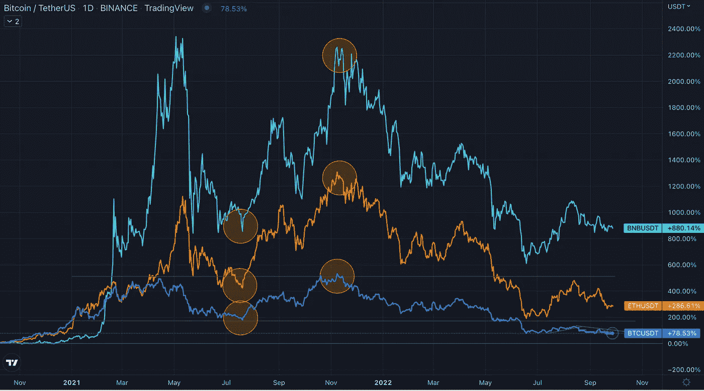

# 看看比特币的价格变动如何影响其他加密货币

> 原文：<https://medium.com/coinmonks/a-look-at-how-bitcoins-price-movements-affect-other-cryptocurrencies-f49782a53a1d?source=collection_archive---------14----------------------->

Photo: Jievani Weerasinghe on Unsplash

# 介绍

**比特币霸主地位**指由比特币单独控制的加密货币总市值的百分比。

**什么是市值** —在这个上下文中，市值的总价值实质上是所有加密货币加在一起的**总价值。市值的简称是市值。**

# 我如何利用这些信息赚钱？

A Daily Price Chart Zoomed Out

## 所有的硬币都跟随比特币的价格

看一下上面的图表。比特币(深蓝色线)的最高价和最低价几乎与以太坊(橙色线)和币安币(浅蓝色线)同步移动。**这不是巧合**这是因为比特币的市值最高，这意味着任何加密货币中持有的最多的钱都是比特币。因此，当拥有数十亿美元的投资者开始抛售时，其他人会注意到这一点，并在同一时间开始抛售，这使得所有加密货币的价格在数月内下跌。

这样做的好处是，你可以比仅仅持有比特币赚更多的钱。

# 1000 美元不同的加密货币

## 我们来看看不同市值的硬币价格是如何变化的。

一个简单的方法是继续 [CoinGecko](https://www.coingecko.com/) 或 [CoinMarketCap](https://coinmarketcap.com/) 。
这些网站拥有几乎所有按美元市值排名的加密货币**。**

这里是一个潜在利润的硬币列表，使用 2019 年的最低价格与 2021 年的最高价格进行比较。

## 前 10 名中的硬币

1.  **比特币**
    排名:1
    最低价(2019 年):3400 美元
    最高价(2021 年):69000 美元
    1000 美元投资:19294 美元
2.  **以太坊**
    排名:2
    最低价(2019 年):90 美元
    最高价(2021 年):4878 美元
    1000 美元投资:53200 美元

## 前 10-50 名中的硬币

1.  **多边形**
    排名:15
    最低价(2019 年):0.00314 美元
    最高价(2021 年):2.88 美元
    1000 美元投资:927820 美元
2.  **FTX**
    排名:26
    最低价(2019 年):1.15 美元
    最高价(2021 年):84 美元
    1000 美元投资:72043 美元

## 超过 50 的硬币

1.  **Fantom**
    排名:76
    最低价(2019 年):0.00329 美元
    最高价(2021 年):3.46 美元
    1000 美元投资额:1048197 美元
2.  **金恩币**
    排名:87
    最低价(2019 年):0.00265 美元
    最高价(2021 年):4.82 美元
    1000 美元投资:1812953 美元

2022 年与 2019 年相似，是历史高点(2021 年)后的第一年。开始购买的最佳时机。如果你想了解更多关于如何知道何时购买/出售加密货币的信息，请查看这篇关于[比特币减半](/@cryptocoins872/3-reasons-why-bitcoins-halving-can-t-be-ignored-427d6c762516)的文章。

# 结尾注释

如果你看看潜在的利润，购买低市值的加密货币有更大的回报，但出于多种原因，投资风险更大。

你可以轻松地长期买卖加密货币，你只需要知道怎么做。

关注更多识别金融秘密的文章。
**加密硬币——我精通金融，所以你不必如此。**

以后相关文章会链接到下面或者带下划线的文字。

 [## 比特币减半不容忽视的 3 个原因

### 首先，什么是比特币减半？简单来说,“减半”事件是指比特币矿工获得的奖励…

medium.com](/@cryptocoins872/3-reasons-why-bitcoins-halving-can-t-be-ignored-427d6c762516)  [## 作为第一次投资者，如何使用平均成本法

### 你会在每一篇关于投资的文章中看到它:“平均成本”但这意味着什么，你是否…

medium.com](/3-minute-thoughts/how-to-use-dollar-cost-averaging-to-your-advantage-as-a-first-time-investor-732a95e832f3) 

> 交易新手？尝试[加密交易机器人](/coinmonks/crypto-trading-bot-c2ffce8acb2a)或[复制交易](/coinmonks/top-10-crypto-copy-trading-platforms-for-beginners-d0c37c7d698c)