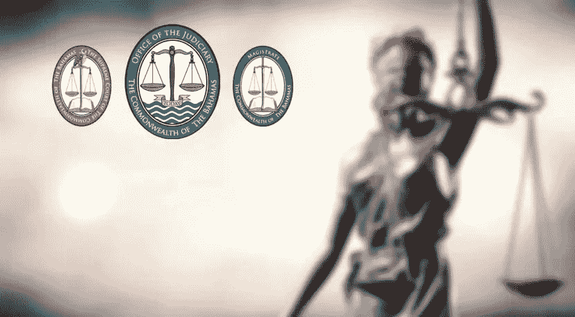

# 看看巴哈马在 FTX 事件中的角色

> 原文：<https://medium.com/coinmonks/a-look-at-the-bahamas-role-in-the-ftx-fallout-60e2ab4c5c2d?source=collection_archive---------17----------------------->

看到 SBF 和 FTX 与巴哈马群岛如此紧密地联系在一起，我想这将保证我们能更近距离地观察巴哈马群岛，尝试看看他们是否真的像他们希望你我所想的那样进步和伟大。

> 从顶级交易者那里复制交易机器人。免费试用。

# 巴哈马对其他国家

巴哈马说得很清楚，他们只关心在巴哈马注册的 FTX。巴哈马将军 Auturney 在 12 月初发表的公开讲话表明了这一点。另一个明显的例子是在 11 月初。当 FTX 在推特上发布他们正在与巴哈马监管机构和监管机构合作时，这一点变得很明显。并再次开始为他们的巴哈马客户提款。

FTX 的推特账户也淡化了相关金额。因为他们在这条推文后写道“提取的金额只占我们目前手头资产的一小部分”。如果我们完全无视 FTX 声称他们有大量资金，提款只是其中的一小部分。我们现在知道这是完全错误的。撤退到底有多“小”？事实表明，在 25 小时的窗口内，通过巴哈马 KYC 的人能够提取他们的资金。1500 人这样做了。他们提取的金额约为 1 亿美元。

*Video from official hearing confirming the 1.500 individuals and ~$100 million*

现在看来，他们将不得不试图从 1500 个人手中夺回这些资金。美国法院和巴哈马法院在谁控制什么的问题上似乎存在冲突。

然而，巴哈马人发表了一份声明，驳斥了他们指示 FTX 优先为巴哈马客户提款的说法。但巴哈马人的这一声明在美国方面似乎没有什么分量和可信度。

# 更多关于巴哈马梅德林的报道

根据彭博 12 月 12 日的报道。据报道，巴哈马政府要求 SBF 铸造总计数亿美元的新资产。据彭博称，他们随后要求 SBF 将这些新资产转移到岛屿官员控制下的账户。据报道，彭博是从 SBF 的律师那里得到这份文件的。

据报道，他们还告诉彭博，“在法庭上，巴哈马官员(官方和非官方)计划进入 FTX 交易所的核心数据库，以便 SBF 可以轻松控制破产的 FTX 密码交易所的计算机系统”。SBF 被迫铸造这些新的代币。巴哈马机构这样做是为了试图控制交易所。

联邦贸易委员会新任首席执行官约翰·j·雷三世似乎也证实了这一点。有报道称，他们正试图从利用计算机系统制造新代币的人手中夺回对这些系统的控制权。

> 这是对实时动态访问的请求，将立即提供给巴哈马政府，

巴哈马律师也申请增加该案件的数据访问。美国显然认为这是谁控制什么的冲突升级。指责 SBF 与巴哈马政府合作，并引用巴哈马客户可获得的有限提款作为证据。

# 我们能从中得出什么结论？

首先，就我个人而言，我认为这里发生了太多巧合的事情，以至于巴哈马人声称他们至少没有幕后操纵。如果这仅仅是巴哈马试图保护他们的金融利益，或者他们试图超越美国。嗯，我的钱花在巴哈马群岛上，仅仅是为了给他们的富裕公民他们已经支付的东西。如果不能指望得到优惠待遇，为什么会有更多的富人来到这里？

对我来说，这就是全部。巴哈马正在做对巴哈马最好的事情。为什么 SBF 会同意呢？嗯，他大概认为只要他继续听从巴哈马人的命令，他就一切都很好、舒适、安全。尽管巴哈马人一直表示，他们正在与美国平行并合作进行自己的调查。对我来说，这看起来只不过是当罪犯试图在电视上的一个警察节目中插入自己的调查。

*They say that lady justice is blind, but in the Bahamian case, she appears to be both deaf and dumb as well*

我的意思是，我认为很明显，阿拉梅达研究公司的前首席执行官卡罗琳·埃里森和 FTX 公司的联合创始人王微都与美国而不是巴哈马签订了认罪协议。我确实认为，如果巴哈马法院对任何涉案人员提起诉讼，将会很有趣。然而，我不会在它上面下任何钱。

你对此有什么想法，是巴哈马群岛简单地在做生意，而且是“客户”，还是和我对这个谁的事情看得太多了？还是像他们说的“巴哈马群岛更好”？这也是事实吗？请在评论部分分享您对巴哈马公共服务公告的想法。如果你想支持我和我的内容，请考虑跟随我，阅读我的其他帖子，或者为什么不两者兼而有之。

互联网上见！

图片提供:[https://www.bahamasjudiciary.com](https://www.bahamasjudiciary.com/)(合理使用)

**资源**

2.  [https://bitcoinik . com/巴哈马-vs-us-contra varsy-over-ftx-bankrupcy/](https://bitcoinik.com/bahamas-vs-us-contravarsy-over-ftx-bankrupcy/)
3.  [https://www . Bloomberg . com/news/articles/2022-12-12/ftx-says-Bahamas-trying-to-help-bank man-fried-access-key-systems](https://www.bloomberg.com/news/articles/2022-12-12/ftx-says-bahamas-trying-to-help-bankman-fried-access-key-systems)

> 加入 Coinmonks [电报频道](https://t.me/coincodecap)和 [Youtube 频道](https://www.youtube.com/c/coinmonks/videos)了解加密交易和投资

# 另外，阅读

*   [加拿大最佳加密交易机器人](https://coincodecap.com/5-best-crypto-trading-bots-in-canada) | [KuCoin 评论](https://coincodecap.com/kucoin-review)
*   [火币加密交易信号](https://coincodecap.com/huobi-crypto-trading-signals) | [HitBTC 审核](/coinmonks/hitbtc-review-c5143c5d53c2)
*   [TraderWagon 回顾](https://coincodecap.com/traderwagon-review) | [北海巨妖 vs 双子 vs 比特亚德](https://coincodecap.com/kraken-vs-gemini-vs-bityard)
*   [如何在 FTX 交易所交易期货](https://coincodecap.com/ftx-futures-trading)
*   [OKEx vs KuCoin](https://coincodecap.com/okex-kucoin) | [摄氏替代品](https://coincodecap.com/celsius-alternatives) | [如何购买 VeChain](https://coincodecap.com/buy-vechain)