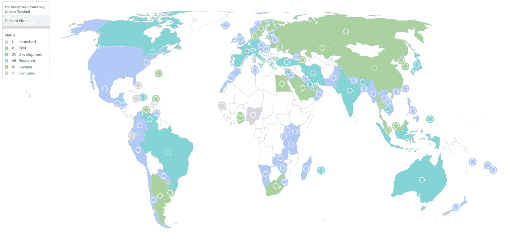
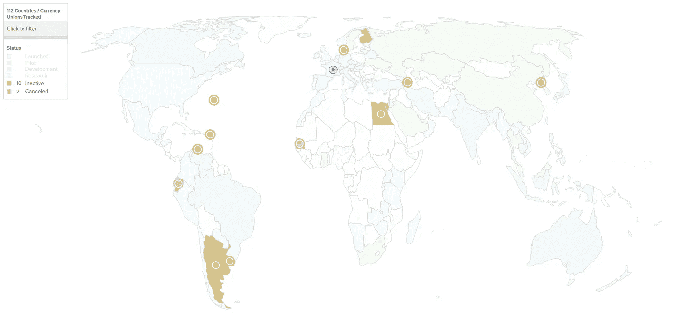
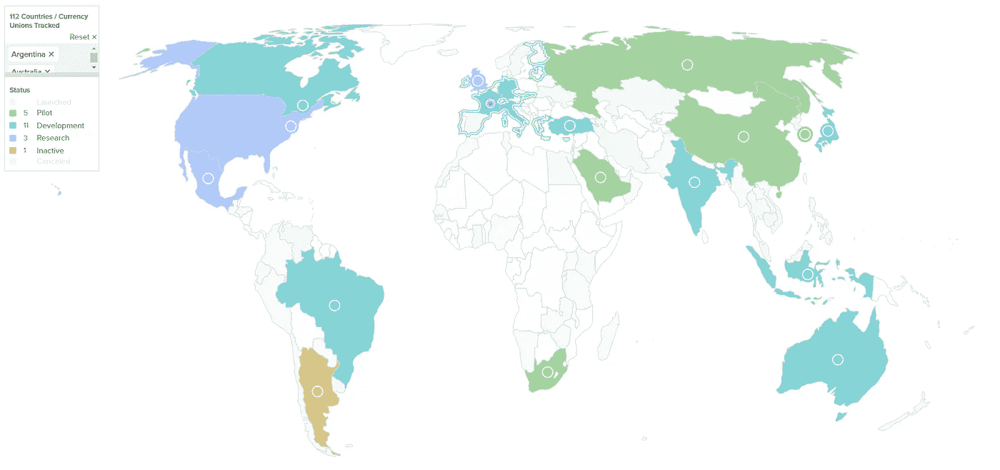

# 审视 CBDCs 的全球状况

> 原文：<https://medium.com/coinmonks/a-look-at-the-global-state-of-cbdcs-884907f58a74?source=collection_archive---------34----------------------->

由于我最近发现了一个极好的资源，大西洋理事会的地缘经济中心，可以用来观察 CBDCs 的全球进展，我认为现在是时候采取更加全球化的眼光，看看趋势是什么。

# CBDC 全球进步

据我所知，该网站上的数据最近一次重大更新是在今年 5 月。这意味着日期不是那么新鲜，它仍然在移动，但另一方面，它也没有开始闻起来。我确实看到在五月之后也有一些更新。

The global state of CBDC projects

在总共 195 个国家中，有 112 个国家以这样或那样的方式研究过 CBDC。这 112 个国家加起来相当于全球 GDP 的 95%左右。对我来说，这描绘了一幅清晰的画面。如果这个国家有全科医生的话，他们至少已经看到了 CBDC 是怎么回事。我必须承认，这个数字让我大吃一惊。我知道有些国家正在探索 BDCD 作为一种选择，最近开始了几个试点项目。但我从没想过会有这么多。

# 都在 CBDC 的火车上

在 112 个国家中，只有两个国家正式取消了他们的 CBDC 项目。他们是厄瓜多尔和塞内加尔。虽然该国的两个项目之间存在一些差异，但两者都将用例列为“零售”。

厄瓜多尔和塞内加尔的 GDP 分别只有 1062 亿和 276.3 亿。或相对于世界 GDP 的 0.111%和 0.029%。这使得它们都远低于 4930 亿美元的全球平均 GDP。这告诉我，它们的经济规模都较小，这很可能是项目被取消的主要原因。

Countries that canceled their CBDC project or are inactive

目前还有 10 个国家被列为非活跃国家。这些国家的经济规模也相当小，都低于全球平均水平。其中，也许最值得注意的国家是朝鲜。我敢打赌，一个国家会喜欢 CBDC 这个主意。但后来我意识到，如果人们一直在挨饿，谁会使用 CBDC 呢？我只是觉得奇怪，他们竟然一开始就开始调查这件事。

# 在不久的将来会发生什么

目前有 11 个国家启动了 CBDS，15 个县正在开展试点项目。鉴于只有极少数国家取消了他们的 CBDC 项目，或者干脆不采取行动。我认为更多的国家走出试点阶段进入启动阶段只是时间问题。当然，还有新的国家申请进入试点阶段。

如果我们看看“最大”的七国集团(G7)，其中有两个国家非常突出。美国和英国。当谈到他们自己的 CBDC 项目时，他们都远远落后于其他 5 个国家。看看这是否意味着他们会试着走捷径来赶上来，或者这仅仅意味着他们不是真的把 CBDC 的事情看得超级重要，这将是很有趣的。或者他们可能有别的计划。如果我们看看 20 国集团，其中 16 个已经处于规划或试点阶段。

G20 countries

我确实认为，有这么多国家看到赛车成为第一个在更广泛的流通中采用 CBDC 的国家。我认为他们可能忽略了一个相当大的问题。国际贸易和交易。

当我环顾地图时，我可以看到这些项目的许多不同的底层技术。如果有一件事是我知道的，那就是科技并不总是与其他科技友好相处。这可能会成为一个比他们最初认为的更大的问题。全球贸易似乎只会越来越多。

如果我们回顾历史，我们可以看到类似的事情在过去发生过。例如，欧盟的不同铁路标准。那里使用了许多不同的标准，这大大增加了在欧盟有效利用铁路作为国际运输手段的问题。这导致了一个全新的行业的出现，低成本国际航班。

对于年龄稍大的人来说，这是 Betamax 和 VHS，或者 Laserdisc 和 DVD 之间的战争。我们很可能会对各国如何选择合作感到惊讶。或者我们可能会遇到一些全新的事情。这很可能是美国或/和英国正在努力的。更不用说中国、俄罗斯和沙特阿拉伯似乎正在考虑建立自己的储备货币。这也可能是玩家在不久的将来会遇到的事情。

所以，不管你是不是 CBDC 的粉丝，我想我们大多数人都不是，我确实认为我们正处于一个有趣的时代。

注:我选择只看 GDB，而不是人均 GDP 或其他指标。主要是因为 GDP 跟踪一个国家的商品和服务，而这些不一定是一对一的。我仍然认为它为 CBDC 的潜在用途提供了一个更好的比较和衡量标准。我认为人口规模，虽然它可以作为一个因素，但它只是这个大难题的一小部分。下面是我获取数据的大西洋理事会地理经济中心的链接。

你对 CBDC 的大米有什么看法？除了隐私相关的问题之外，您是否看到了任何潜在的问题？或者你认为采用和实现它们会相当顺利吗？请在下面的评论区分享你对 CBDC 话题的想法。如果你想支持我和我制作的内容，请考虑关注我，阅读我的其他帖子，或者为什么不两者都做。

网络上见！

图片提供:[https://www.atlanticcouncil.org，](https://www.atlanticcouncil.org,)[https://pixabay.com/](https://pixabay.com/)

资源

1.  【https://www.atlanticcouncil.org/cbdctracker/ 

> 交易新手？尝试[加密交易机器人](/coinmonks/crypto-trading-bot-c2ffce8acb2a)或[复制交易](/coinmonks/top-10-crypto-copy-trading-platforms-for-beginners-d0c37c7d698c)