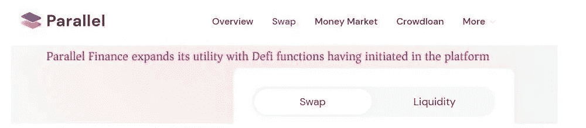
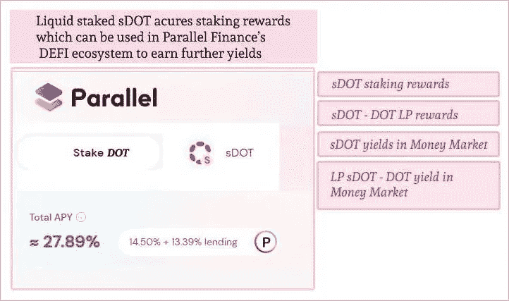
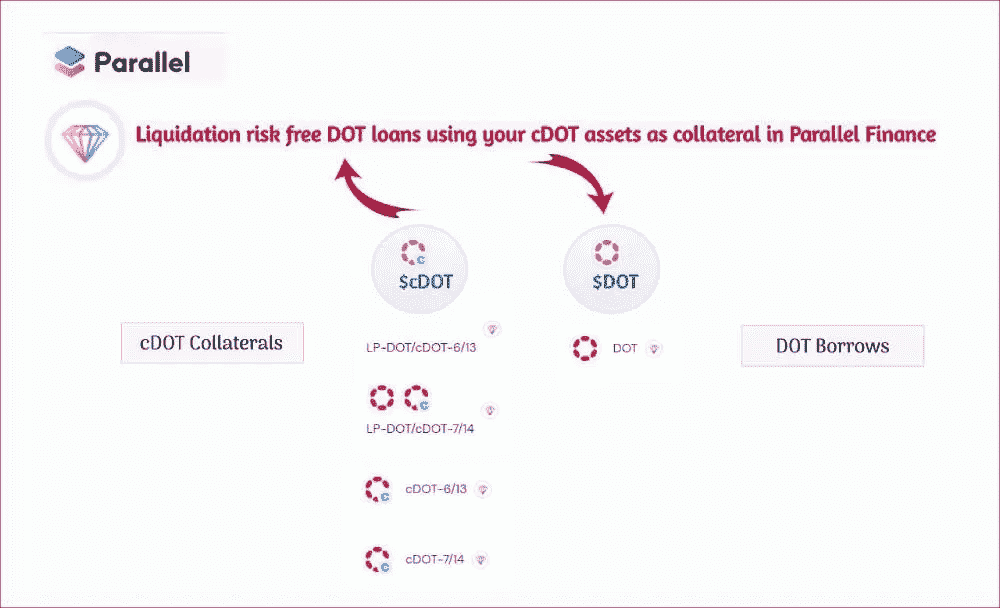
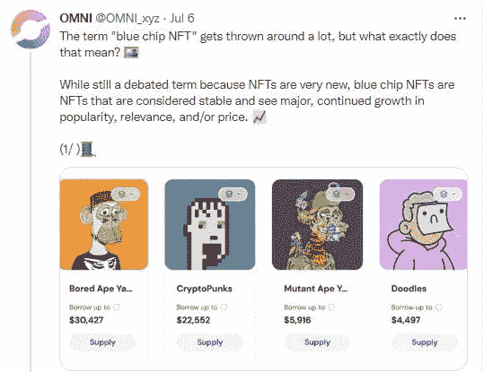

# 了解 Parallel Finance 提供的全面的 Web3 金融服务

> 原文：<https://medium.com/coinmonks/a-look-into-the-comprehensive-web3-financial-services-that-parallel-finance-offers-444046a9f7a2?source=collection_archive---------62----------------------->

Overview of the available DEFI services in Parallel Finance

# Parallel Finance 的服务为 Polkadot 生态系统增加了更多价值

由于 Parallel Finance 被设计为一站式 DEFI 中心，它具有许多有用的功能，进一步增加了 Polkadot 生态系统的价值，其中:

*   DOT 持有者可以使用 Parallel Finance 的 [Cowdloan 模块](/@kikctikcy/parallel-finance-expands-its-utility-with-defi-functions-having-initiated-in-the-platform-9f4f5ee14897)轻松贡献他们的 DOT，参与 Polkadot 的 parachain crowdloans，
*   液体[赌注他们的点](/coinmonks/liquid-staked-sdot-accrues-staking-rewards-which-can-be-used-in-parallel-finances-defi-ecosystem-f823b14967cb)，赚取赌注奖励等

# Parallel Finance 的通用 AMM 定义功能

除了为点持有者提供这些有用的服务来增加 Polkadot 网络的价值，Parallel Finance 还是一个超级 DEFI 应用程序，为 Parallel Finance 的用户提供有价值的 [DEFI 服务](/@kikctikcy/parallel-finance-expands-its-utility-with-defi-functions-having-initiated-in-the-platform-9f4f5ee14897)。

*   AMM DEX 通过流动性模块为用户提供资产流动性。流动性提供者受到 LP 奖励和 Para token 激励的激励。
*   AMM 德克斯也有一个用于交换资产的交换模块。

## 增强了其他通用 DEFI dapps 的并行财务的插件

请注意，平行金融不仅仅是一个一般的定义指标，因为它具有创新的特征。

*   众筹贷款点，即捐助者使用平行金融的众筹贷款托盘向副链众筹贷款贡献的点，作为 cDOT 令牌记入帐户，可在平行金融的 DEFI 中使用。

*   平行金融中的股份点，作为 sDOT 记入账户，可用于平行金融定义的流动股份点。

## 开发提高资本效率和用户资产效用的功能

这些衍生 cDOT 和 sDOT 资产可用于平行融资 DEFI，在此，它们可在货币市场上借出，以获得更多收益。cDOT 持有人可以在流动性模块中为 cDOT-DOT 对提供流动性，并获得 LP 奖励，这些奖励可以用于在货币市场中获得更多收益。

***平行金融的核心原则之一是拥有资本效率 DEFI，这意味着优化利用可用资产以获得最佳收益。***

现在，Parallel Finance 为用户创造了一种方式，让他们利用基于 cDOT 的资产来借入 DOT 资产，从而获得清算免费贷款。你可以在这里读到它。

[使用您的 cDOT 资产作为平行融资抵押品的无风险 DOT 贷款清算](/@kikctikcy/liquidation-risk-free-dot-loans-using-your-cdot-assets-as-collateral-in-parallel-finance-8aed8cb6f46f)

# Parallel Finance 的流提供了一个有价值的 Web3 支付解决方案

除此之外，Parallel Finance 还通过 Stream 提供了一个 web3 自动支付解决方案。使用 [Stream](/coinmonks/parallel-finances-stream-makes-scheduling-of-automatic-periodic-payments-possible-372fc802fa6f) ，可以安排自动定期向任何账户支付各种加密资产(点和段)。

Stream 激活 Parallel Finance 的 Dao Fi 功能，使其能够进行自动工资支付和代币分配。

我在之前的文章中概括了平行金融的所有功能

[并行金融的增值 Web 3 金融服务使其成为 DEFI 超级 App](/coinmonks/value-added-web-3-financial-services-of-parallel-finance-make-it-a-defi-super-app-ebe04a7f8e66)

> 交易新手？试试[密码交易机器人](/coinmonks/crypto-trading-bot-c2ffce8acb2a)或[复制交易](/coinmonks/top-10-crypto-copy-trading-platforms-for-beginners-d0c37c7d698c)

# 平行金融现在为 NFT 持有者提供 NFT 货币市场服务！！

这些功能本身使 Parallel finance 成为一个非常全面的 DeFi 应用程序，但 Parallel Finance 为 web3 用户开发了更多的服务。

现在，Parallel Finance 的团队已经冒险超越了仅仅为加密 DEFI 用户提供服务，因为该团队已经为 NFT 持有者建立了一个专属的 DEFI 平台，提供 NFT 货币市场服务。

Parallel Finance 的 NFT DEFI 平台名为 Omni protocol，你可以点击这里查看——[https://omniprotocol.xyz/](https://omniprotocol.xyz/)

[Tweet from OMNI Protocol](https://twitter.com/OMNI_xyz/status/1540052194002718723?s=20&t=HkcaHLLsRsqckcENaqfqNA)

## 以 Omni 协议在 NFT 货币市场借出和借入 NFT

在 Omni Protocol 上，蓝筹 NFT 的 NFT 持有者可以借出他们的 NFT 并获得 Omni 代币奖励。

蓝筹股 NFT 是公认的受欢迎的 NFT，由于其相关性，预计相对稳定，并具有持续的未来价格增长前景。

[OMNI tweet](https://twitter.com/OMNI_xyz/status/1544405894175285254?s=20&t=HkcaHLLsRsqckcENaqfqNA)

目前加入《OMNI 议定书》并在该议定书的 NFT 货币市场上使用的蓝筹 NFT 有——无聊猿人俱乐部(BAYC)、加密朋克、变异猿人俱乐部(MAYC)和涂鸦。

*   NFT 可以被借出，借出者获得收益和 OMNI 代币。
*   NFTs 可以用作抵押品来借用 ETH、DAI 等加密技术，借用者还可以因为是 OMNI 协议生态系统的一部分而获得 OMNI 令牌。

[OMNI Protocol’s Tweet](https://twitter.com/OMNI_xyz)

在 Omni 协议上，ETH 资产也可以借出和借入。目前，有 7 家 20 代币在货币市场上挂牌借贷——ETH、、、戴 APE、、stEtH。

[OMNI Protocol’s tweet](https://twitter.com/OMNI_xyz/status/1540052194002718723?s=20&t=HkcaHLLsRsqckcENaqfqNA)

OMNI 协议中有更多功能将被激活，NFT 市场空间也将很快被激活。Omni Protocol 的 NFT 市场将使感兴趣的买家更容易购买 NFT，据说将推出“现在支付，以后购买”的功能。

[OMNI Protocol’s Tweet](https://twitter.com/OMNI_xyz)

随着平台的发展，我们将了解更多关于这些和其他发展的信息。

## 并行金融的 DEFI 超级 App

**此处进入平行金融 App**——【https://app.parallel.fi/ 

**了解平行金融-**

网站—[https://parallel.fi/index.html](https://parallel.fi/index.html)

推特—[https://twitter.com/ParallelFi](https://twitter.com/ParallelFi)

不一致—[https://discord.gg/DeyEntFT](https://discord.gg/DeyEntFT)

白皮书—[https://parallel fi . git book . io/parallel-finance/polkadot-network/白皮书](https://parallelfi.gitbook.io/parallel-finance/polkadot-network/white-paper)

**平行金融的 NFT 货币市场 App**

**此处进入 OMNI 协议 App**[https://omniprotocol.xyz/#/leverage-buy](https://omniprotocol.xyz/#/leverage-buy)

docs—[https://docs . omni protocol . XYZ/omni-protocol/omni-protocol/functionality—概述](https://docs.omniprotocol.xyz/omni-protocol/omni-protocol/functionality-overview)

推特—[https://twitter.com/OMNI_xyz](https://twitter.com/OMNI_xyz)

https://discord.com/invite/UBnnr7pt5a

**这位作者的文章也可以在这些平台上阅读—**

[https://peakd.com/@mintymile/posts](https://peakd.com/@mintymile/posts)

[https://steemit.com/@mintymile/posts](https://steemit.com/@mintymile/posts)