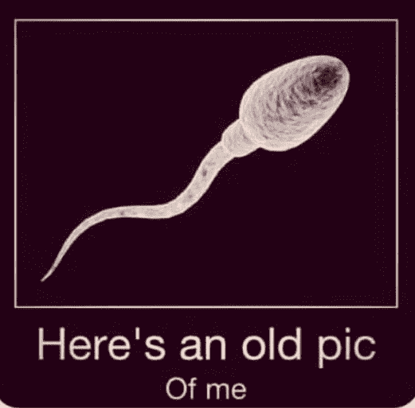

# 一个男人的视角:为什么罗伊诉韦德案如此重要

> 原文：<https://medium.com/coinmonks/a-mans-perspective-why-the-roe-v-wade-concern-is-important-771c52685bf2?source=collection_archive---------34----------------------->

这是本选举季的一个热点话题:罗伊诉韦德。最高法院 1973 年做出的决定使堕胎在美国合法化。2022 年 6 月，它被推翻。这些决定和变化当然已经两极化了，争论双方的人都热情地陈述着他们的观点。随着 11 月大选的临近，许多人都在问自己在这个重要问题上的立场。让我们从一个男人的角度来看看罗伊诉韦德案，并试图理解为什么这种关注如此重要，甚至超出了它的默认含义。

1968 年，我出生在印第安纳州的一个小镇上，比罗伊诉韦德案早五年。我的生母对她怀孕的事情保密，据我所知，任何人都不知道，即使是她最亲近的家人。我相信她当时还在上高中，大约 16 岁。想象一下当她家里羊水破了，她开始分娩时，她周围的人有多惊讶！

我的生母选择了生下我，但在我出生后就被人收养了。幸运的是，我很快被送进了一个寄养家庭，我认识的那个女人，也就是我的母亲，喂养和照顾这个体重不足的小“早产儿”。我知道我的养父母不得不努力抚养我，他们做到了。我很高兴他们这么做了。我很高兴我现在知道更多的背景故事，Ct 23andMe。

不过，我的故事并不独特。有数百万美国人出生在类似的情况下。

我个人的想法是支持堕胎的，但是我支持其他人的选择。为什么？因为我相信上帝给了我们自由意志。我们不能把我们的意志或道德强加于人，这不是这个世界的初衷。作为美国人，我们都应该能够进行这种对话，而不诉诸骂人、诽谤或暴力。我们应该能够有不同意见，但仍然尊重彼此。

每个女人对自己身体做出选择的权利绝对在这次选举的选票上。没有选择，就没有对我们自己生活的所有权或代理权；是我们的选择能力和我们的选择定义了我们。毕竟，选择是这个美国实验的标志。你记住了，***之地*自由*** *，勇者之家*。我有一个女儿和一个儿子，我非常关心他们。我希望他们都能自由成长，充满力量。因此，当我们在今年 11 月前往投票站时，让我们记住利害攸关的是什么。让我们记住，我们的声音、我们的选择和我们的投票都很重要。*

*感谢您的阅读，我希望这有助于从一个男人的角度来看待罗伊诉韦德案。这对你意味着什么？为什么重要？*

*请记得在 11 月出去投票！每一票都很重要。*

*#十一月#罗罗罗投票*

> *交易新手？试试[加密交易机器人](/coinmonks/crypto-trading-bot-c2ffce8acb2a)或者[复制交易](/coinmonks/top-10-crypto-copy-trading-platforms-for-beginners-d0c37c7d698c)*