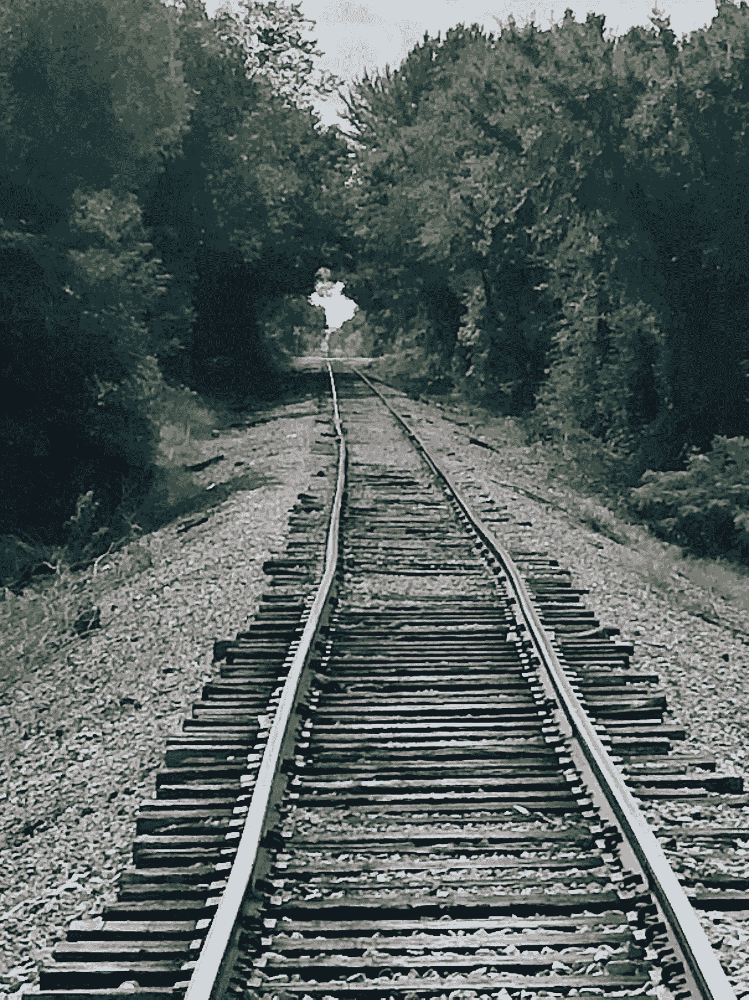

# 运动训练的新范式——人类的进化和运动表现的下一次进化

> 原文：<https://medium.com/coinmonks/a-new-paradigm-of-athletic-training-the-evolution-of-mankind-and-the-next-evolution-of-athletic-f536819f2383?source=collection_archive---------23----------------------->

我们人类作为游牧物种进化而来。我们从恶劣、北极、灼热或动荡的地方搬到了气候舒适、食物、水和住所充足的地方。

我们每天以越来越方便的方式狩猎、采集食物和水。我们为了更好、更轻松的生活条件而移民。

通过这种进化，我们经常从一个地方搬到另一个地方，我们不是通过奔跑做到的。我们步行。我们走了很多路。行走是我们进化的方式。

作为一种日常习惯，这是最容易被忽视和低估的运动。

当我们行走时，我们的肌肉、关节、韧带和肌腱会自我适应。我们很快会谈到如何最大限度地发挥这一作用，但现在，考虑一下步行比大多数人意识到的重要得多，它是拉伸我们并使我们更加灵活的主要运动。

下一次你迈步的时候，把手放在你后腿的肌腱上，感受每一步你得到的拉伸。现在用你的手在后腿的臀肌上做同样的事情。感觉到拉力了吗？

当你的脚着地时，观察你的脚踝是如何紧张的，当你向前推进时，注意你的小腿是如何伸展的，特别是在后腿上，每走一步。你不会从跑步中得到同样的伸展。

跑步是一种很好的锻炼方式，比走路需要更多的氧气。跑步需要更多腿部肌肉的力量，但在任何时候，一只或两只脚都会在空中。两只脚永远不会同时着地。

如果双脚不同时着地，你的臀部、臀肌和腿部就不会被拉拽。这些肌肉是在跑步时使用的，但它们的用法与走路时不同。

施力方式不同，肌肉和肌腱得不到相同的拉伸。散步不仅是一种有氧运动，其好处包括改善循环，而且也是一种动态拉伸的形式。

当你迈步时，注意到你经历了一次轻微的拖拉。当你一只脚踩在另一只脚的前面时，重力、惯性和摩擦力试图抓住那只后脚。

每一步创建两个向量，一个指向前腿，一个指向后腿。这些向量表示拉伸发生的位置。由于下半身有几十块肌肉控制你的行走动作，所以每走一步都有多种肌肉伸展。

长距离行走时，这种对下半身的拉扯会发生很多次。肌肉、韧带和肌腱以一种非常有益的方式重新排列。

我喜欢把这些小拉伸或拉扯的累积效应称为“橡皮筋”效应。如果你拉伸一根橡皮筋，然后放开，它会弹回到原来的形状。看起来好像什么都没变。

如果你拿起橡皮筋，把它拉伸很多很多次，你会开始看到橡胶的特性发生变化。做足够多的次数，最终你甚至可以让它扩张。

步行通过这些几乎察觉不到的拉伸对下半身做同样的事情，我称之为“StretchStride”，一种步行的改良版本，加速给你增加的力量和流动性。

大量的小拉伸的效果是放松和改变下半身结构，这给了你额外的运动和力量。

这些小小的伸展有一种复合效应，假以时日，会产生巨大的变化，帮助你的身体更有效地运动。你将看到如何用 StretchStride 放大这一优势，但现在，要知道走路不仅有助于血液流动，增强和调节我们的肌肉，还有助于保持我们的柔韧性。

走路是运动的命脉。这是我们进化的方式。散步做着美妙的事情而不会造成伤害，因为它对关节的影响很小，而且肌腱、韧带和肌肉的接合很温和。

不幸的是，我们已经进化成一个不用走路去采集食物、打猎、工作或旅行的社会。现代世界已经允许我们坐下来完成大部分工作、旅行和娱乐。

在桌子后面，在汽车里，或者在我们的安乐椅或沙发上，我们看电视、学习、阅读或玩电子游戏。我们坐着吃饭，坐着学习。我们坐着旅行，坐着工作。我们甚至不坐在地上。我们坐在椅子上，斜靠着，不需要用肌肉来保持直立。

如果你是一名运动员，你会进行举重训练。你跑短跑，在露天看台上跑上跑下，还跳绳。你做各种其他的高强度和有挑战性的事情，但是你多久走一次？

你走向你的车。你进出你的房子、办公室、商店、学校等。但是你多久进行一次长距离散步呢？

跑步者也有类似的问题。他们跑步，因为这是他们喜欢的。跑步是一种美妙的释放内啡肽的体验。跑步有它自己的好处，但是跑步者的目标是跑，而不是走。他们做的任何散步通常都是他们生活方式中的附带活动。

人们忽略了步行是一种很好的交叉训练方法。这是在跑步等更激烈的活动之前和之后动态拉伸自己的自然方式，也是在训练期间保持灵活的自然方式。

散步实际上会帮助你成为一名更好的运动员。这将有助于通过使你成为一个更有效率的跑步者来减少你的跑步时间，并通过使你更加稳定和给你超级快的第一步来帮助其他运动。

这并不是要取消你已经在做的任何训练。大多数体育锻炼是美妙的，令人兴奋的，有益于身心。

StretchStride 为任何训练方案提供了一个重要的、专门的补充。这是一种帮助你达到你想要达到的最终成功的方式。

话虽如此，但要知道，更多的日常散步会让你比你想象的更接近最佳表现。

多走路，少坐着，听起来很简单，但会比大多数人意识到的更能提高你的表现。

健康科学告诉我们，当我们坐着时，我们的肌肉处于收缩、缩短的状态。这导致它们变紧。这可能对整体力量和灵活性、关节健康和日常疼痛水平产生巨大的负面影响。

即使你是一个狂热的运动员，在一次高强度的训练后，你坐在车里离开体育馆。你找个地方吃饭，然后坐下。你去上课，然后坐下。你回家，坐在你最喜欢的椅子上看电视，或者打开你的笔记本电脑，坐下来。

坐着会抵消你的锻炼。在坐姿收缩状态下，你的肌肉会变得僵硬。我们已经从一个白天大部分时间行走、站立和移动的物种变成了一个白天大部分时间坐着的物种。我们一天中的大部分时间都是蜷缩着坐着。

坐着不利于我们的姿势、灵活性和运动表现。它也缩短了我们的寿命。坐着简直要了我们的命。这种久坐的生活方式甚至迫使苹果公司首席执行官蒂姆·库克称久坐为下一个癌症。

为什么强调多走路，少坐着？因为如果你获得了 StretchStride 的显著但鲜为人知的优势，而不了解这两个基本实践的影响，你的好处将会减少。

我不想你也这样。我希望你能充分了解步行的双重好处，并体验这种理解和实践对你运动表现的促进作用。

所以，为了忠实于这个使命，我要请你们在你们的主席时间里完成这一小段。我向你保证会有回报的。

这是对久坐的负面影响的一个简要概述。关于这个话题有很多已发表的研究，但我们只知道久坐对我们的健康和运动表现非常不利。

我们悄悄地从一个过去经常走路和移动的社会变成了一个经常坐着的社会。

考虑到我们走路的少和坐着的时间是有联系的。

相对于我们进化的过去，我们生活方式的这两个变化，加上步行方面的修改练习，是 StretchStride 计划如此有效的原因，为参与它的人带来了性能上的突破。

简而言之，步行的伸展和柔软的好处以前没有被发现或强调。我们没有想到好处，有氧或拉伸，因为这是我们进化和生活的方式。

就像呼吸一样，你做了，不做的后果是不存在的。这些年来，我们步行量的逐渐减少并没有被注意到。

在一次意外中，我发现了 StretchStride，当时我被困住了，不得不在铁路上行走几个小时，踩在每一根铁轨枕木上，这比我正常的步幅多出三分之一的距离。这让我的臀部和下半身得到了难以置信的伸展，这让我感觉自己像个超人。我可以前所未有地扣篮。我可以移动得更好，投篮更好，打球更有强度和流畅性。这让我的运动能力大大提高，我把这些点与步行的另一个强大的好处联系起来。

走路自然会拉伸我们的下半身。因此，我们已经失去了现代生活方式带来的好处:有氧运动，心脏健康，以及下半身的自然伸展。

我们已经用坐着代替了一天中走路和一般移动的时间。坐着是走路的对立面。这些就是我们从伸展行走中获益良多的原因。

**总结一下:**

1)坐着不好。

2)步行对你的运动能力和健康的帮助比任何人想象的都要大。

3)伸展行走(StretchStride)会把你的打球、跑步、下半身运动带到另一个层次！

我的下一篇文章将更深入地讨论如何做拉伸步幅，不同的设置，以及如何确定你的正常步长，但同时，基本的只是尝试延长你的正常步长约 30%。所以每走一步，试着走得比你的大脑/身体告诉你的更远一点。现在去散步吧。快乐伸展！

> 交易新手？试试[密码交易机器人](/coinmonks/crypto-trading-bot-c2ffce8acb2a)或者[复制交易](/coinmonks/top-10-crypto-copy-trading-platforms-for-beginners-d0c37c7d698c)