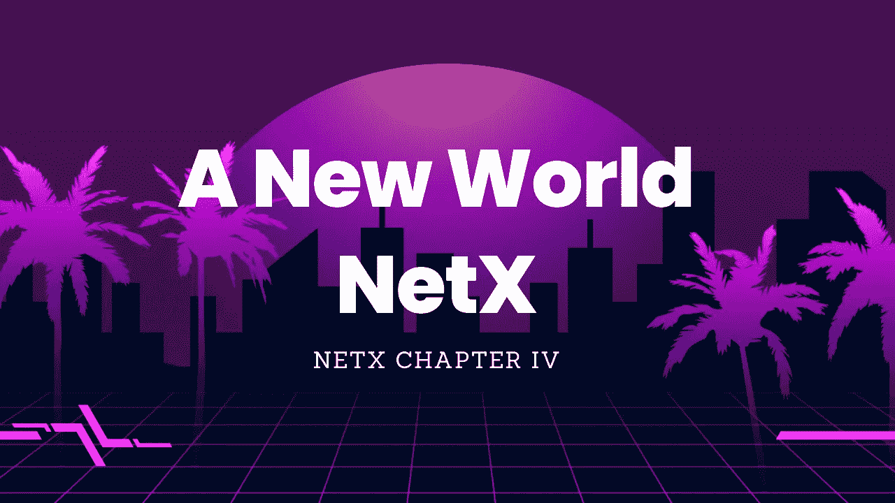

# 新世界— NetX

> 原文：<https://medium.com/coinmonks/a-new-world-netx-1250f144f154?source=collection_archive---------4----------------------->

> 但是因为我们目前的计划导致打开一条通向理解的完全不同的道路，一条对他们来说没有吸引力和未知的道路。这是一种发明知识的方法和路径，被称为“对自然的解释”:“不是在争论中战胜对手，而是用行动征服自然”。
> 
> *—弗朗西斯·培根的《新器官》*

演绎推理通常意味着从一般到特殊。NetX 就是这样诞生的。我称之为 chain native，一种分散的云原生架构，横跨整个网络。NetX 是 Web 3.0 现有的主要解决方案。它由七个主要组件组成，即 Leviatom(一个可信的分布式算法平台)、Divina(一个大规模协作源代码编译器)、Triathon(一个分散的测试和审计驱动程序)、Octavius(一个分散的功能即服务平台，或 dFaaS)、FLock(一个针对 AI 的原生 Web3 数据隐私解决方案)、Tusima(一个可控的私有金融基础设施)、Ethanim(一个新鲜定义的人机交互平台)。这些分散的组件从根本上改变了传统软件行业解决方案的架构，并实际实现了现有区块链的互联网规模。我不认为自己是这个解决方案的发明者。这是自然的自然演绎不可避免的结果，是 It 行业的发展方向，也是 Web 3.0 最终的归宿。

## 分散式 FaaS 平台

经过大量研究得出以下结论:现有的开源无服务器或 FaaS 平台不足以胜任现代云原生 FaaS 平台。云原生无服务器领域的最新进展使得构建新一代 FaaS 平台成为可能。因此，NetX 打算启动 dFaaS 项目，旨在构建新一代开源分散式 FaaS 平台。

比特币是我们汲取灵感的地方。十三年的安全稳定运行让我们对放权充满信心。此外，比特币的激励机制也推动了生产力和生产与生产之间关系的改革。我们还推出了针对互联网规模的激励措施，吸引了更广泛的受众。这个类似于 TCP/ IP 的上层协议运行一个开放的生态、基于服务器的路由系统。所有的代码编写、调试和发布都在这个平台上完成。一旦连接上，开发者就可以随时随地调用平台上的 FaaS 功能。功能运行在各种独立的虚拟应用集群上。出于隐私和安全方面的考虑，Hash 被引入作为索引。函数在调用者应用程序的本地进程中执行。FaaS 平台仅用于开发和发布目的。

## 自我进化的免疫系统

chain native 的核心部分是 docker 驱动的容器，在区块链上自由运行。它与原生云的最大区别在于跨多节点创建的安全性和稳定性。利用 Octavius 提供的 API，Leviatom 上的 docker 图像很快被发现。在单个节点出现故障时，备份节点会前来救援，从而实现不折不扣的连续交付。这样的功能也可以通过更加形象化的人机交互来实现。在此过程中，所有数据通过 FLock 本地存储，通过 docker 图像分发进行数据搜索，用 Divina 实现大规模协同源代码编译，在 Triathon 上进行分散测试。然而，自我进化需要优胜劣汰的激励。当任务完成时，生态中的节点用户被授予令牌。所有的金融互动都在 Tusima 上运行，这是一个隐私可控的金融基础设施。整个系统形成一个闭环。

一旦建立，系统就不再需要人工控制和调度。整个 IT 基础设施处于市场的自动控制之下。当某个部分存在策略监管或某个部分或某个版本存在缺陷时，网络会自我修复和自我进化。就像矿机为了更多的比特币不断升级一样，节点也在不断更新。整个网络社区变成了一个完全去中心化的开源社区，听起来和 ETH 差不多，但是扩展性更强。ETH 只是智能合约和相对简单的 dApps 的简单 EVM，而 chain native 用 docker 代替了传统的 EVM。所有代码都与 chain native 兼容，这是一个分散的网络，允许 Docker 引擎与 ETH 一起运行。

## 实施“低代码”技术

一颗自由的种子正在权力下放的土壤中发芽。对于羊群来说，将理论转化为创新生产力的最佳方式是激发每个单元的创造力。一旦特异性得到充分发挥，新的思维和技术就会通过多样化的渠道产生，这也正是达尔文进化论中生物多样性的本质所在。为此，我们提出了实现低代码类操作的概念。每个人都可以轻松访问整个链原生网络，就像微软最初创建 windows 时家用电脑得到普及一样。世界上的每个用户(非专业计算机用户)都可以访问网络。NetX 使每个人都能够在类似低代码的工具的帮助下设计、编写、调试、测试和发布他们自己或想要的应用程序。这样就大大节省了开发者的时间和成本，也大大提高了整个网络的生产力。从多条战线吸收能量，这种多元生态也会催生各种生产工具和生产关系。通过这样做，我们渴望建设一个容纳我们每一个人的元宇宙。

# 📚必读

[NetX 系列 1.1](/triaslab/rethinking-the-it-industry-d101384e801) | [NetX 系列 1.2](/coinmonks/a-letter-from-satoshi-nakamoto-345a45d012bb) | [NetX 系列 1.3](/coinmonks/out-of-control-the-post-it-evolution-dd64e05ff5bc) | [NetX 系列 2.1](/coinmonks/life-emerges-9ebf26304cd4) | [NetX 系列 2.2](/coinmonks/life-is-out-of-control-9f8e5b7b4b99) | [NetX 系列 2.3](/coinmonks/the-kite-flies-up-and-i-become-the-kite-40678b9dabda) | [NetX 系列 3.1](/coinmonks/the-container-in-the-it-field-21250e3e8b5) | [NetX 系列 3.2](/coinmonks/microservice-architecture-for-new-technologies-d0e37cfccdfa) | [NetX 系列 3.3](/coinmonks/from-service-mesh-to-serverless-570ebd69c884)

***NetX，面向可信可靠的智能自治系统的数字生活的链原生互联网(***[***Trias***](https://www.trias.one/)***)***

****|***[***Ethanim***](https://www.ethanim.network/)***|***[***Tusima***](https://www.tusima.network/#/)***| behemotumius | leviam | Divina****