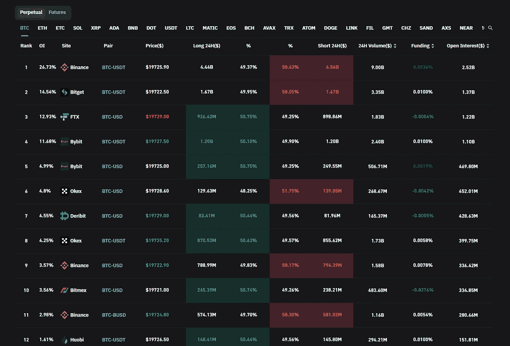
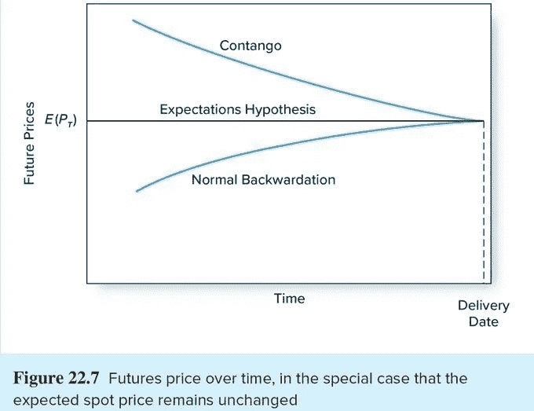
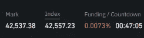
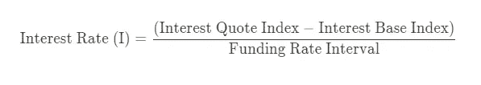
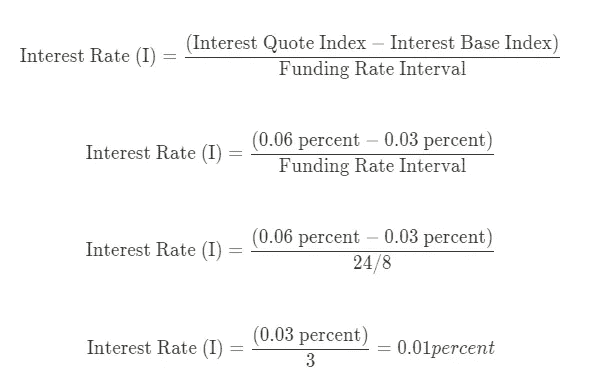
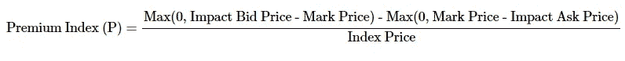
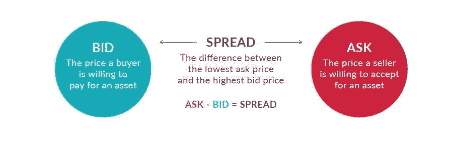
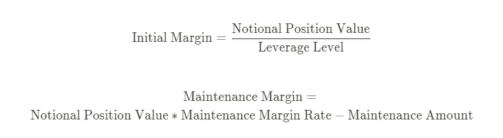
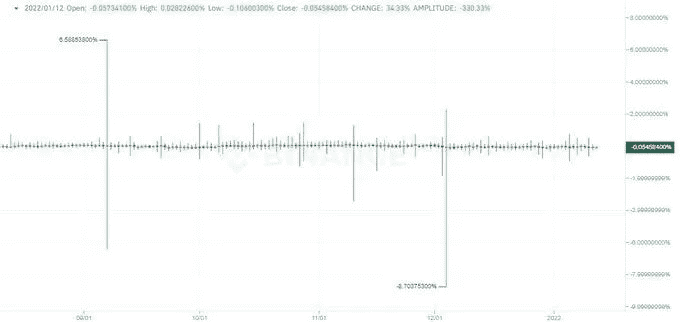

# 理解加密资金利率的新手指南

> 原文：<https://medium.com/coinmonks/a-newbies-guide-to-understanding-funding-rates-dfd2c1e77a75?source=collection_archive---------5----------------------->

现在，虽然[永久期货](https://academy.binance.com/en/articles/what-are-perpetual-futures-contracts)的学习曲线通常不适合密码世界的新手，但如果用必要的知识和决心武装自己，即使是最缺乏经验的用户也可以从这些类型的投资中受益匪浅。

今天，我将介绍永久期货市场的一个子集。我们将讨论资金利率。

# **那么，什么是融资利率？**

**融资利率是根据永久合约市场和现货价格的差异向多头或空头交易者支付的定期款项。它防止了两个市场价格的持续差异。**

## 哪些因素影响资金率？

为了充分理解融资利率的基本面，我们必须首先了解期货合约是如何工作的。

期货合同本质上是双方在未来某一日期以特定价格购买和/或出售其资产的协议。传统期货合约和永久期货合约都被称为衍生品，这意味着它们的价值来自或直接联系到另一种资产的价值。

传统期货有到期日。随着合约接近到期日，人们开始套利，导致价格趋同，到期日接近现货价格。

另一方面，加密世界中的期货合约的价值与其基础令牌的价值直接相关。这些永久期货合约允许加密交易员持有没有到期日的头寸，这意味着这些合约永远不会结算。人们可以无限期地持有它们，直到它们关闭或被清算。

融资利率由两部分组成:利率和溢价。利率通常是固定的，而溢价则根据永久合同和市价之间的差价而变化。

在高波动期间，永久合约的价格和马克价格可能会出现差异。在这种情况下，保险费会相应地上升或下降。

利差大意味着溢价高。另一方面，低溢价表明两种价格之间的差距很小。

当融资利率为正时，永久合约价格高于标记价格，做多的交易者支付空头头寸。另一方面，负的融资利率表明永久价格低于标记价格，意味着空头为多头买单。

融资额并不是一个神奇的数字，它有一个非常简单的计算方法，几乎适用于所有的交易所。融资利率简单地说就是:融资利率= *[利率-溢价指数] +溢价指数*应用了一个钳制函数，上限/下限为 0.05%和-0.05%

资金率并不是一个神奇的数字。几乎所有的交易所都是以非常简单的方式计算的。

**资金利率(F) =溢价指数(P) +钳(利率(I) —溢价指数(P)，0.05%，-0.05%)**

使用箝位功能，上限和下限分别为 0.05%和-0.05%。因此，如果(I — P)在+/-0.05%范围内，则 F = P + (I — P) = I。

为了更好地理解该公式，请考虑以下情况:利率合约以基础货币和报价货币(例如，BTC-基础货币，美元-报价)进行交易，利率是它们之间的简单计算，如下所示:

利率报价指数=报价货币的借款利率

基础利率指数=基础货币的借款利率

融资间隔=重新计算利率的定期间隔

现在让我们通过一个例子来使这些变得更简单。

币安和 Bybit 的美元利率为 0.06%，BTC 利率为 0.03%，因此差异约为 0.03%。大部分交易所的资金间隔是 8 小时，所以利率=(0.06–0.03)/(24/8)= 0.01%(神奇的数字)。

但是，当现货价格和永久价格相差如此之远时，我们如何强制收敛呢？

我们通过使用可爱溢价指数来执行它。

最大值= f (x)

冲击买价=用于执行买价的冲击保证金名义值的平均成交价格。

冲击买入价格=对买入执行冲击保证金概念的平均买入价格

指数价格=资产的指数价格

永久合约的冲击保证金名义值(IMN)是可用于交易初始保证金(USDT 报价)为 200 USDT(币安)的名义值，用于确定平均冲击买价或卖价，以及其在订单中的深度 IMN = 200 /最大杠杆下的初始保证金率。

考虑以下来自[币安](https://www.binance.com/en)的例子:

如果 btcusdt 的最大杠杆是 125 倍，初始利润率是 0.8%，那么 IMN 是 25，000 USDT (200 USDT / 0.8%)。这意味着系统将在订单簿中以每分钟 25，000 USDT 的 IMN 来衡量平均影响买价/卖价。

因此，溢价指数会发生变化，从而影响融资利率。

注意溢价指数在高波动/大波动的日子里变化很大。

如果大多数交易者做多，融资利率将为正，一旦时间到期，做多交易者将支付空头以平衡合约。反之亦然。

为了查看各交易所的融资利率，我使用了[硬币杯](http://coinglass.com)。这是一个观察资金利率和许多其他指标的好网站。

还需要注意的是，用资金利率交易，并不是负数=做空挤压那么简单，因为交易者很蠢；正=上涨，因为鲸鱼在买。融资利率本身不是买入/信号，但当与其他分析结合时，它们可以让你做更有信心的交易。

参考材料:

 [## 加密资金利率比较:币安，FTX，dYdX，ByBit

### 虽然早在 1992 年就被认为是一种潜在的投资渠道，但永久期货并没有付诸实践…

defirate.com](https://defirate.com/funding)  [## 资金利率初学者指南|币安博客

### 传统期货合约的一个关键特征是到期日。当合同到期时，这一过程被称为…

www.binance.com](https://www.binance.com/en/blog/futures/a-beginners-guide-to-funding-rates-421499824684900382) 

> 交易新手？试试[加密交易机器人](/coinmonks/crypto-trading-bot-c2ffce8acb2a)或者[复制交易](/coinmonks/top-10-crypto-copy-trading-platforms-for-beginners-d0c37c7d698c)