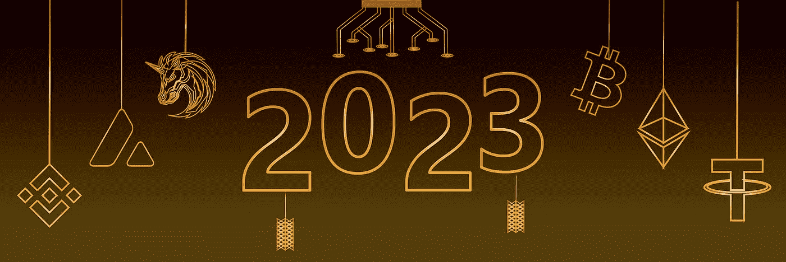

# 《密码 2023》的新观点

> 原文：<https://medium.com/coinmonks/a-newies-look-at-crypto-2023-5635f4ed384d?source=collection_archive---------34----------------------->

Pixabay

我已经阅读了即将到来的报告——赞成的和反对的。我已经看过了图表，调查了地形，并提供了我的 crypto 2023 展望。

加密分析公司 Santiment 发布的一份报告显示，最近已有超过 7 亿美元投资于 crypto。

> 交易新手？在[最佳密码交易所](/coinmonks/crypto-exchange-dd2f9d6f3769)上尝试[密码交易机器人](/coinmonks/crypto-trading-bot-c2ffce8acb2a)或[复制交易](/coinmonks/top-10-crypto-copy-trading-platforms-for-beginners-d0c37c7d698c)