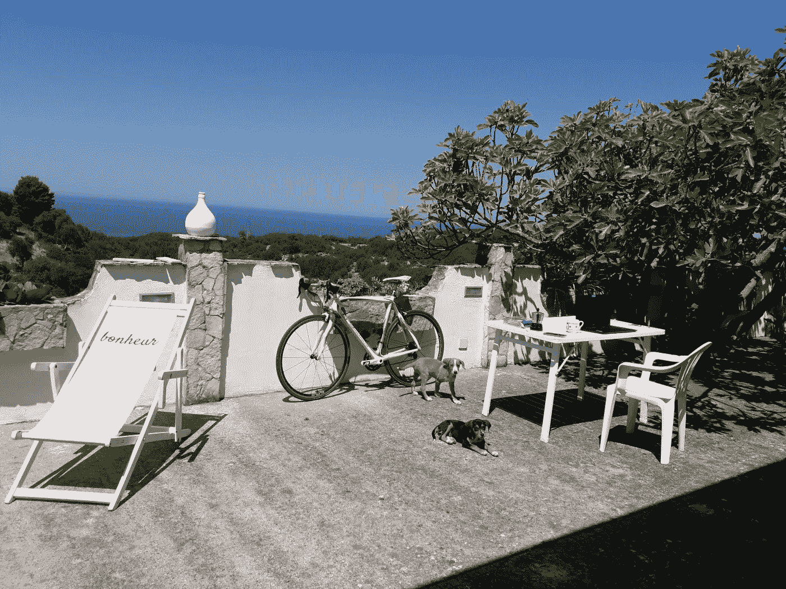
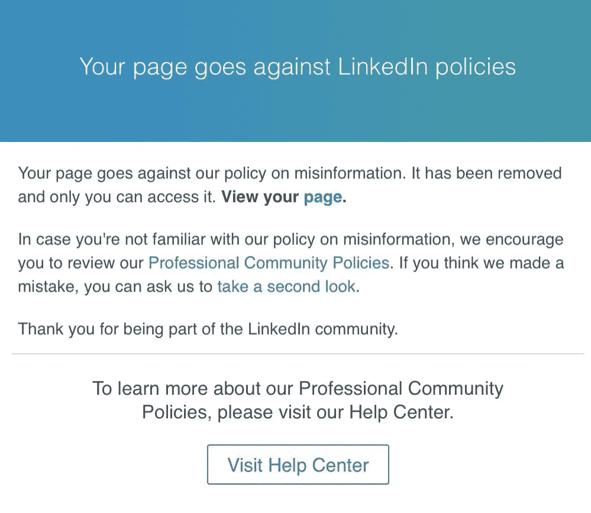

# 比特币的无名小卒。

> 原文：<https://medium.com/coinmonks/a-nobody-s-case-for-bitcoin-66dbc067b1c7?source=collection_archive---------8----------------------->

A nobody´s retreat in Bella Italia. The best way to concentrate on writing a Bitcoin book and making the case for Bitcoin

2022 年的前六个月相当具有挑战性。如果有人希望在新冠肺炎的大规模歇斯底里之后，会有某种程度的恢复正常，那么现在他肯定是严重的妄想了。我没有。我或多或少知道会发生什么。因为我知道在玩什么游戏，谁是玩家。

股票市场暴跌，[日元和欧元像发展中国家的货币一样膨胀，](https://www.zerohedge.com/markets/bank-japan-spends-record-81-billion-avert-collapse-10-trillion-jgb-market-now-completely)[通货膨胀，商品价格飙升，WWIII 的火花在乌克兰点燃。](https://www.zerohedge.com/economics/visualizing-three-different-types-inflation)

然后是自杀的西方政府，基本上是在制裁自己，而任何有头脑的人都清楚，经过 10 年的制裁，俄罗斯现在完全脱离了西方的经济战，不受其影响。

最后，比特币在其短短的 12 年历史中第 459 次死亡。

在这一切发生的时候，我很幸运地独处了一段时间。我沉浸在意大利普利亚加尔加诺自然公园的美妙大自然中，有两只好狗，许多猫和我心爱的 Pinarello 公路赛车。

我没有无线网络，没有电视，只有一个电台整天播放 70 年代和 80 年代的音乐。狗似乎也很享受，没有人错过来自“文明”主流媒体宣传机器的令人沮丧的消息。

> 交易新手？尝试[加密交易机器人](/coinmonks/crypto-trading-bot-c2ffce8acb2a)或[复制交易](/coinmonks/top-10-crypto-copy-trading-platforms-for-beginners-d0c37c7d698c)

自从 LinkedIn 突然取消了我的职业简介，没有任何通知和理由，我已经“孤立”了一段时间。只需轻轻一点，全球主义真理部的审查人员就拿走了四分之一世纪以来积累的数千份专业人脉，让我成了“无名小卒”。反正我也不在乎。我知道这迟早会发生。我也决定远离其他任何一个中心化的平台，直到一个运行在比特币协议上的真正去中心化的社交平台出现。所以我感觉自己回到了 90 年代。

我很乐意做一个无名小卒，只有一封电子邮件和一个网站。

LinkedIn censorship

与许多其他“被平台化的新一代”一样，这些天我犯了一个非常常见的罪行:不符合科技寡头强制推行的全球主义政权认可的大众思维，这些科技寡头与达沃斯、腐败的官僚以及为他们服务的政客(而不是错误选举他们的人)同流合污。简而言之，整个疯狂的全球主义者群体。享受着我新发现的健康的“无名之身”——拿着笔记本电脑坐在一棵大无花果树的树荫下，凝视着大海和起伏的橄榄树、橙子和柠檬的绿色斗篷，伴随着持续不断的蝉鸣和海风——我在精神上向他们伸出中指，继续写我的比特币之书。这是一个极好的时间来反思过去 3 年中发生的许多事件，这些事件最终给了达沃斯破坏者千载难逢的机会，将他们的破坏性议程强加给我们，为他们“重建更美好的世界”,让我们更加贫穷和不幸福。

这也可能是最好的观察地点——带着超然和一种漠不关心的冷漠——在最近的一次比特币大幅贬值中。

虽然与主流媒体的垃圾和噪音完全隔离，但我可以更好地专注于这次回调的真正原因，并保持理性和清醒的头脑，在这个关头为比特币提供客观的理由。

因此，我把我的想法写在这篇文章中“[比特币下跌了，但它的情况从未如此引人注目](https://bitcoinmagazine.com/culture/bitcoin-down-but-never-more-compelling)”,这篇文章已由 Bitcoinmagazine 独家发表。在这篇文章中，我研究了比特币的基本面，最近的地缘政治和宏观经济事件，以及它们可能对比特币的未来产生的影响。我还评估了比特币最近下跌的真正原因，以及达沃斯全球主义议程所扮演的角色。写这本书还帮助我将复杂的地缘政治和宏观经济拼图的不同部分组合在一起，描绘出一幅更大、更全面的画面，帮助比特币创造者理解最近的事件。

[**“所发生的事情不是偶然发生的。这也不仅仅是政客们无能的结果。我认为，这是一个经过深思熟虑的政策选择，议程中包括一些即将发生的非常糟糕的事情……**](https://bitcoinmagazine.com/culture/bitcoin-down-but-never-more-compelling)

**但对于比特币，我的预期仍然非常乐观:比特币的理由从未如此令人信服。我邀请你阅读我在 [Bitcoinmagazine](https://bitcoinmagazine.com/culture/bitcoin-down-but-never-more-compelling) 上的文章，以了解所有的背景，以及为什么在这个节骨眼上人们应该更加看好比特币。**

**这是一篇相当长的文章，但有必要处理一些复杂的主题。我相信你会从中找到一些值得思考的东西。让我知道你对比特币“无名小卒”的看法。**

**在阅读我的 Bitcoinmagazine 文章的同时，也阅读了由 Ross Stevens、Nic Carter 和 Allen Farrington 撰写的关于 Terra /LUNA 崩溃的最新报道“[关于早餐前不可能的事情”——对 Terra 的事后分析，对 DeFi 的事前分析，以及对即将到来的疯狂的一瞥](https://info.nydig.com/hubfs/On%20Impossible%20Things%20Before%20Breakfast.pdf?utm_medium=email&_hsmi=215380682&utm_content=215380682&utm_source=hs_email)。**

**如果你想给小费来支持我自由独立的工作，谢谢:**

****BTC——比特币****

**BC 1 QM jmh 75 lkfpjpgx 224j 06 hjekv 96 jnl 7 txt ug3 k**

****XMR — Monero****

**454 fee vu 1 z 1 bpwyhx 2w 369 z 4 r 6 ifwaptckcmjxjv 2 idxq 2 hedswpkp 1 RWC 2 ajvbjxkohl 1 vfswnvsn 21 mrze 56 x7 bcu**

***原载于 2022 年 7 月 16 日 https://andreabianconi.medium.com***。****

> ***加入 Coinmonks [电报频道](https://t.me/coincodecap)和 [Youtube 频道](https://www.youtube.com/c/coinmonks/videos)了解加密交易和投资***

# ***另外，阅读***

*   ***[CoinFLEX 评论](https://coincodecap.com/coinflex-review) | [AEX 交易所评论](https://coincodecap.com/aex-exchange-review) | [UPbit 评论](https://coincodecap.com/upbit-review)***
*   ***[十大最佳加密货币博客](https://coincodecap.com/best-cryptocurrency-blogs) | [YouHodler 评论](https://coincodecap.com/youhodler-review)***
*   ***[AscendEx 保证金交易](https://coincodecap.com/ascendex-margin-trading) | [Bitfinex 赌注](https://coincodecap.com/bitfinex-staking)***
*   ***[最好的卡达诺钱包](https://coincodecap.com/best-cardano-wallets) | [Bingbon 副本交易](https://coincodecap.com/bingbon-copy-trading)***
*   ***[印度最佳 P2P 加密交易所](https://coincodecap.com/p2p-crypto-exchanges-in-india) | [柴犬钱包](https://coincodecap.com/baby-shiba-inu-wallets)***