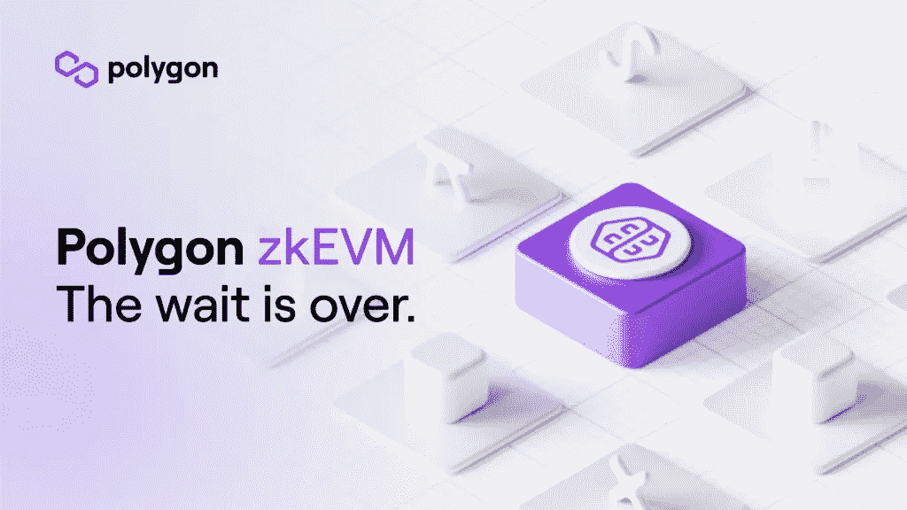
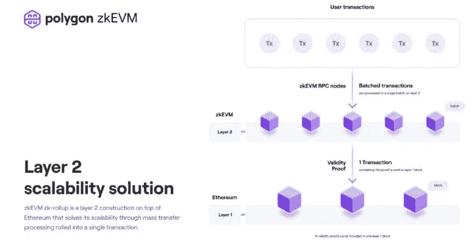
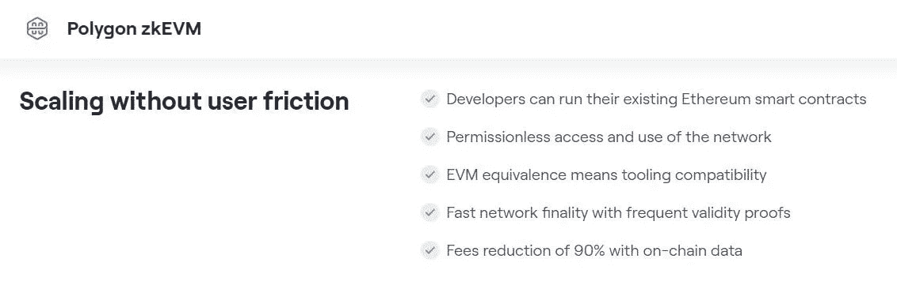
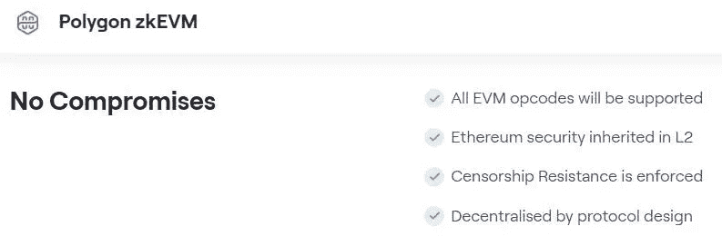

# 用 Polygon 的 zkEM 测试以太坊的一个新的第 2 层扩展解决方案

> 原文：<https://medium.com/coinmonks/a-novel-layer-2-scaling-solution-for-ethereum-being-tested-with-polygons-zkem-1d3c993aa1f6?source=collection_archive---------43----------------------->

[Source](https://blog.polygon.technology/the-future-is-now-for-ethereum-scaling-introducing-polygon-zkevm/)

# 以太坊工作层 2 扩展解决方案的成熟阶段

所以哇！！…大约在 2019 年，我对以太坊的想法感到沮丧，我想工作的第 2 层解决方案在哪里？。

看起来现在，以太坊的第二层解决方案正在成熟，所以尽管以太坊仍然是一个使用成本很高的网络，但当我们在 Polygon 中使用以太坊应用程序时，成本会稍微低一些。因为我知道 Polygon，我认为它主要是一个儿童端 POS 链，在那里以太坊交易可以以更便宜和更快的方式完成。

所以，你可以通过一个桥把以太网和其他代币带到 Polygon，你必须承担以太坊网络的费用，但之后你可以在 Polygon 交易，那里的费用很低，但交易很快。

嗯，这是以太坊的一个非常基本的基于等离子体的多边形缩放解决方案，但看起来它已经进化了。

***最近，Polygon 宣布它得到了正确的方程，使用零知识技术为以太坊纺出了另一个缩放解决方案，那就是(ZK) tech at play！！***

所以，哇…至少现在，以太坊有了越来越方便的扩展解决方案。

Polygon 自从被称为 Matic 以来，一直利用以太坊的安全性运行。自动令牌被标在以太坊链上，带有使用以太坊网络安全的验证器，所以在 Polygon 上发生的任何交易都可以在以太坊上被验证，可能是它的最终状态。

# Polygon 的以太坊零知识证明扩展解决方案

Polygon 的 zkEVM 是一个第 2 层协议，它使用 roll ups 来扩展以太坊。这种基于零知识技术的协议将各种交易批量化为一个汇总，并通过将汇总作为单个 zk 证明发送到以太坊主链进行验证，在第 1 层以太坊中对其进行验证。

因此，多个交易被分批汇总，并作为 zk 证明发送到以太坊第 1 层网络，在那里进行验证。这扩展了以太坊，因为 zk 证明中汇总的许多交易都被验证为以太坊主链中的单个交易。

[Source](https://blog.polygon.technology/the-future-is-now-for-ethereum-scaling-introducing-polygon-zkevm/)

# 好消息是，零知识证明扩展解决方案看起来能够令人满意地扩展以太坊

目前，这种 zkEVM 扩展解决方案将在发布之前在 testnet 版本中进行测试，但 Polygon 团队已经确认该解决方案在扩展以太坊网络方面的性能令人满意。这是一个好消息，因为在早期，虽然 zk 技术被认为是有前途的，但由于它是一个昂贵和耗时的过程，所以实现是不可行的。

Polygon 的 zkEVM 是以太坊虚拟机(EVM)兼容的，这意味着部署在这里的任何以太坊智能合约都将像在以太坊中一样工作，尽管速度更快，成本更低。以太坊中使用的相同开发工具和编程语言也将在 zkEVM 中运行！！

[Source](https://polygon.technology/solutions/polygon-zkevm/)

Polygon zkEVM 的 EVM 等价性使得它在用户和开发者中都大受欢迎。

[Source](https://polygon.technology/solutions/polygon-zkevm/)

***结论***

当然，今天有如此多的第 1 层区块链，它们速度快、成本低，但 Polygon 提出了一个先进的扩展解决方案来扩展以太坊，这很好。显然，我觉得这可以更早完成，这将减轻我在处理以太坊时的挫折感，但所有这些扩展解决方案对于 ETH 和 ERC20 令牌持有者以及那些使用以太坊 dapps 的人来说都很方便。

这是我连续第三篇关于多边形的文章，所以我感觉自己上演了帽子戏法。哈！！

我以前的关于 Polygon ID 解决方案的其他文章，这是一个以隐私为中心的身份解决方案，通过让用户控制他们的个人数据来赋予他们权力。

***你可以在这里阅读关于多边形 ID-:***

[Web3 时代，区块链功能集成在手机上，如 Nothing Phone (1)](/coinmonks/web3-era-growing-with-blockchain-functionalities-integrated-on-mobile-phones-like-nothing-phone-1-b5bcf6801685)

[使用户能够控制其个人数据的身份解决方案——Polygon ID](/coinmonks/a-identity-solution-that-empowers-users-with-control-over-their-personal-data-polygon-id-fe951f595eb)

> 交易新手？尝试[加密交易机器人](/coinmonks/crypto-trading-bot-c2ffce8acb2a)或[复制交易](/coinmonks/top-10-crypto-copy-trading-platforms-for-beginners-d0c37c7d698c)