# 世界上最大的密码交易所可能损失 5 亿美元

> 原文：<https://medium.com/coinmonks/a-possible-500-million-loss-on-the-worlds-largest-crypto-exchange-d84edfdafc08?source=collection_archive---------16----------------------->

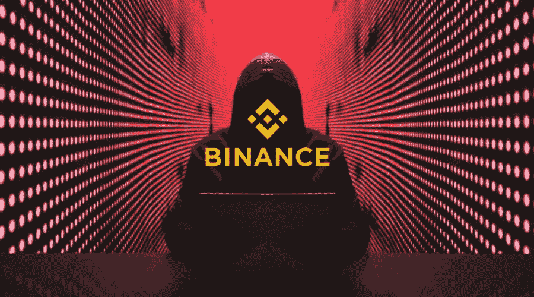

据世界上最大的加密货币交易所币安的代表称，一次价值 5.7 亿美元的黑客攻击影响了与该公司相关的区块链。这是今年打击加密货币行业的一系列攻击中的最新一起。

在一条推文中，币安首席执行官赵昌鹏表示，在 BNB 连锁店使用的区块链“桥”上的令牌被盗，该连锁店在 2 月份之前被称为币安智能连锁店。

利用区块链桥，加密货币可以在其他应用之间移动。

根据研究人员 Chainalysis 的说法，小偷越来越关注他们，大约 20 亿美元在 13 次不同的黑客攻击中被盗，主要是在今年。

根据赵的帖子，窃贼偷走了价值近 1 亿美元的加密货币。

后来，根据 BNB·钱恩的一篇博客文章，黑客总共取走了 200 万枚 BNB 硬币，价值约 5.7 亿美元。

根据来自币安代表的邮件，大部分 BNB 仍在黑客的数字钱包地址中，约有 1 亿美元的价值仍“未被追回”

BNB 链支持 BNB，原名币安币，根据数据提供商 CoinGecko 的数据，它是世界上第五大加密货币，市值超过 450 亿美元。

## 币安黑客事件的技术细节

五个小时前，一名攻击者从币安大桥偷走了 200 万 BNB(约 5 . 66 亿美元)。在那段时间里，我一直在与多方密切合作，以甄别和解决这个问题。事情是这样的。

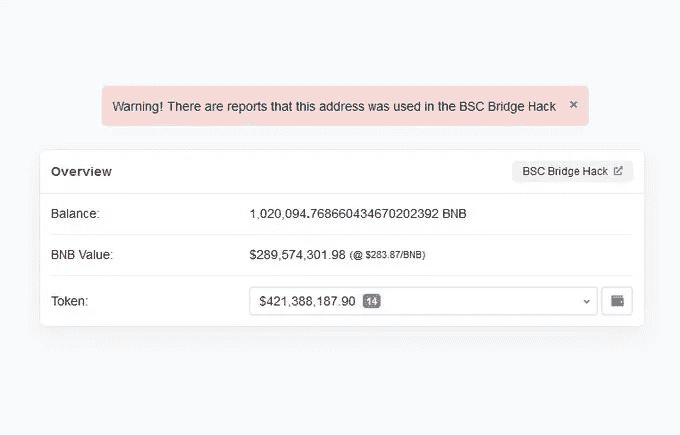

这一切都是从 [@zachxbt](https://twitter.com/zachxbt) 突然发给我攻击者的地址开始的。当我点进去的时候，我看到了一个价值数亿美元的账户。要么有人拉下了一个巨大的地毯，要么有一个大规模的黑客攻击正在进行

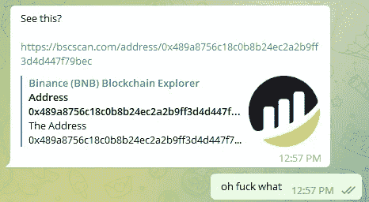

起初，我以为 [@VenusProtocol](https://twitter.com/VenusProtocol) 又被黑了。然而，只需要几秒钟就可以确定攻击者*真的*向 Venus 存入了超过 2 亿美元。相反，我需要弄清楚这些资金来自哪里

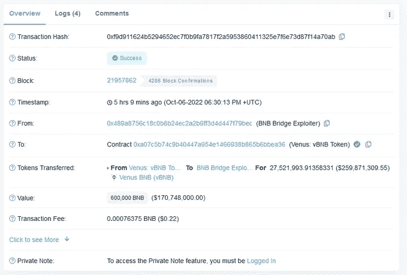

答案是攻击者以某种方式说服币安大桥只需给他们送去 100 万 BNB。两次。

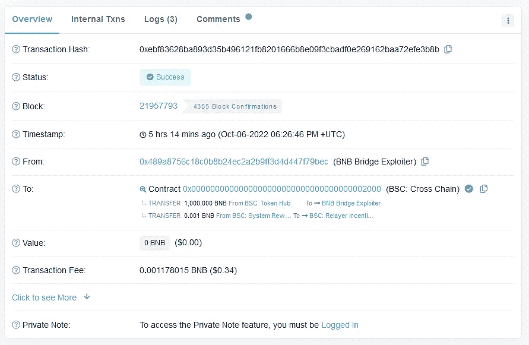

要么是币安最终泄露了 Web3 有史以来最大的秘密，要么是攻击者发现了一个严重的错误。

我从对比攻击者的交易和合法取款开始。我注意到的第一件事是攻击者使用的身高总是相同的——110217401。合法取款使用的高度要大得多，比如 270822321

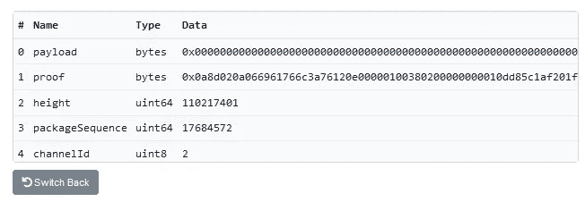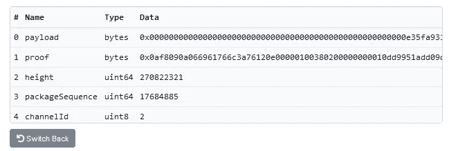

我还注意到攻击者的证明比合法取款的证明要短得多。这两个事实让我相信攻击者已经找到了一种方法来伪造那个特定块(110217401)的证明。现在我必须弄清楚这些证明是如何工作的

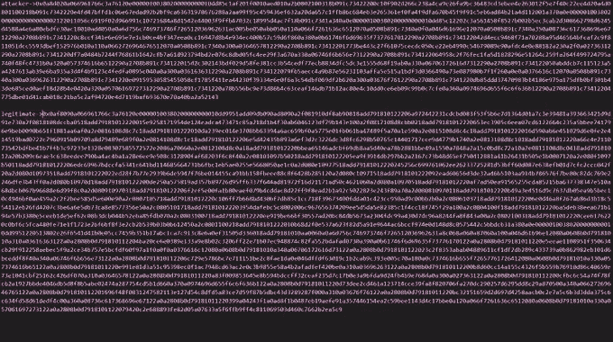

在币安上，有一个特殊的预编译契约用于验证 IAVL 树。如果你对 IAVL 树一无所知，不要担心。大概有 95%的内容我还是不明白。幸运的是，你和我需要复制的只是剩下的 5%…

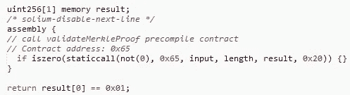

好的，所以基本上，当你验证一个 IAVL 树时，你指定了一个“操作”列表。币安桥通常期望其中的两个:一个“iavl:v”操作和一个“multistore”操作。以下是它们的实现

 [## iavl/proof _ iavl _ value . go at de 0740903 a67b 624d 887 f 9055 d4c 60175 dcfa 758 cosmos/iavl

### 此时您不能执行该操作。您已使用另一个标签页或窗口登录。您已在另一个选项卡中注销，或者…

github.com](https://github.com/cosmos/iavl/blob/de0740903a67b624d887f9055d4c60175dcfa758/proof_iavl_value.go#L61-L82) 

为了伪造一个证明，我们需要两个操作都成功，并且我们需要最后一个操作(multistore)返回一个固定值(指定块的散列:110217401)。看一下实现，我们可以努力说服自己，操纵根散列是不可能的，或者至少是非常困难的。或者你可以相信我的话。这意味着我们需要输入值等于提交 id 之一

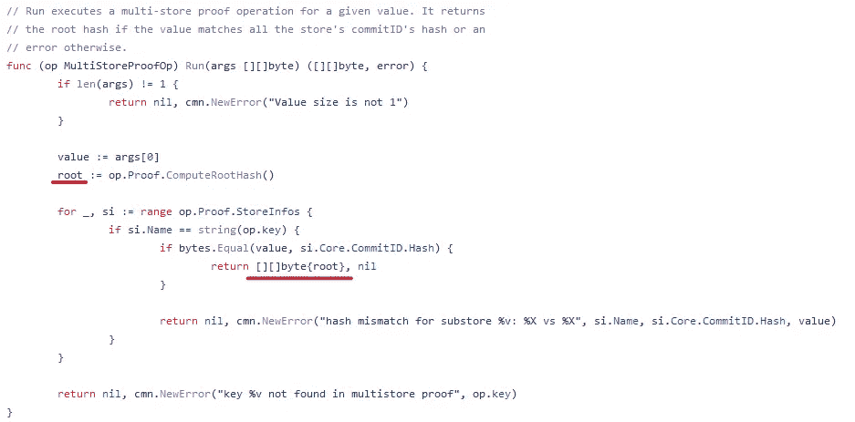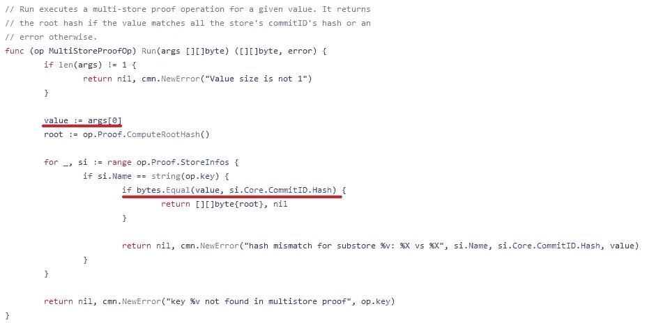

“multistore”操作的输入值是“iavl:v”操作的输出值。这意味着我们希望以某种方式控制这里的根变量，同时仍然通过值验证。

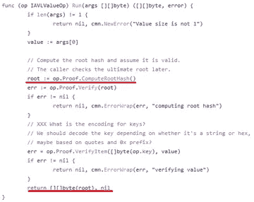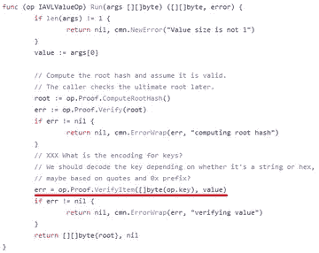

那么根散列是如何计算的呢？这发生在一个叫做 COMPUTEHASH 的函数中。在一个非常非常高的层次上，它递归地遍历每一条路径和每一片叶子，进行一系列哈希运算，实际上实现细节并不重要

 [## iavl/proof _ range . go at de 0740903 a67b 624d 887 f 9055 d4c 60175 dcfa 758 cosmos/iavl

### 此时您不能执行该操作。您已使用另一个标签页或窗口登录。您已在另一个选项卡中注销，或者…

github.com](https://github.com/cosmos/iavl/blob/de0740903a67b624d887f9055d4c60175dcfa758/proof_range.go#L237-L290) 

重要的是，由于哈希函数的工作方式，我们基本上可以肯定地说，任何(path，nleaf)对都将产生唯一的哈希。如果我们想伪造证据，这些需要保持不变。

查看合法事务中证明的布局，我们看到它有一个很长的路径，没有内部节点，只有一个叶节点。这个叶子节点包含了我们恶意负载的散列！如果我们不能修改这个叶节点，那么我们需要添加一个新的。

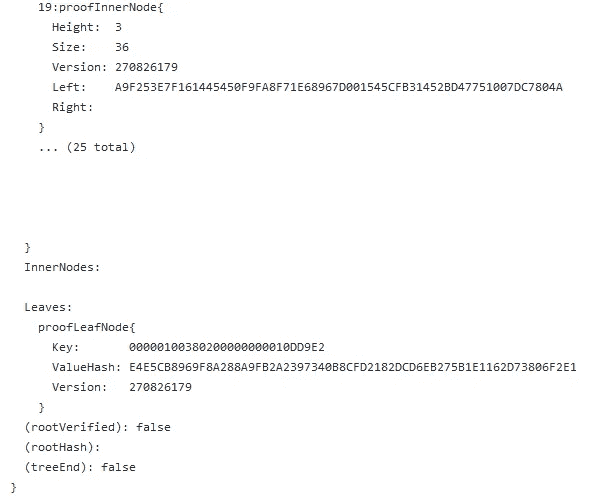

当然，如果我们添加一个新的叶节点，我们还需要添加一个新的内部节点来匹配

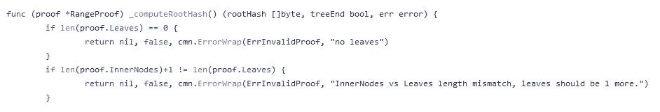

现在我们只剩下最后一个障碍要面对了。我们实际上如何让 COMPUTEHASH 返回我们想要的根 HASH 呢？注意，最终我们需要一个包含非零右散列的路径。当我们发现一个匹配时，我们断言它匹配中间根散列

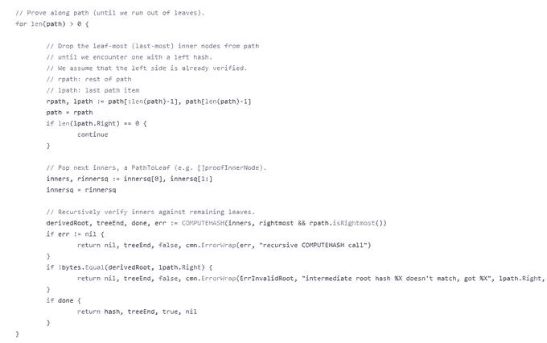

让我们对代码进行一点测试，这样我们就可以知道我们需要什么样的散列。

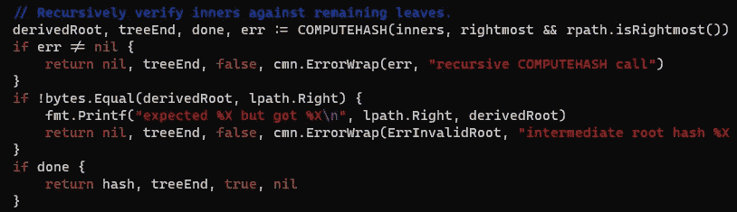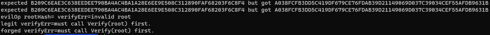

剩下的就是把所有的东西放在一起。我们将采用合法的证明并对其进行修改，以便:

*1)我们为我们伪造的有效载荷添加了新的一页*

*2)我们添加一个空白的内部节点来满足证明者*

*3)我们使用正确的根哈希调整我们的叶子以提前退出*

(值得注意的是，这并不是攻击者使用的确切方法。他们的证明路径要短得多，我不确定他们到底是如何得出这个结论的。然而，其余的利用是相同的，我相信展示如何从头开始构建它是有价值的)

总之，在币安桥验证证据的方式上有一个缺陷，这可能会允许攻击者伪造任意消息。幸运的是，这里的攻击者只伪造了两条消息，但损害可能会严重得多。

为了防止未来的黑客攻击，币安称之为“社区驱动、开源和去中心化的生态系统”的 BNB 链表示，它将添加一个新的“治理机制”，并增加验证器的数量。

在有史以来最大的加密货币抢劫案之一中，黑客在 3 月份从区块链一座名为 Ronin Bridge 的桥上窃取了超过 6.15 亿美元。美国将此次盗窃事件归咎于朝鲜黑客，这是有史以来规模最大的一次。

> 交易新手？尝试[加密交易机器人](/coinmonks/crypto-trading-bot-c2ffce8acb2a)或[复制交易](/coinmonks/top-10-crypto-copy-trading-platforms-for-beginners-d0c37c7d698c)