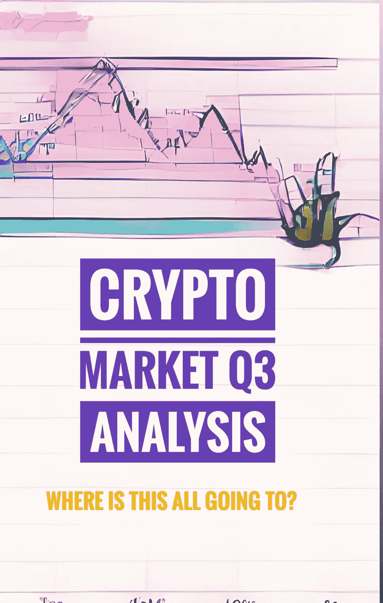
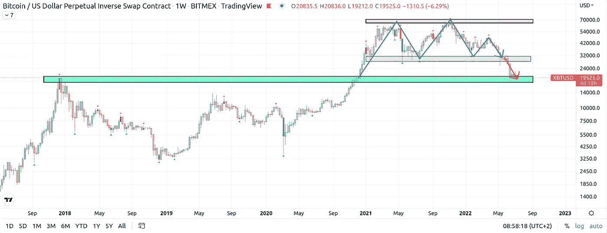
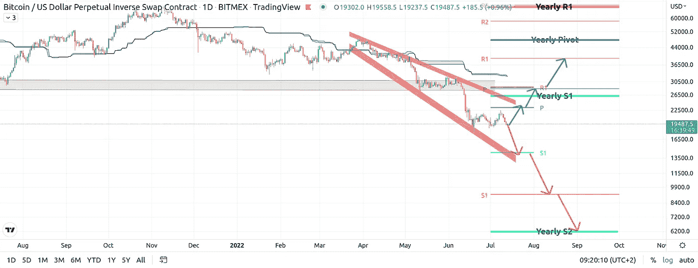
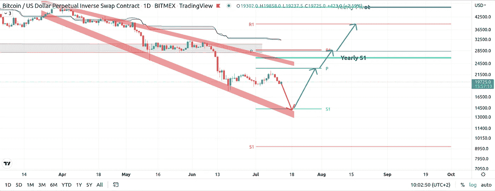
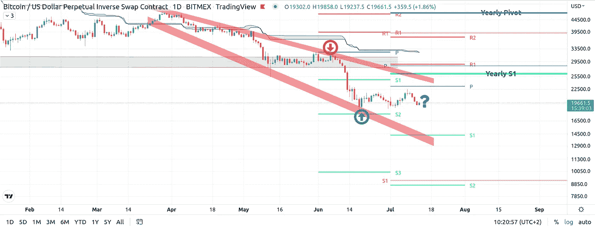
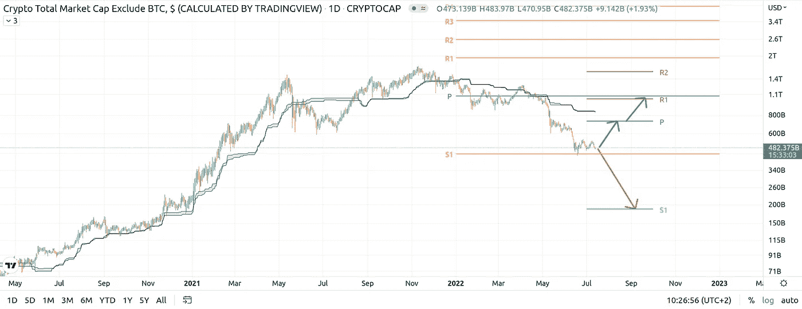

# 季度分析:对第三季度加密市场(如比特币)有什么期待

> 原文：<https://medium.com/coinmonks/a-quarterly-analysis-what-to-expect-from-q3-in-crypto-markets-i-e-bitcoin-9b7e81a92cb?source=collection_archive---------24----------------------->

是的，这个月已经有点晚了，但由于比特币价格几乎没有变化，只是挂在深渊的边缘，这确实是一个悬而未决的故事，所以仍然可以推测 2022 年第三季度的可能情况。像往常一样，我要用支点和常识来做这件事。我也将成功地忽略基本面，尽管在我写这几行时，我能听到全球市场基本面在尖叫。我塞住耳朵，看着图表，念着咒语:“只有图表重要，只有图表”。

然而，重要的是要说，全球图表，主要是股票，不仅看起来很像比特币的图表，或者实际上相反会更准确，但它们都有点在同一个地方:深渊的边缘。这是一条很长的路。我提到这一点是因为正如你在过去几年中所了解的那样，比特币本身不再是一种资产类别，它现在已经深深融入了金融遗产市场。如果它们向下移动，它也会向下移动。如果他们上升了，那就是另一回事了。当比特币移动时，整个加密市场也会移动。因此，在建立了这些认识之后，逆向投资者会问自己:“区块链科技股还有多大的指数上涨潜力？”。带着最大化主义者心中的疑虑，让我们来看看图表本身。

我从一张干净的周线图开始，图上只画出了基数水平，很容易看出我们现在的位置——这是 2017 年比特币狂热结束后第 12 个小时的支撑位。早在 2020 年 11 月，价格确实在同一水平上短暂挣扎过，当时价格抛物线式地升至约 6.4 万美元大关。在 32k-64k 之间的范围内已经有一年半的时间了，随后是一个刹车下降。现在价格回来测试最后 ATH 水平。在全球形势和已经看跌的 2022 年的背景下，a 未能守住那里，这是一个严重的厄运，希望水平正在下降。另一方面，成功守住当前水平将是一个令人印象深刻的力量行为和未来看涨宣言。

## 阴郁压倒了繁荣

现在是比特币测试当前水平的第五周。这是一个真正的伤害点，一个可能的明斯基时刻，如果你愿意。我有两种主要情况:看跌和看涨(啊！)及其变体。如果突破这一水平，价格可能会首先测试月度 S1，也会在大约 14k 美元处遇到不断扩大的楔形底部。如果这不成立，这是一个很大的概率移动到约 9k 美元的第三季度 S1。如果这是彻底崩溃的一部分，我会在每年 6k 美元左右的 S2 上看到你。

在我转向更乐观的情景之前，我要提一下，根据我处理支点的经验，当一个季度支点与 S1 之间存在如此巨大的差距时，就像本季度支点的情况一样，这种向下移动很少发生。我认为，搬到本月的 S1 比看到第三季度达到更有可能。此外，有时这样的差距是价格机制变化的信号，但不要抱太大希望。这是一个非常不确定的全球环境，今年所有股票市场的制度都变得看跌(哎呀，我说的是原教旨主义)。比特币本身今年不仅成功地从一年一度的支点变成了一年一度的 S1，而且目前还挂在一年一度的 S1 之下。用中枢理论的术语来说，这是一个信号，表明资产想要进入下一个级别，在这个例子中是年度 S2。

即使赔率更倾向于下跌，你的祈祷很可能会得到回应，一些看涨情绪将进入系统。如果它确实在当前水平介入，我们很可能会看到一个测试月支点附近的动作，在那里它遇到楔形的上平面和每年的 S1。我只是想说，向下移动到 S1 将是一个很好的反向买入点，向上移动将在理论上提供一个很大的卖出机会。在 23-29k 之间有很多阻力等着我们。很多！然而，如果价格奇迹般地成功突破，那么本季度的下一个目标将至少是第三季度 1，价格约为 3.9 万美元。这几乎是目前水平的 100%的变动！

> 交易新手？试试[加密交易机器人](/coinmonks/crypto-trading-bot-c2ffce8acb2a)或者[复制交易](/coinmonks/top-10-crypto-copy-trading-platforms-for-beginners-d0c37c7d698c)

## **场景、场景和整体市场**

让我们谈谈可能的情况。在我看来，这里有一个可能性很大:

那就太可悲了。跌破目前的主要水平，预示着整个行业可能会经历一个漫长的冬天。但是价格不在乎，如果你是交易的正确一方，你也不应该在乎。毕竟，除了投机之外，已经有 13 年没有大众效用了。让我们看看另一个投机场景，首先下跌到每月的 S1，只是为了愚弄每个人和他们的姐妹，在上涨之前再次埋葬比特币。这将是一个多么壮观的场面…史诗！

最后，如果你上个月一直在关注我，你会知道我提到过上个月的 S2，认为在 17.5k 区域买入的可能性很大。这是我看待买卖的方式——它们是一种概率游戏。你可以在趋势开始时买入确认，这绝对没有错，但是你也可以在确认和信号堆积之前，在游戏的早期买入。那是我的事。上个月初在 31k 美元的高概率区域卖出后，带着买入进入，这里是月支点与楔形上平面相交的地方，这就是我认为的高质量交易。它可以让你以两种相反的姿势舒适地坐着。让两个都跑，直到其中一个停下来。

等等，现在你问整个加密市场第三季度的分析如何？简而言之，没有比特币的许可，它是不会动的。在罕见的情况下，这种绿灯可能是 BTC 在牛市渗透到 Alts 时长时间保持不变。我们已经有一段时间没有看到这种情况了，但这是可能的。以下是可能的情景，绘制在不包括 BTC 的总市值上:

很明显，市场正在测试一年一度的 S1。如果它真的失败了，那么你可以期待市值至少减半。如果反弹结束，有+50%的可能性移动到第三季度支点，这可能会或可能不会跟随另一个类似的移动到第三季度 R1 和年度支点。随着本季度的发展，我会在我的 Twitter 账户和这里更新这些信息。

原来如此。这是一张地图。但这是一张不断变化的地图，同时仍然保持相关性，你不知道你将在哪里结束，你只知道那里的道路。祝你好运…

> 加入 Coinmonks [电报频道](https://t.me/coincodecap)和 [Youtube 频道](https://www.youtube.com/c/coinmonks/videos)了解加密交易和投资

# 另外，阅读

*   [5 款最佳加密交易终端](https://coincodecap.com/crypto-trading-terminals) | [最佳 DeFi 应用](https://coincodecap.com/best-defi-apps)
*   [比特币基地 vs 瓦济克斯](https://coincodecap.com/coinbase-vs-wazirx) | [比特鲁点评](https://coincodecap.com/bitrue-review) | [波洛涅克斯 vs 比特鲁](https://coincodecap.com/poloniex-vs-bittrex)
*   [德国最佳加密交易所](https://coincodecap.com/crypto-exchanges-in-germany) | [Arbitrum:第二层解决方案](https://coincodecap.com/arbitrum)
*   [币安交易机器人](/coinmonks/binance-trading-bots-d0d57bb62c4c) | [OKEx 评论](/coinmonks/okex-review-6b369304110f) | [阿塔尼评论](https://coincodecap.com/atani-review)
*   [最佳加密交易信号电报](/coinmonks/best-crypto-signals-telegram-5785cdbc4b2b) | [MoonXBT 评论](/coinmonks/moonxbt-review-6e4ab26d037)
*   [如何在 Bitbns 上购买柴犬(SHIB)币？](https://coincodecap.com/buy-shiba-bitbns) | [购买弗洛基](https://coincodecap.com/buy-floki-inu-token)