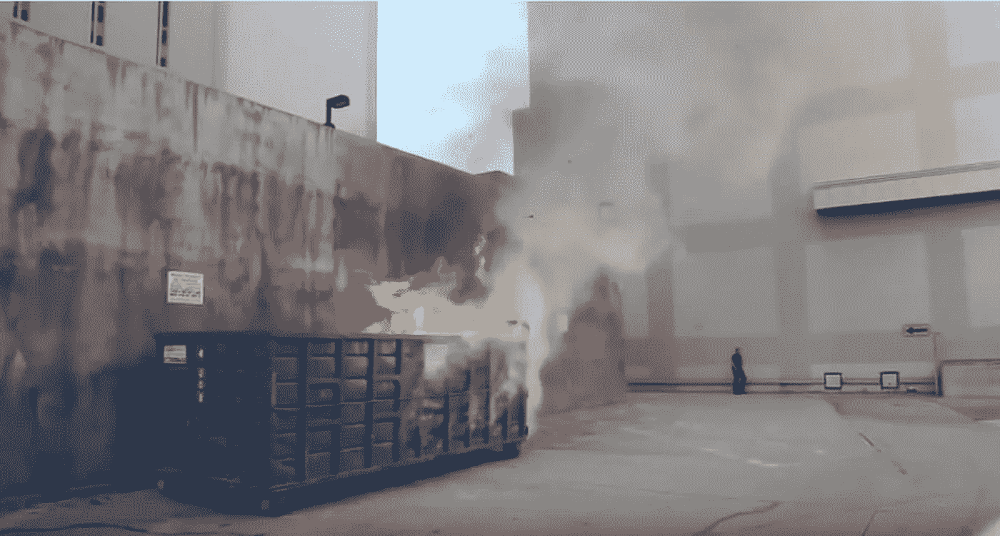

# 为什么比特币可能很快暴跌的快速指南

> 原文：<https://medium.com/coinmonks/a-quick-guide-to-why-bitcoin-could-plummet-soon-75465d278cc?source=collection_archive---------41----------------------->

为九月做好准备。

Sometimes, the world feels like its on fire. Oftentimes, it literally is.

## 全球垃圾箱火灾

我刚刚写了关于我们是否已经看到熊市底部的文章。虽然我们是否会看涨的几率是 50 %,但我打赌我们会看到进一步的低点。

我们现在知道，加密货币与股票市场息息相关。事实上，相关性从未如此之高。

> 随着[通货膨胀](/the-capital/understanding-inflation-61aaf4f03cfc)，欧洲的土地战争，以及正在进行的疫情，很难相信牛市即将到来，即使市场已经抹去了 50%的损失。

如果对股票没有新的热情，如果市场进一步下跌，比特币将受到拖累。

## 奥古斯特被拒绝了

八月可能是比特币的大杂烩。2017 年 8 月走牛撕，涨幅 65%。但是这个月有两次大的提款。

> 事实上，今年 8 月是自 2015 年熊市以来表现最差的 8 月。

8 月 10 日，BTC 试图突破 25000 美元的阻力，但失败了。此后，crypto 稳步下降。截至发稿时，该指数位于 20200 美元，仅比其下一个主要支撑位 18600 美元高出 1600 美元。

BTC 有可能会保持在这一支持水平，但如果出现任何关于通胀、加息或股市抛售的负面消息，比特币很可能会失去它。

Bitcoin is beaten down. Will it bounce back?

## 九月糟透了

九月通常比八月更糟糕。历史上，它是最大的输家。自从加密货币问世以来，九月已经被长期的霍德勒人称为红色月份。平均下来出血 6%左右。

对于股票来说，这也是一个糟糕的月份。

> 自 1945 年以来，只有 2 月和 9 月的回报率一直为负。

后者是两者中最糟糕的，三大领先指数在此期间持续下跌。

这是为什么呢？九月通常意味着焦点的回归。交易者可能会卖出以锁定利润，或者支付他们度假回来的费用。这也是许多共同基金支付股息的月份，这可能会导致出于税收目的的抛售。也有技术原因，如卖方在年初重新乐观后降低了风险。

## **这只是更多的 FUD 吗？**

也许，只是也许，接下来的这个月会有所不同。有一些不同的声音认为，由于今年股市已经经历了残酷的一年，9 月份将是牛市。

这篇文章说，市场已经消化了熊市，我们将迎来反弹。以太坊 9 月份与 proof of work 的合并也可能意味着看涨，尽管还没有定论。

> 如果比特币月度收盘价能超过 2 万美元，那么今年 9 月可能会是个例外。如果不是这样，正如最近的一条推文所警告的，它可能会引发抛售。

作为 BTC 和瑞士联邦理工学院的持有人，我非常激动。

> 交易新手？试试[密码交易机器人](/coinmonks/crypto-trading-bot-c2ffce8acb2a)或者[复制交易](/coinmonks/top-10-crypto-copy-trading-platforms-for-beginners-d0c37c7d698c)