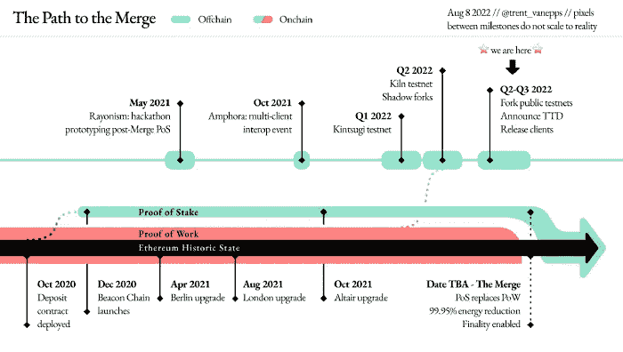
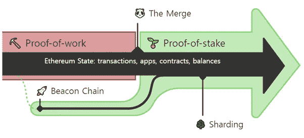
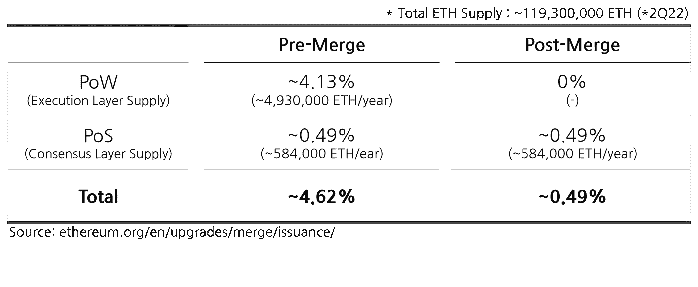
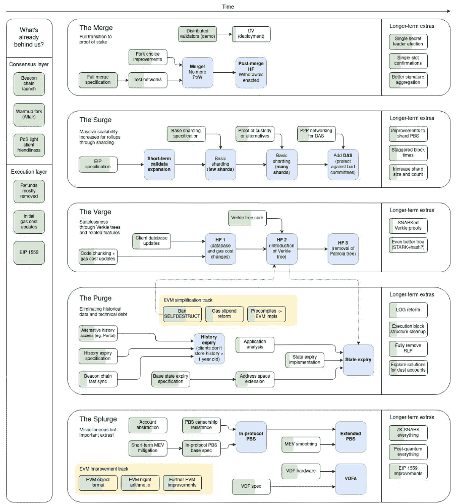
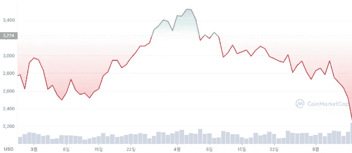
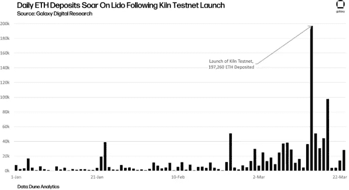
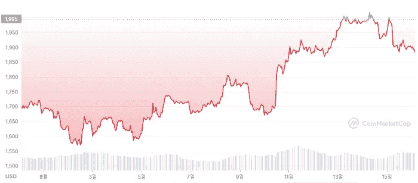
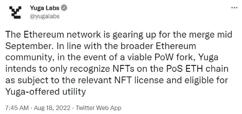

# 以太坊合并快速回顾[略]

> 原文：<https://medium.com/coinmonks/a-quick-review-of-ethereum-merge-abbreviated-c96e95c0fcac?source=collection_archive---------21----------------------->

“加密史上最重大的升级之一”

CoinMetrics 的数据显示，以太坊 8 月份的月度高点比今年 6 月初跃升了 100%+主要研究机构估计，对定于 9 月份进行的合并的预期可能已经影响了它。

以太坊的合并是加密史上最重要的升级之一，也是加密爱好者最期待的事件。

现在，让我们用不太专业的语言来简单了解一下什么是合并。

> ***什么是合并？***

合并是一种升级，它将以太坊的 PoW(工作证明)执行层与 PoS(利益证明)共识层(信标链)集成在一起。合并后，PoW 将被 PoW 取代。

以太坊的愿景是成为一个更可扩展、更安全、更可持续的生态系统，同时保持去中心化。为了安全过渡到 PoS，已经有许多测试和 bug 奖励。

[blog.ethereum.org]

*   PoW 要求矿工使用他们的计算硬件，这一过程使用了太多的电力，导致了环境问题。
*   通过合并升级，以太坊旨在提高可持续性和安全性。

> ***是什么时候合并的？***

9 月 7 日，Bellatrix hard fork 被激活， [Vitalk Buterin 在他的 Twitter 上发布了](https://twitter.com/VitalikButerin/status/1566993505326710785)消息，称合并预计将在 9 月 13 日至 15 日左右进行。请参考下面的外部链接来跟踪合并的时间。

*   [https://ultrasound.money/](https://ultrasound.money/)
*   [https://wenmerge.com/](https://wenmerge.com/)

> ***合并后有什么变化？***

合并后有两大变化。

1)全面过渡到 PoS 后，以太坊的能耗将降低 99%左右。

2)以太坊年发行率将下降~90%。

[[How the Merge impacts ETH supply](https://ethereum.org/en/upgrades/merge/issuance/)]

> ***误解***

**1)燃气费**:在合并后进一步升级之前，燃气费不会有明显变化。

**2)交易速度:**略有变化但不明显。通过分片升级，交易速度将会提高。

**3)Hard Fork Token(ETHPoW)的价值:**资产翻倍的机会很低(截至 9 月 7 日，eth pow 的当前价格仅为 30~40 美元左右)

> ***合并后进一步升级***

在合并之后，将进一步升级可伸缩性，称为分片。分片升级预计明年内落地，将降低二层系统的交易费用。

7 月在法国举行的以太坊社区大会上，Vitalk 展示了他对未来升级的愿景。根据 Vitalk Buterin 的说法，以太坊将经历进一步的升级，称为-浪涌，边缘，净化和挥霍。

[[A quick breakdown of what each stage means for](https://twitter.com/milesdeutscher/status/1550315295402668032)]

> ***合并升级前后的价格走势***

*   **窑炉测试网** 上线后 3 月 15 日窑炉测试网成功上线后，根据 CoinMarketCap 和 Dune Analytics 的数据，以太坊价格和每日 ETH 存款飙升。

*   **8 月 11 日歌尔力测试网上线后**
    来自 CoinMarketCap 的数据显示，8 月 11 日歌尔力测试网成功上线后，以太坊的价格创下 6 月以来的最高。

然而，由于所有的事件都是 testnet 发布，很难妄下结论，因为许多变量会影响合并后的价格。

> ***可能影响以太坊价格的因素***

1.  **以太坊将成为通缩资产的预期**

*   发行率将下降 90%，一些研究机构预计，如果以太坊的燃烧率高于发行率，它可能是一种通缩资产。但众所周知，金融和密码市场是不可预测的，许多因素可能会影响价格。

**2。上海升级将允许提款**

*   对上海升级后出售以太坊的一些担忧，使得人们可以提取股份以太——这不太可能发生，因为退出是有利率限制的

**3。技术不确定性**

*   合并是一个重要且高度复杂的升级，它改变了 mainnet 的一致算法。经过多年的理论讨论和测试，可能会出现意想不到的技术问题，导致密码市场的波动。

> ***市场参与者如何为合并做准备***

1.  **矿工**

*   一些矿商正在尝试硬分叉以太坊，发行 PoW 硬分叉令牌，比如 ETHPoW。

**2。加密货币交易所**

*   大多数交易所都在为这一重大事件做准备，表示他们将支持合并，并将对 PoW fork 相关令牌进行相同的上市审查流程。
*   MEXC、BitMEX 和 Poloniex 已经推出了 ETHPoW(以太坊的 PoW fork)期货合约。
*   币安最近宣布，在 9 月 26 日之前，他们将免除使用 BUSD 交易以太坊的费用。

**3。稳定币**

*   Stablecoin 提供商 Circle(USDC)和 Tether(USDT)宣布他们将支持以太坊，并且不会猜测任何硬分叉 PoW 的可能性。

**4。DeFi 项目**

*   大多数 DeFi 项目表示，他们将支持合并，因为他们的决定也与以太坊基金会和更广泛的以太坊社区一致。
*   为以太坊区块链提供分散式 oracle 服务的 Chainlink 表示，它不会为分叉版本提供支持。
*   Aave 是 TVL 最大的 DeFi 贷款协议之一，将在合并后仅支持 PoS，并决定在合并前暂时暂停贷款。
*   [Aave 机构群体同意](https://snapshot.org/#/aave.eth/proposal/0xa121311c67b7a5bbe5b8b5fe1911663a0ab94ed339a6a4b0e1b9443f670a0e97)从 PoW 过渡到 PoS 具有在 ETH 市场中高利用率的风险。

**5。NFT**

*   与 stablecoin 和其他 DeFi 项目不同，可能会有关于哪些资产是原始资产的争论。
*   尽管有这些可能性，宇迦实验室表示，他们将只支持 PoS ETH 链，以避免任何混乱。

> ***结论***

对于以太坊生态系统和更广泛的以太坊社区来说，合并无疑是一个历史时刻。合并的成功完成将开启一个更具可持续性和可扩展性的生态系统的时代。

在根据路线图进行进一步升级后，以太坊网络将以更低的燃气费更快地处理交易，从长远角度来看，这将进一步增加以太坊生态系统的价值。

由 Trinito 的合伙人 Jiyon Kim 撰写，Trinito 的投资主管 SungPil Huh 供稿。

#合并#以太坊# ETH # Vitalik # SBT # NFT # dApps #科技#区块链#加密货币

**链接**

*   [https://Twitter . com/DuneAnalytics/status/1562021273575751680](https://twitter.com/DuneAnalytics/status/1562021273575751680)
*   [https://dune.com/sixdegree/ethereum-the-merge](https://dune.com/sixdegree/ethereum-the-merge)
*   [https://coin telegraph . com/news/vitalik-crypto-payments-will-make-sense-as-tx-costs-fall-to-mere-cents-kbw-2022](https://cointelegraph.com/news/vitalik-crypto-payments-will-make-sense-as-tx-costs-fall-to-mere-cents-kbw-2022)
*   [https://decrypt . co/105707/ether eum-merge-surge-verge-purge-spluge-vitalik-buter in](https://decrypt.co/105707/ethereum-merge-surge-verge-purge-splurge-vitalik-buterin)
*   [https://www . coin desk . com/tech/2022/08/01/ether eum-after-the-merge-what-comes-next/](https://www.coindesk.com/tech/2022/08/01/ethereum-after-the-merge-what-comes-next/)
*   [https://www . the block . co/post/166019/coin base-is-open-to-listing-ether eum-pow-fork-assets？UTM _ source = telegram 1&UTM _ medium = social](https://www.theblock.co/post/166019/coinbase-is-open-to-listing-ethereum-pow-fork-assets?utm_source=telegram1&utm_medium=social)

**免责声明**

这不是投资建议，仅供参考。您不应将任何此类信息或其他材料理解为法律、税务、投资、财务或其他建议。

> 交易新手？试试[密码交易机器人](/coinmonks/crypto-trading-bot-c2ffce8acb2a)或[复制交易](/coinmonks/top-10-crypto-copy-trading-platforms-for-beginners-d0c37c7d698c)