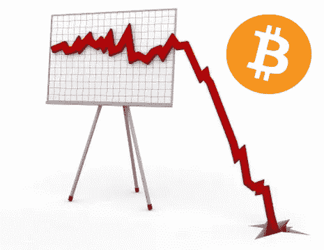
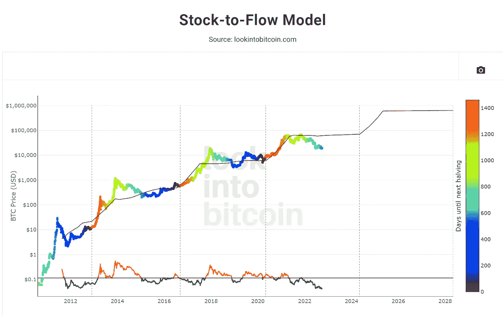
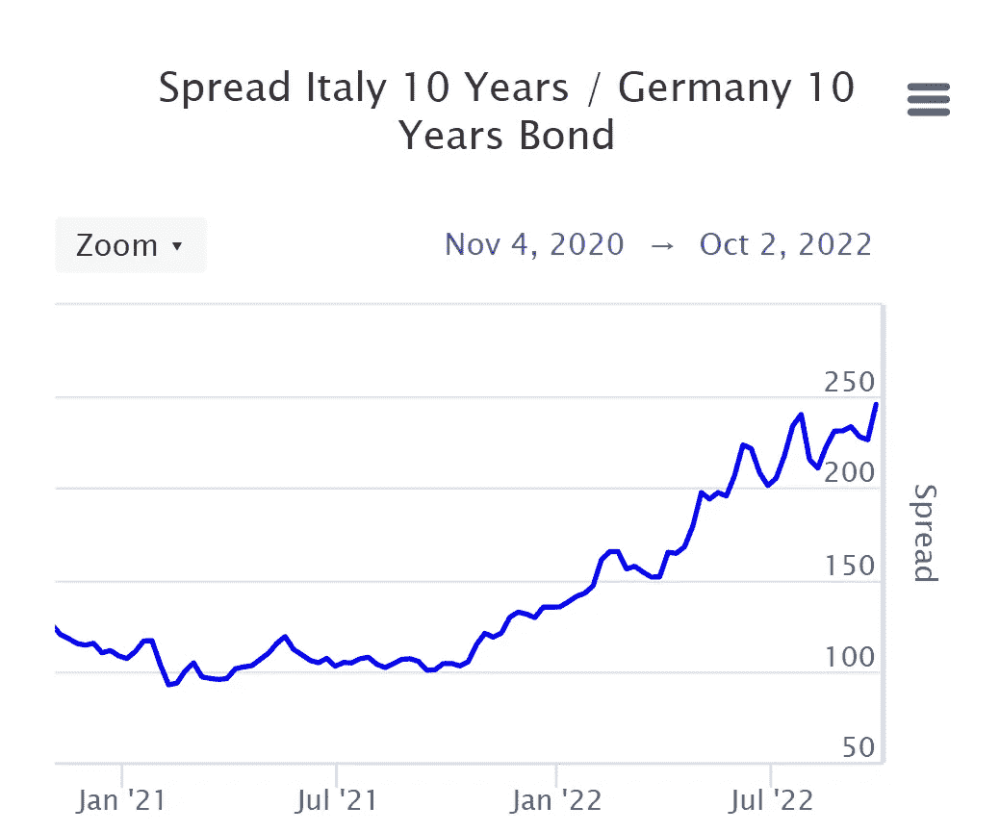
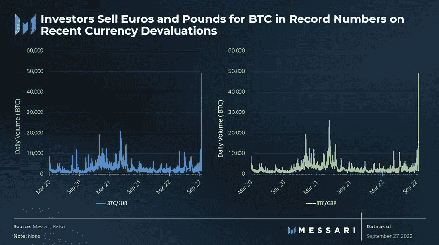

# 一万美元比特币的现实案例:最终崩盘即将来临

> 原文：<https://medium.com/coinmonks/a-realistic-case-for-a-10-000-bitcoin-the-ultimate-crash-is-upon-us-48f7131d79c3?source=collection_archive---------9----------------------->

*免责声明:这不是理财建议，仅供娱乐。*

好吧，好吧，好吧，我已经听到你说的了，但是在跳到我身上之前，用一些“花哨”的词，比如**【FUD】**；事情是这样的，我只是根据事实进行分析。我不是说 BTC 会走得这么低，**，我只是提出一个我认为可能发生的案例研究**。极有可能？我不会走那么远。

# 事实

BTC 只知道一个看涨的贸易环境，它在 2008 年次贷金融危机后推出了一种分散货币。从这个角度来看，这是成功的。

Popular S2F Model by PlanB

所有当前模型(S2F、测井曲线区等)都是在极其有利的市场条件下制作和回测的**。我还认为他们中的一些人已经看到了**无效点**。当然，BTC 已经触及 S2F 模型的平均预期价格，但它比以往的熊市偏离得更多。**

对数曲线区域模型**必须重新制作**以适应当前的价格行为，当前的价格行为正在回测之前的牛市 ATH。BTC 过去从未这样做过。

如果最近的过去(几年)是任何迹象，它肯定有利于 BTC 更低的底部，如果它保持高度相关的风险资产，如标准普尔 500。

BTC 还没有经历过像 1973 年世界经历第一次石油危机、2000 年网络泡沫或 2008 年房地产泡沫时 TradFi 调整 50%的情况。到目前为止，S&P“只”修正了大约 25%,这已经很痛苦了，但与上次金融危机相比，这根本不算什么。

# 美联储，美国货币政策

我看到越来越多的人在谈论美联储转向，到目前为止，杰罗姆·鲍威尔没有给出任何放松 QT 的迹象。更糟糕的是，美国经济仍然非常强劲，以至于拜登政府试图重新定义什么是衰退。如果说有什么不同的话，那就是给了美联储更多的回旋余地来保持紧缩。

Is shit about to hit the fan ?

回顾 J. Pow 的演讲，他谈到“一些痛苦”正在降临市场。在他最近的 FOMC 会议上，他加倍努力首先对抗通货膨胀，最重要的是对抗 T21。

为了让美联储转向，要么美国债务利率攀升至引发主权债务危机的高位，要么美国经济本身崩溃得太厉害(比如房地产市场，甚至是持续的汽车泡沫)。但在通胀没有真正显示出任何真正放缓迹象的情况下，现在转向可能会对美联储产生反作用。

这是硬道理，为了抑制通货膨胀，J. Pow 需要真正伤害经济，减少消费，减少投资，价格最终会下降。

# 世界经济正在崩溃

首先，让我们看看欧洲，特别是 T2 欧元区 T3。它目前的经济模式被彻底摧毁。它基于**低能源**成本(主要来自俄国)生产**高附加值**项目(德国的汽车、法国的奢侈品等……)。不管人们会怎么想，这种商业模式在可预见的未来已经结束了(特别是北溪 1 号& 2 号现在已经被破坏了)，这意味着欧洲将不得不忍受许多痛苦(我住在那里！).

**欧盟手中没有有效对抗通胀的工具。如果欧洲央行继续提高利率，将会显著增加主要使用同一货币的意大利(T14)、西班牙(T15)和法国(T17)之间的主权债务利差。现在，意大利和西班牙依靠欧洲央行回购他们的债券来控制他们。然而，最重要的是，意大利刚刚选出了一个对布鲁塞尔(欧盟首都)不友好的极右翼政府。这反过来又会阻止欧洲央行缩减资产负债表，从而减少流通中的€数量，最终通胀会保持在高位。**

**欧盟正处于内爆的边缘**，它从未如此接近，即使是在 2012-2013 年主权债务危机期间。

我需要谈论英国吗？利兹·特拉斯在减税的同时大幅增加政府支出。这直接导致了英镑抛售，进而导致养老金基金被追加保证金，不得不大量清算其金边债券(英国债券)，迫使英国央行进行干预，回购这些债券，因为在某些时候看不到买家。

这不是一个近乎雷曼的时刻，实际上更糟。

**日本**也不能收紧。相反，他们坚持他们的 QE 政策。

中国，哦，中国，别让我提起这个。该国正面临自 CCP 掌权以来最大的金融危机。他们的房地产市场空前繁荣，占他们国内生产总值的 30%。不要误解我的意思，中国会生存下来，但它不会没有给中国公民带来重大的经济痛苦。哦，对了，差点忘了 0 Covid 策略仍在继续…

# BTC 拯救恩典

对 BTC 来说，唯一的可取之处是，它能完全履行自己的角色，成为不受任何人控制的分散货币。它不能像任何国家的货币一样疯狂印刷，它的参数是固定不变的。为了实现这一点，BTC 需要与 TradFi 脱钩。

支持这种说法的一个理由可能是**最近来自欧元区和英国的散户投资者涌入**，因为他们目睹了本国货币对美元的大幅贬值。BTC 能做到吗？这是一个价值数百万美元的问题。如果它能做到这一点，那么我们就有很好的机会看到 BTC 正在触底。**如果没有…**

然后当你在看世界经济的时候，问自己一个问题。如果你看到的不是一场重大危机的来临，那么好吧，BTC 目前正在形成底部。

但是，如果你是数据驱动型的，并且**你看到了世界经济即将崩溃的所有迹象**，同时 BTC 无法与 TradFi 脱钩，那么是的:**这将是一万美元 BTC 的现实案例**(或者更低，但在一万美元左右有一个强有力的支撑)。

我希望你们都有一个愉快的阅读。如果是这种情况，请点击👏按钮，这样这篇文章就可以接触到更多的人。

我的推特账号:[https://twitter.com/CryptoDeFi2048](https://twitter.com/CryptoDeFi2048)

> 交易新手？尝试[加密交易机器人](/coinmonks/crypto-trading-bot-c2ffce8acb2a)或[复制交易](/coinmonks/top-10-crypto-copy-trading-platforms-for-beginners-d0c37c7d698c)