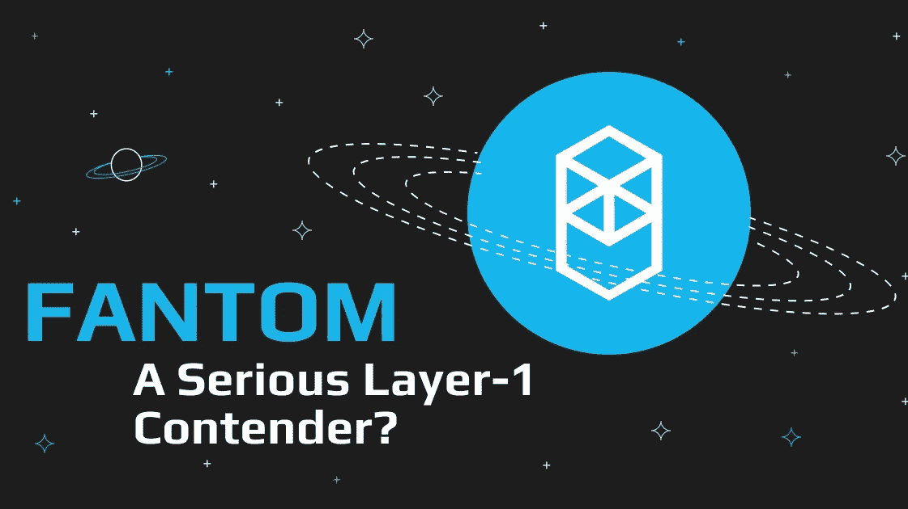
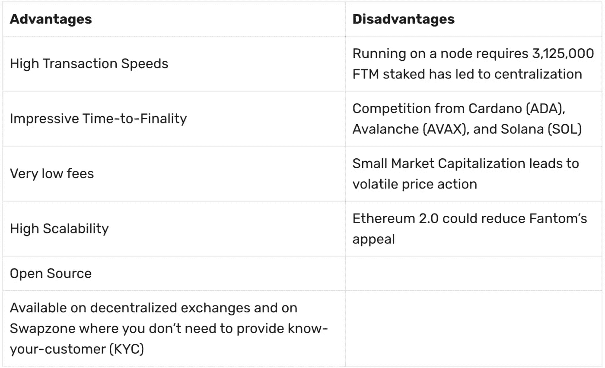
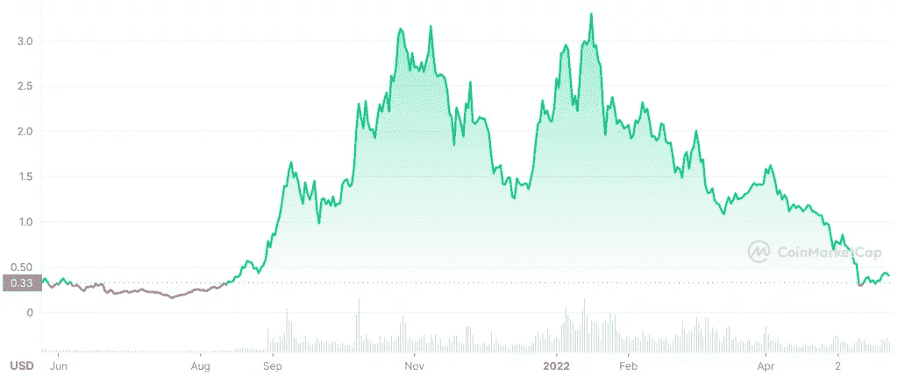

# 一个重要的第一层竞争者？Fantom (FTM)全面审查

> 原文：<https://medium.com/coinmonks/a-serious-layer-1-contender-fantom-ftm-full-review-980d1f230578?source=collection_archive---------11----------------------->

Fantom (FTM) 是第一层 Fantom 区块链的本地令牌，它向用户承诺高速、安全的智能合约兼容服务，可以承担类似[以太坊(ETH)](https://swapzone.io/currencies/ethereum) 和[索拉纳(SOL)](https://swapzone.io/currencies/solana) 的服务。

自推出以来，Fantom 项目已经引起了相当大的关注，因为它据称能够解决第一层区块链面临的三大难题，即安全性、分散性和可伸缩性。

在本文中，我们将深入探讨 Fantom 背后的技术，看看它的用例，并调查这是否真的是一个潜在的“以太坊杀手”，其交易价格比历史高点低 85%。

# Fantom (FTM)是如何工作的？

Fantom 的网络完全兼容智能合同，并像其他第 1 层区块链项目一样运行无许可系统。

事务和治理由本机 [FTM 实用令牌](https://swapzone.io/currencies/fantom)提供支持，该令牌在以太坊网络上作为 ERC-20 令牌发布，在币安区块链上作为 BEP-20 令牌发布。

通过提供高速、可扩展和安全的智能合同解决方案，Fantom 网络是 dApp 开发者的梦想，这使得它能够发展成为一个蓬勃发展的 DeFi 生态系统。

Fantom 开发人员声称他们的网络比竞争对手的更安全、更可扩展的原因是其独特的设计和共识机制 Opera。

# Fantom 如何运作

Opera 是 Fantom 的主要网络，它完全兼容以太坊虚拟机(EVM)，这就是为什么 dApps 可以跨区块链导入。

与通常以线性方式设计的传统区块链不同，Fantom 的 Opera 链利用了有向非循环图(DAG)，就像 [Hedera (HBAR)](https://swapzone.io/currencies/hedera-hashgraph) 项目一样。

DAG 允许节点在成批事务被发送到主链以完成之前以更独立的方式确认事务。

给予节点更多的自由意味着 Fantom 能够实现比传统区块链更高的交易速度(TPS)。

Fantom 的共识机制被称为“巨蝮属”，它使用利害关系证明机制来运行异步拜占庭容错(aBFT)系统。

aBFT 共识机制保证了非常快速的完成速度，这意味着交易可以比在[以太坊(ETH)](https://swapzone.io/currencies/ethereum) 和[比特币(BTC)](https://swapzone.io/currencies/bitcoin) 使用的工作证明系统上更快地完成。

# 灵活且适应性强

由于其 EVM 兼容性，Fantom 网络创建了一个适应性非常强、非常灵活的项目，因为它为已经在以太坊上运行的无数 dApps 打开了大门。

由于以太坊的费用和速度继续阻碍开发者和用户的体验，其他第一层正成为一个受欢迎的替代方案，由于其灵活性，Fantom 似乎领先于竞争对手。

除了高速交易，得益于 aBFT，Fantom 对试图破坏网络的恶意节点具有极强的抵抗力；即使三分之一的节点试图破坏 Fantom aBFT，网络也不会出现问题。

Fantom 的开发者不仅希望它能够吸引广泛的 dApps，而且他们还认为 FTM 具有很好的可扩展性，可以成为城市和公共事业运营的网络，尽管这是一个非常长期的目标，尚未取得任何成果。

# Fantom (FTM)的优缺点

Fantom 网络显然有一个令人印象深刻的属性列表，但是在您全面了解之前，让我们来看看这个项目的优缺点。

正如你所看到的，这个项目确实有一些缺点，但总的来说，它是一个非常有前途的网络，有很大的潜力成长为一个主要的第一层参与者。

# 谁创造了 Fantom？

Fantom 是由韩国计算机科学家 Ahn Byung Ik 博士在 2018 年创建的，他致力于解决第一层区块链面临的三重困境。Byung 后来离开了这个项目，Michael Krong 成为了新的首席执行官，加密货币巨头 Andre Cronje 接管了该项目的 DeFi 方面。

由于 Andre Cronje 是 Web 3.0 和 DeFi 的教父之一，他的加入对这个项目是一个巨大的推动。然而，2022 年 3 月，Cronje 宣布他将离开 DeFi 的世界，这导致 FTM 的价格暴跌。

有趣的是，Cronje 似乎在本月(5 月 22 日)重新加入了该项目，该网络的本地令牌也因此反弹。Cronje 的出现显然对 Fantom 是一个巨大的推动。

# Fantom (FTM)为什么有价值？

Fantom 的价值在于它能够克服目前困扰第一层区块链的三难困境。

Opera networks 基于 DAG 的共识机制创建了一个以极高速度处理交易的系统，以低成本解决了三难问题的两个部分。

此外，该项目有可能解决权力下放的第三个难题，尽管目前在这一领域，由于节点的高进入壁垒，它仍然落后。

虽然 FTM 仍在发展中，但它已经成为数十个 dApps 的家园，并显示出其安全快速处理交易的能力，使其成为对用户和开发者都有价值的网络。

# 饭团的价格

FTM 的最大供应量为 3，175，000，000，其中 2，541，152，000 个代币处于流通供应中。该加密技术在 2021 年 10 月达到了 3.46 美元的历史高点，这不仅是围绕该项目的一段时期，也是整个加密货币市场的一段时期。

到目前为止，对于大多数加密项目来说，2022 年是困难的一年，它看到 FTM 从历史最高水平下降了 85%以上，降至 0.5 美元，市值为 13 亿美元，排名第 57 位。

虽然 FTM 的年度图表可能看起来很难看，但中期内还是有一些积极的动向。在过去的七天里，token 上涨了 30%，主要是因为围绕 Cronje 回归该项目的传言。

大多数主要价格分析师认为，FTM 最近的上涨是长期趋势的一部分，这一趋势将使令牌回到历史高点。

DigitalCoinPrice 预测，这种货币今年将达到 0.7 美元的最高价格目标，到 2025 年将超过 1 美元。

[trading beats](https://tradingbeasts.com/price-prediction/fantom)比 DigitalCoinPrice 更乐观，预测今年该币最高将达到 0.8 美元，2024 年将超过 1 美元。

[GovCapital](https://gov.capital/crypto/fantom/) 对该项目发布了极其乐观的预测，预计今年晚些时候其令牌将达到 1 美元，2025 年将远高于 5 美元。

$FTM 1 年价格图表 [CoinMarketCap](https://coinmarketcap.com/currencies/fantom/)

# 为什么要用 Fantom (FTM)？

开发人员使用 Fantom 的主要动机是它的 EVM 兼容性；由于网络上的智能合约是用以太坊的 Solidity 编码语言编写的，因此可以通过 Fantom 更便宜、更快速、更安全地实现。

如果你是一个投资者，那么 FTM 是有吸引力的，因为它的潜力，相对较小的市值和雄心勃勃的目标；从长远来看，这个项目会给你的投资组合带来丰厚的回报。

# 怎样才能买到 Fantom (FTM)？

通过 Swapzone 交换 ETH 或任何其他 FTM 加密非常容易，并且通过比较 15 个以上的交换提供商，确保您支付最少的交易费用。按照以下简单步骤购买带 ETH 的 FTM:

1.  选择用于 FTM 交换的[ETH](https://swapzone.io/exchange/eth/ftm)页面。
2.  输入您要交换的 ETH 总量。
3.  选择最好的 [ETH to FTM](https://swapzone.io/exchange/eth/ftm) 掉期报价。
4.  点击交换按钮。
5.  输入您的钱包地址，以便将 FTM 存入您的钱包。
6.  将您的 ETH 存款发送到生成的地址。
7.  等待你的 [ETH-FTM](https://swapzone.io/exchange/eth/ftm) 互换完成。

# Fantom (FTM)有打桩吗？

您可以通过将 FTM 令牌委托给各种平台上的验证器节点来标记它们；我们这里有一个选项列表供您考虑:

1.  [币安](https://accounts.binance.com/en/register?ref=10279156) : APY 1%
2.  比特币基地:APY 4%到 14%
3.  APY:4–14%
4.  APY 18%
5.  莱杰纳米公司:APY
6.  好的，APY 1-6%

# 外卖

毫无疑问，Fantom 项目是最令人印象深刻的第 1 层竞争者之一，到目前为止，它似乎已经解决了以太坊安全性和可伸缩性所面临的两个问题，并且它也很可能破解去中心化。

现在，Cronje 似乎回到了团队中，该项目的 DeFi 空间可能会迅速扩大，加密社区将会对该项目表现出更多的爱，因为他们知道该行业的一位伟人正在掌舵。

总之，很难忽视像 FTM 这样的项目，尤其是当它的交易价格与历史高点相比有如此大的折扣时。

> 交易新手？尝试[加密交易机器人](/coinmonks/crypto-trading-bot-c2ffce8acb2a)或[复制交易](/coinmonks/top-10-crypto-copy-trading-platforms-for-beginners-d0c37c7d698c)