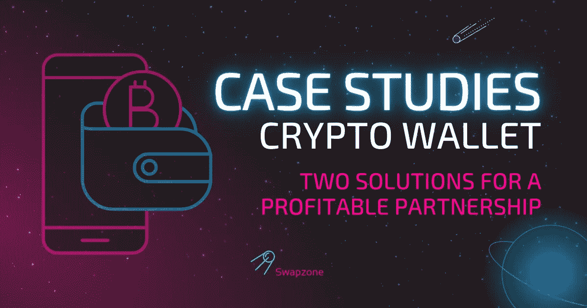

# 一套针对不同技术能力的解决方案:如何从加密钱包中获得额外收入

> 原文：<https://medium.com/coinmonks/a-set-of-solutions-for-different-technical-capabilities-how-to-get-additional-income-from-a-78bb9409c9d3?source=collection_archive---------30----------------------->

什么是加密钱包？理想情况下，一个安全存储和保存加密资产的地方。没有钱包，没有密码——然而它总是有扩展你的服务和获得额外收入的空间。最安全的方法是为您的用户提供一个嵌入到钱包界面中的兑换或购买/出售功能。

根据你的技术能力、开发阶段、开发部门的工作量，有不同的流程和工具可以增加你的收入，提升用户体验。在本文中，我们以我们的一个合作伙伴——一个主要的非保管加密钱包为例，全面地解释了这个过程。

**集成内置交换功能的好处:**

*   额外收入的免费来源——从每笔交易中获得奖励
*   通过添加一个非常有用的工具来改善用户体验
*   可用资产数量增加，甚至包括钱包不支持的资产
*   有可能将该功能无缝嵌入到现有界面中

> **合作伙伴:**加密钱包
> 
> **内部资产金额:** 300
> 
> **存在内部交换 API:** 是
> 
> **实现:**钱包界面内的兑换页签
> 
> **使用期限:**2.5 个月

# 货币化:它是如何工作的

钱包从通过 Swapzone 附属工具持有的每笔交易中获得佣金:奖励是灵活的，随着成交量的增加而增加。也可以增加**额外费用**来进一步增加收益。

你的观众越忠诚，你能增加的额外费用就越高。

*   作为一个功能良好的加密钱包，有一个成型的用户群，你可以支付一笔不错的额外费用，从每笔交易中赚取更多。
*   作为一个刚刚起步并仍在占领利基市场的钱包，你可以创造一个超越其他钱包的竞争优势，并在不加价的情况下建立用户忠诚度。

# 方法 1:立即添加交换功能

**工具:** [**加密交换小工具**](https://swapzone.io/partners/exchange-widget)

**适用时:**

*   作为通过 API 部署加密交换功能的全部功能的中间步骤
*   在缺乏资源或技术能力的情况下作为独立的交换工具

API 实现的过程可能需要一些技术准备和开发资源，因此有一种方法可以立即增加您的加密钱包的额外支出——[swap zone 加密交换小部件](https://swapzone.io/partners/exchange-widget)。

**如何:**

exchange widget 是一段可以轻松嵌入桌面或移动钱包界面的代码，通常不需要任何特定的技术修改。

对于 partnering crypto wallet，部署主要 exchange 解决方案的过程需要大约 1.5 个月，因此为了建设性地利用这段时间，他们同时将小部件集成到桌面应用程序的硬币页面中。

# 合作伙伴的结果:

合作伙伴在准备嵌入 exchange API 密钥时获得的额外收入。

> 月营业额:**125469376 BTC**
> 
> 月利润:**125469376 BTC**

# 方法 2:从头开始集成全股权交易功能

**工具:** [**加密交换 API**](https://swapzone.io/partners/exchange-api)

**适用于:**希望扩展内部功能的钱包

加密货币钱包的基本配置意味着安全存储加密资产的可能性，但对于任何加密用户来说，能够在不离开钱包界面的情况下将一枚硬币换成另一枚硬币总是很方便的。尤其是如果钱包支持一堆不同的资产。

**如何:**

该过程从界面准备开始:通常建议将 exchange 选项卡原生安装到现有界面中，以使该功能看起来不陌生。我们随时准备在这一过程中为您提供帮助，并提供布局和指定必要的字段。

然后，API 被实现到钱包的所有硬币，即使钱包不支持，也保证多达 1000 个加密资产可用于交换:如果没有特定加密资产的特定钱包，API 流显示标签以输入外部地址。钱包也从这种交易中获得与内部交易相同的佣金。

# 方法 3:扩展资产数量并备份现有的 exchange 功能

**工具:** [**加密交换 API**](https://swapzone.io/partners/exchange-api)

**适用于:**已经有兑换功能但还想赚更多的钱包

在处理加密货币钱包时，不仅可以通过部署新功能来盈利，还可以通过多样化和扩展现有功能来盈利。

**如何:**

由于合作伙伴已经具备交换、购买和销售加密资产的功能，因此不需要进行特殊的技术准备 Swapzone API 被原生添加到现有流程中，并补充了现有接口。

使用的规模总是取决于特定的钱包——这是一个高度适应性的工具，可以根据不同的要求进行调整。Swapozone API 可以:

*   备份前一个以防停机，
*   或者通过添加 wallet 不支持的资产来扩展资产的数量。

无论哪种方式，它都为钱包提供了每笔交易的额外收入，并为钱包的用户提供了方便的功能，提高了客户保留率。

# 总体伙伴关系成果

这些数字显示了合作伙伴通过实施 [Swapzone Exchange API](https://swapzone.io/partners/exchange-api) 支持已安装的交易而获得的**额外交易**的结果:仅交易的结果

> 月营业额: **~** **310 BTC**
> 月利润: **~ 3，1 BTC**

> 交易新手？尝试[加密交易机器人](/coinmonks/crypto-trading-bot-c2ffce8acb2a)或[复制交易](/coinmonks/top-10-crypto-copy-trading-platforms-for-beginners-d0c37c7d698c)