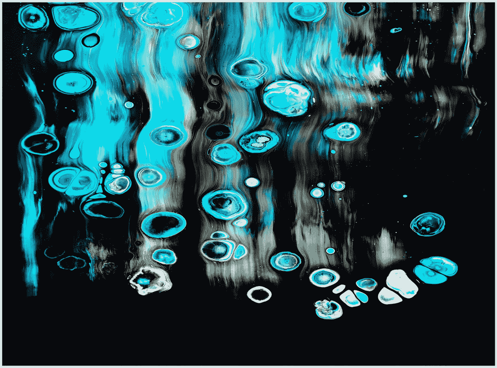
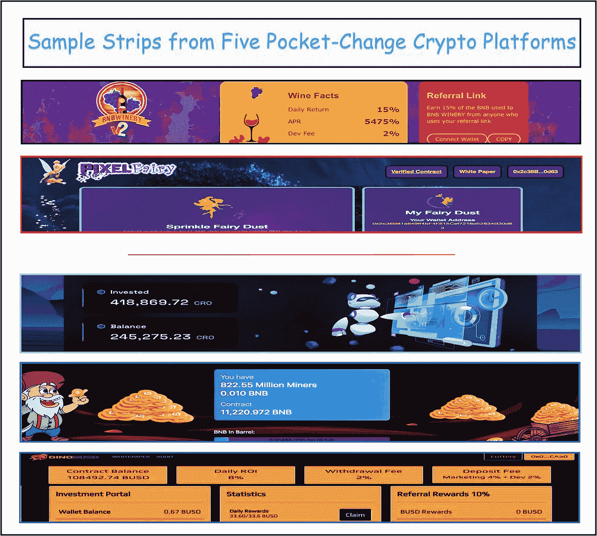
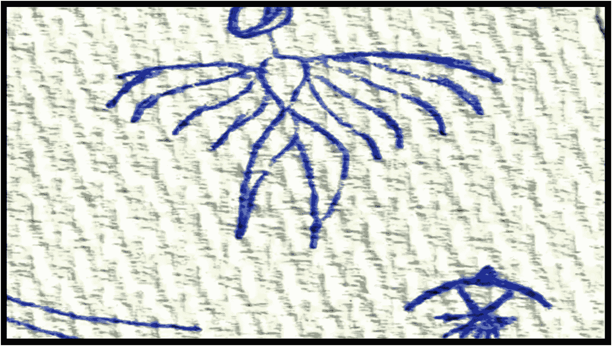
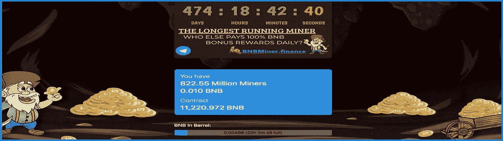
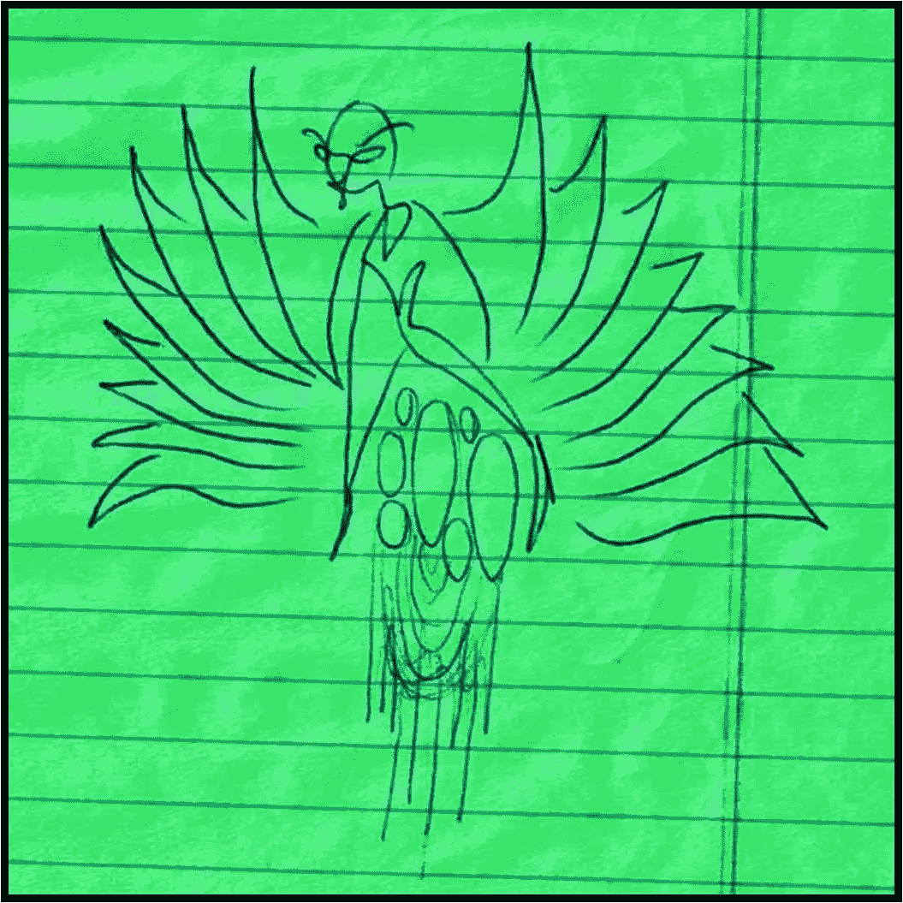

# 投资回报率口袋变化加密赌注平台浅探

> 原文：<https://medium.com/coinmonks/a-shallow-dive-into-roi-pocket-change-crypto-platforms-e86147653635?source=collection_archive---------24----------------------->

## 我学到的第二课:伊卡洛斯从天而降…

> 伊卡洛斯为自己创造了翅膀，飞上了天空。完成飞行后，他感到如此强大，以至于他决定飞得更高。太高了，高温融化了他的翅膀，就好像它们从来没有存在过一样&伊卡洛斯撞回了地球。

我从没想过会在加密领域突然变得富有…这当然很好。不过，我被现实束缚得太深了，我知道厌倦的猿类和西班牙月亮的过山车般的兴奋永远不会让我变得富有。

不过，我喜欢赚钱，我喜欢所有的秘密——这两件事不一定是互斥的。

如果研究和规划得当，被动口袋改变加密平台可以产生良好的剩余收入。我喜欢这些 dapp——它们有趣、愚蠢、严肃、复杂、凌乱、美丽、令人沮丧、有利可图；&都承诺投资回报超快。他们中的一些人实现了这个承诺；大多数人不知道。

一次糟糕的经历让我下定决心要做更多的研究&在投资零花钱时要非常挑剔。相反，当我达到 100%的投资回报时，我会有一种兴奋的感觉。那种成就感也是让我留在这个领域的原因。

**Funny & sophisticated??**…Crypto pocket-change investment platforms come in all shapes & sizes. Miners dig for gold, Farmers grow crops & Space Robots always compound. The themes can be silly; however, the financial result is very serious.

赔钱糟透了。做智能研究后获得收入是一种很神奇的感觉。这就是为什么尽可能仔细检查这些平台是必不可少的。

顶部的两个口袋改变平台， **BNBWinery & PixelFairy，**已经或即将依次倒塌。两个项目都有许多缺陷，有些非常明显。他们分别提供了贪婪的 **15% & 11.33%的日回报率**。

上图中最下面的三个口袋更换协议是我目前最喜欢的；所有人都在微笑着回报。从 Cronos chain 在 Cronos Farm 的飞行机器人**(3.5%的回报率)**，到最初的永久牛奶赚钱机器 **BNBMiner (3%)** ，这给了我第一次投资回报；到 **DinoBusd.finance (8%)** 的直观仪表盘，这是一个使用新实践来保持项目生产&可持续的酷平台…

我深入研究了这五个口袋改变加密项目中的每一个；跟我来…

> **什么是加密零钱投资协议？**
> 
> 这是一种使用锁定流动性池的在线投资工具。来自 [Cryptopedia](https://www.gemini.com/cryptopedia/glossary) :锁定流动性池是一种“激励机制，交易者通过向特定池提供资产，锁定资产，&以代币(通常是平台的原生代币)的形式赚取利息。”
> 
> 要知道这一点:一旦投入，锁定的资金是不返还的。它们变成了一个加密资产的众包池，永远被纳入一份智能合同。然而，财务回报是以资产形式的每日百分比回报，如 Bnb、Busd 或 Cro(来自 Cronos chain)，这是三种最常见的零钱加密投资货币。如果操作得当，这些“加密矿工”有可能提供数倍的投资回报率。
> 
> 不同的零花钱项目的日回报率不同，从 1%到超过 15%不等。在加密空间的这个领域，越少往往越多:每日回报越低，越合理，你的投资回报率就越有可能&协议将继续维持下去。

My Buddy’s (Brawny paper towel) drawing reminds me of Icarus, flying too high…

我最喜欢的，也是最容易记住的规则是伊卡洛斯规则:

日产量爬得越高，它就会越快跌落地面。

天价回报率让人感觉如此离谱是有原因的。口袋里的零钱投资项目在高回报下一败涂地。不过，每天 1-8%的适度回报——包括其他当前的长寿创新——似乎对最近的项目有效。

一个口袋零钱加密平台的出色、合理的每日回报的明显、最好的例子是运行时间最长的 [BNBMiner.finance](https://bnbminer.finance?ref=0x2c38B81a649ff4bF4F515Cef7216d52834B30d63) ，如下所示。在近一年半的时间里，该平台为成千上万的投资者带来了投资回报，提供了(通常)持续 3%的日回报率。我对它很着迷…感谢阅读。

## 不要脸塞:

我研究过的另一个小额投资网站是 DinoBusd.finance，见上面的五协议示例带；橙色的恐龙是最后一张照片。这是一个严肃的、非常用户友好的平台，提供专用的 8%日回报率，每周复利。我在网站上开设了我的主要&好友账户&在 2 周半的时间里，我在其中一个账户上获得了投资回报…

[关于 BNBMiner.finance 协议的浅显研究文章。](/@jebalucas/what-the-heck-is-happening-with-bnbminer-finance-82a6d98f857f)

只玩你不需要的东西。

感谢你走到这一步…我希望你能在这篇关于我们生活的疯狂的密码世界的文章中找到一些有价值的东西…

我只投资我已经研究过的项目&写起来感觉舒服的项目。我喜欢链接。我的一些链接隶属于我喜欢合作的协议和公司；点击它们会给我带来一点金钱上的好处。又是 Thx！

我哥们什么都画！我称之为他的账本系列。上面的纸巾图片和下面的图片来自他的书库。它们让我想起了飞得太高的伊卡洛斯…

See you soon…