# 雪球的雪崩之旅——雪崩基本面分析

> 原文：<https://medium.com/coinmonks/a-snowballs-journey-to-avalanche-avalanche-fundamental-analysis-2f59fd88b7f2?source=collection_archive---------8----------------------->

这份基本面分析是 Crypto Consulting Institute 上个月付费时事通讯的一部分，提供了市场洞察、可操作的交易信号和基本面分析。更多信息，请访问:【https://www.cryptoconsultinginstitute.com/newsletter 

如果厨房的水龙头需要安装新的垫圈，或者保险丝烧断，切断了你房子某一部分的电源，我们可能会用双手修理，或者打电话找一个普通的勤杂工。

拥有全面知识的技工适合高级维护，但如果需要从房子下面更换管道，或者不仅仅是保险丝烧断导致停电，该怎么办？

除非我们运气好，有一个惊人的多面手，我们可能需要一个专家。一个普通的杂工可能不够；我们需要一名水管工和一名电工。

多面手通常随处可得，所以雇佣他们的成本并不高，但专家会根据他们的专长和工作难度收取额外费用

专家可能会利用多面手工具箱之外的资源。

我们可以用同样的方式看待区块链。许多完全是为一般用途或寻求实现普遍性而建造的。尽管用户体验可能很吸引人，但可能会有次优的工具来满足特定的用例。

如果你运行一个 DeFi 协议，拥有一个不变的共识层以确保没有操纵，一个好的 UX，低费用和交易速度都是对东道主区块链的期望的关键特征。但是，如果公司不得不依靠公共事业将他们的私人信息存储在公众可访问的账本上，那该怎么办呢？

其中一些信息可能是敏感的，可能包含员工的身份识别信息或透露公司的战略，从而使他们在市场中占据优势。公布这类知识可能会损害公司的前景。

此外，DeFi 协议可能会优先考虑交易速度和低成本，但 meta vs/p2e 需要高带宽来运行会给整个网络带来计算负担的产品呢？可扩展数据计算可能比有利于元宇宙吞吐量的条件更有价值。

在“以太坊黑仔”和“互操作性”方面，Avalanche 是其子网基础设施的一个有趣竞争对手。

在这一基础分析中，我们将回顾什么是 Avalanche，使 Avalanche 从 EVM 兼容的竞争对手中脱颖而出的子网背后的价值主张，以及 Avalanche 在促进机构采用方面的优势。

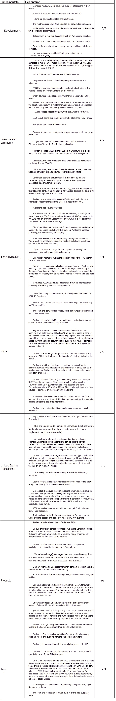

Your TLDR summary, D.I.S.R.U.P.T. key takeaways. 25/35

# 以雪花开始的事情可能会以雪崩结束

雪崩是一个特别有趣的第一层区块链。经典和中本聪共识模型的局限性和优势启发了它的发展。

经典共识需要持续的节点到节点通信，而 Nakamoto 共识使用工作证明来执行“最长链规则”。众所周知，在区块链三难困境中，这些方法都有利弊。前者具有高吞吐量，可以实现快速终结，但通常是高度集中的。后者是高度健壮的和分散的，但是具有低吞吐量和高系统要求。

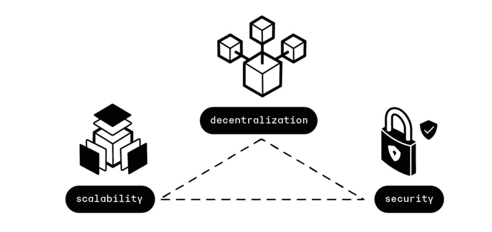

雪崩带着它的一致协议接近区块链三难困境。不是要求所有节点不断地相互通信，而是重复地随机采样网络，导致需要绝大多数节点(大于 80%)来中断共识。

为了具有高度可伸缩性，我们经常在去中心化上妥协。一个网络通常会有其基础或关键投资者操作节点，以确保从构想开始的正常运行时间，但这存在单点故障。

为了实现去中心化，节点需要面向大众，而不是只允许富有的投资者维护网络，因为这通常会导致可扩展性的妥协。

安全性通常是平衡这两种结果和网络架构的副产品，网络架构定义了参与者之间达成交易有效性共识所需的条件。

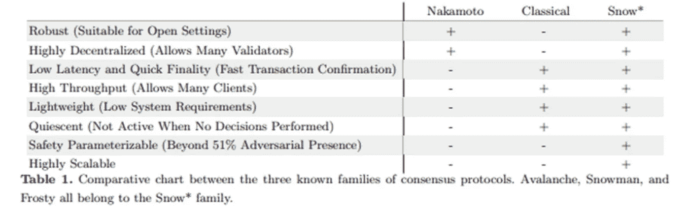

雪崩由划分功能和网络活动的三个相互依赖的区块链维持。

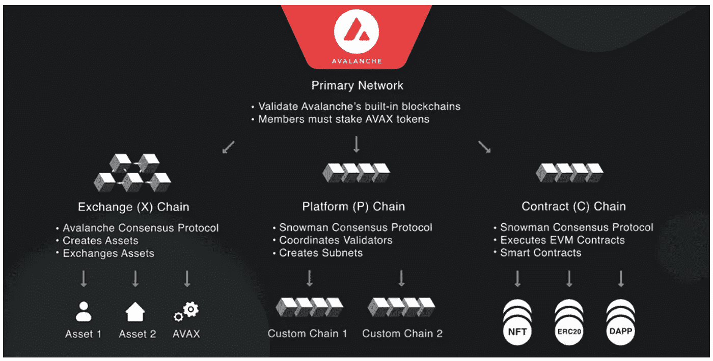

交换链处理跨链的桥接信息，并创建独特的合成数字资产。雪崩的一个未被重视的目标是真实世界资产的令牌化。

平台链是验证器协调和子网创建的地方。广播事务的用户首先将事务发送给验证器，开始协商过程。验证器节点然后通过有向无环图(DAG)基础设施开始谣言工厂或流言蜚语。

契约链维护虚拟机环境(EVM 兼容)，开发人员在其中部署他们的契约，用户在其中与智能契约进行交互。

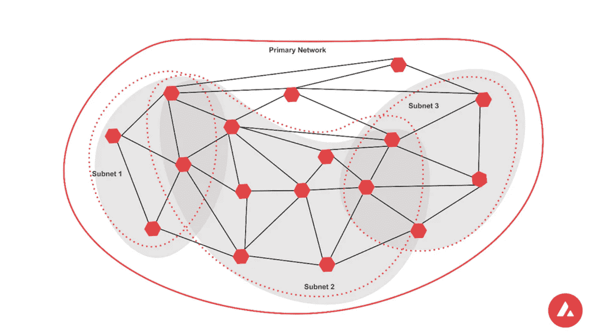

子网是 Avalanche 的主要价值主张，开发人员可以借此在生态系统中快速部署他们的区块链。子网需要一个验证器节点来保护其网络并设置其网络的参数。每个子网都作为自己的虚拟机运行，也是 EVM 兼容的，支持与公共网络的交互以及与其他 EVM 兼容的区块链的跨链互操作功能。

在共识层面上，子网是可扩展的，因为验证者可能只选择保护他们关心的网络。他们不需要处理发生的每一笔交易。可以对计算要求进行管理，以适应特定项目的功能。即，如果对存储容量的需求较少，那么子网可以支持可扩展的一致模型。如果相反，它可能会与 Arweave 存储或 Aleph 云计算集成，以满足不断增长的计算需求。

每个子网部署提高了整个雪崩网络的速度、安全性和分散性。一般的雪崩网络可以将其共识机制的焦点转移到监视子网验证器上的共识，而不是单独负责验证单个事务。每个子网最多可处理 4500 TPS，随着更多子网的引入，整个网络的效率会进一步提高。

仅仅依靠 C 链并不是实现无限可伸缩性的可靠解决方案。雪崩水平扩展，这意味着子网的每个新添加都通过管理其自己的 DAG 分支做出贡献，默认子网验证器和志愿者子网参与共识。

通过消除每个节点相互通信的需要和划分链上功能，Avalanche 展示了他们的碎片验证器机制是在分布式网络上达成共识的下一步。

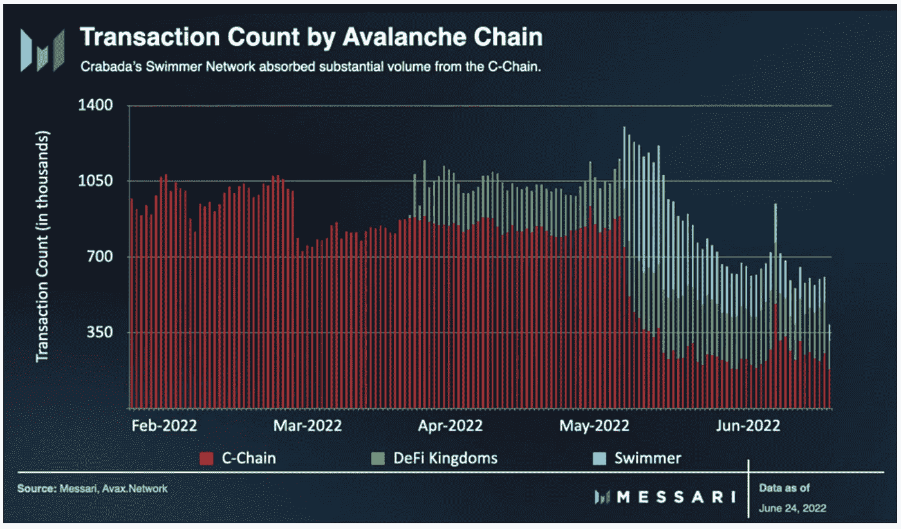

自从子网发布以来，我们已经看到来自 C 链的事务正在减少。上述实例中的子网验证器可以吸收它们的事务量份额。好处是资源密集型应用程序不会使主链负担过重。它们可以并行运行，同时共享子网验证器来保护整个网络。

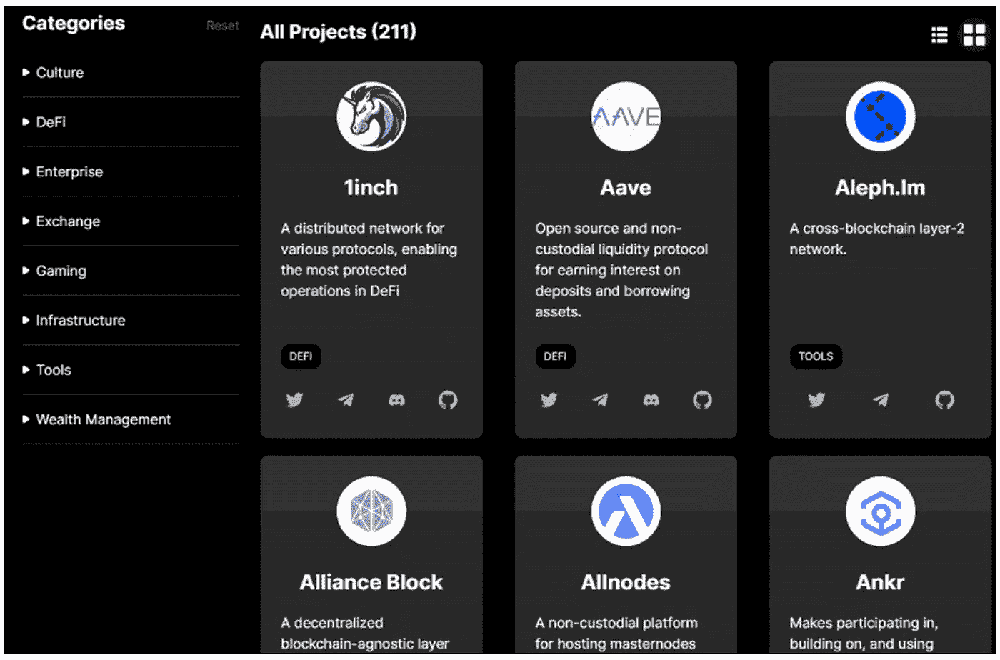

超过 200 个 DApps 部署在 Avalanche 上，其中许多是众所周知的，存在于竞争的区块链网络上。

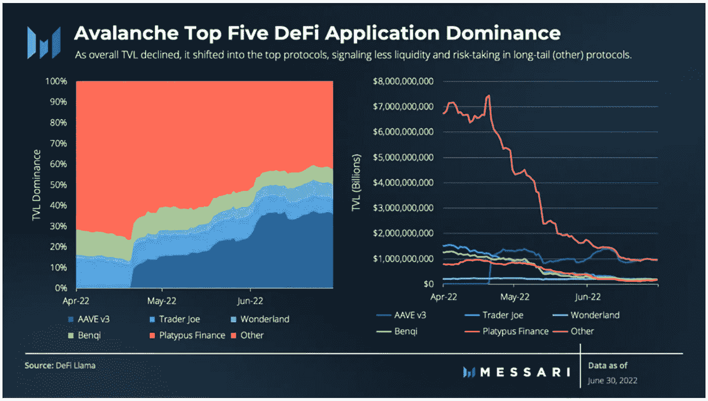

Aave 仍然是 TVL 在 Avalanche 上最具优势的 Dapp，与所有其他 Dapp 的总和相当。

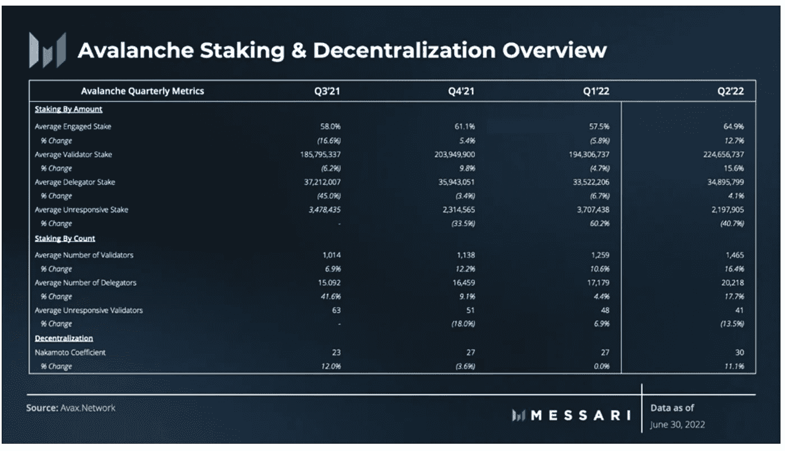

交易量下降，这不是一个有效的批评，而是熊市期间不同区块链一致的观察结果。无论如何，网络活动逐年增加，在 2022 年的 Q2，Avalanche 上的验证者参与显著增加。市场价值的下降并没有导致收入或验证参与者的损失。

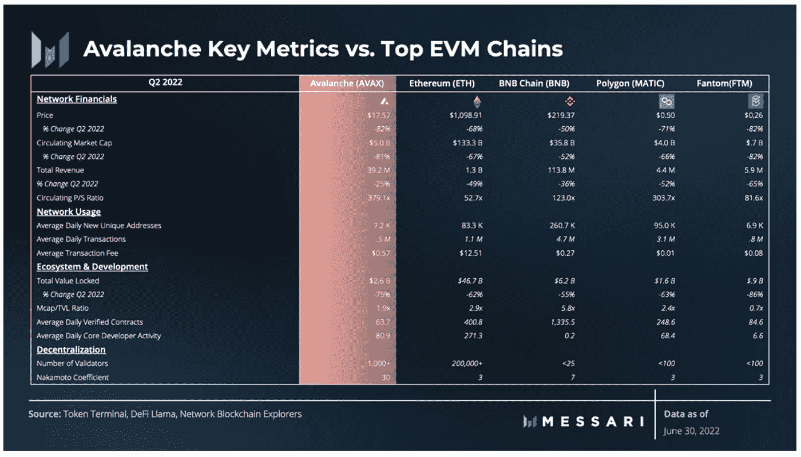

雪崩关键指标表明生态系统中用户的相对流失。然而，这很可能与泰拉 UST 脱钩论的余波混为一谈。Emin 公开承认雪崩基金会对$UST 的 1 亿美元投资已经变得一文不值。

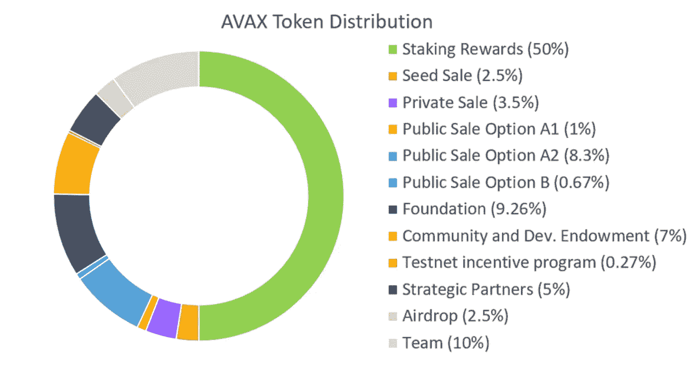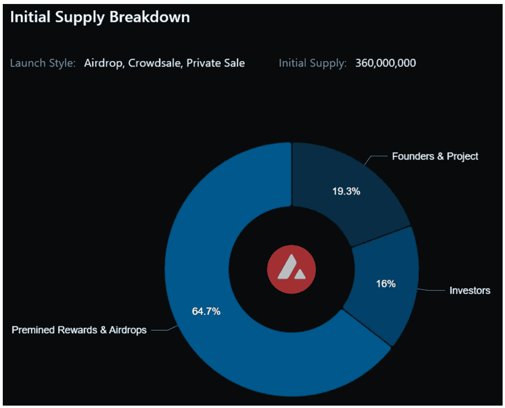

除了这两个令牌分发图形之外，几乎没有关于令牌分发的可用信息。此外，2021 年路线图已从网站上删除。要么是他们取消了一个可供外部人士交叉检查进展情况的参考点，要么是他们很快将发布一个新的路线图(这很有道理，因为 Emin 表示正在编写雪崩 2.0 白皮书)。

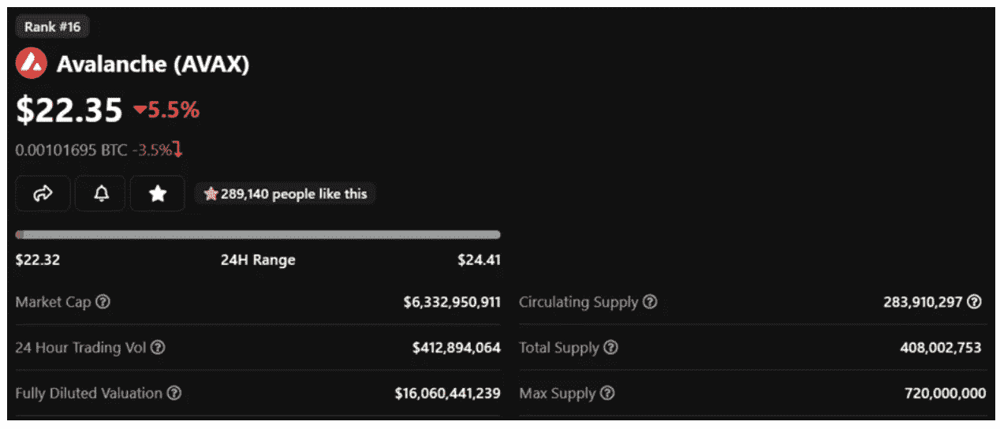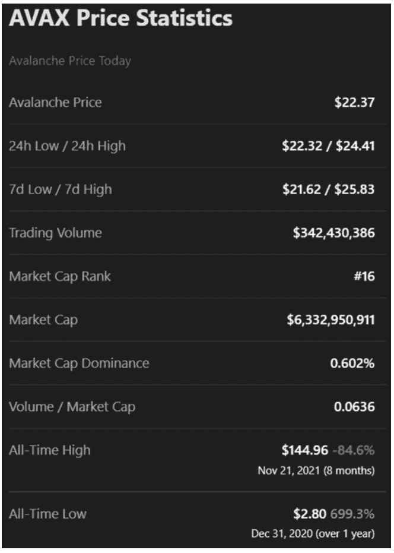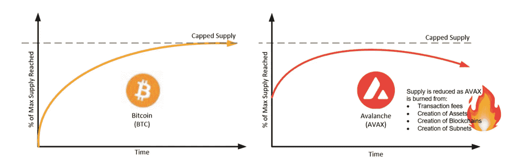

雪崩烧掉了网络上支付的所有$AVAX 交易费。一旦排放量在 2028 年达到顶峰，它将成为一种净通缩资产。

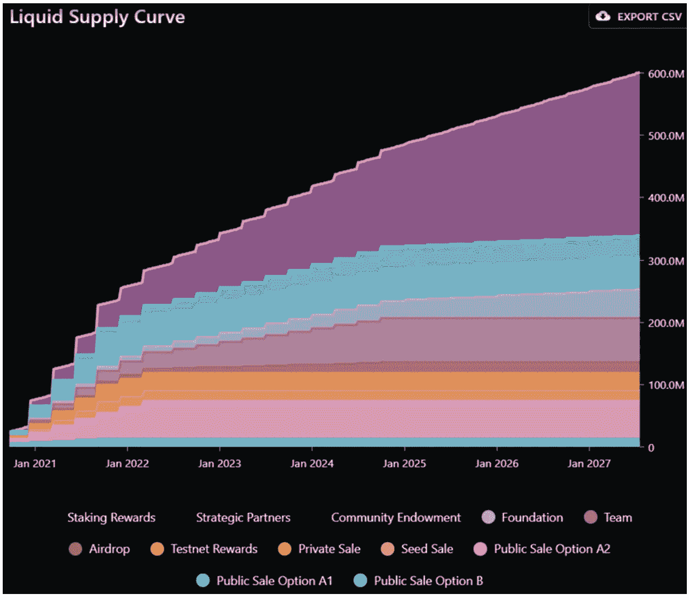

总体而言，归属时间表相当激进；一些种子销售、公共销售和私人销售代币正在流通。其余的归属时间表将在 2024 年年中完成最后一次大规模解锁，但线性归属释放将持续到 2028 年。

# 冰川中雪球的机会

到目前为止，在之前的 FAs 中覆盖的所有第 0 层和第 1 层区块链都有自己的方法来解决区块链三元悖论。

[Fantom](https://justmy2satoshis.medium.com/it-looks-a-little-dag-gy-fantom-fundamental-analysis-dc68fbf8a70e) 依靠 DAG 架构来实现八卦，通过他们的 Stake consensus 层来实现可扩展性和保持 EVM 兼容性。然而，验证者身份是模糊的，并且入职过程是集中的，因为 Fantom Foundation 必须批准节点运营商进入网络。币安智慧连锁也存在类似的集中共识瓶颈。

自从我们在《CCI》第一期新闻简报的 [Solana](https://justmy2satoshis.medium.com/fundamentals-of-solana-summer-crypto-consulting-institute-in-depth-fa-2e2637ba5685) FA 中强调了宕机风险后，仅今年就发生了五次宕机。最近的一次导致了 bug 的不确定性，bug 导致两个节点产生两种不同的结果。虽然他们仍在“Mainnet Beta”上，但在可预见的未来，他们可能会继续干预网络状况。

众所周知，以太坊和比特币似乎并没有因为验证器级别的集中化缺陷而导致网络瘫痪。它们非常安全，但交易成本仍然很高(至少在合并之前是这样)。

识别区块链网络中的创新是一件棘手的事情，因为许多网络都被重新调整了复制粘贴工作。其中一些源自以太坊，只是略微改变了双方的股权证明共识模型，但最终目的是在速度和成本上与以太坊竞争，同时利用以太坊的技术堆栈提高安全性和可组装性(特别是与 EVM 的兼容性)。

其他人部署 [Cosmos](/coinmonks/out-of-this-world-cosmos-atom-fundamental-analysis-b7aeb65583f) SDK 来定制他们的共识方法或默认为 Tendermint 共识(Terra 和 BSC 是两个关键的例子)。许多人依靠不常用的编程语言从头开始构建一些独特的东西来满足他们的目的(Flow 区块链使用 Cadence 索拉纳和波尔卡多特用的是铁锈)。

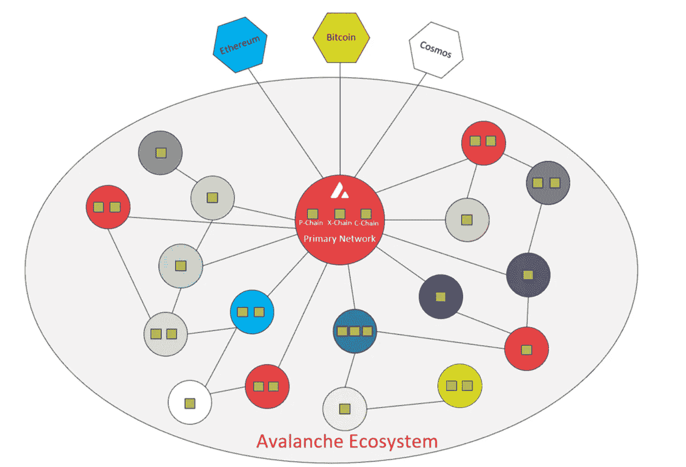

Avalanche 偏离了自 80 年代以来在分布式网络技术中流行的实用拜占庭故障一致性模型。我们如何就交易的有效性达成一致对网络完整性至关重要。虽然现有共识模型中区块链三难困境的局限性表明我们可以牺牲另一个因素来优化两个因素，但三难困境本身已经成为一个自我实现的预言，限制了创新。

我们考虑专家(电工)和多面手(杂工)。沿着专业路线走得太远，将能够开发适合特定用例的网络功能，但这是以牺牲其他潜在应用为代价的。电工可能有处理特定故障的技能和设备，但在修理管道时，他们可能没有用。

类似地，如果我们选择一个通用的方法，我们可能会缺乏通用性来实施新的解决方案来优化特定的产品。

我们已经看到了来自 DApps 的要求，例如 BAYC“other side”土地出售造币厂活动，该活动将 gwei 发送到 600 左右，有效地使整个以太坊公共链在土地出售期间的交易成本高得不可思议。但是，使用专门构建的子网对一般网络进行分段可以确保网络的整体状态不受影响。

子网是 Avalanche 的一个迷人方面，它日益成为核心价值主张。吸引人的地方在于每个子网的许可层和非许可层。安装许可功能对于机构和公司管理敏感的内部信息、财务和后台系统至关重要。相比之下，无权限函数为客户和开发人员提供了一个高度可访问的前端。从实用的角度来看，Avalanche 可以说是与 Cosmos 不相上下，并且领先于 [Metis Andromeda](/coinmonks/metis-the-future-of-decentralized-human-organizations-199a32d97ab9) 的 DAC 基础设施一步，旨在促进无缝的开发者和用户体验。Metis 的优势在于组织上的 DApps 更加关注社区治理。

这些能力的重要性没有被机构忽视。子网也不是一个特别新的命题。许多机构和公司已经独立开发以太坊来修补私人区块链。不过，问题在于“围墙花园”现象，即它们的流动性停留在私人生态系统的边界。机构和类似机构的机会受限于它们能为私人生态系统带来什么。像 Cosmos hubs 一样，雪崩子网解决了专用网络的连接问题。

子网是一种技术，在分散的社区手中，可以利用强大的工具来追求共同的经济目标，但在中央计划者手中，它们可以促进 CBDCs 的目标。我们已经在 XRP 和 T2 的 FAs 会议上详细讨论了 CBDCs。支持 CBDCs 是 Avalanche 公开声明的目标。然而，与 XRP 相反，在 Avalanche 上实施 CBDCs 不会影响共识的完整性，也不会导致公共网络的过度集中。所有因过度集中而受到批评的区块链主要网络(明确列在《ISO20022 票据交换协议》上的项目)都因使参与者面临交易对手风险而被叫停。尽管如此，在分散且无许可的生态系统中部署私有子网对于消除私有子网之外的其他生态系统参与者的传染风险是明智的。

虽然 Avalanche 肯定比兼容 EVM 的区块链有优势，但仍有风险需要考虑。

首先，Terra 向 AVAX 大举投资了 2 亿美元，这是 Luna Foundation Guard 仍然持有的一项资产。LFG 有可能会扔下他们的包，但 Avalanche 首席执行官 Emin 表示他并不担心:

> “我们已经和[Terra]谈过了，他们甚至在需要的时候也没有扔掉 AVAX，所以这是他们目前最有价值的东西。。。]相当大比例的 AVAX 实际上是锁定的，因此他们实际上无法移动它。”

Avalanche 面临的主要问题是，$UST 成为其生态系统中流动性池的重要抵押品来源。当我们明白除了比特币和以太坊之外的大多数加密资产都是有效的衍生品时，一个流动性池中单一资产价值的下降可能会吸引套利者的注意。当美元 UST 下跌时，这些流动性池中美元 AVAX 的挂钩价值也随之下跌。套利的最终结果是在一个流动性池中低价买入，在另一个流动性池中高价卖出。当观察到 Terra Luna 事件的蔓延效应时，似乎暴露于$UST 或$LUNA 的资产遭受了连带降级。虽然后果肯定不仅限于雪崩，但它作为一个受到黑天鹅事件重创的生态系统而引人注目。

第二，自从 Terra Luna 事件后，监管机构可能会密切关注雪崩，因为它们在彼此的生态系统中有着重要的共同利益。Avalanche 越来越多地参与针对美国加密法规的游说活动，这可能表明内部对即将到来的更严格审查的理解。

第三，在达到项目里程碑方面存在延迟，这可能表明内部缺乏资源来部署雪崩基础架构。在几次大规模的象征性出售后，人们担心的不是他们是否有能力维持发展，而是他们能否找到人才。这并不奇怪。Avalanche 利用新颖的区块链架构，这需要独特的技能组合，特别是当他们进入 X 链上的子网和数字资产创建的未知领域时。

第四，“以太坊黑仔”的叙事过于拥挤，潜在买家之间的流动性分散。新生态系统的部署不一定会导致新的资金进入该生态系统，相反会导致从一个生态系统撤资进入另一个生态系统。

这种观念让我们想到了雪崩的投资潜力。毫无疑问，Avalanche 不仅仅是另一个复制/粘贴任务。Avalanche 有一个独特的底层共识机制，可以随着每个子网的部署而扩展。如果我们认为采用加密货币面临的最大挑战是缺乏可扩展的网络来满足新兴需求，那么 Avalanche 完全有能力应对这一挑战。

也就是说，正如 Terra Luna 的失败所表明的，TVL 在网络上的并行基础仍然构成威胁。然而，这种威胁绝不仅限于雪崩。

Terra 和 Avalanche 共同投资的正在进行的授权时间表、排放和风险因素可能会在未来对$AVAX 造成持续的卖出压力。然而，德勤正在积极整合雪崩子网，以管理联邦紧急事务管理局(FEMA)对自然灾害救援资金的分配。此外，瓦尔基里公司、温特穆特公司、金树资产管理公司、Jump Crypto 公司和其他合作者正在建立专门针对 KYC 本地机构 DeFi 的子网，以满足监管要求。随着知名资产管理公司在 Avalanche 上积极部署具有经济和金融颠覆性的产品，预计大量机构资金流入生态系统是无可厚非的。

在上一轮牛市中，AVAX 的市值达到了 300 亿美元。在此期间，它与$BNB，$露娜，$阿达，$联邦理工学院，$索尔和$XRP 在 L1 的叙事中竞争。其中一个现在已经出局了(LUNA)，另一个仍在追赶 SEC(XRP)，一些继续落后于开发里程碑(ADA)，其他竞争者正在经历持续的网络中断(SOL)。

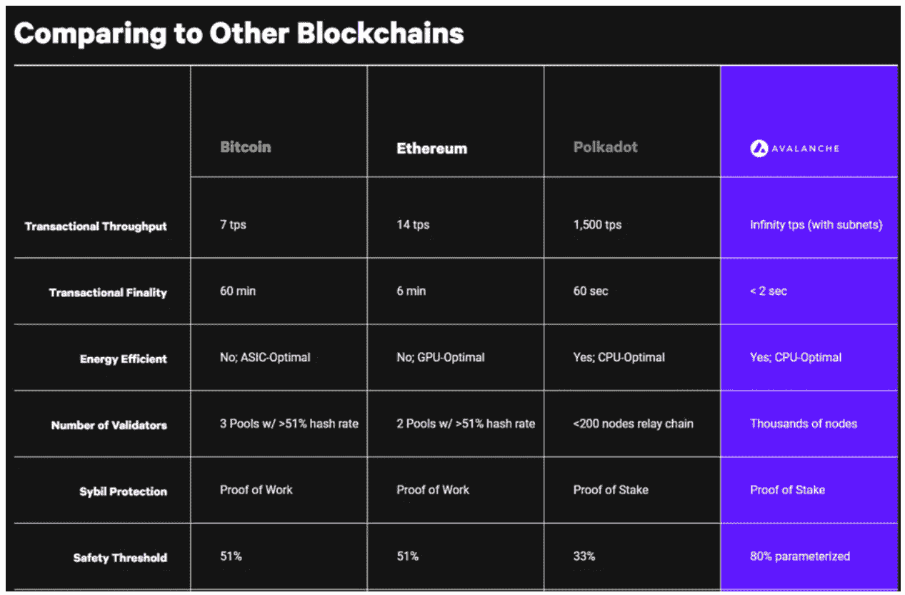

在熊市中，重要的是研究过去和现在的竞争者，以了解加密货币的采用在下一轮牛市中面临的挑战。虽然 L1“黑仔联邦理工学院”的故事很热闹，但我们可以从中吸取教训，推测新的趋势。一个观察结果是，第 1 层区块链已经表明，他们还没有准备好大规模采用。

“第二层”的叙述很可能会吸引大量的注意力。如果合并成功，ETH 2.0 将有可能使第二层的性能提高几个数量级。乐观的总结，如 Metis，Arbitrum，乐观，和 Zk 总结，如 Loopring 和 DYDX 都站在 L2 叙事获得牵引力。然而，可能有人会说 L2 还没有经过压力测试。Cosmos、Polkadot 和 Kardiachain 等第 0 层协议也将挑战黑仔联邦理工学院的流动性份额。

如果子网的进一步部署能够带来指数级的可扩展性，并且这些子网能够更好地与 Avalanche 之外的生态系统进行互操作，那么很少有人能够与 Avalanche 的整体用户体验和技术堆栈相媲美。

Polygon 是“以太坊杀手”竞赛中的一个重要竞争对手，他们最近宣布了相当于 EVM 的 ZK 扩展解决方案，与 Cosmos 和 Polkadot 一起成为互操作性叙事中的主导力量。

机构流动性如何在子网生态系统中流动，可能是 Avalanche 手中一张意想不到的王牌。需要具有许可层和非许可层的可定制专用网络来保持企业的竞争优势。无权限层是客户与之交互的面向前的产品。驻留在后台的是可以操作(甚至自动化)公司财务、通信、人力资源、支付、库存、治理和 PoS 流程的许可层。因此，虽然每个人都可以作为客户与前端交互，但只有白名单中的钱包地址(员工)才被允许查看后台。

未来，来自传统机构的流动性是否会完全在链上转移，这是否会对区块链生态系统中的新兴机会产生有益影响，还有待观察。机构流动性可能会将他们的信心放在像$USDC 这样的合规稳定的公司上，以在他们的子网上存储价值。

最终，阻止机构 DeFi 采用的法规可以在子网的共识级别进行编程。国际清算银行的研究论文断言，区块链应该在共识水平上进行监管。雪崩的核心是无权限和去中心化的。尽管这种对集中化的坚持应该受到强烈抵制——如果央行想要修补 CBDCs，或者机构希望用自己的共识参数建立一个私有子网，他们可以在不影响底层网络完整性的情况下这样做。

Avalanche 的子网是游戏和 NFTs 的理想选择，特别是对于寻求桥接和保留大量游戏逻辑的现有传统游戏。可扩展存储能力的可定制网络导致像元宇宙 DeFi 王国这样的公司完全通过雪崩上的智能合同来运营，导致离线计算不那么集中。

从表面上看，子网游戏正在利用一种已被证明很受欢迎的市场趋势，但它的价值可能是作为数据密集型应用程序的低风险概念验证。假设 Avalanche 的子网架构可以有效地将像链上元宇宙事务这样的数据密集型计算从一般链中分离出来。在这种情况下，这将为开发人员提供信心，以追求数据密集型用例，如视频和音乐流。扰乱传统游戏市场是一件大事。游戏市场每年都在增长，子网似乎是将这种经济破坏延伸到游戏市场之外的可行工具。

考虑到所有这些因素，并假设 Avalanche 的子网之旅和现实世界资产的令牌化没有出现重大复杂情况，那么$AVAX 仍有可能超过其之前的历史高点。它是“以太网杀手”(L1)、L2、互操作性、机构采用和元宇宙叙事的关键竞争者。

虽然 Avalanche 继续通过子网扩展其主要的指数级可扩展性，但他们并不缺少竞争对手。尽管大多数 L1 的竞争者要么是多面手区块链，要么是非常专业的，但 Avalanche 类似于一家建筑公司，从开始到结束为一个建筑的各个方面寻找所需的专家。

# 参考

雪崩共识白皮书，2020 年 8 月 24 日，[https://assets . website-files . com/5d 80307810123 F5 ffbb 34 d6e/6009805681 b 416 f 34 dcae 012 _ Avalanche % 20 Consensus % 20 white paper . pdf](https://assets.website-files.com/5d80307810123f5ffbb34d6e/6009805681b416f34dcae012_Avalanche%20Consensus%20Whitepaper.pdf)

雪崩传媒，“机构用雪崩构筑未来”，2022 年 6 月 22 日，[https://Medium . com/Avalanche VAX/Institutions-is-Building-the-Future-with-Avalanche-4 daf 8062 ad 1](/avalancheavax/institutions-are-building-the-future-with-avalanche-4daf8062ad1)

Avalanche Medium，“艾娃实验室发布适用于 Avalanche 的一体化 Web3 操作系统 Core”，2022 年 6 月 23 日，[https://Medium . com/Avalanche VAX/ava-Labs-Releases-Core-an-All-In-One-web 3-Operating-System-for-Avalanche-a 844 EB 822887](/avalancheavax/ava-labs-releases-core-an-all-in-one-web3-operating-system-for-avalanche-a844eb822887)

Avalanche Medium，“桥接比特币到雪崩:技术概述”，2022 年 6 月 25 日，[https://Medium . com/Avalanche VAX/Bridging-bit coin-To-Avalanche-A-Technical-Overview-2535 e 7088 b8](/avalancheavax/bridging-bitcoin-to-avalanche-a-technical-overview-2535e7088b8)

Avalanche Native Token Dynamics 白皮书，2020 年 7 月 25 日，[https://assets . website-files . com/5d 80307810123 F5 ffbb 34 d6e/6008 D7 BC 56430 D6 b 8792 b8d 1 _ Avalanche % 20 Native % 20 Token % 20 Dynamics . pdf](https://assets.website-files.com/5d80307810123f5ffbb34d6e/6008d7bc56430d6b8792b8d1_Avalanche%20Native%20Token%20Dynamics.pdf)

雪崩平台白皮书，2020 年 7 月 30 日，[https://assets . website-files . com/5d 80307810123 F5 ffbb 34d 6 e/6008 D7 bbf 8 b 10 D1 EB 01 e 7 e 16 _ Avalanche % 20 Platform % 20 white page . pdf](https://assets.website-files.com/5d80307810123f5ffbb34d6e/6008d7bbf8b10d1eb01e7e16_Avalanche%20Platform%20Whitepaper.pdf)

Beincrypto，“什么是雪崩(AVAX)？”，2021 年 9 月 17 日，[https://beincrypto.com/learn/avalanche-avax/](https://beincrypto.com/learn/avalanche-avax/)

Coincu，“索拉纳在 2022 年遭受第五次停电，SOL Dives”，2022 年 6 月 2 日，[https://cryptonews . com/news/Solana-beares-fifth-Outage-in-2022-SOL-Dives . htm](https://cryptonews.com/news/solana-suffers-5th-outage-in-2022-sol-dives.htm)

Medium，“深入观察 Avalanche 和 AVAX 加密货币令牌”，2021 年 9 月 28 日，[https://medium . com/yellow-blog/An-In-Depth-Look-at-Avalanche-and-AVAX-Cryptocurrency-Token-1569 FB f1 a 46 c](/yellow-blog/an-in-depth-look-at-avalanche-and-avax-cryptocurrency-token-1569fbf1a46c)

Medium，“为什么 Avalanche (AVAX)有潜力成为一个不可思议的价值商店”，2020 年 10 月 19 日，[https://medium . com/Avalanche-hub/Why-Avalanche-AVAX-has-the-potential-to-be-a-incredible-store-of-value-8e F6 e 68 cbb 60](/avalanche-hub/why-avalanche-avax-has-the-potential-to-be-an-incredible-store-of-value-8ef6e68cbb60)

梅萨里，“2022 年 Q2 雪崩状态”，2022 年 7 月 11 日，【https://messari.io/article/state-of-avalanche-q2-2022? referrer=asset:雪崩

梅萨里，“雪崩生态系统概述”，2022 年 7 月 15 日，[https://messari.io/article/avalanche-ecosystem-overview](https://messari.io/article/avalanche-ecosystem-overview)

Messari，“启动和初始令牌分发”，[https://messari . io/asset/avalanche/profile/Launch-and-Initial-Token-Distribution](https://messari.io/asset/avalanche/profile/launch-and-initial-token-distribution)

Youtube，雪崩，“什么是雪崩”，2020 年 4 月 23 日，[https://youtu.be/mWBzFmzzBAg](https://youtu.be/mWBzFmzzBAg)

Youtube，Coinbureau，‘雪崩:AVAX 怎么了？！这会让你大吃一惊！!'，2022 年 6 月 3 日，[https://www.youtube.com/watch?v=kts3zcktuZ8](https://www.youtube.com/watch?v=kts3zcktuZ8)

Youtube，Coinsider，“索拉纳 vs 雪崩——谁赢了？!'2021 年 9 月 30 日[https://www.youtube.com/watch?v=vKcLyqjpm3E](https://www.youtube.com/watch?v=vKcLyqjpm3E)

Youtube，Coinsider，' Avalanche 的$AVAX 值得大肆宣传吗？(利弊)’2021 年 10 月 21 日，[https://www.youtube.com/watch?v=mungr7DhWdE](https://www.youtube.com/watch?v=mungr7DhWdE)

Youtube，InvestAnswers，“雪崩:对自己至关重要？$AVAX 值得吗？2021 年 7 月 13 日，[https://www.youtube.com/watch?v=vaHC-XZkX6Q](https://www.youtube.com/watch?v=vaHC-XZkX6Q)2030 年价格预测详细研究

Youtube，白板加密，“什么是雪崩网络？AVAX 用动画解释，2021 年 9 月 5 日，[https://www.youtube.com/watch?v=CbM2jidEn0s](https://www.youtube.com/watch?v=CbM2jidEn0s)

> 交易新手？试试[加密交易机器人](/coinmonks/crypto-trading-bot-c2ffce8acb2a)或者[复制交易](/coinmonks/top-10-crypto-copy-trading-platforms-for-beginners-d0c37c7d698c)