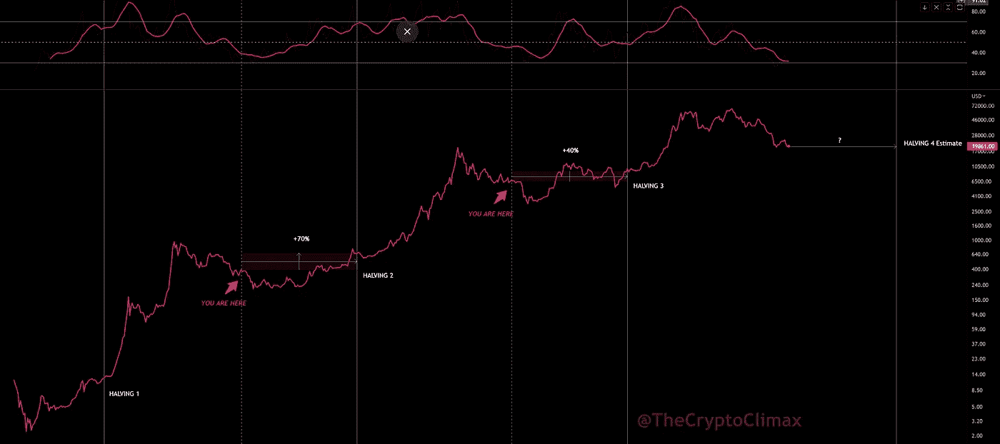
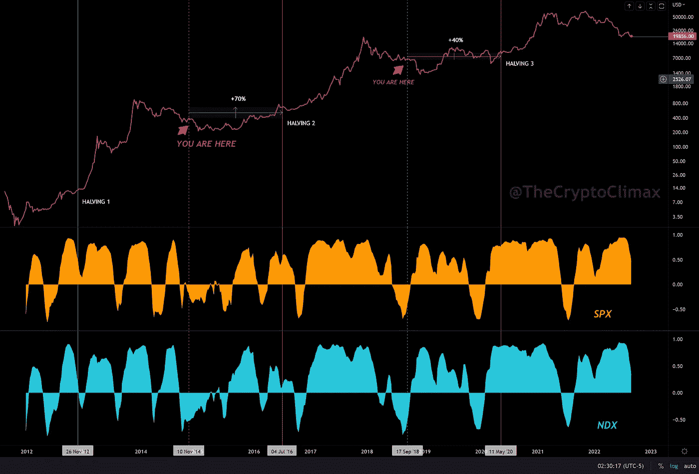
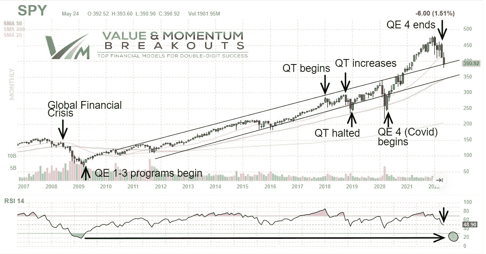
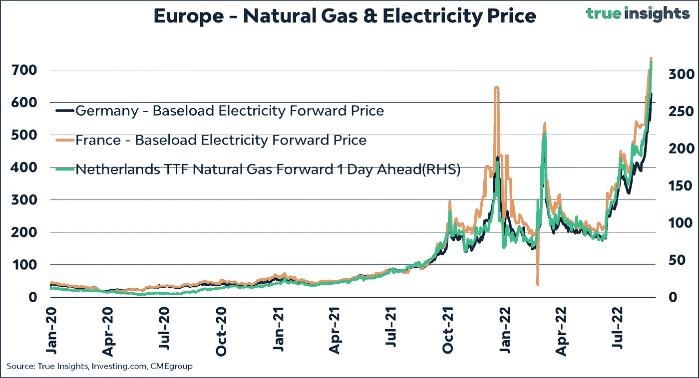
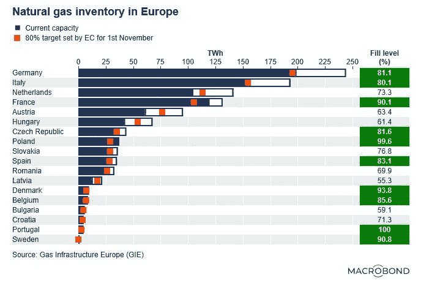
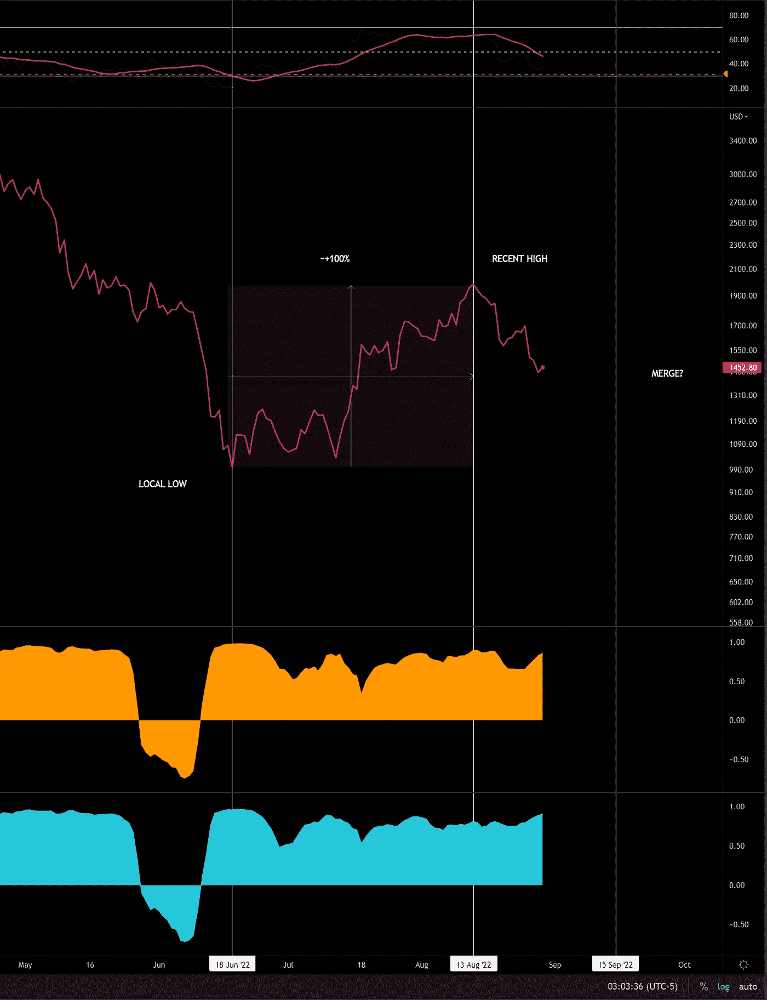

# 加密市场的现状—2022 年 8 月 29 日

> 原文：<https://medium.com/coinmonks/a-state-of-the-crypto-market-august-29-2022-1662ae0bff34?source=collection_archive---------16----------------------->

Picture of a Cyberpunk city

他们说‘草总是更绿’，但是为什么天空从来没有‘更蓝’呢？

在我们“触摸草地”的倾向中，我们的焦点是否太窄，我们的头是否倾斜得太厉害？

我想和你分享一些东西。

在此之前，有一些重要的事情需要解决。

# 我们现在在加密市场处于什么位置？

如果我说我知道，那我是在撒谎，但是我们能不能快速浏览一下，收集一些见解，然后更有信心呢？

让我们试一试。请继续阅读讨论和图表。

先说大的，比特币减半倒计时。每隔四年，比特币区块排放量就会减半。

我们距离下一个预计减半的时间刚刚过半。街区奖励将下降到 3.125 BTC。

有关系吗？这里有一个狭隘的观点。

BTC price vs halving cycles

我认为可以从这张图表中剔除两个明显脆弱的模式。

1)价格减半后上涨。

2)现在这个时候价格相对明显下跌。

接下来让我们扩展一下我们的视野。

# **相关性**

您已经听到了很多关于宏观环境以及我们与 Tradfi 的相关性的信息。我不是这方面的专家，但我们可以试着观察一些事情。

我没有历史相关性指标，所以让我们看看图表。

这里是 BTC 与每个 SPX 和 NDX 的相关性。

BTC correlations SPX, NDX

让我们把从最近减半到现在的每一段时间称为一个象限。

我们能拿走什么？

尽管基于薄弱的铰链，这里有几个松散的结论。

1)象限内的相关性似乎较高，象限间的相关性较低。

2)与 Tradfi 的相关性并不新鲜。尽管这个当前象限似乎比以前的象限更持续地接近相关性高点。

3)在我们现在所处的位置之前，相关性往往会显著下降，但这次不会。

鉴于上述情况，我们应该预期从现在到下一个减半期间相关性会变弱吗？

如果是，哪个向上，哪个向下？

时间会证明一切。**以下几点可能会给你一些提示**

## 2020 年 QE 人口激增，我们现在正在进行 QT。

人们的钱少了，所以投资也少了。

这意味着我们至少在 Tradfi 和 Crypto 中的一个中继续下降，并且可能两者都下降。

这里有一个图表显示在 QE，QT 地区的间谍与联邦资产。

SPY relationship with QE, QT

## 一场战争正在进行。是世界大战吗？我不知道；不知道这个词在今天到底是什么意思。

一些不好的事情正在全球范围内发生。这对市场来说不是好事，对吗？

这里有一个带着一些厄运和洞见的线索。

[https://twitter.com/fomocapdao/status/1486496697052065796](https://twitter.com/fomocapdao/status/1486496697052065796)

**3)以上的延伸，电价(以及其他必需品)都在大幅上涨。**

人们需要吃东西和保暖。

对世界上大多数居民来说，生存比投资资产更重要，无论是股票还是猴子图片。

也就是说，我不太了解能源市场，也不太了解它们是如何进入普通家庭的最终账单的。

有区别(研究和轶事，因为我在欧洲)；价格目前似乎高出约 25-33%。

但是厄运是有根据的吗？

这是一张前瞻性价格图表。

Forward-looking energy prices Europe

这些还不是真的，但有可能是。

这可能会使人们的生活相当困难，尤其是在冬天。

这是一个显示灌装量、当前灌装量和预期的库存清单。

Natural gas inventories Europe

低于预期是不好的。超出预期是好事。

当然，考虑到这里的多变量性质和所有这些因素如何组合在一起的混乱，我在这里简单地离开了它。

最后几个图表应该会让事情清醒一点(我不知道是否公正)。

这里有一个线索来提供更多的上下文。

[https://twitter.com/yakutsavas/status/1563529006997450752](https://twitter.com/yakutsavas/status/1563529006997450752)

无论如何，所有这些厄运和黑暗是相当无聊的。

阿米利特？衰退，这是什么意思？它不再有真正的定义；无关紧要。

前所未有的次数，即使我花了过去 10 年研究市场。

真正的问题是，这些和以太坊合并有什么关系！？

钱快被超声波了！那就是> 20hz！印象深刻，我觉得。

你能感觉到震动吗？看起来市场已经有一段时间了。

下面我们来看看。

ETH chart with merge relationship

几周前，ETH 从清算低点上涨了一倍，达到最近的高点。

离合并日期还有几周。我们要纠正它，在它前面跑，后面呢？

以下是一些需要考虑的事项:

1.  看起来 ETH 也与 Tradfi 相关，这是有道理的。这些都是相关的，并且处于不同的 betas。
2.  加密的某些部分即使不能完全打破短期趋势，也能获得相当高的贝塔系数，尤其是在强有力的叙述中。
3.  有人仍然能把焦糖放进焦糖牛奶条里。

对于 **1)** 我唠叨再多也比不上你应该关注和研究消化的人。

因此，我将在这里提到其中的几个。

资金进出市场。

它用频率和振幅来讲述一个故事。

如果你知道如何阅读，波动性开始讲述这个故事。

我认为有人比大多数人做得更好。

[@ wife alpha](https://twitter.com/WifeyAlpha)—Tradfi，波动率，Quant，建模，家族

期权可以主宰市场。

期权和期货的流动是非常重要的。

相关的图表，信息，和质量狗屎张贴，我首先想到这个人。他做面包。真的，他是个#面包推特 OG。

材料科学家 —订单、流程、选项、烤面包

关于 2)，我想知道今天有多少名义价值进入加密空间，特别是与 2020 年和 2021 年相比。

有多少出口？

名义流量和市值的关系如何？

这些都可以揭开，但是这个帖子已经太长了，那是另一个时间的另一个评估。

如果你已经知道那里的详细研究，请发布一个链接。

读起来会很棒。

关于 3)，那完全不相干，我只是饿了。

所以我应该离开了。我希望你喜欢这个。差点忘了，开头！我有东西要分享。

事实上，不是我，我分享得够多了。宇宙有更多的东西要与你分享，这就是我想提醒你的。

所以当你触摸草地时，记得抬头看，尤其是在晚上(远离城市)。

我们对于宇宙的重要性不如一片玻璃对于你周围的地面的重要性。(和我猜测的同时，正如)。

偶尔记住这一点。我保证，这将增加你触草和仰视的效果。

如果你觉得这很有帮助，请跟随我来到[的加密高潮](https://medium.com/u/ac6a6e914928?source=post_page-----1662ae0bff34--------------------------------)

无论你的技能水平如何，这里都可能有你需要的东西。

我也开始了一个有更多信息的免费通讯。在这里签名。

【https://www.getrevue.co/profile/thecryptoclimax 

感谢阅读，草地触摸者和天空观察者。

> 交易新手？尝试[加密交易机器人](/coinmonks/crypto-trading-bot-c2ffce8acb2a)或[复制交易](/coinmonks/top-10-crypto-copy-trading-platforms-for-beginners-d0c37c7d698c)