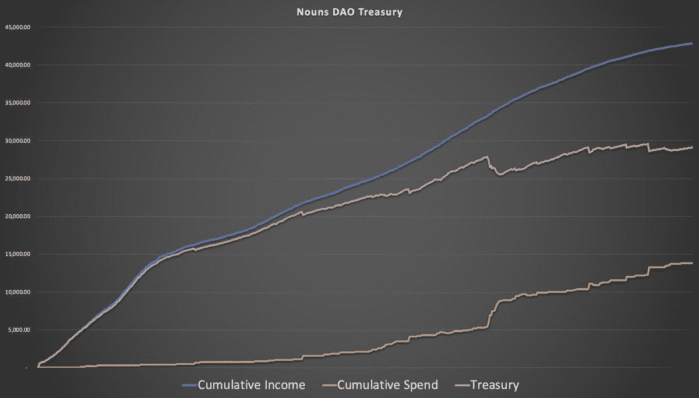
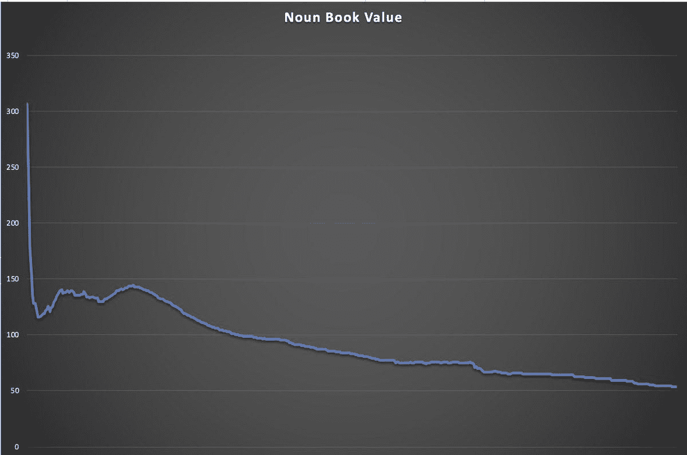

# “道库”名词历史漫谈

> 原文：<https://medium.com/coinmonks/a-stroll-through-the-history-of-the-nouns-dao-treasury-13991b5c8743?source=collection_archive---------10----------------------->

我们将深入到收入，支出，账面价值+我将通过刀的 1 年多的历史突出最有趣的道具。如果你曾经想知道道是如何使用它的资金的，你会喜欢这个。

如果你不熟悉背后的历史和机制，请随意阅读我几周前的推文。

[https://Twitter . com/0x digital oil/status/1593272731059060739？s = 20&t = 2wz 4 qof 5 zqqfi _ quudt qbq…](https://twitter.com/0xDigitalOil/status/1593272731059060739?s=20&t=2WZ4qOf5Zqqfi_QUuDtQbQ)

但是如果你准备好了，让我们变脏吧👇

我们将从财政部发展的一些基本数据开始。

拍卖总收入(国家粮食信托基金日销售额):42，860 ETH

总费用(减去退款和 stETH 收入):13，840 ETH

昨日国债:约 29020 英镑

这包括 stETH 和新 USDC 付款合同。

我从未见过显示收入和支出的演变以及两者之间差距的图表，所以我计算了这些数字，得到了这个。

ATH 财政部:29，579 瑞士法郎

我还对名词账面价值(NBV)很好奇，即每个名词背后有多少支持，以及这个价值是如何随着时间的推移而演变的。我明白了。NBV ATH(不算头几天):143 ETH

当前 NBV: 53.77 瑞士法郎

最近平均拍卖价格(过去 5 天):28.76 瑞士法郎

现在我们将进入提案(道具)的实质。首先，一些有趣的数据:

最有价值道具:1500 ETH——丽都 ETH 赌注(2 次)【https://nouns.wtf/vote/22[https://nouns.wtf/vote/30](https://t.co/4LgCyAistk)T4

道具总数:181

取消道具:18

失败道具:22/163 = 13.5%

那些已经通过并被执行的道具中:

49 项仍在进行中

3 状态不确定或被放弃

共向慈善机构捐赠 1，445 ETH

111 交付的许多完成的道具已经用于 nounish 营销，其他人已经建立了很好的工具

其中一些是…

由 [@matyETH](https://twitter.com/matyETH) 提供的提案仪表板，您可以在其中找到每个链、[@ nouns propose](https://twitter.com/nounsprophouse)、 [@NounsGrants](https://twitter.com/NounsGrants) 道具的详细信息，以及每个道具的跟进和更新。

[https://t.co/VkvLKnKJ2K](https://t.co/VkvLKnKJ2K)

这是一个伟大的治理仪表板的开始，在这个仪表板上，你可以直观地看到宣布者委托给谁，委托人和宣布者投票记录配置文件。

 [## 名词广场

### Agora 是名词选民的家。

t.co](https://t.co/uQGZhYaDxG) 

Prop House 是许多 Dao 运行基于 multisig 的 NFT 投票 props 的中心位置，可以更加灵活地筹集资金。

 [## 道具屋

### 通过部署资金拍卖为您的社区建设者提供资金。任何有钱包的人都可以提交提案，而你的…

t.co](https://t.co/UEvCFKGtEO) 

名词构建器，它使任何人都可以一键部署一个名词 DAO。我们正在使用这个平台部署 Panama DAO，由[@ nounsprophose](https://twitter.com/nounsprophouse)资助的 pre-seed，即将推出。

 [## 名词你的想法

### 名词构建器是一个工具，它允许任何 DAO 以名词 DAO 的格式完全在一个链上形成和管理。名词…

t.co](https://t.co/xrlpPMLlbp) 

名词点钟应用程序，允许在名词拍卖的最后几分钟进行更丰富的可视化、数据和交互。抓起一杯咖啡&打开名词点，一边听着[@ toady _ hawk](https://twitter.com/toady_hawk)&[@ manofmissle](https://twitter.com/manofmissle)主持人 [@thenounsquare](https://twitter.com/thenounsquare) 。

[https://nounoclock.app](https://t.co/Q90MSBADaf)

Noun O' Talk，由 [@cdt_eth](https://twitter.com/cdt_eth) 主持，这是一个每月一次的 Nounish 播客，在这里你可以听到 Nouners 正在做什么。最起码推荐听这两集，有嘉宾[@ punk 4156](https://twitter.com/punk4156)&[@ punk 4464](https://twitter.com/punk4464):

[https://noun-o-talk . cohost podcasting . com/episodes/a-year-of-nons-with-4156……](https://t.co/nDdxhDmvfz)

https://noun-o-talk . cohost podcasting . com/episodes/the-summer-of-building-nons-with-vapeape

Federation，这是 DAO 间投票的第一个框架，它使像 [@lilnounsdao](https://twitter.com/lilnounsdao) 这样的东西能够从链外投票过渡到直接的链上投票，它们的名词在名词道具上。

 [## 联盟

### 一个链上委托投票器，使名词生态系统中的社区能够通过一个…

t.co](https://t.co/jDsCZ9Wtfa) 

名词终端，允许先进的股票市场一样的数据可视化过去和现场拍卖。

 [## 名词终端

### 名词拍卖的高级界面

t.co](https://t.co/LBbGZ6t9yv) 

更多从名词道具推出的项目，请查看[@ nounslaunchpad](https://twitter.com/nounslaunchpad)&[@ NounsCenter](https://twitter.com/NounsCenter)(作者 [@cdt_eth](https://twitter.com/cdt_eth) )

[https://nounslaunchpad . wtf](https://t.co/63rSVeH3Uq)

 [## 名词中心

### 名词资源中心。了解项目、社区和参与方式，以及…

t.co](https://t.co/XoYOxb4cmK) 

关于我策划的最有趣的道具的信息，请继续阅读我的 Twitter 帖子:

> 交易新手？尝试[加密交易机器人](/coinmonks/crypto-trading-bot-c2ffce8acb2a)或[复制交易](/coinmonks/top-10-crypto-copy-trading-platforms-for-beginners-d0c37c7d698c)