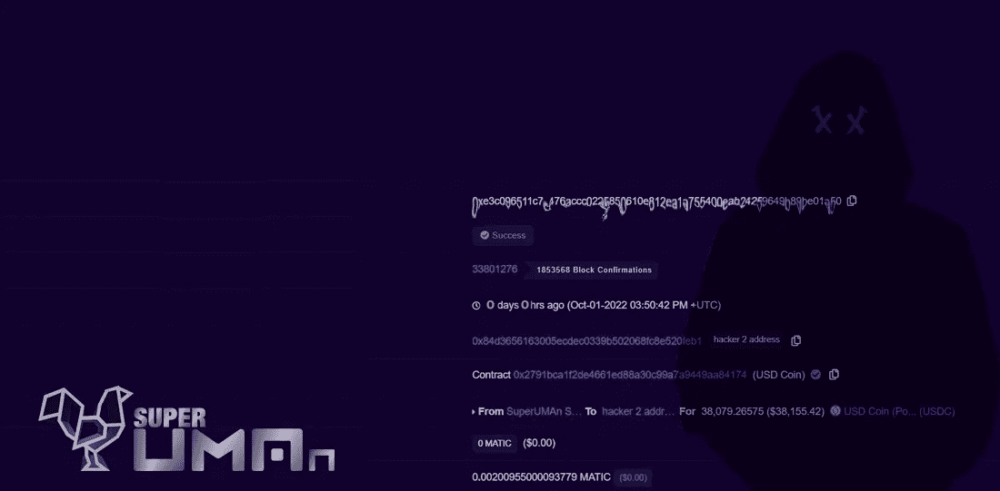
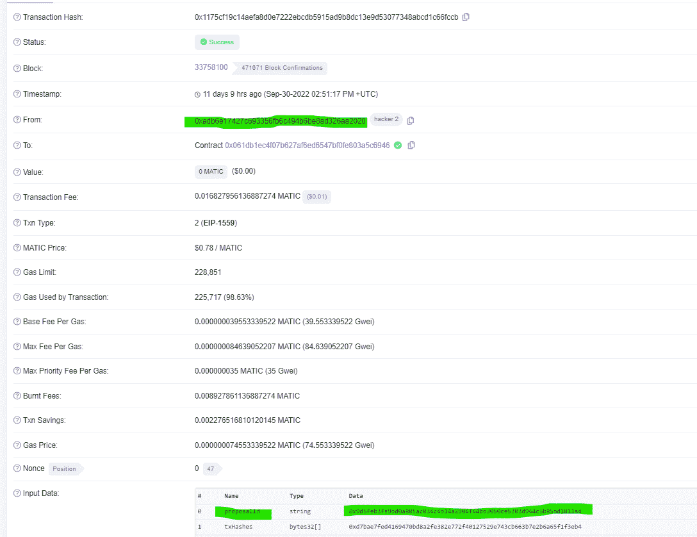
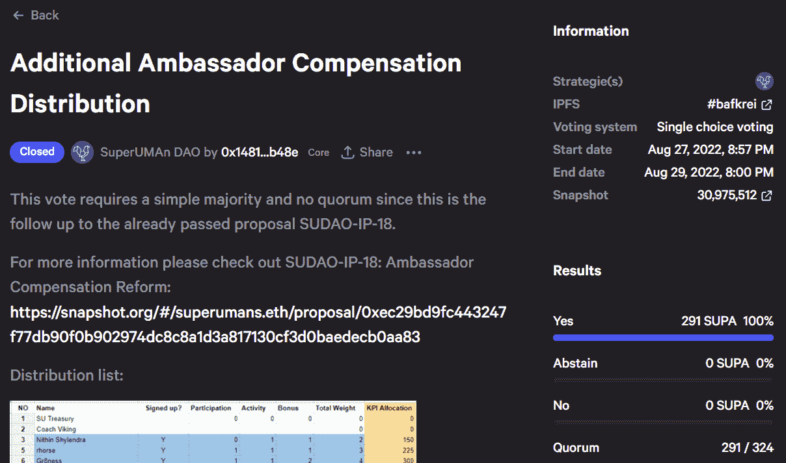
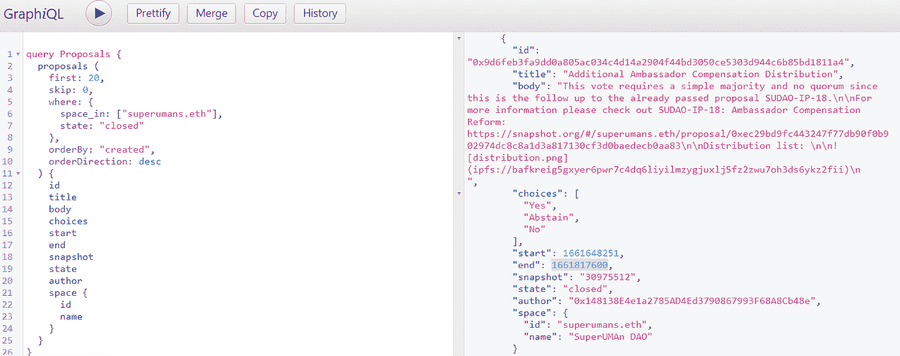
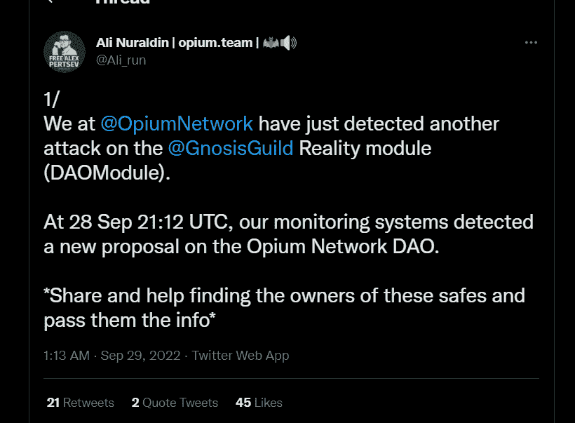
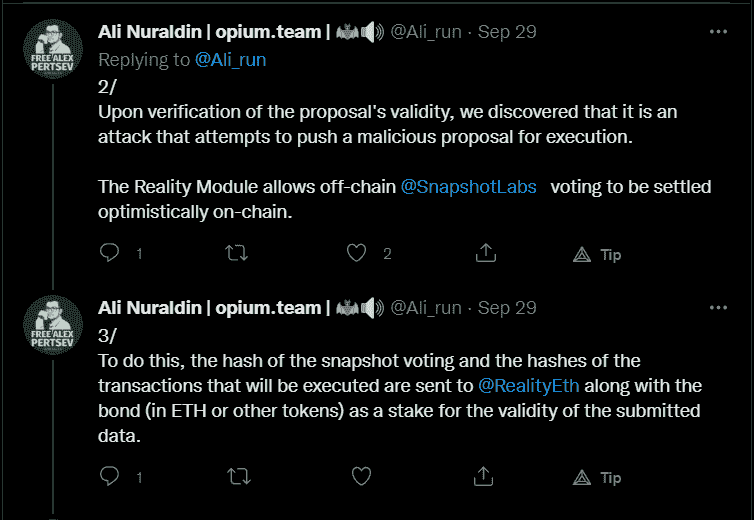
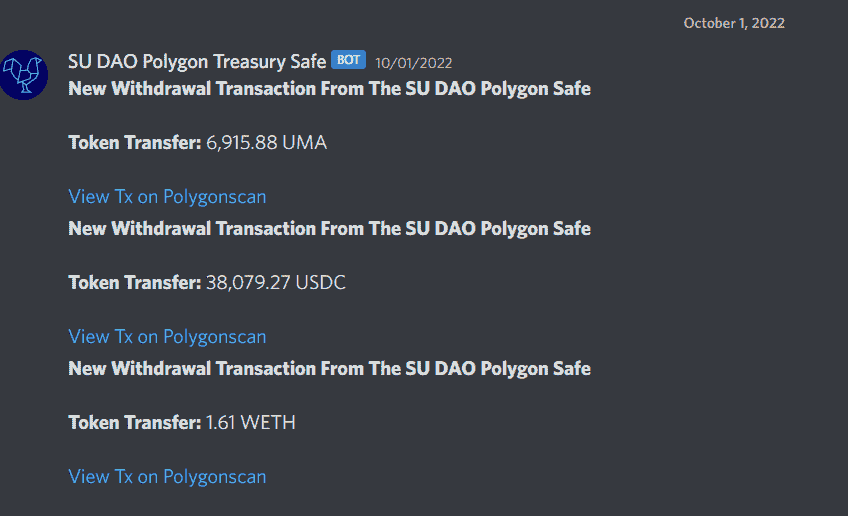

# 对超人道(SuDAO)攻击的技术剖析——现有治理工具中的缺陷

> 原文：<https://medium.com/coinmonks/a-technical-post-mortem-of-superuman-dao-sudao-hack-flaws-of-existing-governance-tools-553de4d4736e?source=collection_archive---------17----------------------->

如今，大多数 Dao 使用 Gnosis Safe Multisig 钱包来保护他们的国库，这是以太坊生态系统中最受欢迎的智能合约钱包之一。Gnosis Safe 通过模块提供了灵活性，类似于现代浏览器的扩展。

苏道([超人道](https://discord.gg/ES8fUzyB))使用灵知安全 Multisig 钱包。此外，它将[快照](https://snapshot.org/#/superumans.eth)与 Zodiac Reality 模块结合使用，用于治理投票的链上实现。

# 摘要

在 10 月 1 日 22 (03:34:16 PM +UTC ),一个恶意的提议被执行，导致在 Polygon 上 SuDAO 的国库钱包中的资金损失。

在漏洞利用之后，该团队调查了该事件，并准备了以下报告。

正如公开报道的那样，该事件是由于执行提交给 Reality 模块的恶意提案而导致的，该提案绕过了 Snapshot。攻击者利用了 Gnosis Safe 的一个已知功能漏洞，Gnosis Safe 模块(Zodiac Reality)可以在没有任何所有者确认的情况下执行交易，再加上 Reality.ETH 的设计缺陷。

黑客入侵时，损失的资金超过 5.6 万美元。

# 事情的进展

9 月 30 日下午 2:51:17+UTC，攻击者提交了一个恶意的[提议](https://polygonscan.com/tx/0x1175cf19c14aefa8d0e7222ebcdb5915ad9b8dc13e9d53077348abcd1c66fccb)给现实。ETH 绕过快照进行链上实施。

这一提案与一个月前苏岛通过的一项合法提案相同。

下图显示了原始提案中的输入数据。

然而，这个恶意的提议增加了一些功能，使它能够耗尽苏岛的多边形钱包。

任何提交给现实的提议。ETH 有一个争议窗口。在 SuDAO 一案中，有 12 个小时的暂停时间来对提案提出异议。

由于目前没有正在进行的投票，该提案未被关注。现实。ETH tracker in Discord 不是为某个特定的钱包定制的，它跟踪 Reality.ETH 的所有解析请求。

该恶意提议于 10 月 1 日 03:34:16 PM +UTC(提议后超过 24 小时)执行。需要澄清的是，为什么提案在 12 小时加 1 小时的冷却期后没有自动执行。

# 简要报告

Gnosis 安全模块为 Gnosis 安全帐户启用了额外的访问控制逻辑。因此，可以通过两种方式控制 Gnosis 安全帐户。一种是由帐户所有者使用他们的签名者密钥，另一种是由具有自定义访问逻辑的可选模块。例如，7 个所有者中有 5 个可以控制一个 Gnosis 安全帐户，一个额外的模块允许一个管理密钥只需一个签名就可以控制 Gnosis 安全帐户。

十二宫现实模块(以前的 SafeSnap)是一个 Gnosis 安全模块，允许基于现实报告的事件结果进行链上执行。ETH oracle。它根据快照建议执行 Gnosis 安全交易，而不需要帐户所有者的任何签名。

攻击者利用了 Gnosis Safe 的这一已知功能漏洞，从而

任何附加模块都可以从钱包中执行交易，而无需所有者的任何确认。换句话说，模块可以比所有者本身更强大。一旦一个模块被附加到一个钱包上，它就可以自由地调用 execTransactionFromModule 函数，该函数允许在没有确认的情况下执行操作。([开放齐柏林飞艇](https://blog.openzeppelin.com/backdooring-gnosis-safe-multisig-wallets/)，2020 年 3 月)

攻击者能够利用现实在本地模拟合法的交易。ETH 的模式，将恶意交易数据注入与提案相关的 EIP712 哈希中。然后，使用这个散列，他们通过十二宫现实模块创建了一个假提议，其文本格式与苏道和其他道使用的相同。

攻击者使用了最近通过的超人提议(附加大使补偿)的 proposal_id，该提议避免了恶意提议被表面层的随机旁观者捕获。提案通过了，因为在提案期间没有人提出任何警告。

Gnosis Safe 模块被允许完全访问以传送任何交易和函数调用，因此，一旦提议被通过，交易被认为是正确的，approve()和 transfer()函数被调用，资金被耗尽，所有这些都不需要实际的调用者(即攻击者)是保险箱的所有者或签名者。

# 事件时间线

9 月 22 日 28 日，鸦片协议小组的一名成员在 Twitter 上发布了以下内容:

现实中有好几个通知。ETH discord 频道将于 9 月 22 日的 28 日、29 日和 30 日播出。任何提案都会出现这些问题，而不仅仅是关于 SuDAO 的提案。

10 月 1 日(星期六)22 日，以下通知出现在速道-钱包不和谐频道:

一项低级别的调查显示，黑客攻击是通过 Reality.ETH 提交的恶意提议进行的。

# 事故后计划

攻击者攻击了 SuDAO 的多边形保险箱。由于灵知保险箱模块(十二宫现实)仍然附属于联邦理工学院的金库保险箱，资金被转移到一个新的多西格。

我们得出结论，我们没有任何办法追回被盗的资金。然而，它暴露了现实中一个重要的设计缺陷。将每个用户置于风险之中。

# 结束报告

为了推动治理，Dao 求助于链外投票解决方案。这些措施本应通过节约天然气成本让公众参与进来，但治理仍是一个挑战。现有的链外治理系统依赖 oracle 系统进行链上执行，这是可以利用的。

区块链和智能合约是独立的封闭系统，无法访问网络外部的数据。区块链只理解内部数据，如钱包地址、余额、NFT 元数据、块数据等。然而，一些契约协议要求访问链外数据来执行，oracles 通过为链上执行提供链外数据使这成为可能。

在没有神谕的情况下，智能合约的用处很小。DeFi 非常依赖神谕，这是几乎所有智能合约的基础，这些合约的执行与现实世界的事件有关。区块链甲骨文本身并不构成数据源。相反，oracles 查询、验证和认证外部数据，然后将信息转发到封闭的网络。

虽然 oracles 是将外部数据引入链上环境的可行解决方案，但它们是第三方实体(影响去中心化)，其可靠性需要被信任(影响不信任)。

鉴于最近的漏洞已导致 SuDAO 的国库和其他 DAO 的国库损失超过 56，000 美元，必须强调 Gnosis 安全模块的问题和缺陷，尤其是使用 Reality.ETH 的 Zodiac Reality 模块。这些现有的可组合治理和国库管理工具中有一些是在没有经过彻底审查和配置的情况下采用的，因此造成了数百万美元国库风险的威胁。

# 现有治理工具的缺陷

[十二宫现实模块](https://github.com/gnosis/zodiac-module-reality)属于[灵知保险箱](https://gnosis-safe.io/)上可用的[十二宫](https://github.com/gnosis/zodiac)工具集合。它利用现实。ETH 作为 oracle，用于触发通过 Reality 批准的交易的执行。ETH 问题。

现实。ETH 通过问答互动来工作。用户通过问题与智能合同进行交互。问题由现实来回答。ETH 用户。现实上问的问题。ETH 由提议 ID(例如，IPFS 散列)组成，其可用于为要执行的事务提供更多信息，以及表示应该执行的事务的基于 EIP 712 的事务散列的数组。

一旦一个问题被问及现实。ETH，任何人都可以通过建立一个债券来回答这个问题，如果被证明是错误的，他们愿意失去这个债券。该系统的设计使得任何用户都可以通过提交更高的保证金来挑战和推翻之前的答案。它应该激励正确的答案来触发正确的连锁反应。

使用现实的用户。ETH 有权选择仲裁人来解决争议。如果没有选择仲裁人，将自动选择得分最高的答案。如果仲裁员错误地选择了自己作为仲裁员，他们有责任解决争议。如果他们失去对密钥的访问(永久地或暂时地)，系统表现得像无仲裁器配置。

在一个答案被选为真理后，有一个宽限期，在此期间灵知安全签名者可以否决这个决定。这很有挑战性，需要 24 小时的监控来扫描所有到来的现实。ETH 问题请求。

让我们了解一下这款车型的设计缺陷。首先，在没有仲裁人的情况下，这种设计会激励出价最高的人(类似于美元拍卖游戏)。如果一个高度资本化的恶意行为者决定不正确地回答一个问题，他们将可能通过能够比他们的对手花费更多而成功。

第二是关于对人类行为者的依赖。任何恶意的参与者都可以创建请求。如果 DAO 未能监控此类请求，恶意解析将在 DAO 不知情的情况下通过。该系统需要 24x7 全天候人员配备。Multisig 成员不能总是随叫随到地访问他们的签名密钥。

更多了解，请阅读 [@isaacpatka](https://twitter.com/isaacpatka) 的[文章](https://hackmd.io/g0txop3tTfGxcNKxn4z4Jg?view)。

# 结论

Web3 还很早&仍处于构建阶段。FTX 海啸过后，整个行业处于最低谷。因此，对于项目来说，突出任何可能影响最终用户的潜在漏洞变得至关重要。此外，开发者和项目必须记住，Web3 的全部精神是透明和负责。没有这一点，我们与任何其他遗留系统没有什么不同。

Dao 应尽可能通过激励治理来解决选民的冷漠和倦怠。可组合性对 Web3 推动采用很重要；然而，在没有适当审查的情况下添加模块可能会产生灾难性的深远后果。

缺少关于模块能力的警告和文档会导致危险的攻击媒介。攻击者可以通过不安全的模块轻易地利用多签名钱包，直到 Gnosis 提高了更多的最终用户对恶意模块的危险的认识。

SuDAO 现在正在等待[乐观治理](/uma-project/how-to-let-anyone-and-everyone-run-your-dao-c9d62a274412)模块的发布，该模块将用于替代 Reality.ETH。该模块将赋予协议更多挑战无效交易的权力。

感谢 [@neondaemon3](https://twitter.com/neondaemon3) 、 [@pennepanda](https://twitter.com/pennepanda) 、 [@G_0neT2](https://twitter.com/G_0neT2) &其他 [@SuperUmans](https://twitter.com/SuperUmans) 帮助完成这篇报道。

如果您觉得这很有帮助，请通过订阅和关注来支持。

**万物区块链**🧐——自由思想家、作家✍、区块链探险家🔭
为了简化元宇宙链的不同模块

**社交**

[Twitter](https://twitter.com/EverythingB0x) ， [Medium](/@everythingblockchain) ， [Youtube](https://www.youtube.com/channel/UCkcc6EceEAu1sMoi2dKczCQ) ， [Reddit](https://www.reddit.com/user/cyekmyster) ， [Substack](https://everythingblockchain.substack.com/account?utm_source=menu-dropdown)

**下线**

[智囊团](https://app.usebraintrust.com/r/everything1/)，[预研](https://www.presearch.org/signup?rid=2491437)，[币安](https://accounts.binance.com/en/register?ref=12626399)，[库科恩](https://www.kucoin.com/ucenter/signup?rcode=rJCLFS2)

本文提供的信息仅用于教育目的，不得视为投资建议。在正确呈现任何信息方面的任何失误都是我们的责任。我们否认与使用此内容相关的任何责任。

> 交易新手？尝试[加密交易机器人](/coinmonks/crypto-trading-bot-c2ffce8acb2a)或[复制交易](/coinmonks/top-10-crypto-copy-trading-platforms-for-beginners-d0c37c7d698c)