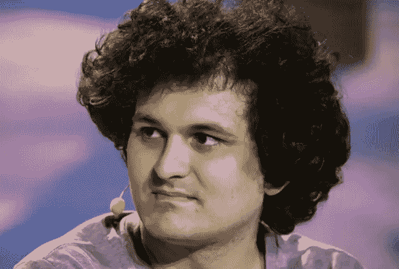
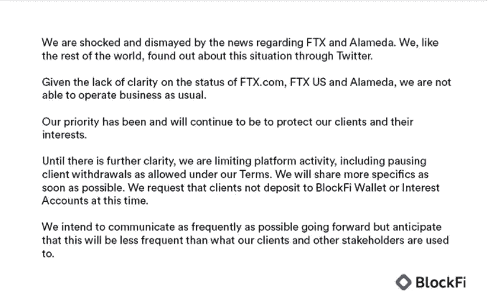
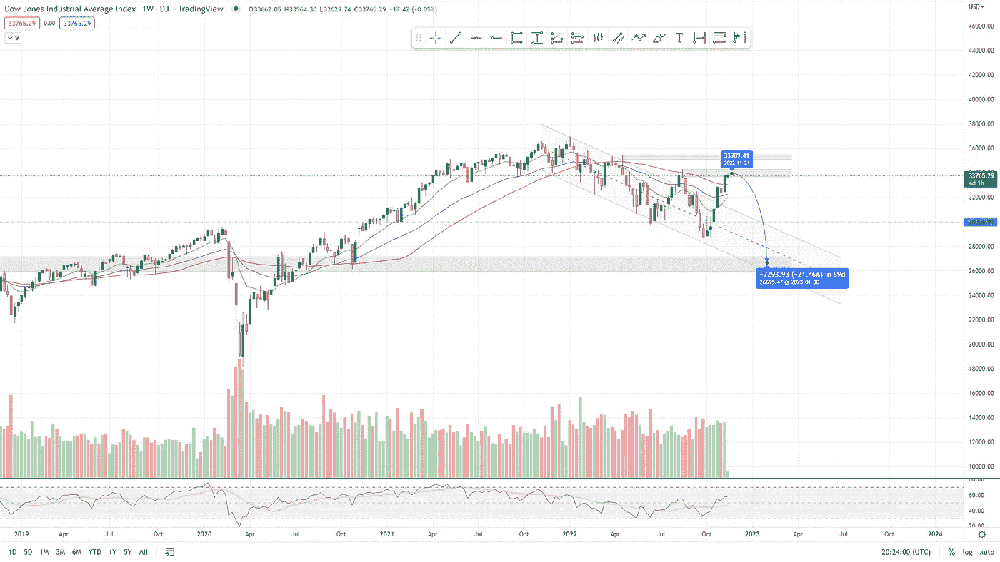

# 对 FTX 危机的调查

> 原文：<https://medium.com/coinmonks/a-thorough-look-into-the-ftx-meltdown-9f07db4cb60e?source=collection_archive---------49----------------------->

FTX、SBF 和整个密码行业到底发生了什么？

# 在本周的报告中

*   FTX 到底发生了什么事
*   币安卷入 FTX 危机
*   Bitfinex 和更多余波
*   Crypto.com 恐慌和恐惧
*   比特币价格行动评论
*   美国 30 +纳斯达克价格行动评论

‍

# FTX 到底怎么了？

过去两周，全球第三大加密货币交易所 FTX 的突然崩溃席卷了全球。
‍

‍
又一个事件伤害了整个行业和许多合法创新者和技术人员的声誉。
‍

‍
对聪明的投资者来说，FTX 的崩溃仅仅显示了对任何投资者来说，了解他们在投资时所冒的风险是多么重要，尤其是像 FTX 这样的风险更大的投资。

‍

FTX 及其附属公司于 11 月 11 日申请破产。该公司创始人萨姆·班克曼-弗里德(SBF)于同一天辞去了 FTX 首席执行官的职务。

‍

总部位于巴哈马的 FTX 持有约 160 亿美元的客户资产，但显然已将其中约 100 亿美元借给了由 Bankman-Fried and friends 经营的交易公司 Alameda Research。

‍

后来人们发现，阿拉米达研究公司反过来向其他第三方实体借出了数十亿美元，其中许多贷款是由 FTX 交易所的本土证券 FTT 担保的。

‍

正如我们上周所报道的，在币安首席执行官赵长鹏宣布他们将出售所有的 FTT 代币后，FTT 的价值迅速崩溃，因为“最近的披露”提到了上述 FTX 交易所缺乏资金和阿拉米达研究公司资金管理不善。

‍

由于 CZ 公开宣布币安抛售 FTX 股票后产生的恐惧，FTX 立即面临 50 亿美元的客户提款要求。根据 Bankman-Fried 的说法，这使得 FTX 面临 80 亿美元的缺口。

‍

除此之外，还有谣言说阿拉米达研究公司的高层主管。卡罗琳·埃里森、萨姆·班克曼-弗里德和阿拉米达的其他员工一直在一起搞“性崇拜”。
‍

‍
这个谣言很可能是通过阿拉米达研究公司的高管散布的。卡罗琳·埃里森是萨姆·班克曼-弗里德的前女友，据称她是因为与班克曼-弗里德的性关系才获得这个职位的。

‍

卡罗琳·埃里森(Caroline Ellison)曾部分负责阿拉米达的交易和关系，她曾表示，“我们倾向于不使用止损之类的东西，我认为这些不一定是很好的风险管理工具”。

‍

这种对技术和交易理解的缺乏，在该基金的数十亿美元损失中显而易见。

*FTX 首席执行官山姆·班克曼-弗里德*

# FTX 被黑了吗？

‍

就在前面提到的事件发生后，FTX 被“黑客”攻击，许多人认为这是内部人员从 FTX 账户中取出最后一笔资金，进入投资者和 FTX 公司高层的私人钱包。

‍

在这次黑客攻击中，超过 6 亿美元被从 FTX 的加密钱包中取走。

‍

“FTX 被黑了。FTX 应用程序是恶意软件。删除它们。聊天已打开。不要上 FTX 网站，因为它可能会下载木马，”一名帐户管理员在他们的 FTX 支持电报聊天中写道。

‍

转移发生在该公司申请破产的同一天。

‍

前面提到的怀疑是由于这一切的模糊性和方便性而产生的。关于是否是公司内部某个人而不是外部攻击造成的谣言很快在网上流传开来。

‍

# 受 FTX 危机影响最大的项目

‍

在 FTX 崩盘 BlockFi 后不久，一家加密贷款公司宣布，由于“FTX 和阿拉米达的状况不明朗”(图 1)，它将停止从他们的平台上提款，这给所有资金在集中交易所或其他集中网络上的用户带来了恐惧、不确定性和怀疑。

‍

BlockFi 和 FTX 美国公司今年 7 月宣布，两家公司已同意一项交易，其中 FTX 美国公司将向 BlockFi 提供 4 亿美元的信贷，这将使 FTX 美国公司有权以最高 1500 万美元的价格收购 BlockFi。

‍

名为“coiiiii”的 Reddit 用户很快宣布了一份受 FTX 影响最大且有直接关系的不同加密货币项目的清单。

‍

其中一些包括该领域的主要公司，如宇迦实验室、Circle、Genesis Digital Assets、NEAR protocol、BlockFi、Aptos、Nova Labs、MINA、Polygon、Solana 和 Voyager Digital。

‍

崩溃的影响在任何项目中都会被延迟，所以 FTX 和阿拉米达研究破产的真正影响还有待观察。

*图 1 BlockFi 报文*

# Crypto.com FUD

‍

Crypto.com 在周末“错误地”将价值高达 4 亿美元的以太坊送到了错误的地址。这笔钱很快被追回，尽管它给交易所和平台的用户带来了极大的恐惧。

‍

10 月下旬，大量 ETH(价值约 4 亿美元)从 Crypto.com 被发送到 Gate.io。然而，这些令牌本应被送到一个冷藏地址，但“错误地”出现在 Gate.io，[crypto.com](http://crypto.com/)首席执行官克里斯·马斯扎克在推特上指出。

‍

在 FTX 前所未有的崩溃之后，所有主要的加密货币经纪人都透露了他们的冷藏地址，本着透明的精神，他们在那里保存了大多数客户的令牌。

‍

Marszalek 上周公布了 Crypto.com 一些顶级资产的冷钱包地址。不久之后，用户很快发现了 32 万乙醚的可疑转移。一位名叫 Conor Grogan 的用户指出，Gate.io 和 Marszalek 的公司在 10 月 21 日达成了 4 亿美元的交易。

‍

这导致了大量的退出加密通信和大量的恐惧蔓延。(CRO)克罗诺斯，crypto.com 链的本地加密货币，当天暴跌超过 40%。

# 加密的下一步是什么？

‍

FTX 现在加入了许多其他倒下的项目——包括 Terra Luna、对冲基金 Three Arrows Capital、Celsius 和 Voyager。

‍

由于在加密领域看到的这种破坏，首席执行官赵昌鹏“CZ”虽然仍然在崩溃中发挥了相当大的作用，但他在这些崩溃中指出，他设想在不久的将来会出现一个更严格的监管审查时代。

‍

CZ 表示:“我认为基本上我们已经倒退了几年。监管机构理所当然地会更加严格地审查这个行业，老实说，这可能是一件好事。”

‍

一个很好的结束方式，也是一个不幸的事实。建立起来的信任在很大程度上已经崩溃，尽管人们的目光会在适当的时候再次转向 crypto。

# ‍Bitcoin 价格分析

‍

由于 FTX 事件，比特币在周二遭遇了大规模抛售。

‍

自对 FTX 破产的担忧开始以来，股市总跌幅超过了 25%。这一下跌迫使比特币跌至新低，打破了 6 月份 17.5k 的低点。

‍

新低大约是在 1996 年创下的。15500.如果我们看不到强劲的 V 型复苏很快离开这些水平，我们肯定会很快更低。

‍

在后一种情况下，最终目标可能低至 9k。

*图 2 1D BTC 2022 年 3 月—2022 年 11 月(TradingView)*

‍

# 道琼斯价格分析

‍

股市保持相对不变，所有股票都将继续走强。自上周以来，道琼斯、S&P 和纳斯达克等所有主要指数都大幅上涨，道琼斯工业平均指数的涨幅超过 3%。

‍

我们不断谈论的回调还没有真正发生，但价格行为目前所处的区域仍然是空头涌入的关键区域。
‍

‍

拒绝是迫在眉睫的，没有新的积极或消极的高影响力的消息预计很快。缺乏高影响力的消息意味着市场走势将在很大程度上取决于投资者的信念和交易行为。

‍

作为投资者，由于全球经济形势，我仍然非常谨慎，作为交易者，这看起来是强烈拒绝的最佳时机。

‍

道指 26000-27000 点的关键长期水平目前位于通道底部。在合适的条件下，这些水平将有可能在 Q2 2023 开始前达到。

‍

*图 3 1D DJIA 2019 年 12 月—2022 年 11 月(TradingView)*

> 交易新手？试试[加密交易机器人](/coinmonks/crypto-trading-bot-c2ffce8acb2a)或者[复制交易](/coinmonks/top-10-crypto-copy-trading-platforms-for-beginners-d0c37c7d698c)