# DefiLlama 平台漫游

> 原文：<https://medium.com/coinmonks/a-walkthrough-of-the-defillama-platform-7bfd95d86784?source=collection_archive---------9----------------------->

*本指南帮助您理解 DefiLlama 平台中的数据。*

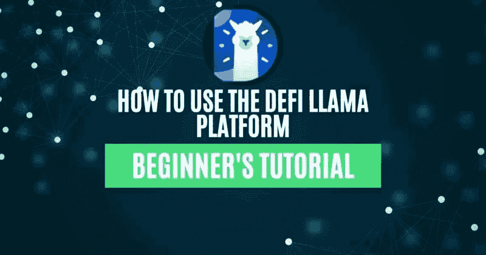

## [DefiLlama](https://defillama.com/) 是一个分析平台，在这里您可以检查从不同区块链网络整合的分析数据。它是[Defi](https://www.altcoinbuzz.io/defi/astar-network-and-acala-launches-new-defi-initiative/)最大的 TVL 聚合器，可以聚合来自 100 多个网络和应用的数据。DefiLlama 平台为您提供了每条链以及基于该链的应用的全面而详细的记录。平台源代码是开放的，由不同协议的贡献者维护。

所以，在这篇文章中，我们将解释你能在 DefiLama 平台中找到什么样的数据，以及如何理解它。

**进入除颤器平台**

要访问 DefiLlama 网站，请访问[链接](https://defillama.com/)。你可以看到下面的屏幕。

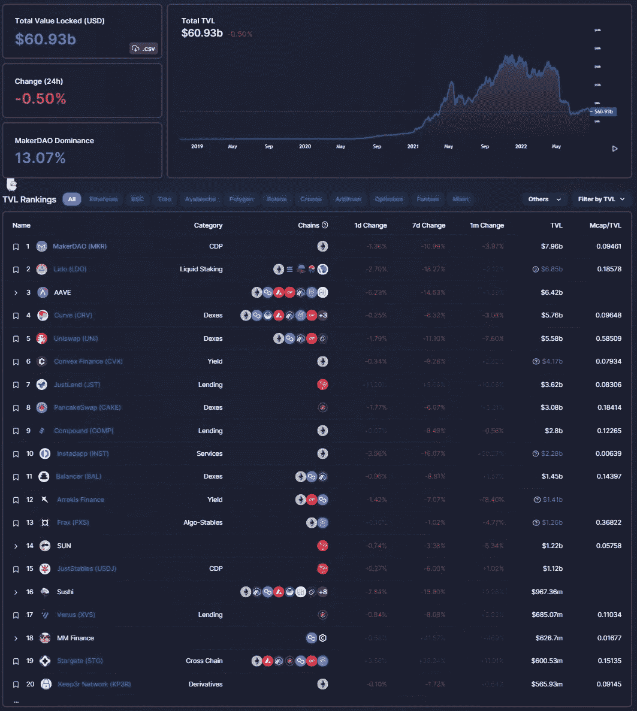

从迪菲拉马门户网站，你可以看到和跟踪整个迪菲生态空间的统计数据。您可以在控制面板中找到不同的部分，在那里您可以查看有关以下字段的分析数据:

*   Defi、Yield 和 StableCoins 数据
*   链子
*   空投
*   神谕
*   叉
*   Defi 中的清算级别
*   顶级协议

我们将解释其中的每个部分，并帮助您理解平台维护的数据。

**概述**

在该选项卡中，您可以查看**中锁定的所有相关区块链协议**的总值。一个 **TVL 或总价值锁定**是用户在协议中锁定的资产数量。

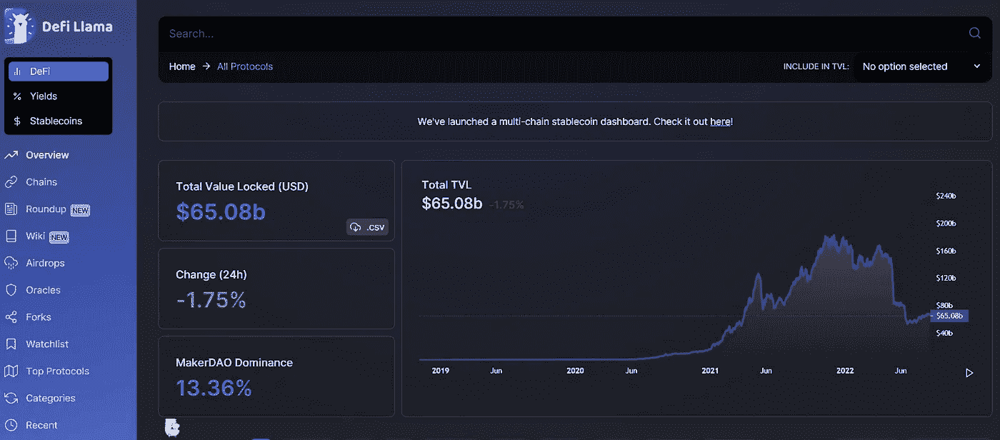

**顶部**

从 overview 选项卡的顶部，您可以检查所有加密用户锁定到网络的资产总数，以及 24 小时内的百分比变化，以及主要贡献协议(MakerDAO)及其百分比。

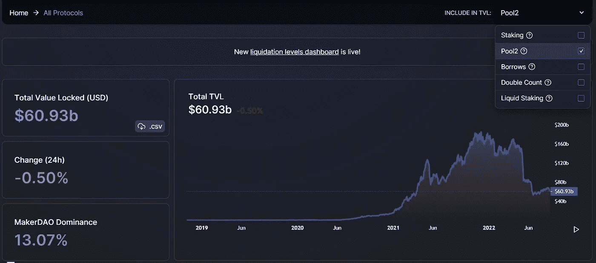

请注意，TVL 值不包括以下程序中锁定的令牌:

*   协议中的治理令牌
*   与治理令牌配对的桩式 LP 令牌
*   借自借出协议的令牌
*   协议的 TVL，其 TVL 馈入其他协议
*   赌注资产的回报和流动性

如果您希望包含上述任何参数，请选中所需的框并查看更新的 TVL 数据。

**底部部分**

在底部，您可以查看有关协议的更多详细信息。以下是您可以从该部分获得的关键信息:

*   协议(项目)名称
*   协议类型(DEX、贷款、CDP 等)
*   支持项目的不同链
*   1D 变化
*   7D 变化
*   1M 变化
*   TVL
*   MCap/TVL

这些项目是根据 TVL 锁定的。从**链**字段，您可以查看网络中锁定的 TVL 的网络排名。

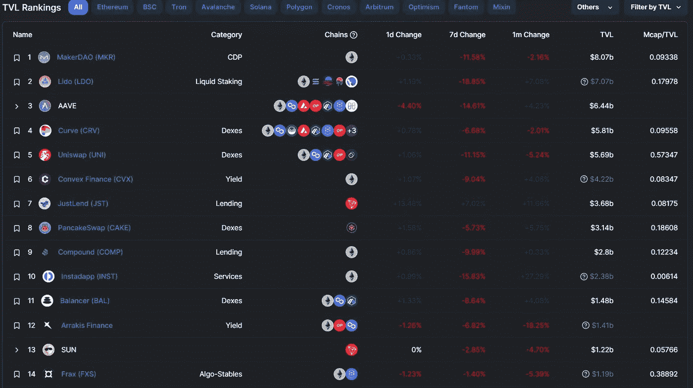

你甚至可以过滤基于 TVL 锁定的全部数据，即基于最大和最小 TVL。

用户可以进入每个**网络**标签(如以太坊、BSC 等)来查看那些基于特定网络的项目的详细信息。用户可以进一步向下钻取项目级别的数据。

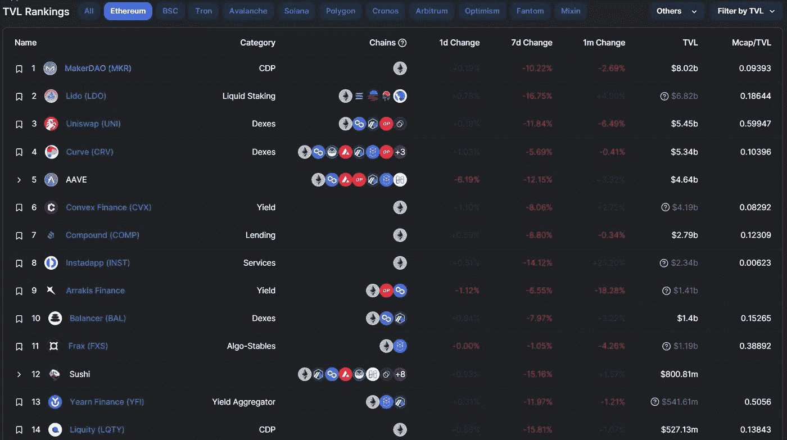

例如，您可以选择**以太坊**网络来查看基于以太坊的项目。接下来，在 projects 下，您可以选择 **Uniswap** 或 **MakerDAO** ，以获得关于该特定项目的详细信息。

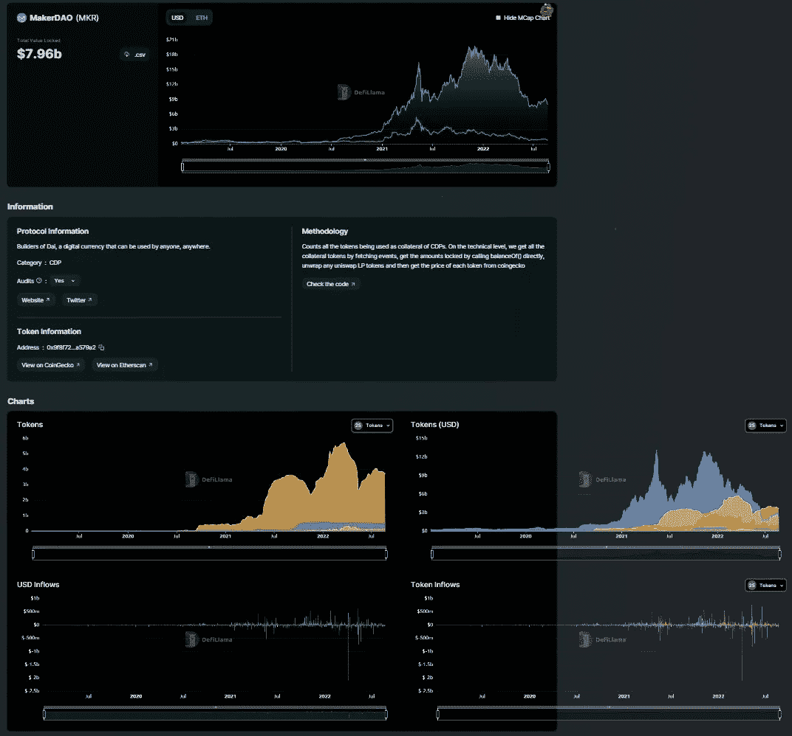

从上面的截图可以看出，我们已经导航到了一个基于以太坊的项目，即 MakerDAO。在这里，您可以查看有关该项目的以下信息:

*   项目的简短描述
*   这是什么类型的项目
*   项目是否经过审计
*   项目网站及其 Twitter 页面的链接
*   表示多个链上数据的图表，包括 TVL、美元流入和代币流入

**收益率排名**

在此选项卡中，您可以查看根据锁定的 TVL 值排名的各种网络中的可用池列表。用户可以获得有关池的以下信息:

*   池名称
*   支持池的项目
*   TVL 锁定
*   APY
*   基地 APY
*   奖励 APY
*   观点
*   信心

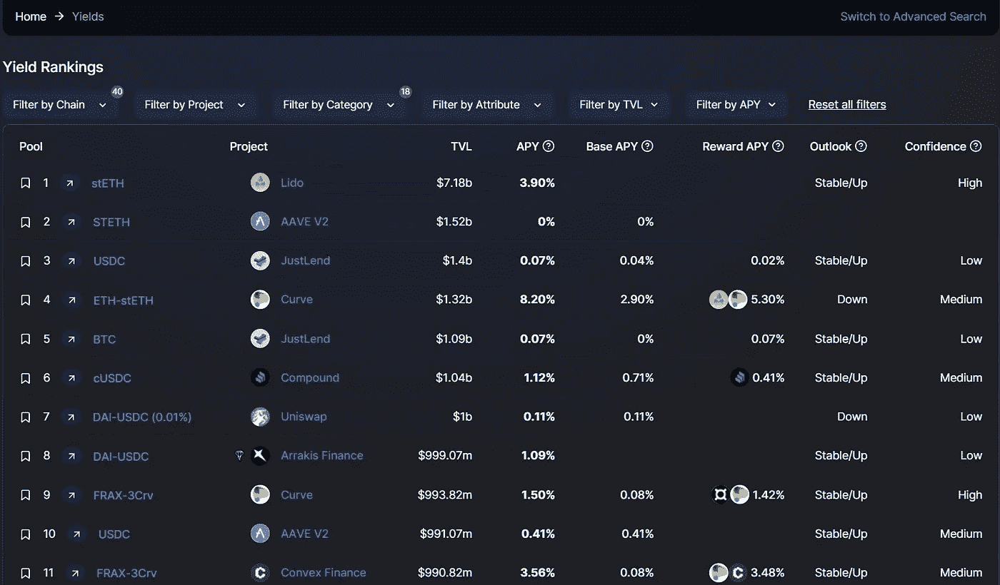

用户还可以根据各种参数过滤产量数据，包括:

*   网络
*   项目名
*   领域(桥梁、贷款等)
*   属性
*   TVL 值
*   APY

**稳定的硬币市场**

从这个选项卡中，您可以获得关于 stablecoins 的复合数据。这里，图表也分为两个部分。

**顶部**

从顶部，您可以检查以下内容:

*   稳定的货币市场总量
*   7 天内的百分比变化
*   主要稳定硬币及其百分比优势

从图表的右侧，您可以查看不同稳定点的趋势图。将光标悬停在任何一点，查看任何时间范围内任何稳定币的市值。

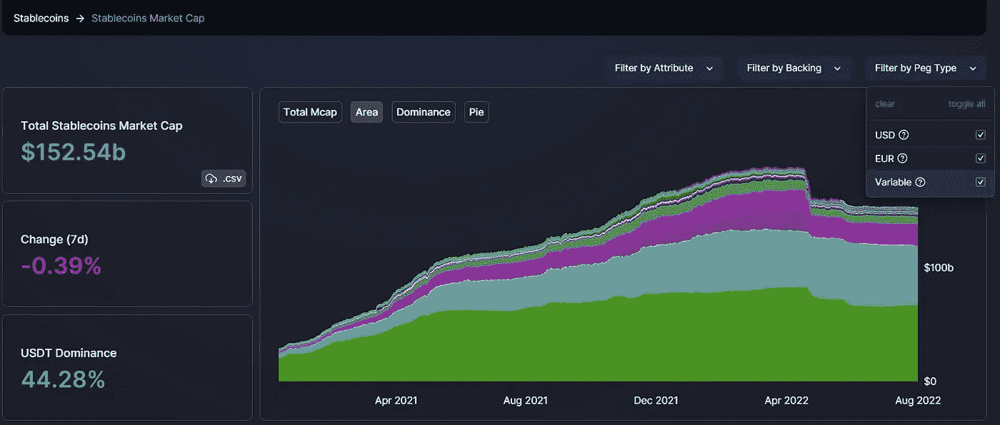

您可以下载 stablecoin 数据。csv 格式，如果你想通过点击**。csv** 按钮。用户还可以找到各种过滤器(按属性、支持(fiat、crypto、algorithm)、peg 类型(USD、EUR、Variable))让他们根据您的选择过滤掉数据。

**底部部分**

从底部，你可以看到稳定币的数据按照他们的市场支配百分比排列。

**注:**稳定货币与稳定资产挂钩，一般与美元 1:1 挂钩，以抑制其波动性。其他 stablecoins 仅由算法支持，而非抵押品。

在这里，用户可以查看以下关于 stablecoins 的数据:

*   链(支持的链列表)
*   偏离固定值的百分比(偏离固定值)
*   偏离挂钩 1m %( 1 个月内与挂钩值的最大偏差)
*   价格
*   1D 变化
*   7D 变化
*   1m 变化
*   市值

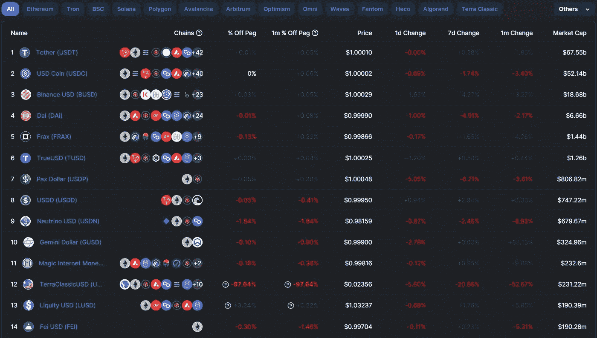

你可以去任何网络标签如以太坊、BSC 等查看支持的 stablecoins 及其市场价值。用户可以进一步深入到硬币/代币级别，以获得更详细的信息。

**链条**

从这一部分，检查锁定在不同链中的总值。以太坊是主要的连锁企业，占据了所有连锁企业总价值的 58%左右。

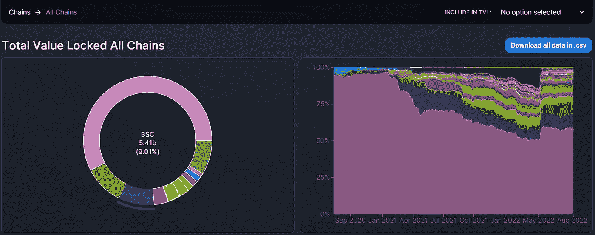

在底部，您可以根据链类型(第 1 层或第 2 层)检查数据，即 EVM、非 EVM、宇宙、副链和汇总。

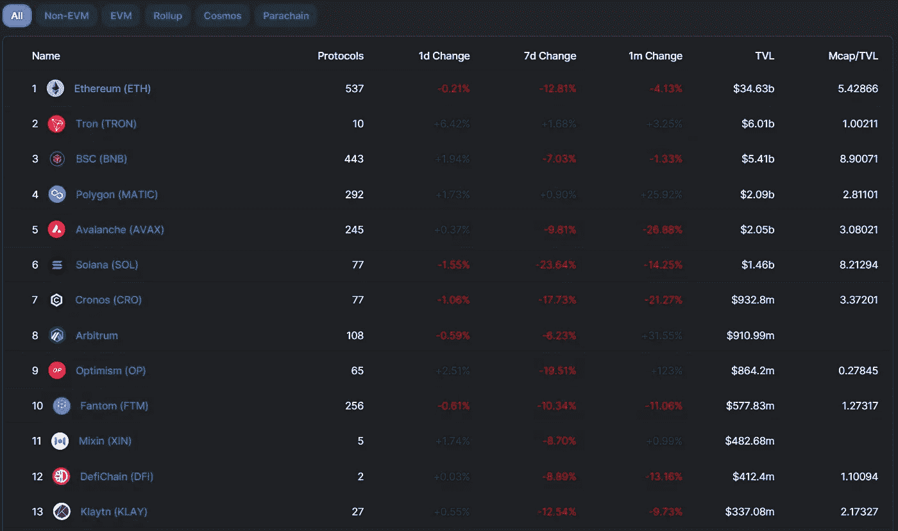

您可以转到每个选项卡，查看与链相关的更具体的数据。

**综述**

从这个板块查看每日重要新闻。

**空投**

在这个选项卡上，DefiLlama 可以帮助您关注可能在不久的将来空投的协议列表。

空投是一种奖励早期用户的活动。这是一种非常常见的做法，通过在项目启动时分发免费的本地令牌来推广项目及其令牌。

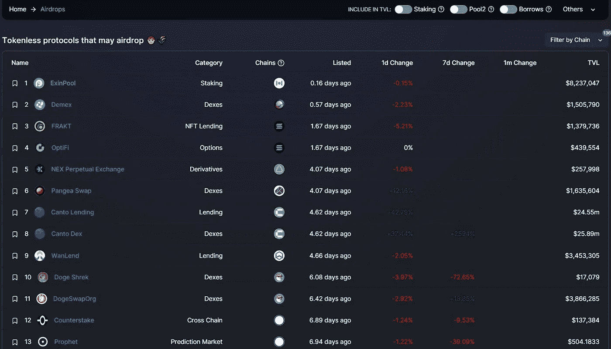

**神谕**

从 **Oracle** 选项卡，您可以查看各种区块链 Oracle 中的担保总额。Chainlink 是最大的控股公司，约占总价值的 48%。

区块链神谕充当区块链代码(即智能合约)和外部世界之间的中介。数据存储在 oracles 中，负责验证和认证任何外部输入数据。

在图表的右侧，您可以查看从 2019 年 3 月至今区块链行业不同先知的增长、创立和参与情况。

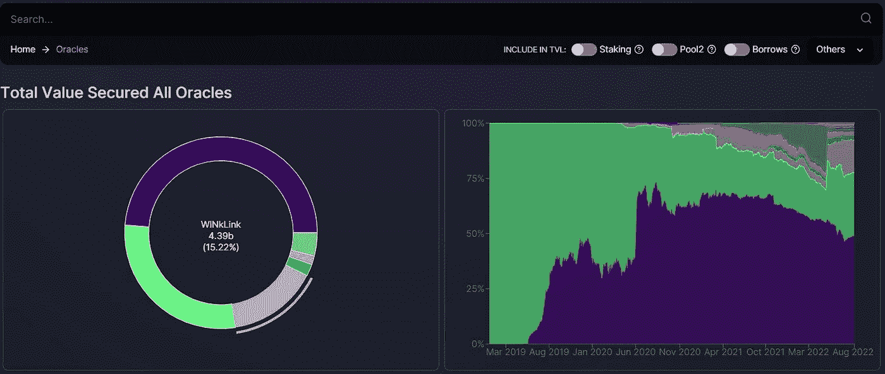

在底部，您可以查看不同的 oracle 列表、使用这些 Oracle 的协议数量以及它们保护的总价值。

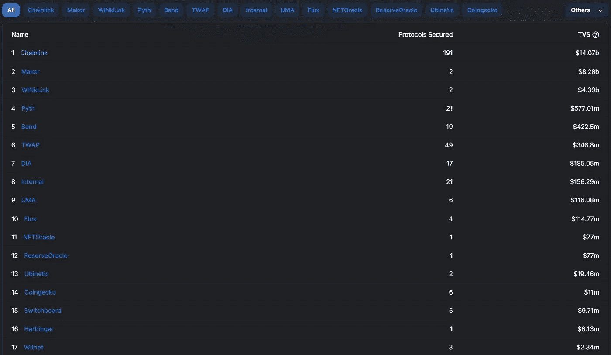

您可以进一步深入每个 oracle，以了解更多关于使用 Oracle 的不同项目、占主要份额的项目以及份额百分比。

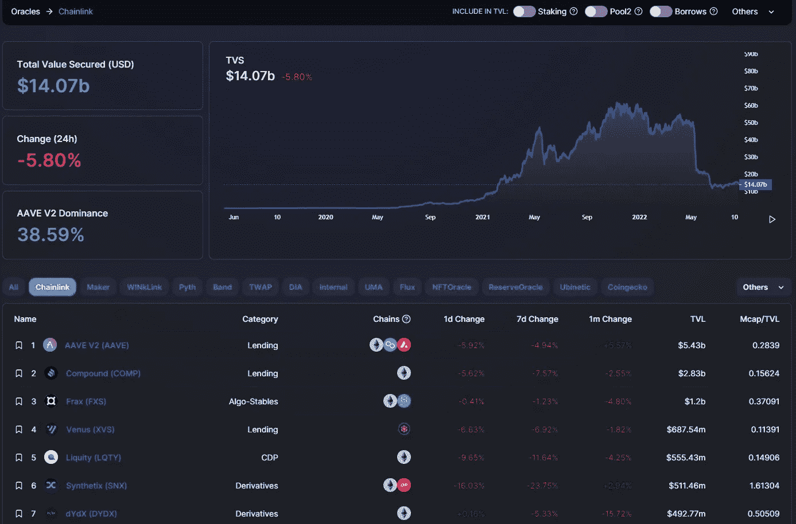

您还可以从图表中查看一段时间内 TVS 值的上升/下降。

**叉子**

检查此部分所有分叉中锁定的总值。

区块链代码是开源的，因此任何人(开发者)都可以更改/更新它们以供进一步开发。每当一组社区成员想要改变协议的基本规则时，就会发生分叉。这种情况导致了原链的分裂，产生了新的第二链。第二个链使用新的规则集，但是它共享父链的历史。

正如你在下面的截图中看到的，Uniswap 是最多分叉的 Defi 应用程序，是 288 个不同分叉协议的家园(在撰写本文时)。

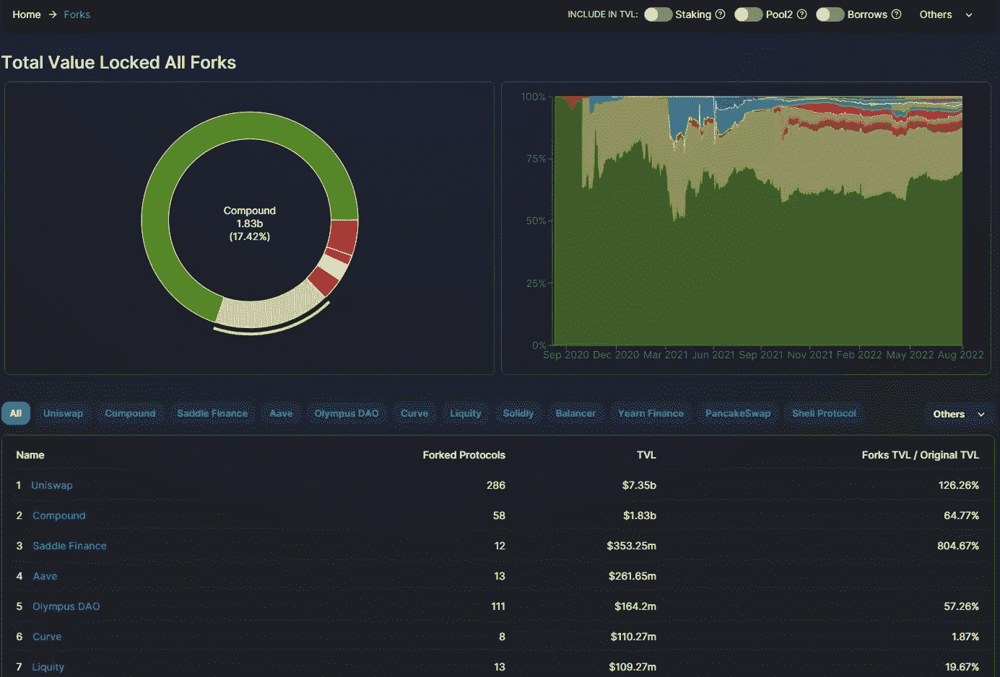

如果您想获得更详细的信息，您可以浏览协议。

**清算**

从清算级别仪表板，用户可以在任何清算点检查有多少资产将被清算的不同贷款协议。

用户可以选择顶部的担保资产。您可以检查使用所选资产作为抵押品的网络。

例如，我们选择了 ETH 作为抵押品。从下面的截图中，您可以查看使用 ETH 作为抵押品的不同贷款协议。现在，将鼠标悬停在任何一点上，查看清算值，并查看这些协议将清算多少抵押品(在本例中为 ETH)。

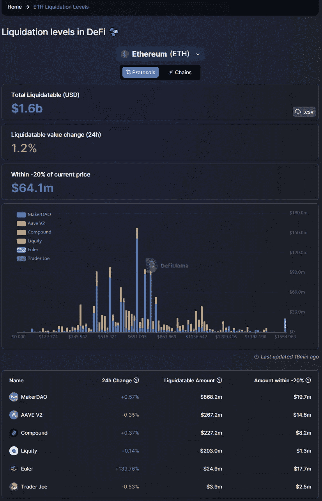

在页面底部，还可以查看最新的刷新时间。

**顶级协议**

从这个部分，你可以查看不同的区块链网络和各种 dApps 的列表，如 CDP、Liquid staking、bridges、yield farming、aggregator 等。

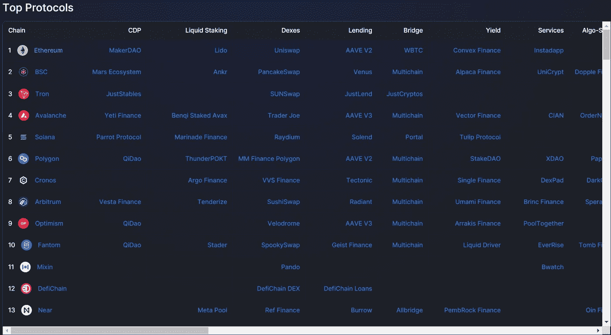

**类别**

查看不同 dApps(协议类别)的列表及其基本描述。

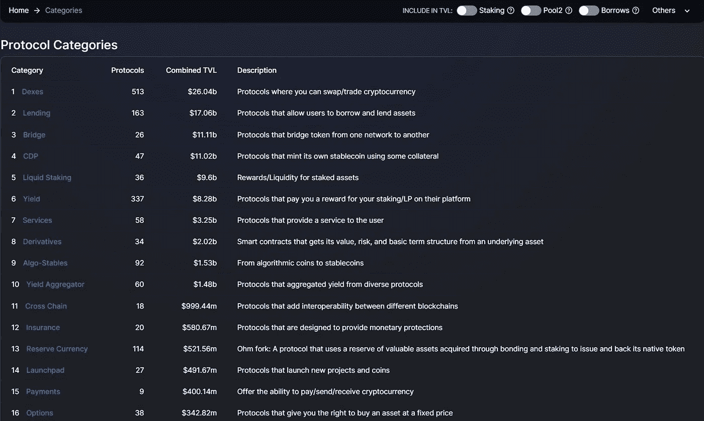

**最近的**

在此部分，您可以查看最近列出的协议的详细信息。

**对比**

通过比较选项卡，您可以将协议 A 的价格与协议 b 的 Mcap/TVL 进行比较。您可以在两个字段中输入这两个协议，DefiLama 将计算协议 A 相对于协议 b 的价格

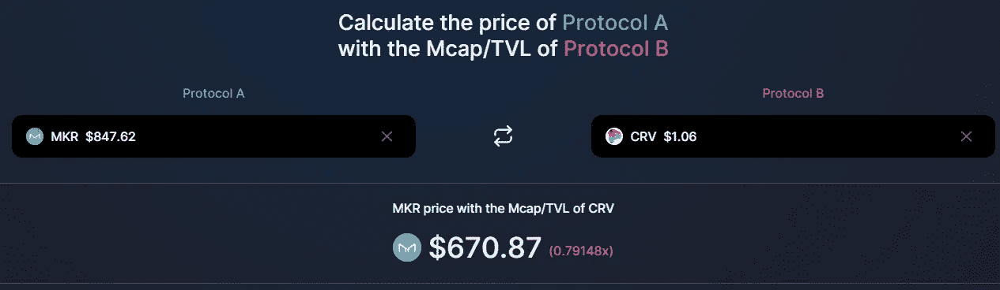

**语言**

根据不同的智能合同语言，如 Rust、Solidity 等，检查 TVL 分解的数据。

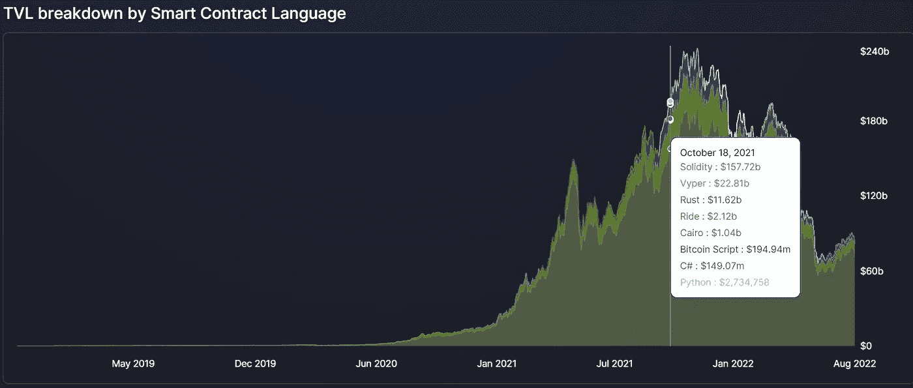

**结论**

DefiLlama 是一个强大的分析平台，它集成了所有现有区块链协议的数据，并以简单、易懂和简洁的形式呈现给用户。该平台主要适合中级用户，节省了他们收集和整理这些细节的大量时间和精力。您可以获得任何级别的详细信息，如 Chain、dApps、oracles 等。

***注:*** *本帖首发* [*此处*](https://www.altcoinbuzz.io/bitcoin-and-crypto-guide/a-walkthrough-of-the-defillama-platform/) *同* [*一* ltcoinbuzz.io](https://www.altcoinbuzz.io/) *。*

跟我来吧

**👉** [推特](https://twitter.com/rumadas123)

**👉**[**Linkedin**](https://www.linkedin.com/in/ruma-das-a1439320/)

> **交易新手？试试[加密交易机器人](/coinmonks/crypto-trading-bot-c2ffce8acb2a)或者[复制交易](/coinmonks/top-10-crypto-copy-trading-platforms-for-beginners-d0c37c7d698c)**