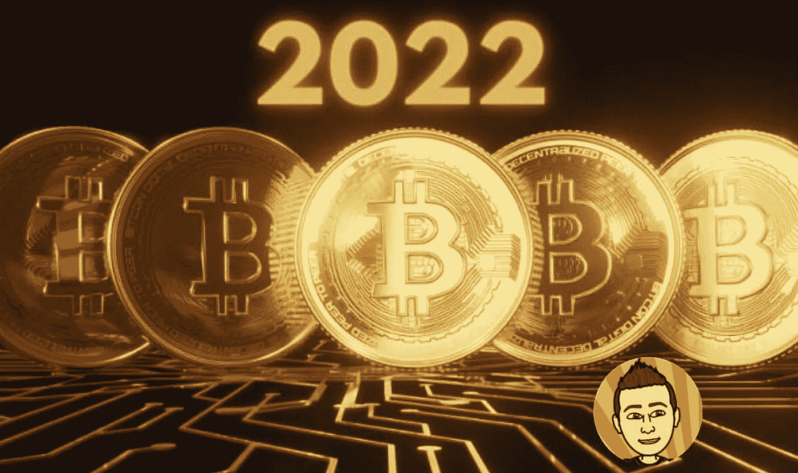

# 比特币“本该如何”的一年

> 原文：<https://medium.com/coinmonks/a-year-of-what-could-have-been-for-bitcoin-db432ea4c26?source=collection_archive---------13----------------------->

当我们迈向 2022 年时，市场情绪看涨。我们刚刚创下了比特币 69k 美元的历史新高，经过一个夏天的价格下跌后，我们都认为牛市又回来了。那是一个充满希望的时代，一切似乎都有可能。人们开始预测比特币将很快达到 10 万美元，以太坊也将很快达到 1 万美元。但是正如你所知道的，这些事情…