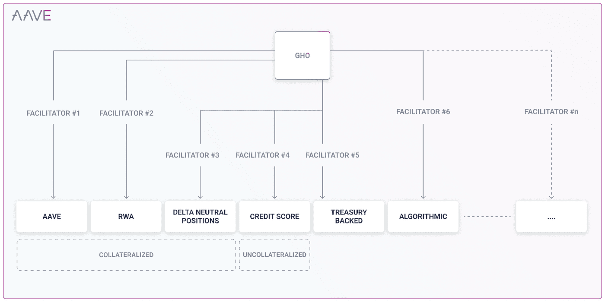
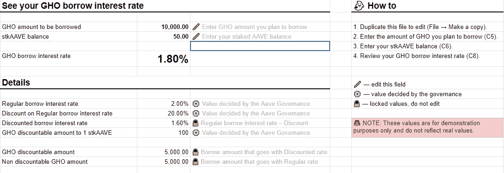

# AAVE — GHO 稳定币

> 原文：<https://medium.com/coinmonks/aave-gho-stablecoin-e39d8abad690?source=collection_archive---------8----------------------->

## 又一枚 stablecoin…它的特性会成功地从群体中脱颖而出吗？

Photo by [Alex Geerts](https://unsplash.com/@alexgeerts?utm_source=medium&utm_medium=referral) on [Unsplash](https://unsplash.com?utm_source=medium&utm_medium=referral)

Stablecoins 仍然是加密社区不可或缺的一部分，并且有很多用途。即使随着算法稳定币 UST 的下跌，我们仍然看到相当多的新稳定币在熊市中涌现。

尽管它们到底好不好是另一回事。今天，我们将快速了解 AAVE 的另一部作品《GHO》。我们将探索并看看它带来了什么新的东西(如果有的话)，以及它对协议及其用户的好处。

# **AAVE 简介**

AAVE 是一个分散的流动性协议，允许用户在其平台上供应、入股、借贷和投票。用户将能够通过他们的有限合伙人存款或赌注来赚取收益。

# 什么是 GHO

GHO 是一种分散的、抵押品支持的稳定货币，与 AAVE 本土的美元挂钩。与 GHO 有关的决定将通过 AAVE 治理来解决，因此稳定的某些方面尚未确定。

用户或借款人将能够在 Aave 协议上铸造 GHO。在铸造 GHO 之前，他们首先需要存放抵押品。当债务得到偿还或清算时，GHO 协议将相应地烧掉 GHO。

**促进者** —一个协议/实体，其有权无信任地铸造和焚烧 GHO 令牌。还将引入一个“ ***”桶“*** 来设置促进者可以创造多少的上限。
如果这个 ***【推动者】*** 的概念通过治理得到批准，他们将能够采用不同的策略(如上所示)来创造和燃烧 GHO。

# 通过治理确定的其他功能

—利率，它将根据市场情况而变化

—主持人的选择

—折扣策略机制，如果您有 STK ave，您将有权获得各种折扣借款利率
(STK ave =在安全模块上下注 AAVE，可以获得 AAVE 奖励)

因此，这将为 Aave 令牌提供更多的附加功能。

[https://docs.google.com/spreadsheets/d/1icTBIL3VijAbdn3mHIDkeScdphDGn_LVue3j2e7Ssoo/edit#gid=474599885](https://docs.google.com/spreadsheets/d/1icTBIL3VijAbdn3mHIDkeScdphDGn_LVue3j2e7Ssoo/edit#gid=474599885)

GHO 的愿景之一是以太坊 L2 连锁店的广泛使用。他们的策略是专注于支付等用例，并利用 L2 连锁店的增长和低费用。

# 结论

与戴有许多相似之处。我的意思是，它首先是同一种类的稳定币。(过分夸张)但它确实有其他功能，这有助于它脱颖而出，使它能够灵活地部署不同的策略，从而有更多的使用案例。

上面提到的主持人确实让我想起了 TRON 的 stablecoin 的超级代表*，USDD。在那里 SR 被选中并被允许铸造稳定币。*

*在最后一期发布之前，我认为 USDD 还不能被认为是真正的去中心化。如果你有兴趣了解更多关于 USDD 的信息，你可以看看我的另一篇文章，我在那里分解了他们的白皮书，所以你不必去读它。*

* [## USDD，未来的分散稳定中心？还是会走向不可避免的死亡？

### 另一种算法 stablecoin 奋起迎接挑战。在本文中，我们将把白皮书细分为…

medium.com](/coinmonks/usdd-a-decentralized-stablecoin-for-the-future-or-will-it-head-towards-an-inevitable-death-c40f048e6272) 

允许不同的主持人带着他们自己的策略来生成 GHO 是非常巧妙的，因为这给了稳定社区更多的目的和灵活性。现在给出的例子看起来像是把“世界上最好的”放入他们自己的稳定币中。

就个人而言，我并不完全理解治理投票是如何工作的，因为它似乎非常偏向于鲸鱼或拥有最多投票权的人。但这可能是一个常见的误解，我可能会去看看这个。

引进这种 GHO 稳定币肯定会给它的生态系统带来更多的好处。让我们拭目以待，看看它是否能在未来超越戴，超越过度抵押，分散稳定货币的 OG，然后超越其他三大巨头。* 

*希望你觉得这篇文章有用，感谢阅读！🐸*

> *交易新手？试试[加密交易机器人](/coinmonks/crypto-trading-bot-c2ffce8acb2a)或者[复制交易](/coinmonks/top-10-crypto-copy-trading-platforms-for-beginners-d0c37c7d698c)*