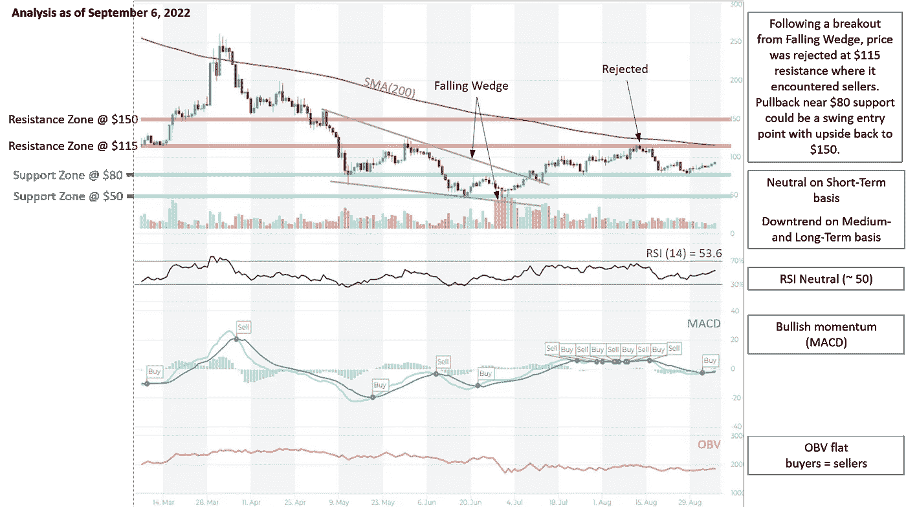
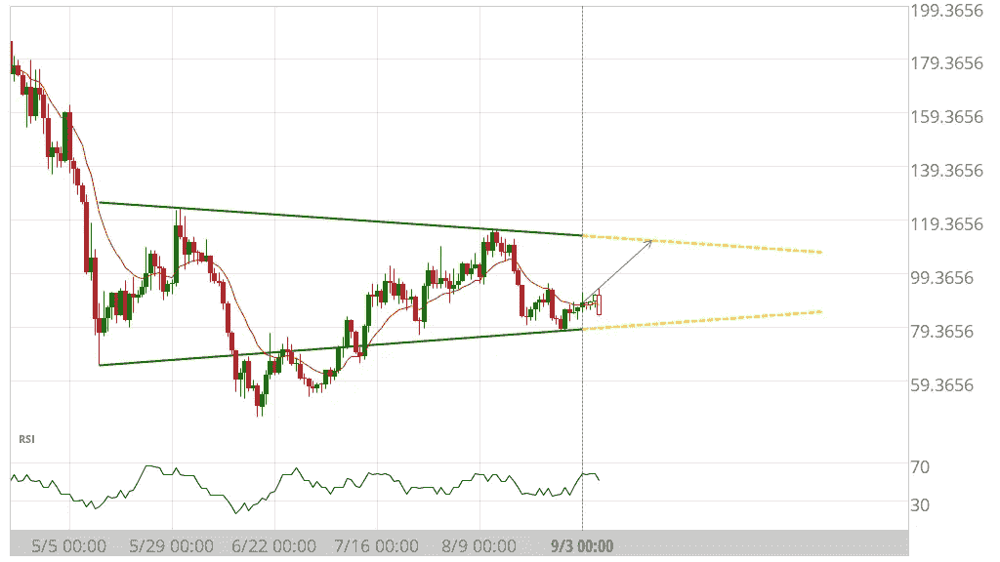
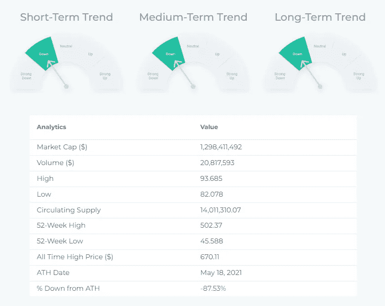
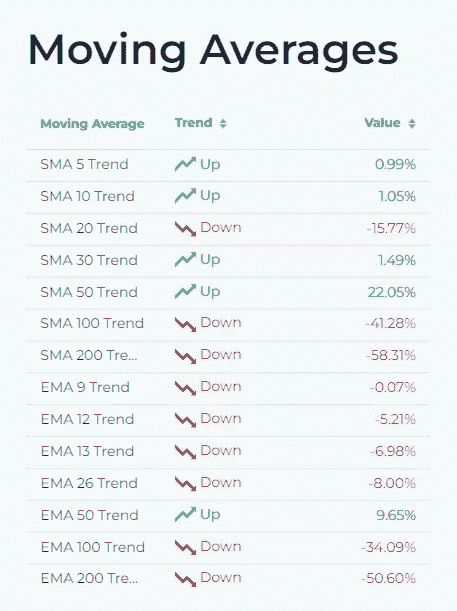
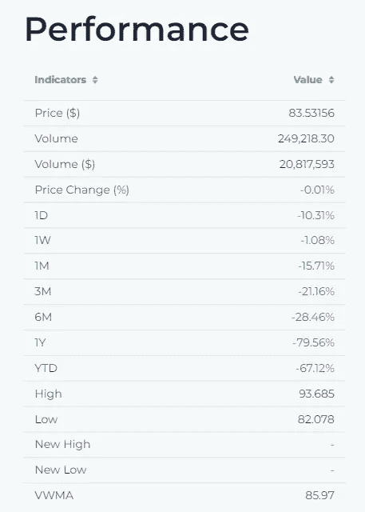
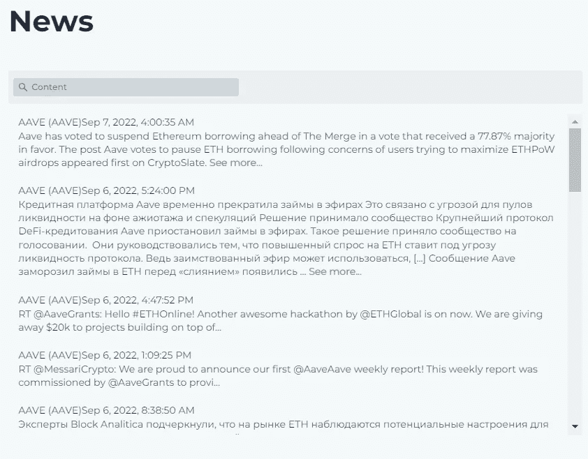

# AAVE-价格分析，图表模式，技术指标，新，描述…

> 原文：<https://medium.com/coinmonks/aave-price-analysis-chart-patterns-technical-indicators-new-description-d9662d352c7d?source=collection_archive---------41----------------------->

# AAVE 的技术分析:

Source: [altFINS](https://platform.altfins.com/curatedCharts)

**交易设置:**趋势反转正在进行，价格形成更高的高点和更高的低点。价格突破 12.50 美元阻力，并可能再次访问 17 美元(200 天移动 avrg)阻力。(设定价格[警报](https://altfins.com/knowledge-base/create-alert-for-cryptocurrencies/))。势头转为看涨(MACD 信号交叉，RSI 交叉于 50 中线上方)。

**趋势:**中短期上行，长期中性。

**动能**看涨( [MACD](https://altfins.com/knowledge-base/macd-line-and-macd-signal-line/) 线在 MACD 信号线上方，RSI 在 55 上方)。

**OBV(平衡成交量):**持平，表示上涨日成交量等于下跌日成交量。因此，买方的需求和卖方的供应处于平衡状态

**支撑和阻力:**最近的支撑区是 10.00 美元(之前的阻力)，然后是 6.00 美元。最近的阻力区是 12.50 美元，它打破了，然后 20.00 美元。

# 图表模式:AAVE / USDT:

**盈利潜力** ( **买入** ) + **38.62%**

Source: [altFINS](https://platform.altfins.com/tpatterns)

世界协调时 9 月 3 日 0:00 时确定的反向头部和肩部。这个格局还在形成过程中。未来 33 天内，价格可能向阻力位 115.7813 移动。

# 技术指标:

Source: [altFINS](https://platform.altfins.com/screener)

Source: [altFINS](https://platform.altfins.com/screener)

Source: altFINS

Source: altFINS

# 什么是 AAVE？

Aave 是一个开源的非托管协议，用于以可变或稳定的利率借入资产，并从存款中获得利息。此外，它使超短期、无抵押的快速贷款成为可能，这些贷款与其它商品和服务交织在一起。

访问[altFINS.com](https://platform.altfins.com/)获取更多分析、新闻和基础研究。

> 交易新手？尝试[加密交易机器人](/coinmonks/crypto-trading-bot-c2ffce8acb2a)或[复制交易](/coinmonks/top-10-crypto-copy-trading-platforms-for-beginners-d0c37c7d698c)