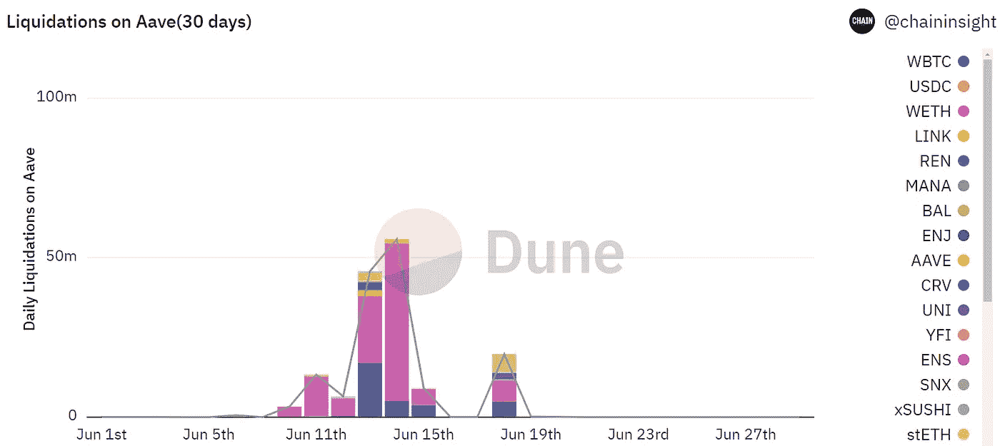
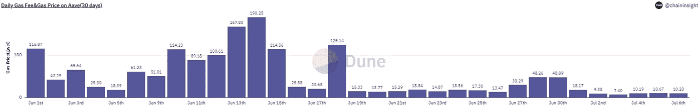

# Aave 协议清算回顾:2022 年 6 月

> 原文：<https://medium.com/coinmonks/aave-protocol-liquidation-retrospective-june-2022-9c19dd792338?source=collection_archive---------6----------------------->

## 1.55 亿美元被清算，有人单月套利超过 260 万美元

牛市有多疯狂，熊市就有多惨烈。过去 6 月，加密货币经历了令人难以置信的波动，价格暴跌，协议崩溃，对冲基金陷入清算危机。

6 月 18 日，比特币(BTC)跌破 20000 美元支撑，最低达到 17500 美元。市值第二大的以太坊(ETH)跌破 1000 美元，最低跌至 880 美元。当市场下跌时，DeFi lending 首先面临清算。同一天，加密资产市场的清算总额也超过了 5.6 亿美元。基于此，为了研究清算市场的具体情况，我们进一步分析了领先借贷协议 AAVE 6 月份的清算数据。

> 交易新手？试试[加密交易机器人](/coinmonks/crypto-trading-bot-c2ffce8acb2a)或者[复制交易](/coinmonks/top-10-crypto-copy-trading-platforms-for-beginners-d0c37c7d698c)

**关键点:**

1.近 5000 人被清算，总计损失 1 . 55 亿美元

2.6 月 14 日，清算量超过 5582 万，其中 wet 占清算抵押品的 88%

3.巨鲸单笔变现金额高达 561 万

4.清算人通过支付高额汽油获得交易优势

5.一名清算人花费 14.746 万美元(天然气费)，套利 381 万美元

**清算 1.55 亿美元，环比增长 29.89%**

**我们在 Dune 上汇总了 AAVE 6 月份的清算数据，发现 AAVE 项目当月清算金额共计 1.55 亿美元，环比增长 29.89%(图 1)。请注意，清算担保资产的价值基于最接近清算价格的价格。如果以平仓开盘价作为参考，可能会因价格剧烈变动而出现差异。**

****

**1\. Total value and growth of liquidated collateral assets in June**

****在已清算的抵押品中，我们占了一半以上****

**进一步分组汇总 6 月份 AAVE 项目各代币的清算额度，得到各质押代币的每日清算数据(例 2)。**

****

**2\. The amount of liquidation of each token in June**

**图 2 显示大额清算主要集中在 6 月 10 日至 6 月 18 日。其中 6 月 14 日的变现金额最大，达到 55.82m，6 月 13 日的变现额度排名第二，达到 45.83m，而且和预期一样，变现的抵押代币主要集中在 WETH、WBTC 等非稳定币。不稳定币的价格波动很大。用不稳定的硬币做抵押，很容易引发平仓。**

****巨鲸单笔清算金额高达 561 万美元****

****

**3\. Information on the top 10 large-value liquidations in June**

**根据对 6 月份十大大额清算的分析(见图 3)，十大大额清算的每一笔都超过 190 万美元。其中，清算金额最大的交易发生在 6 月 18 日，被清算的抵押资产价格达到 561 万美元，而 6 月 18 日的总清算金额仅为 1976 万美元。其余 9 起中，6 起发生在 6 月 14 日，2 起发生在 6 月 13 日，1 起发生在 6 月 11 日。**

****

**4\. The number of daily liquidation transactions in June**

**结合 6 月日平仓数量(图 4)，6 月 13 日成交数量为本月最高，有 1755 笔资产被平仓。虽然 6 月 14 日的平仓额度在本月排名第一，但平仓数量仅为 593 只，这也解释了前 10 大平仓中有 6 只发生在 6 月 14 日。**

****清算人通过支付高油价获得交易优势****

**一般来说，交易量大可能会造成网络拥堵，网络拥堵会提高气价。面对如此高的交易量，交易过程中的气价会是怎样的？**

**查看 AAVE 项目清算的气价(取当日均价)(图 5)，与猜测一致，6 月 14 日的气价均价为本月最高(因为取当日均价，该值无实际价值意义，只看走势)，6 月 13 日和 18 日的气价也处于较高水平。**

****

**5\. Average gas price for liquidation (in gwei)**

**较高的气价可能对应较高的交易费用，高交易费用可能导致交易失败。查看 6 月份清算的交易成功率(图 6)可以发现，6 月 13 日的成功率仅为 89%，6 月 14 日的成功率为 92%，6 月 18 日的成功率为 94%。数据与假设一致。**

****

**6\. The success rate of AAVE project liquidation in June**

**为了研究清算成功率与清算人和借款人的关系，给出了单日清算人数、借款人数和清算成功率的数据(图 7)。不难发现，被清算的借款人数量与清算成功率之间存在一定的相关性。借款人多的日子清盘成功率相对较低，借款人少的日子清盘成功率相对较高。**

****

**7\. The number of liquidators, the number of borrowers and the success rate of liquidation**

**图 8 显示了与 6 月份清算事件相对应的交易费用(以美元表示)。单笔交易手续费集中在 400 美元以下，10–20 美元之间的交易笔数最多，为 908 笔；包括巨额交易费用(单笔费用大于 1500 美元)在内的交易并不多，共 7 笔交易。但这七个数据也反映出，尽管交易费用巨大，但清算人仍然愿意通过清算获利。**

****

**8\. Transaction fees corresponding to the June liquidation event**

****清算人花费 14.746 万美元(天然气费)，套利 381 万美元****

**这么高的交易费用，清算人还能从清算中获利吗？图 9 显示了 6 月份以来前 10 名清算人的套利信息，列出了清算人的地址、交易笔数、总清算额度、总清算奖励、总交易费用和总利润。**

**可以发现清算人的总清算额度超过百万美元，获利金额也很大。值得注意的是，有两个清算人交易更少，但利润也更高。原因是他们单笔平仓的金额大。由于 AAVE 项目的清算报酬与被清算的抵押资产直接相关，即使清算会产生高额交易成本，清算人仍能从中获得大量资金。利润。**

****

**9\. The number of transactions and arbitrage information of the top liquidators**

**当借款人忧心忡忡时，清算人正在行动。清算人如何在市场波动中寻找机会，识别风险，获取利润，我们将在后续报道中继续讨论相关问题。**

**阿尔法专业版**

*   **本报告仅供参考。它并不意味着作为投资建议。**
*   **[T3【https://dune.com/chaininsight/liquidations-on-aave】T5](https://dune.com/chaininsight/liquidations-on-aave)**
*   ****https://twitter.com/AlphaPro_io**❤**