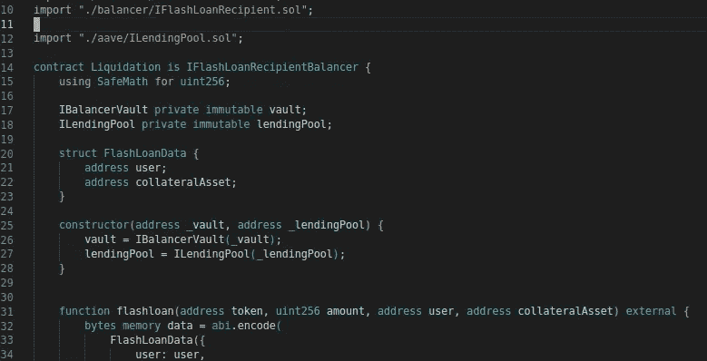

# V2 清算实例

> 原文：<https://medium.com/coinmonks/aave-v2-liquidation-example-162de8436ff5?source=collection_archive---------2----------------------->

## 使用 foundry 的 V2 以太坊主网清算策略示例代码

Liquidation Contract

教程回购这里是。

## 铸造

Foundry 是像 Hardhat、Truffle 等一样的智能合约开发工具。[它以快速的编译/测试时间而闻名](https://github.com/foundry-rs/foundry#how-fast)，可能是因为它是用 Rust 编写的，而 Hardhat 是用 Typescript 编写的…