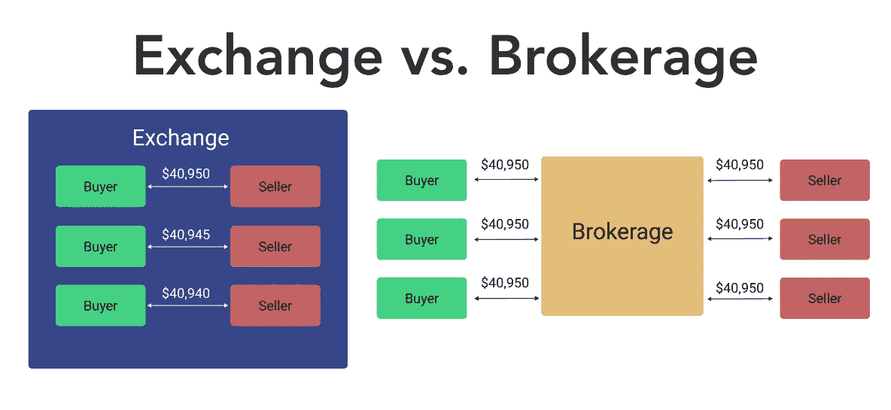

# 投资基础知识:经纪人和交易所的区别是什么？

> 原文：<https://medium.com/coinmonks/abc-of-investments-what-is-the-difference-between-a-broker-and-an-exchange-f78b4f60f3eb?source=collection_archive---------27----------------------->

你现在应该

大家好，投资任何种类资产的人，例如股票、密码、似是而非的金属、外汇，只要是你能想到的，你都必须在交易所或经纪人那里交易。但是是什么让它们有了本质的不同呢？比特币基地是交易所还是经纪人？Robinhood 是经纪人还是交易所？我想我能解释清楚。

Robinhood 是一名股票经纪人，被 SEC[指控“为订单流付款”](https://www.nytimes.com/2021/08/30/business/sec-payment-for-order-flow-robinhood.html)。当你买卖一只股票时，Robinhood(经纪人)不直接执行指令。此外，它将订单转发给交易所执行。作为回报，它从交易所获得一些激励。

相反，比特币基地是一家知名的加密货币交易所，可以直接在他们的平台上轻松购买、出售和兑换加密货币。

## 哪个更好？

交易所的交易者更有滑点的风险，因为他们没有经纪公司提供的价格保证。

然而，交易一发生，交易所就会给你一项资产的所有权，而经纪公司可能需要更长的时间来结算一切。经纪公司也可能收取比交易所更高的差价或费用，这意味着最终价格可能不太有利。

就我个人而言，我总是更喜欢交易所而不是经纪人，以避免经纪人方面的任何操纵。为了避免交易中的任何失误，人们可以使用限价单。

如果你想错过这么棒的产品，想得到通知，请考虑关注我。谢谢:)

 [## 原始勇敢者-媒介

### 在媒体上阅读来自原始人的文字。每天，原始勇敢者和成千上万的其他声音读…

medium.com](/@primitivebrave) 

> 交易新手？试试[密码交易机器人](/coinmonks/crypto-trading-bot-c2ffce8acb2a)或者[复制交易](/coinmonks/top-10-crypto-copy-trading-platforms-for-beginners-d0c37c7d698c)