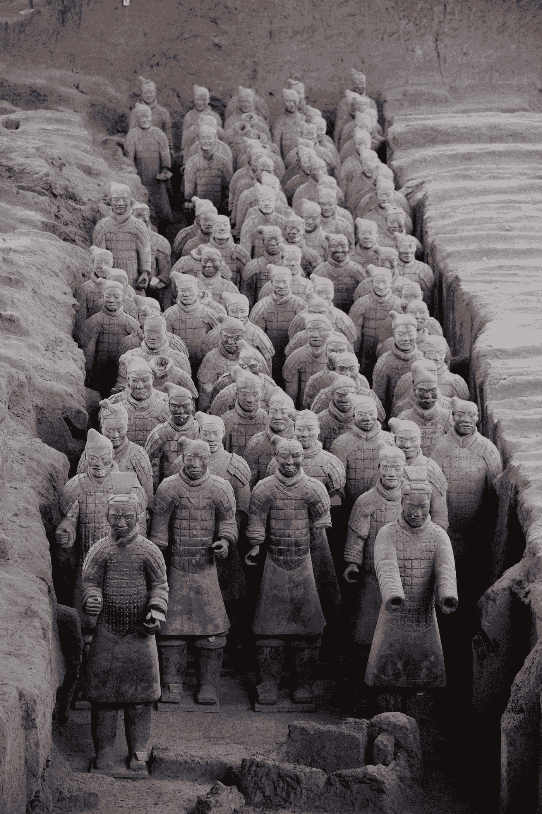

# About Geo-Politics & Future Issues Going Into 2023

> 原文：<https://medium.com/coinmonks/about-geo-politics-future-issues-going-into-2023-8fe85d4e76d7?source=collection_archive---------16----------------------->

Photo by [Aaron Greenwood](https://unsplash.com/@onevibe?utm_source=medium&utm_medium=referral) on [Unsplash](https://unsplash.com?utm_source=medium&utm_medium=referral)

# 1\. Russia & Ukraine

Right away, [**Max Rottersman**](https://medium.com/u/6609da471cf8?source=post_page-----ded40726842a--------------------------------) initiates a concept of war: All wars go from bad to worse. His recount of the conflict’s trajectory sums up how the [**U.S. and European Union**](/areas-producers/the-effects-from-geopolitics-and-sanctions-on-industrial-policies-during-the-russia-ukraine-dcaaf480d9b0) are playing a critical role in efforts to resolve the conflict — in favor of Ukraine ? — in that Russia is struggling to mobilize.

 [## Must Ukraine Bring the War To Moscow Or Freeze To Death?

### Ukrainians are done giving Russians the benefit of the doubt . If the U.S. won’t step in and end the war, Ukraine will…

maxrottersman.medium.com](https://maxrottersman.medium.com/this-winter-will-ukrainian-hardliners-bring-the-war-to-moscow-60d2d7d0fe7d) 

This writer [**Anton Krutikov**](https://medium.com/u/d38584b41539?source=post_page-----ded40726842a--------------------------------)has been putting in work on all aspects/dimensions of Russian society, culture, economy and politics ever since the conflict with Ukraine intensified this year. He basically reviews everything one should know about the historical, political and socio-economic subjects pertaining to Mother Russia. This week, he put out two articles back-to-back about two issues — Google in Russia and Russian emigration to Georgia — that concern Russia’s post-conflict future in the international system.

 [## Will YouTube, Google, and Wikipedia be banned in Russia?

### Our home in London is very close to Google Headquarters in the UK. It is a modern office center next to King’s Cross…

medium.com](/@antonkrutikov/will-youtube-google-and-wikipedia-be-banned-in-russia-bb058244a63f)  [## How Will Mass Exodus Affect Russia’s Political Future?

### The partial mobilization announced by Vladimir Putin on September 21 has led to serious demographic and social changes…

medium.com](/@antonkrutikov/how-will-mass-exodus-affect-russias-political-future-97fc790ad669) 

# 2\. China & United States

Covering all the critical events in International Affairs, [**Sylvain Saurel**](https://medium.com/u/a4963fa09f17?source=post_page-----ded40726842a--------------------------------) looks at German Chancellor Olaf Scholz’s visit to Beijing on November 4, 2022\. This writing paints a picture of how support from countries toward Chinese Chairman Xi Jin Ping is likely to be growing in favor of China’s prominence on the world stage.

 [## Xi Jinping Is Delighted With Olaf Scholz’ Gift of Breaking the American Encirclement.

### The weakening of Europe comes as a cherry on the cake.

ssaurel.medium.com](https://ssaurel.medium.com/xi-jinping-is-delighted-with-olaf-scholz-gift-of-breaking-the-american-encirclement-a8ebbbafa8f4) 

在这里， [**格兰特·派珀**](https://medium.com/u/df29d70fb6bd?source=post_page-----ded40726842a--------------------------------) 写的是 2022 年美国军事力量进驻帕劳。他的标题是:“过去与未来在帕劳群岛相遇”。他声称，由于中国在印度太平洋地区的崛起，美国在这个太平洋岛国上的军事集结规模(自二战以来最大的)越来越大。如果你不熟悉 [**印太**](/areas-producers/a-new-era-of-adversarial-geopolitics-is-beginning-on-the-indo-pacific-arctic-oceans-3dea08db1e47) 战略。读 [**这个**](/areas-producers/a-new-era-of-adversarial-geopolitics-is-beginning-on-the-indo-pacific-arctic-oceans-3dea08db1e47) 。

 [## 为什么 2022 年美国会在帕劳驻军？

### 过去与未来在帕劳群岛相遇

grantpiperwriting.medium.com](https://grantpiperwriting.medium.com/why-does-the-us-have-forces-in-palau-in-2022-28d50de2a0ce) 

# 3.能源危机和粮食安全

据大卫·雷维尔 报道，在 [**北溪 1 号& 2 号管道**](/areas-producers/a-new-era-of-adversarial-geopolitics-is-beginning-on-the-indo-pacific-arctic-oceans-3dea08db1e47) 被恐怖分子破坏后不到两周，全球能源前景发生了翻天覆地的变化。他认为，美国的液化天然气运输不足以解决全球能源组合中的总体困境。他列举了德国的能源依赖以及美国的自然灾害(如 2021 年的艾达飓风)的例子，以表明从国际政治的角度来看，石油输出国组织减产 200 万桶的决定是合理的。我同意。我已经写了关于 [**石油、煤炭和天然气的政治化**](/areas-producers/politicization-of-oil-coal-and-natural-gas-are-playing-a-greater-role-in-industrial-policies-and-5422102c0776) **。**

 [## 能源受到攻击:难以置信的两周

### 这几乎令人难以置信，但在不到两周的时间里，我们的能源前景发生了巨大变化，而且不是因为…

david-reavill.medium.com](https://david-reavill.medium.com/energy-under-attack-two-incredible-weeks-3d2e80230cf9) 

在出版物 [**地区&生产者**](https://medium.com/areas-producers) 中，我写了一篇关于 [**肥料外交 2.0**](/areas-producers/fertilizer-diplomacy-2-0-862b6a6a6321) 在出口谷物协议(也被称为黑海谷物协议)之后，以及它对全球肥料行业和全球粮食安全前景意味着什么的长篇文章。自从 2020 年的全球新冠肺炎疫情、2021 年的艾达飓风以及现在 2022 年的俄乌战争以来，人们对食品和化肥的担忧一直很多，这些战争将化肥库存和供应置于地缘政治和大宗商品的前沿。我已经在出版物 [**区域&生产者**](https://medium.com/areas-producers) 中广泛地写了这些问题。

 [## 肥料外交 2.0

### 联合国新提议的交易是否给了谷物出口走廊(黑海…

medium.com](/areas-producers/fertilizer-diplomacy-2-0-862b6a6a6321) 

# 4.技术和信息战

最后，我想介绍一位我在媒体之外发现的新作家。他的名字叫 [**盖格丽·胡斯**](https://gergelyhusz.substack.com/about) 。我相信这位国际关系专家除了简单的理论和对国际体系的分析之外，还能提供更多的东西。他对技术和信息战的观点揭示了世界变化的速度有多快，并且偏离了过去，这对解释未来至关重要。我只关心未来。所以这就是为什么我推荐跟随这位作家上 [**子栈**](https://gergelyhusz.substack.com/about) 。

 [## 格尔吉利·胡斯

### 欢迎光临！这是我的时事通讯。我叫 Gergely Husz，我是国际关系专家。我写的是…

gergelyhusz.substack.com](https://gergelyhusz.substack.com/about) 

> 交易新手？尝试[加密交易机器人](/coinmonks/crypto-trading-bot-c2ffce8acb2a)或[复制交易](/coinmonks/top-10-crypto-copy-trading-platforms-for-beginners-d0c37c7d698c)