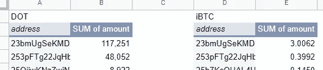

# 阿卡拉:又一份聪明的合同尝到了失败的滋味

> 原文：<https://medium.com/coinmonks/acala-tastes-defeat-e4b8ad97cbb7?source=collection_archive---------19----------------------->

另一个 DeFi 协议漏洞引发了对“代码即法律”的质疑

Credit: LillyCantabile, Pixabay

**如果你是今年被利用的 DeFi 协议，请举手。**自 1 月份以来，超过 18 亿美元从智能合约中流失，其中 1 . 9 亿美元是本月早些时候在 Nomad bridge 抢劫案中流失的。

此后不到两周，又有一笔数百万美元的交易——这次是在波尔卡多特前线。

**故事简介:**

*   第二批[追踪结果](https://gist.github.com/xlc/c952aa6e2f5d6447ace9a796be367b61)证实， [Acala](https://acala.network/) 上的流动性池参与者由于实施了错误的智能合约代码，能够铸造超过 30.22 亿美元的无抵押澳元 stablecoin。
*   这破坏了它们稳定的欧元兑美元汇率(在库币汇率跌至 1 美元兑 0.081 欧元)，并对生态系统造成了严重破坏，其中一个流动性池几乎完全枯竭。
*   这些无担保资产在一定程度上蔓延到了区块链的其他地方，人们不禁要问，该团队有哪些治理或法律先例可以通过武力收回这些资产。

此时，阿卡拉网络仍大多处于离线状态。

## **Acala 是什么？**

Acala 是 Polkadot 的主要 DeFi 中心，同时充当自动做市商(AMM)和分散式银行。在前端，它允许用户从事金融活动(借贷等)。)以 crypto 的商标无许可方式。

由于项目在集成之前必须获得一个 parachain 插槽，所以整个 Polkadot 系统的采用率很低，在撰写本文时，Acala 的 TVL 为[$ 5300 万](https://defillama.com/chain/Acala)。直到本月早些时候，该平台只支持 5 个用于 DeFi 操作的令牌——相比之下，PancakeSwap 支持超过 81 个令牌。

## 层间集成利用

Interlay 是 Acala 最受期待的集成之一，自 2020 年以来一直在 Polkadot 上构建其旗舰 interBTC。它为 Polkadot 提供了一个[包装的比特币](https://polkadot.network/blog/bitcoin-is-coming-to-polkadot/)解决方案，允许持有者参与 DeFi 并获得收益，而无需出售他们的 BTC。

正是 Acala 对这一激励措施的错误部署导致了本周末的事件。iBTC-aUSD 对于世界协调时周六 22:41 在平台上上线，但智能合约中的一个错误导致流动性池迅速铸造无担保 aUSD，而不是 [LP 令牌](https://www.gemini.com/cryptopedia/liquidity-provider-amm-tokens)。

根据 Acala 的[事后分析](https://acala.discourse.group/t/08-14-2022-incident-on-chain-trace-results/1134#trace-result-3-08-18-2022-dot-outflow-9)，16 个钱包索赔了协议错误产生的总计 30.22 亿澳元，还有 4299119 澳元。

## 损害控制

世界协调时周日 01:17，Acala 网络在“紧急治理投票”后进入维护模式。这限制了平台上的大多数功能，更重要的是，完全禁止交换或桥接资产。

这使得无担保 aUSD 的接受者(以及其他所有人)无法将资金转移到链外，或者从那时起在系统内造成更多损害；根据 Acala 的报告，由于这个原因，30.22 亿个错误中约有 99%包含在协议中。

## 被抢劫的 1%

然而，一些用户能够在网络关闭前使其离线。16 个无担保澳元索赔人中有 8 个能够将资金直接汇入 Moonbeam，或通过 Acala 的掉期功能将其兑换成$DOT 和$IBTC，然后再汇给各自的连锁店。

Credit: On-chain analysis by [@ Alice und Bob](https://mobile.twitter.com/alice_und_bob/status/1558959891221463041)

根据第三份[追踪报告](https://acala.discourse.group/t/08-14-2022-incident-on-chain-trace-results/1134#trace-result-3-08-18-2022-dot-outflow-9)，176，725 美元 DOT(150 万美元)逃到了 Polkadot 中继链上，其中 41，999 美元(355，000 美元)随后被送往一家交易所——可能是为了赎回。这相当于 185 万美元的损失。

到目前为止，Acala 团队只完成了对美元点外流的追踪，但估计总损失在 200 万到 1000 万美元之间。目前有一个 [5%](https://mobile.twitter.com/AcalaNetwork/status/1560139905832984576) 的奖励给归还被盗资金的八个钱包主人中的任何一个。

## 阿卡拉可以起诉吗？

现在提出的问题是，如果这些钱包的主人只是……不归还资产，会发生什么。在 DeFi 漏洞利用中,“代码即法律”经常被引用作为一种辩护，但目前没有现有的法律先例。概括一下:

*   由于 Acala 引导错误代码，存入 iBTC-aUSD 流动性池的用户在 aUSD 产生了超额 LP 奖励
*   在声称获得这些奖励的 16 家公司中，有 8 家成功脱链，给平台及其用户造成了约 160 万至 1000 万美元的损失。

出于起诉的目的，Acala *可以*通过 IP 地址和/或区块链追踪这些用户。他们还可以通过 KYC 支持的交易所获得准确的身份。

但是，由于没有一个用户设法提取了令人难以置信的大量资金，采取法律行动既不会简单也不会迅速。此外，对于生活在英语圈之外的钱包持有者来说，一场法律诉讼几乎肯定会不了了之。

## 结论

在舆论法庭上，这种利用完全是阿卡拉的错。更令人不安的是，他们在草间弥生岛运营着一个[金丝雀网络](https://acala.network/karura)，因此黑客攻击和利用不会发生在主副链上。

虽然$iBTC 池几乎完全耗尽，但该平台很可能仍有偿付能力，而且只要资金仍留在生态系统中，即 Polkadot、Moonbeam 或 inter 上，就有可能为其回报提出治理行动。

此时，Acala Network 的运营已经暂停了四天，而且还会持续更长时间，但社区支持似乎很强。

> 交易新手？试试[密码交易机器人](/coinmonks/crypto-trading-bot-c2ffce8acb2a)或[复制交易](/coinmonks/top-10-crypto-copy-trading-platforms-for-beginners-d0c37c7d698c)