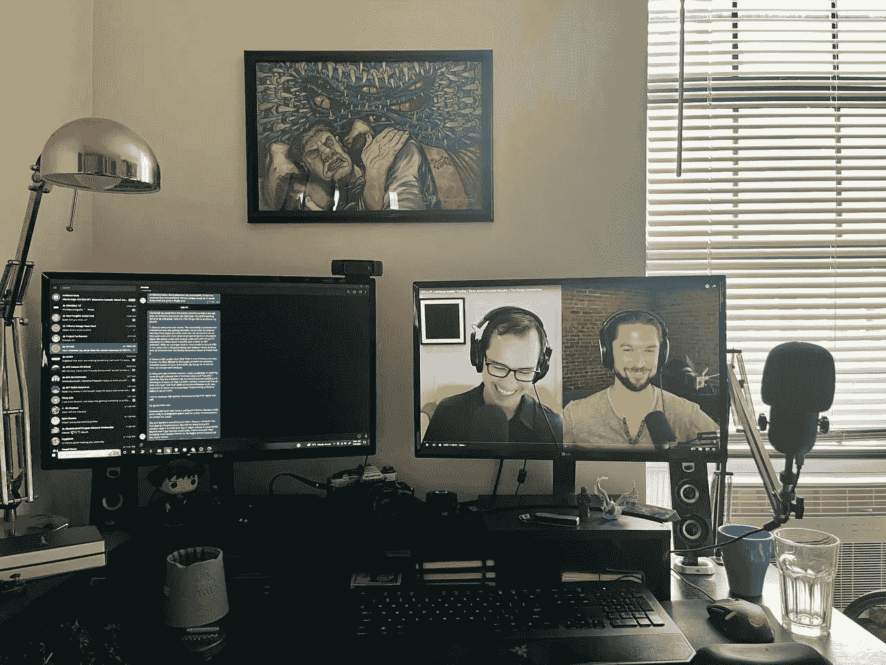

# 加速您的 Web 3 学习曲线

> 原文：<https://medium.com/coinmonks/accelerating-your-web-3-learning-curve-6883a5fb5352?source=collection_archive---------5----------------------->

在去年年底将我的职业生涯从创造者经济转向 Web 3 后，我发现学习曲线非常陡峭，所以一开始很挣扎。以下是我为加速成长而做的几件事。

1.与朋友开始阿尔法聊天。这最初是一个朋友的提议，他当时也在研究 Web 3。他的前提是三个脑袋比一个好。我们每周会面一小时，分享我们在密码领域学到的东西。我们每个人都选择了一个主题，制作了一个幻灯片，目的是让其他人了解一个特定的连锁店、项目或 NFT 系列。我们的 Alpha 聊天仍然在 telegram 上进行，在 telegram 上，我们有 30 多个成员对 Web 3 的所有内容进行了高质量的讨论。

2.策划高质量的新闻源。Web 3 空间中有很多噪音。对新闻和事件进行公正的分析通常很难找到高质量的内容。我的两个新闻来源是 Decrypt 和 CoinDesk。

 [## 比特币、以太坊和 Web 3.0 指南-解密

### 从 Decrypt 阅读最新的比特币和以太坊新闻。获取加密货币价格、最新新闻和…

decrypt.co](https://decrypt.co/)  [## CoinDesk:比特币、以太坊、加密新闻和价格数据

### 加密货币、比特币、以太坊、XRP、区块链、DeFi、数字金融和 Web 3.0 新闻及分析领域的领导者…

www.coindesk.com](https://www.coindesk.com/) 

3.跟随正确的内容创作者。通过稳定的 YouTube 视频和播客，我大大加快了我的学习曲线。我花了前几个月的时间观看和收听了 3 个多小时的 Web 3 内容。

我最喜欢的节目是:

 [## 无银行

### 欢迎来到无银行 YouTube 频道，在这里我们探索加密货币和加密金融的前沿。这是如何…

www.youtube.com](https://www.youtube.com/c/Bankless/videos) 

莱恩·西恩·亚当斯和大卫·霍夫曼。班克斯招待了一些非常有见识的客人，谈话总是有启发和教育意义。

 [## 硬币局

### 硬币局是你通往加密货币星系的信息门户。伙计，那个搞加密的家伙是…

www.youtube.com](https://www.youtube.com/c/CoinBureau) 

硬币局是 YouTube 上最好的 Web 3 节目之一。主持人化名盖伊，他用简单易懂的方式表达复杂观点的能力是无与伦比的。除了 Web 3，Guy 还报道了更广泛的宏观经济新闻，提供了超越加密市场的更大图景所急需的背景。

对于 NFT 新闻，我喜欢将教育和娱乐内容很好地结合在一起。

 [## 证明

### 与朋友、家人和全世界分享您的视频

www.youtube.com](https://www.youtube.com/channel/UCOaX0Vu-dWB7bNjFMnbBo2A/featured) 

《凯文·罗斯的证明》是 NFT 空间中最好的节目之一，涵盖了从德根项目到蓝筹股和 Web 3 中的美术剧的广泛内容。该节目非常专业，有来自 NFT 不同背景的嘉宾。

 [## 俏皮的阿尔法

### 在时髦的阿尔法，Nifty 尼克、皮奥·文森佐和老练的艺术投机者讨论 NFT 市场的一切。这是…

www.youtube.com](https://www.youtube.com/channel/UCKZh-NaE79AbeBmZhOezRsQ) 

俏皮阿尔法是我每天的剂量 NFT 德根乐趣。我随着他们的早间节目醒来，总是期待着主持人皮奥、NFT·尼克和基克斯船长之间的戏谑。介绍音乐很到位，NFT 天气预报信息丰富，即使在残酷的熊市中，这些家伙也总能让我开怀大笑。

4.开始写吧。我不能强调写作在加速你的学习曲线中有多么强大。我从 5 月份开始坚持写作，以此来磨练我对 Web 3 的想法，并更加清晰地表达我对这个领域的想法。写作迫使我真正投入到我正在学习的东西中，并深深地嵌入概念和想法，作为我 Web 3 知识的基础。

一如既往的感谢您的阅读。

看看我在推特上未经过滤的想法:

[https://twitter.com/wasifmrahman](https://twitter.com/wasifmrahman)

在 LinkedIn 上关注我的职业生涯:

https://www.linkedin.com/in/wasifmrahman/

我对媒体的另一个想法是:

 [## 瓦西夫·拉赫曼-中号

### 阅读瓦西夫·拉赫曼在媒介上的作品。Web 3 德根 Ex Populus 营销伙伴关系总监。每天…

medium.com](/@wasifmrahman) 

> 交易新手？试试[密码交易机器人](/coinmonks/crypto-trading-bot-c2ffce8acb2a)或[复制交易](/coinmonks/top-10-crypto-copy-trading-platforms-for-beginners-d0c37c7d698c)