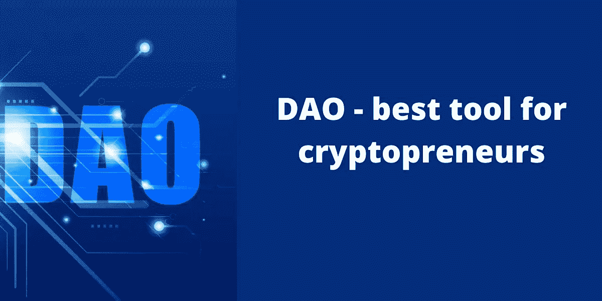
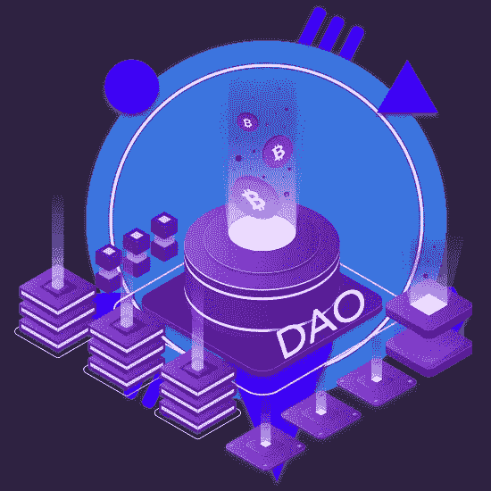

# 用壮观的刀容纳 DeFi 项目

> 原文：<https://medium.com/coinmonks/accommodate-the-defi-projects-with-a-spectacular-dao-ead2538b0b34?source=collection_archive---------36----------------------->

Source:Appdupe

DeFi 项目是增强加密空间的惊人应用。此外，你可以直接深入到隐创业者前进道路上的障碍中。这是由于不变的和未修改的智能合约不适合所有平台。为了根除这些斗争，在一个智能契约中出现了一个创新功能的飞跃——道。最近，你可能会在区块链发展项目中听到这个缩写。

作为一名企业家，你不能忘记执行创新和创造市场。是的，从本文中，您将了解如何通过将 DAO 引入您的平台来扩展您的业务。DAO 项目力争在加密领域和排名中占据最高位置。DAO 策略将有助于处理更高级别的加密项目。您可以通过顶级的 [**道发展公司**](https://www.appdupe.com/dao-development-services?utm_source=medium&utm_medium=article&utm_campaign=monika) 在一个智能合同中提供所有解决方案来提升您的业务。

利用这个博客来激发你完成有利可图的基于 DAO 的项目和 DeFi 平台的欲望。花点时间在这里轻松找到您的解决方案。

Sourc:Appdupe

## 🏷️ **刀——密码创业者的最佳工具**

DAO 是分散自治组织的首字母缩写，它采用了一种新的和创新的方式来构建 DeFi 项目。现在，密码创业者和数字创业者可以更加昏睡，因为现在 DAO 执行所有的操作。现在，只要在马拉松上设置道，就可以设置比赛和基准。

首先，DAO 是一个在线社区，为增强平台做出决策和策略。它是一份具有严格规则和条例的智能合同。这些规则只能由社区成员通过投票来修改。根据投票机制，这些建议是可以批准的。否则，它不能被考虑。

在线社区成员是购买代币并因此成为成员的 NFT 商人。因此，通过拥有代币，成员获得投票权、决策权和参与资金开发。此外，代币持有者可以在智能合同中讨论资金的使用。

> 交易新手？尝试[加密交易机器人](/coinmonks/crypto-trading-bot-c2ffce8acb2a)或[复制交易](/coinmonks/top-10-crypto-copy-trading-platforms-for-beginners-d0c37c7d698c)

所有用于平台开发的资金都被加密在 DAO 中。因此，它促进了平台的最佳可用性。刀在特定的区块链下是可操作的。它可以是任何突出的像以太坊，币安智能链，流，多边形，等等。

> 除此之外，值得注意的是，DAO 在交易和贸易方面是高度安全、透明和去中心化的。

适应区块链发展的这种蠕变是不是不明智？

## 🏷️ **难以置信，刀竟然比传统系统还要厉害！下面是为什么…**

是的，事实上 DAO 比传统的智能契约或系统拥有更多特权。虽然其他系统是在分散的情况下运行的，但是在 DAO 中有一个在线社区。下面的清单证明了 DAO 是一个更奇特的例子。

根据✔️By 的定义，DAO 由能够提出最佳决策的成员组成的在线社区组成。

✔️Now，接受一个人的决定不是独裁。因为在 DAO 中，网络社区可以自主决策。

✔️The 的组织模式是纯民主的，平台将是开源的。它也是透明的；也就是信息公开就能看到。

✔️The 道最适用于大型工业加密项目和平台

✔️DAO 是基于自动化的智能合同，完全按照技术规范工作。

 [## 为您的 DeFi 应用寻找最佳的 DeFi 营销解决方案

### 在营销和广告加密或区块链项目的工业水平，最好的结果是证实…

medium.com](/coinmonks/scrape-the-best-defi-marketing-solutions-for-your-defi-application-288ca7b4742b) 

## 🏷️ **道区块链发展**

很明显，DAO 是加密项目的福音，它让所有的特性和功能都步入正轨。然后让我们知道为 DeFi 平台开发 DAO 的步骤。

Source:Appdupe

## ⚜️Identify 提出了要求

首先，开发人员不会仔细检查你的需求和要求，他们会采取主动。为此，你需要确定你的目标受众，并认识到他们渴望什么。经过这种分析后，设计智能合约将变得简单。

## 智能合约的⚜️Development

最好的刀依赖于它工作所依据的规范和特征。因此，智能合约的功能完全依赖于开发人员纳入并付诸行动的规范。

## ⚜️Testing 刀

在部署之前，将对智能合同进行严格测试。智能合约是 DeFi 平台的基础部分。因此，在部署之后，不能修补任何修改，因为它需要得到在线社区的批准。因此，对 DAO 进行了如此严格的监控。

## ⚜️Front-end 功能和部署

技术熟练的专业人员将根据您的智能合同开发前端功能。修复错误并加入新特性，DAO 将在部署中。这才是上线前更关键的，也就是每次改动后的测试。这可以提高平台的效率和可用性。

## 🏷️ **结论**

所以，总结一下这里的思想，你就可以在这里看到道的神奇之处。你可以挑选出最好的理由来支持你使用道的明智决定。[抓住有利可图的道发展公司](https://www.appdupe.com/dao-development-services?utm_source=medium&utm_medium=article&utm_campaign=monika)，可以围绕和陪伴你带出最好的网上社区。