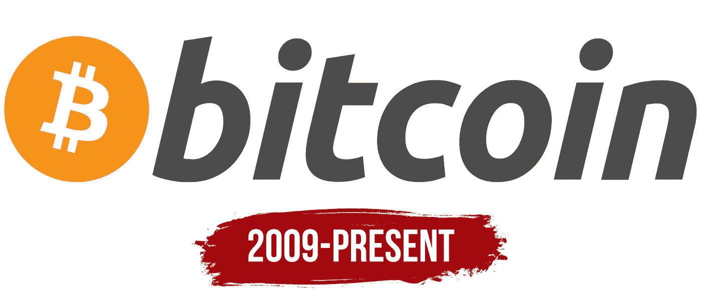
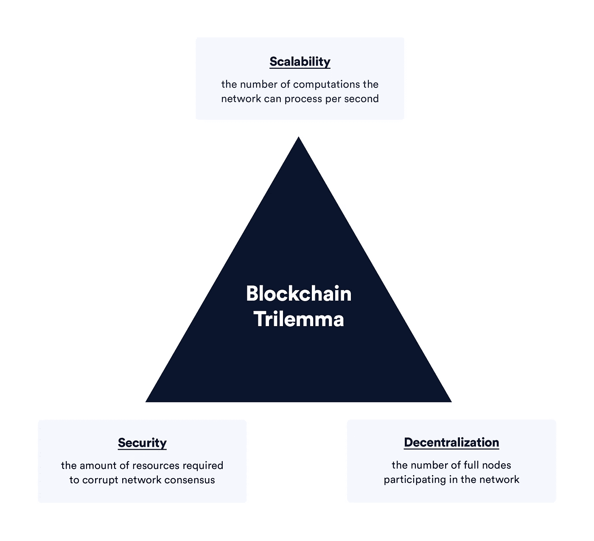
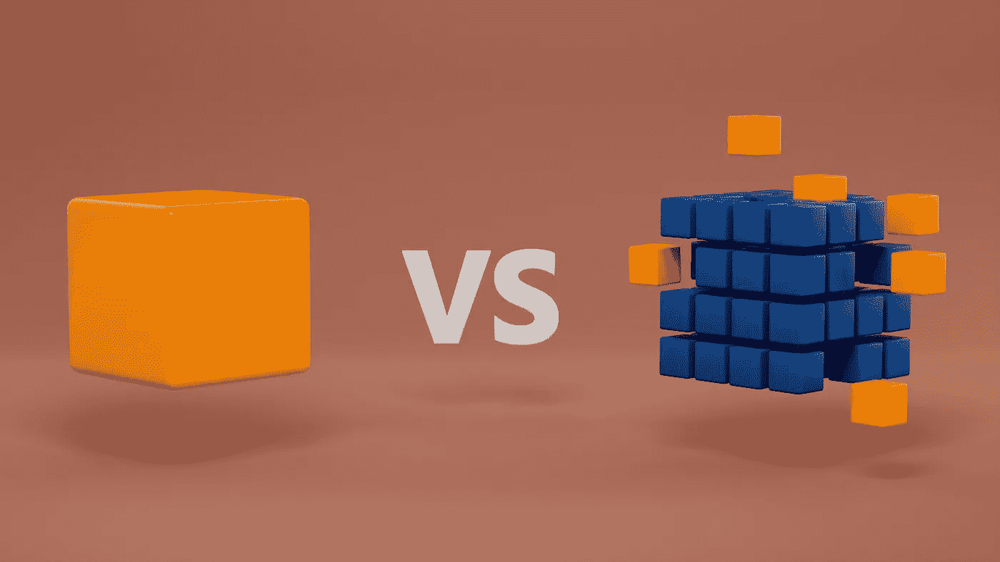

# 在区块链上容纳基于数据的网络

> 原文：<https://medium.com/coinmonks/accommodating-data-based-networks-on-the-blockchain-e5409cfba4a?source=collection_archive---------27----------------------->

世界对数字互动的看法正在发生深刻的变化。

从区块链到联合数据网络，再到让你转换算法的社交媒体，互联网正在转向一种更加模块化的数据方式。

随着硬签名和纸质合同逐渐消失在数字合同中，对能够正确管理这一新模式转变的系统的依赖比以往任何时候都更加迫切。

区块链尤其被誉为传统商业交易的杀手——正如过去 20 年所做的那样——可以说是用二进制取代了纸张。自主智能合同、数字签名和可验证的数字身份都是这种新互联网的突出特征，使开展业务变得更加容易，而且往往更加安全。

这种安全性，或者说*信任*，是确保这些数字互动有效的关键因素。

区块链的第一次真正使用[比特币](https://hackernoon.com/coins/BTC?range=month)的初衷是提供一个可验证的、没有任何权威的真相数字账本。它通过一种强烈的共识算法实现了这一点——或者简单地说，一种确定交易或交易是否合法的算法。

然而，随着时间的推移，人们不想只是验证比特币余额的真实性——他们渴望更多。他们渴望有一个不可否认、不可信的数字真相来源，用于金融以外的互动。

有一个问题——将这种信任扩展到货币余额之外，更重要的是，扩展到一个潜在数十亿用户的世界，被证明在计算上是昂贵的。没错，我们赢得了信任，但事实证明，运行这样一个系统的成本太高，不切实际。

至少，目前看来，区块链的可伸缩性成为了主要问题。

从根本上说，区块链作为真理发生器的概念对于许多应用来说是完美的。问题是，需要什么样的权衡来实现效用、成本和实用性的平衡？区块链是数据聚合的终极解决方案吗？

# 区块链可扩展性问题——权衡的三角

区块链有三个主要组成部分，使其成为一个真实的国家管理机器。我想对 [Chainlink 的工作人员表示由衷的感谢，感谢他们将这些关键方面整合在一起——他们总结得非常好:](https://blog.chain.link/blockchain-scalability-approaches/)

众所周知，区块链是由节点网络组成的。大多数节点，或者更确切地说是“完整节点”，负责以下工作。

*   分布式计算(最常被称为“去中心化”)—处理修改链状态所需的资源或步骤。
*   存储—存储链状态的(通常)完整副本*
*   共识——节点如何就网络的正确或真实状态得出结论。共识算法至关重要，因为它们决定了要传播哪个版本的分类账。

在分布式场景中，每个方面的计算成本都很高，管理起来也很棘手。

区块链的目标是平衡以下几点:安全性、去中心化、性能和可扩展性。通常，当增加一项时，例如安全性，就会牺牲其他一些东西，例如性能。

这场平衡之战的一个主要例子是比特币。它非常安全，具有工作证明，但是，它以较慢的块确认时间和扩展问题为代价。最重要的是，市场正在寻找不仅仅是交易加密的应用。

随着杰克·多西的 [Web5 等概念的出现，我们必须认识到区块链只是拼图中的一块——然而，这是至关重要的一块。当确保信任保持在任何种类的系统中时，一个有组织的、健壮的分类帐是无价的。](https://developer.tbd.website/projects/web5/)

# 基于参考的分类账——数据整合的未来

如前所述，如果配置正确，区块链可以作为真理的来源。简而言之，他们能够让任何人核实一个事件发生的确切时间，所有围绕它的上下文数据按时间顺序排列。

一个常见的误解是，将区块链用于非货币应用程序的 web3 或分散式应用程序必须存储链上的所有数据。虽然对于相关元数据来说这没问题，但一般来说，数据应该只与区块链**链接**，而不是**存储**。

为了一个可持续的 web3(或 5 或 6)未来，有必要认识到区块链就像一个巨大的、可验证的真理目录。它不存储事实本身，而是包含按照时间顺序和可访问的顺序验证和存储事件的方法。

把它想象成一个搜索引擎——除了，提交的一切都是正确和真实的(假设数据已经有效)，并且分类帐的每个实例的设计都符合特定的上下文。

然而，有了互操作性，我们也可以确保这种数据兼容性可以跨网络移植。换句话说，如果一家医院需要后勤信息，他们可以在几秒钟内通过必要的手段获得。

区块链仅仅是冰山一角——但它确实代表了数据互操作性、一致性和安全性的未来。

# 结论

这与区块链或 web3 无关。

它是关于对数据的控制，它如何传播，它在哪里结束，以及它是否真正被认为是均匀安全的。改变这种状况的唯一方法是改变对待像区块链这样的尖端科技的方式。现在许多行业的需求与十年前相比有了很大的不同。互联网是非结构化的——是时候重新构建它了，只有目的、可扩展性和安全性。

# 灵感/参考/你应该读的东西

*   [https://blog.chain.link/blockchain-scalability-approaches/](https://blog.chain.link/blockchain-scalability-approaches/)
*   【https://blog.chain.link/what-is-cryptographic-truth/ 号
*   【https://blog.chain.link/blockchain-agnostic/ 
*   [https://atproto.com/docs](https://atproto.com/docs)
*   [https://developer.tbd.website/projects/web5/](https://developer.tbd.website/projects/web5/)

导联图像[来源。](https://twitter.com/sznecke/status/1587109416960229376)

> 交易新手？尝试[加密交易机器人](/coinmonks/crypto-trading-bot-c2ffce8acb2a)或[复制交易](/coinmonks/top-10-crypto-copy-trading-platforms-for-beginners-d0c37c7d698c)