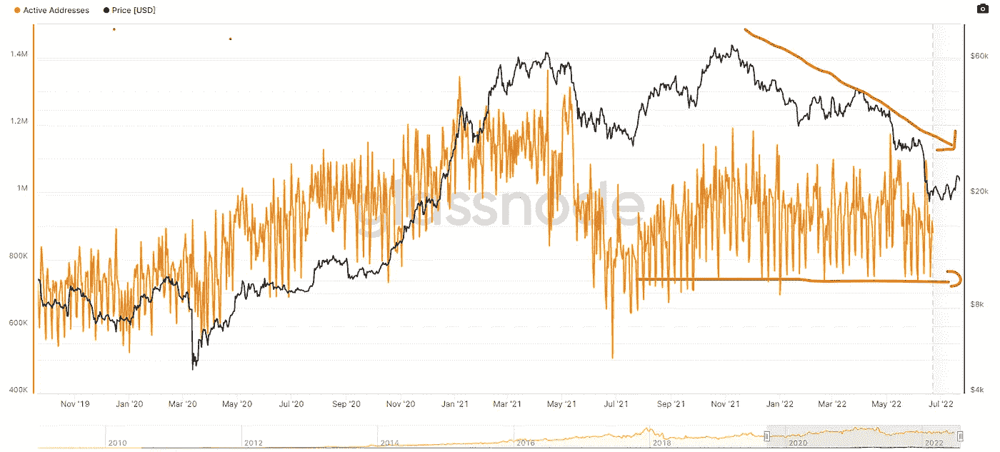
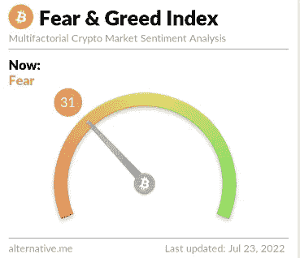
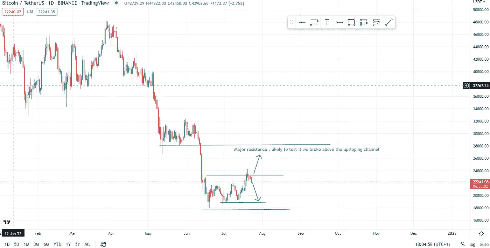

# 积累阶段。市场风险仍然很高。

> 原文：<https://medium.com/coinmonks/accumulation-phase-risks-in-the-markets-remain-elevated-9e766790b165?source=collection_archive---------18----------------------->

距离我的上一篇文章已经有一段时间了，但我一直在密切关注市场，并在我最喜欢的项目上积累，我对此深信不疑。我决定不冒不必要的风险投资新项目，因为宏观环境和整个密码行业都达到了我的风险承受极限。然而，每个人都应该评估自己的风险承受能力、预期并采取相应行动，因为你们中的一些人可能希望完全远离秘密交易，直到尘埃落定，衰退恐惧消退，主要底部形成。其他人可能希望在顶级项目中选择 DCA，并具有更长远的眼光(3–5–7 年)。我知道这听起来很多，但是成功的投资者明白耐心和市场研究是财富积累的关键。如果你在 2020 年至 2021 年的牛市中跟随了错误的人和影响者，你可能会产生错误的预期，你会认为 crypto 是一个快速致富的计划。嗯，不是的。我们都听说过有人获得 20 倍、50 倍或 100 倍收益的案例，但这些都是极少数。不幸的是，YouTube、抖音或 Twitter 上的知名影响者不会尖叫他们的失败，只会尖叫他们的胜利。

如果你想要很棒的教育内容，并且变得比你聪明一点，我建议你遵循 [Stakeborg Dao](https://stakeborg.com/) 。他们每周出版免费的时事通讯和专业时事通讯，每月仅售 12 美元。

**积累阶段**

事实证明，在卢纳-UST 崩溃、三箭资本、Celsius 破产以及现在特斯拉出售 75%的比特币股份(价值约 9.36 亿美元)的消息中，市场表现出了很强的弹性，其比特币的估计售价约为 29，000 美元至 30，000 美元。在将比特币视为避险资产的机构看来，此举无疑引发了一些问题，然而，在这种充满挑战的宏观环境下，埃隆减轻风险和增加流动性的举措很难受到指责。他还表示，特斯拉仍对未来增加比特币持有量持开放态度，这仍有待观察。尽管从长远来看，不管有没有埃隆，我们都会过得很好。

Bitcoin active addresses on a daily basis remain stable despite falling prices signifying increased adoption of the network irrespective of price

恐惧和贪婪指数在 73 天后终于突破了极度恐惧。希望市场传染已经结束，尘埃落定，投资者继续保持乐观。

**风险**

预计波动环境下的交易至少会持续到周三的美联储会议，届时我们将了解他们的加息政策有多激进。0.75%的基点涨幅已经反映在价格中，杰罗姆·鲍威尔(Jerome Powell)认为 1%的涨幅有点令人不快，可能会引发另一轮下跌，比特币可能会重新测试 18900 美元关口。

从好的方面来看，突破 24，000 美元的通道上限可能会迅速推动比特币价格达到 26，000 美元，随后达到 28，000 美元。

Bitcoin failed to break above the higher end of the range $23500-$24000

通胀的滞后特征表明，随着大宗商品、金属和石油价格自 6 月中旬以来大幅下跌，通胀率很有可能在 6 月份达到 9.1%的峰值。石油、小麦和铜的价格较 6 月份的峰值都下跌了 20%以上。由于市场总是具有前瞻性，尤其是在这种渴求流动性的环境下，未来几个月的利率指引是我们目前最重要的预测工具。与利率指引相比，即使是 7 月 28 日正式宣布的衰退，对市场的影响也将相形见绌。因此，每个人都要确保在 7 月 27 日星期三系好安全带，因为我们要么起飞，要么硬着陆。我并不预测会发生崩盘，但你可以预期会有一些动荡。

这种情绪更倾向于看跌，这可能是底部的信号，市场往往与大多数人的预期相反，但我们也多次经历过非理性市场，牛市中的价格超过了我们的上行预期，反之亦然(熊市中的下行价格)。由于市场是前瞻性的，一旦美联储发出任何形式的政策逆转信号或 ***** ，纳斯达克(科技股)和加密/数字资产将首先改变它们的路线，开始大幅上行。我想说***世界经济前景改善**，但是考虑到所有的全球问题，从中国的银行挤兑到德国飞涨的电价和荷兰农民的抗议到我们的斯里兰卡同胞，不知何故这种说法对我来说并不合适。我希望情况有所改善，每个人都能和平地离开。

与纳斯达克的加密相关性仍然很高，但在最近的一个播客中提出了一个很好的观点，即与科技股的相关性可以被视为看涨信号，而不是负面/看跌。该行业发现在框架内交易的速度很慢，这表明采用率在上升。我们正处于早期阶段，最终任何进展都会让我们向前迈进一步。

保重，度过一个美好的夜晚！

免责声明:我必须警告你，有些观点可能是我个人的偏见，但是，我会尽我所能为你提供关于特定主题的客观观点。我不是理财顾问，所有文章只会有严格的教育目的。

> 交易新手？试试[加密交易机器人](/coinmonks/crypto-trading-bot-c2ffce8acb2a)或者[复制交易](/coinmonks/top-10-crypto-copy-trading-platforms-for-beginners-d0c37c7d698c)