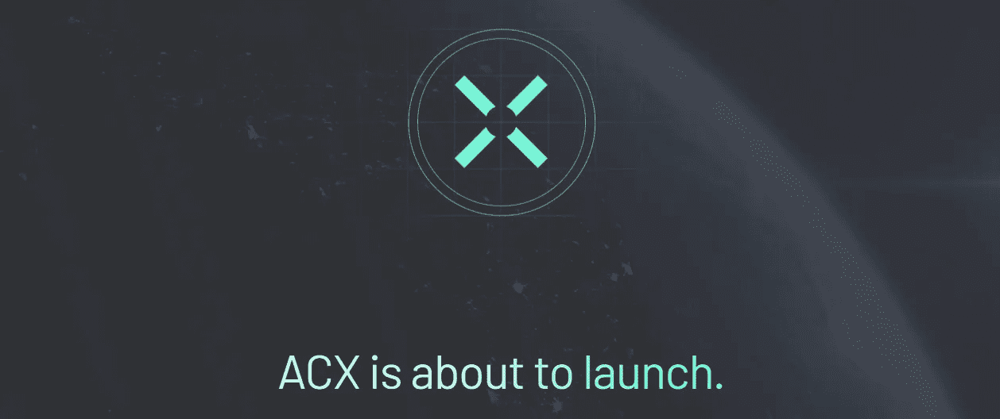
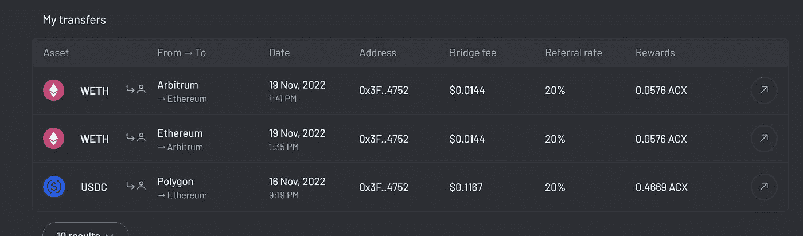

# $ACX 空投可能是巨大的&你还不算太晚

> 原文：<https://medium.com/coinmonks/acx-airdrop-could-be-huge-youre-not-too-late-ec2446d3994d?source=collection_archive---------2----------------------->

$ACX is about to launch their token (Image: [across.to](https://across.to/?ref=0x3F973ba2936C3484D04B1E5f8367D6b8079E4752))

## 什么是跨协议？

> cross 是一个乐观的保险桥，它依靠一组分散的中继来满足从 EVM 到 EVM 网络的用户存款请求。

所以，用一种更简单的方式来说，横跨以太坊的区块链是一座桥梁。现在，它们允许以太坊、Arbitrum、Boba、乐观和 Polygon 之间的转帐，使用的令牌有$ETH、$wETH、$DAI、$UMA 和$wBTC。

跨越其他桥梁有什么特别的？

三件事。

1.  **对面是一座乐观的桥**——“乐观”神谕允许甚至一个“好”演员来对抗“恶意”的桥攻击，使它更加安全。
2.  **净额结算** —过桥交易将资金从一个区块链转移到另一个。这(显然)要求部分资金锁定 7 天。这是一种浪费。跨“网络”隔离传入和传出转账，以最大限度地减少锁定金额，从而减少因时间造成的货币价值损失。
3.  **真钱桥**—cross 不使用合成资产作为全区块链的交易代币。合成令牌是普通令牌的副本，有时可能具有与其原始令牌不同的值。这种价值损失作为滑点传递给了客户。所以，cross 没有滑点，为用户省钱。

## 跨(ACX)代币

$ACX 令牌将成为跨桥的治理令牌。这是一个 ERC-20 令牌(通常用于以太坊项目)。

$ACX 代币将于 2022 年 11 月 28 日发行，现在该桥的某些用户将有资格进行空投。

## 跨(ACX)令牌空投

有几个类别下，你有资格获得$ACX 令牌空投。

总共有 1.25 亿枚代币将被空投到以下类别:

*   社区，2000 万 ACX
*   早期桥用户，1500 万 ACX
*   流动性提供者，7000 万 ACX
*   桥梁旅行者计划，1000-2000 万 ACX(取决于参与情况)

截至目前，我们只能在流动性供应商类别下获得空投资格。其他的在过去已经被关闭。

然而，由于流动性提供者可以在代币发行之前积累点数。

**提供流动性应遵循的步骤；**

1.  **参观** [跨桥](https://across.to/?ref=0x3F973ba2936C3484D04B1E5f8367D6b8079E4752)(参考。链接)
2.  **连接**您的钱包(接受:MetaMask、CoinBase、WalletConnect)
3.  在您的钱包中批准连接请求后，您应该在跨平台的“桥”选项卡中。导航至'**池**'选项卡
4.  **选择**您想要提供流动性的池(在这种情况下，锁定一些代币以获得相同代币的奖励+ $ACX 空投)
5.  在**金额**部分，输入您想要锁定的金额，点击**添加流动性**

注意:你可以随时移除流动性。但我们建议在$ACX 代币发行前保持这种状态，以获得可能的最高空投机会。

**使用网桥**

虽然没有明确提到，但使用这座桥似乎也能为你赢得$ACX 代币。

My bridge usage earning me a few $ACX tokens (Image: across.to)

所以，如果你有一些多余的$ETH，$DAI，或者$ USDCleft，试着把它从以太坊转移到多边形或者乐观主义或者 Arbitrum，然后再转移回来。每一次转账您都会赢得一些$ACX 代币，这些代币将在代币发行时解锁。

此外，您可以通过推荐您的朋友到跨平台来扩大您的$ACX 代币收入。

如果你觉得这篇文章有帮助，考虑使用我的[推荐链接](https://across.to/?ref=0x3F973ba2936C3484D04B1E5f8367D6b8079E4752)加入。

加入他们的[不和谐](https://discord.gg/across)以跟上令牌发射和空投。

**披露:这些是全新的加密协议，会带来巨大的风险。使用时要格外小心。我们建议您使用一个备用钱包来与这些新项目互动。此外，只投资你能承受损失的钱。**

> 交易新手？尝试[加密交易机器人](/coinmonks/crypto-trading-bot-c2ffce8acb2a)或[复制交易](/coinmonks/top-10-crypto-copy-trading-platforms-for-beginners-d0c37c7d698c)