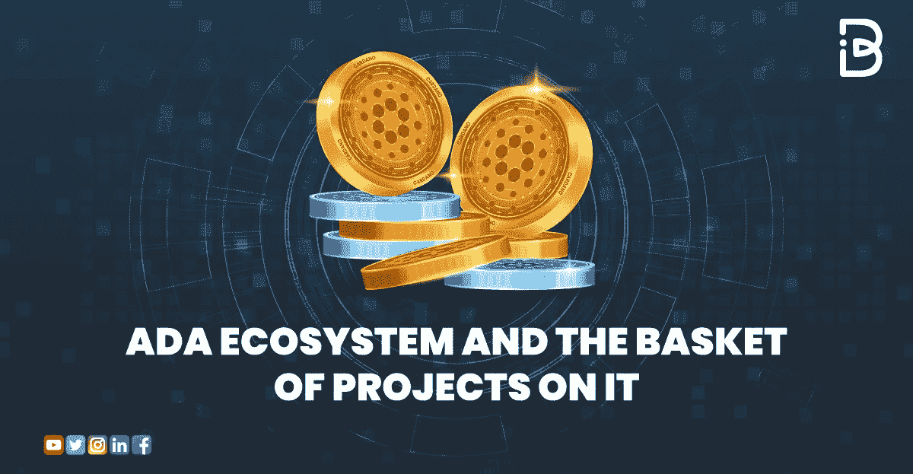
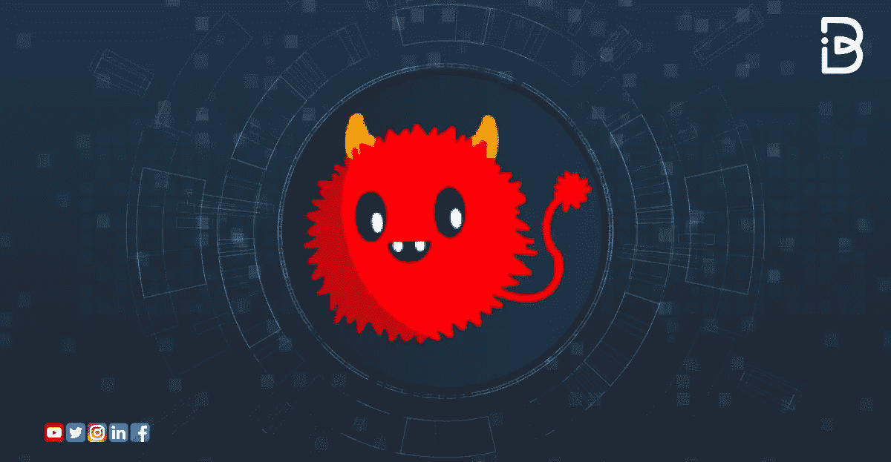
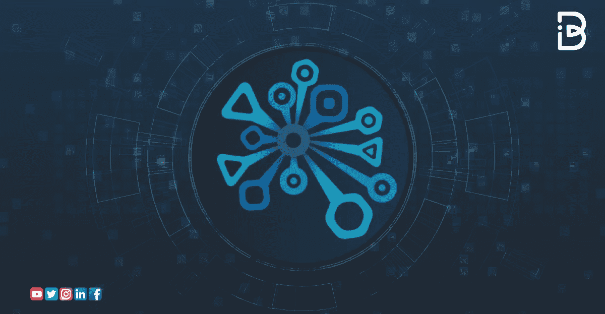
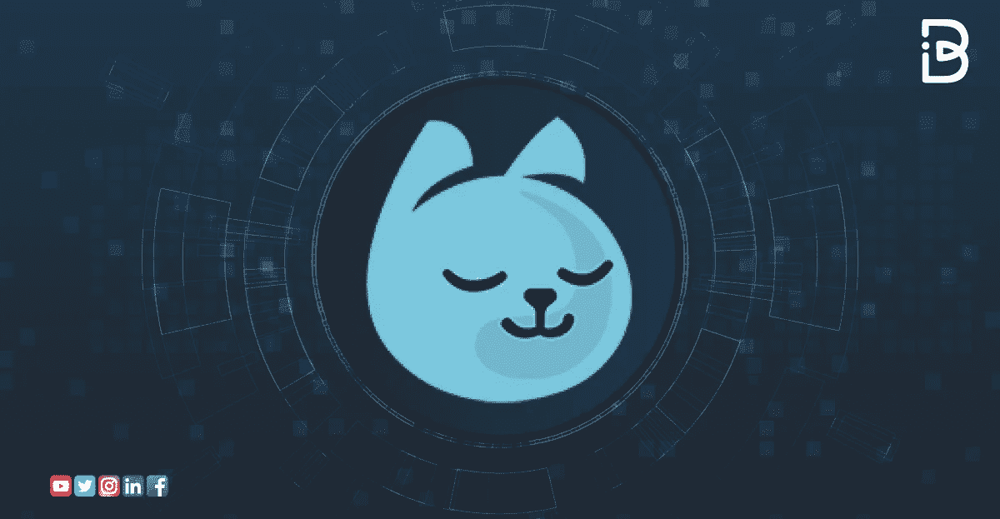
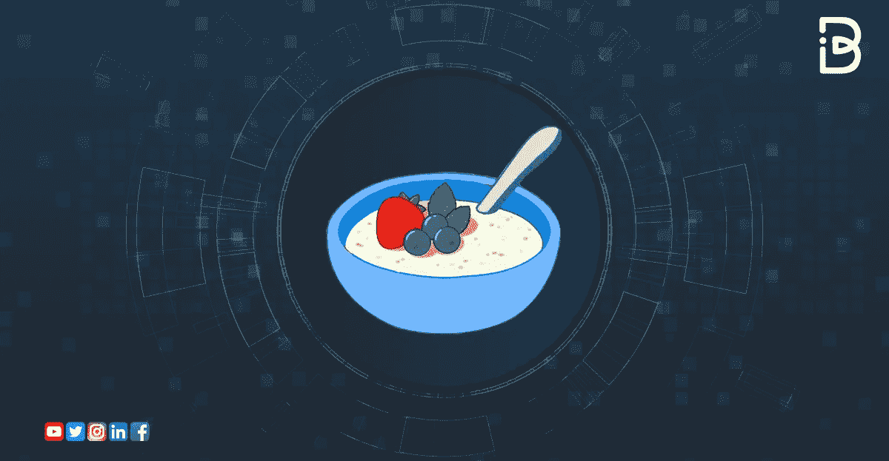
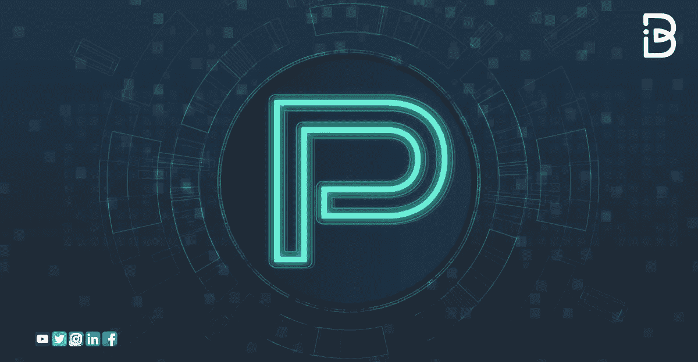
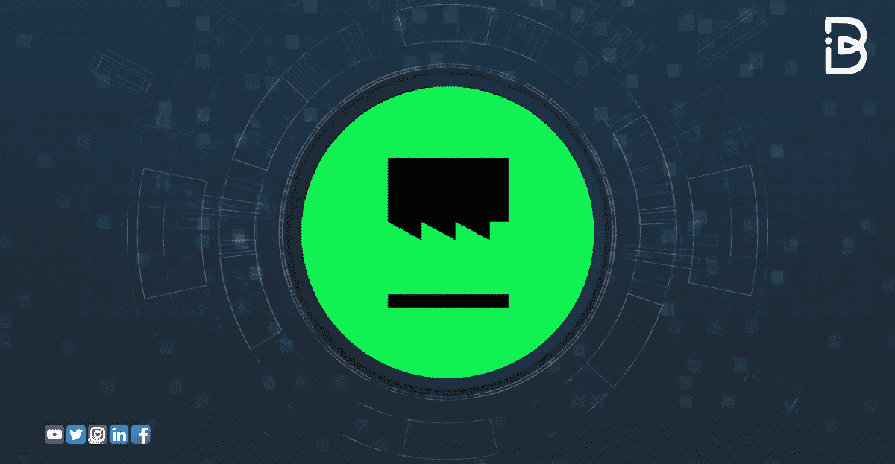
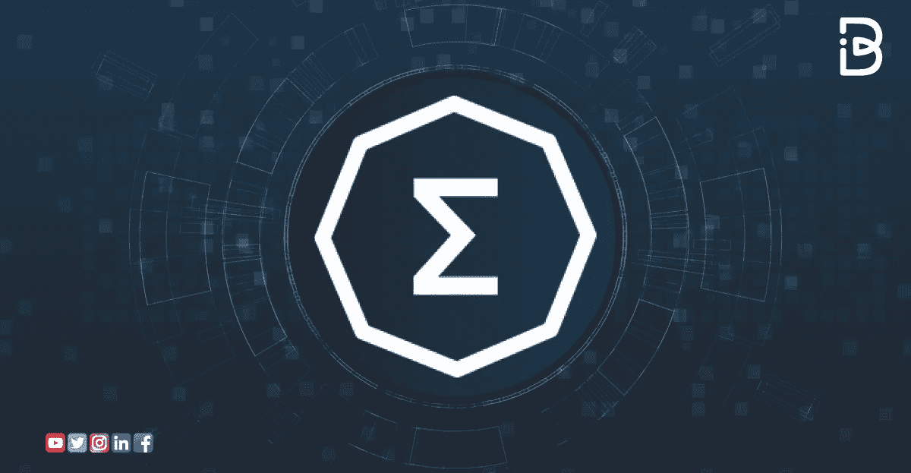
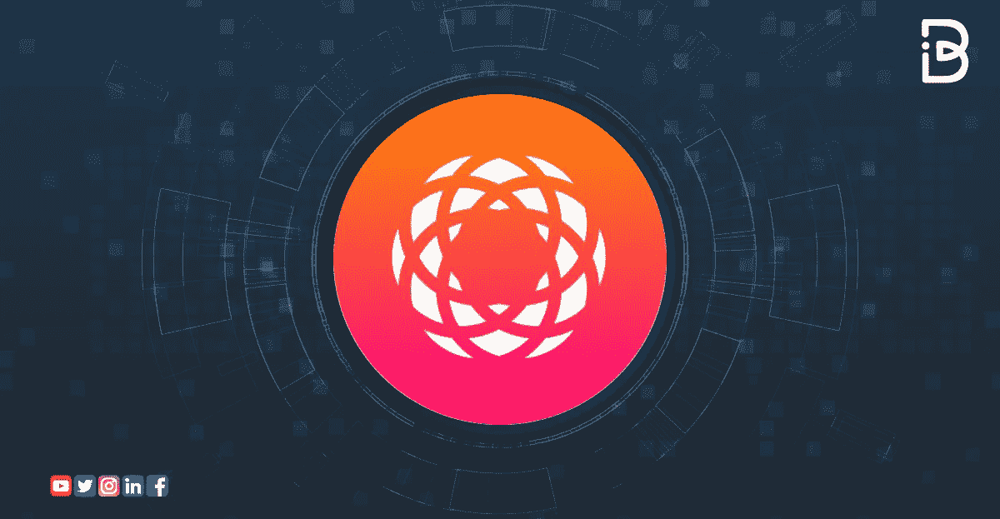

# Ada 生态系统及其一揽子项目

> 原文：<https://medium.com/coinmonks/ada-ecosystem-and-the-basket-of-projects-on-it-a339b7c63d73?source=collection_archive---------3----------------------->

卡达诺加密货币是目前最有前途的代币之一。然而，今天早就不是重新开始的时候了。经过四年的持续发展，卡尔达诺项目拥有了一个完整的生态系统。

# *你知道卡达诺为什么不一样吗？*

卡尔达诺是唯一一种真正有理由存在于加密货币领域的硬币。与比特币这种分散的价值储存方式不同，Cardano 旨在推动金融交易。

这些交易可以是任何合约，包括金融衍生品。这意味着它旨在取代目前的中央系统，如银行和支付处理器。这可能是一个真正的游戏改变者。

卡尔达诺也是不同的，因为它是第一个有科学和数学基础的区块链项目。创建 Cardano 的 IOHK 公司的团队由一位数学家领导。

加密货币领域有很多具有科学基础的区块链项目，但很少有人纯粹专注于具有数学基础的金融技术。这可能会让他们脱颖而出。

推荐阅读: [**卡尔达诺区块链——优点&缺点**](https://www.immunebytes.com/blog/cardano-a-walkthrough-its-working-and-advantages/)

# 介绍 Cardano 的生态系统——流行项目和 DApps 的完整清单

卡尔达诺的生态系统充满了各种各样的项目和 dApps，这将有助于发展和增长的令牌。如果你是这个生态系统的新手，我们强烈建议从我们的最佳投资加密货币综合列表开始。

这将有助于你更好地了解市场的现状以及推动市场发展的项目。Cardano 生态系统中最受欢迎的项目和 dApps 之一拥有一切——一个基于区块链的智能合约平台，一种具有高度可扩展区块链的加密货币，可以处理各种各样的应用程序，以及方便安全的用户体验。

*让我们来看看 Cardano 生态系统中一些最受欢迎的项目和 dApps。*

# 马拉代克斯

Maladex 是一个分散的数字资产交易所，允许参与者在没有信任或中间人的情况下买卖**加密货币**和**ERC 20 代币**。用户可以直接从他们的钱包和交换账户中购买和出售代币，甚至可以创建他们的交易机器人来自动化重复的任务。

它的主要优势之一是交易所不保留账户数据，不像许多其他集中式交易所。这大大降低了数据泄露的风险，并使交易所能够专注于提高其安全性。

# 周日 wap

SundaeSwap 是 Cardano 上的一个分散式交易所，提供各种加密货币和资产的高速、低成本和极低费用交易。

该交易平台提供实时定价和新闻提要，一个匹配引擎，并允许用户创建他们的池，可用于购买和出售多种硬币。

# 努涅特

NuNet 允许任何人共享和货币化他们的计算资源，并提供全球分布的优化计算能力。

该服务通过提供出租或出售虚拟机的能力来帮助解决大规模计算问题。用户可以选择低成本平台或高端机器学习为主的服务器。

# 聚宝盆

Cornucopias 是 Cardano 上的一个分散式应用平台，具有智能合约功能。

它使开发人员能够构建使用区块链技术的应用程序，并专注于增强金融系统。用户可以使用该应用程序买卖股票、债券和加密货币等金融资产。

# Minswap

Minswap 是卡尔达诺上的一个分散式交易所。以最少的成本、最少的时间和最大的便利进行交换。用户可以创建自己的定制交易机器人来自动化重复的任务。

它的主要优势之一是，它不需要用户数据，如电子邮件地址或电话号码，就可以连接到平台进行购买。

# 营养食品指数

Cardano 上的实时操作 DEX 基于为 Cardano UTXOs 定制的简单、研究驱动的订单簿协议。

该项目旨在创建一个严格的研究驱动的订单协议，便于市场参与者使用。

# 帕维亚

在第一个由用户拥有的卡尔达诺虚拟世界中创造、探索和交易。Pavia 是一个位于区块链的虚拟世界，托管应用程序和游戏，可用于与区块链互动，并与用户的金钱互动。用户可以使用他们的虚拟货币:卡达诺代币(ADA)买卖数字商品和服务。

# NFT 制造商

多链 NFT 生态系统为终端用户、艺术家、品牌和企业提供了降低准入门槛的工具。

NFT 创客背后的想法是帮助区块链的初创公司和开发者减少开发他们的想法所需的必要投资和资金。

它为早期项目提供资金，这些项目旨在在其领域创造技术突破。

# 因此

加密货币的去中心化性质使得拥有与中央实体完全不同的治理模式成为可能。分散组织的一些优势是，决策是集体做出的，人们有发言权，利益相关者拥有所有权。

在中央集权的组织中，决策是由单个个人或一小群人根据他们自己的利益做出的。分权组织可以做出对整个利益相关者群体(包括个人)都有利的决策。

由分权组织管理的资金通常用于支持个别成员的活动或项目。为了保持其去中心化的本质，Cardano 使用一种**共识方法**来决定谁因创建和管理一个去中心化的组织而获得报酬。

# ErgoDEX

卡尔达诺有一个独特而有趣的概念，叫做 Ergo。这是一个分散的交易所，允许用户交换加密货币和法定货币，而不必通过中央实体，如银行或交易所。

Ergo 的想法是尽可能无缝快速地交换加密货币。

用户只需要在发送给分散式交易所的请求中提供他们的交易信息，例如他们的钱包地址、要转移的代币数量以及他们想要转移的货币。

# 结论

Cardano 生态系统包含了各种各样的项目和 dApps，可以帮助开发和增长令牌。如果你是这个生态系统的新手，我们强烈建议从我们的最佳投资加密货币综合列表开始。

Cardano 生态系统中最受欢迎的项目和 dApps 之一是一个拥有一切的项目——一个基于区块链的智能合约平台，一种具有高度可扩展区块链的加密货币，可以处理各种各样的应用程序，以及便捷和安全的用户体验。

# 关于免疫字节

ImmuneBytes 为企业和初创公司提供全面的**智能合同审计解决方案**，让他们的应用程序有一个安全的开端。我们的旅程始于促进即将到来的区块链世界的安全，提高大规模系统的性能。

**ImmuneBytes** 管理严格的[**智能合约安全审计**](https://www.immunebytes.com/) ，采用静态和动态分析，检查合约的代码和 gas 优化，不给 bug 留下任何逃脱的路径。

> 交易新手？尝试[加密交易机器人](/coinmonks/crypto-trading-bot-c2ffce8acb2a)或[复制交易](/coinmonks/top-10-crypto-copy-trading-platforms-for-beginners-d0c37c7d698c)