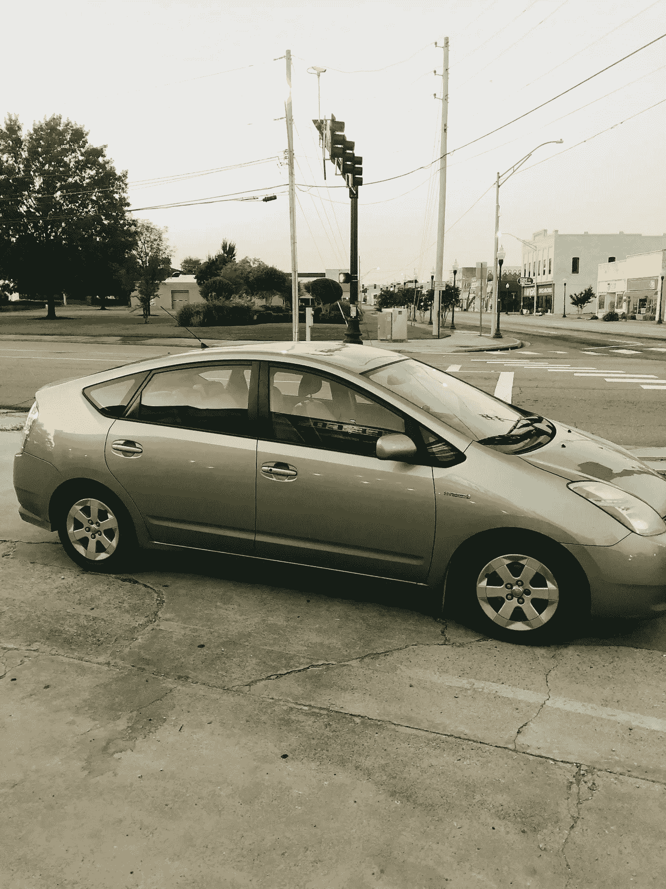

# AdaWorks (Cardano)与零工和共享经济

> 原文：<https://medium.com/coinmonks/adaworks-cardano-and-the-gig-and-sharing-economy-ead2a6ca4dbb?source=collection_archive---------29----------------------->

让我们面对现实吧，我们对零工经济又爱又恨。我们热爱独立、多样性、自发性，有时甚至是金钱。

但是很多时候，我们内心深处有一种感觉，我们被不必要的利用、操纵和压榨。零工的概念真的很好，几乎是资本主义的一种理想形式。但是由于当前资本主义的压力，它似乎被剥削了。

我们能改写演出的规则吗？为什么不呢？运行在 Cardano 上的 dapp 怎么样，它可以托管几乎任何类型的工作和共享经济的各个方面。有了正确的接口，它可以接受来自有需要的人的输入(交付、日工、商品、服务等)。)和来自这样的提供者。

条款的提供/接受可以是即时的、延迟到履行的组合，或者甚至是连续流动的支付方法。付款方式可以是菲亚特或 Cardano，根据个人喜好，两者之间有即时转换机制。

想象一下，你突然有了一点旅游癖，你去了一个新的城镇或城市，到达时除了身上穿的衣服，什么都没有。你在你的 AdaWorks dapp 上找到一辆车，你可以在晚上开着它去参加一个类似优步的演出。这辆车的主人知道，一旦他们下班回家，晚上就不会再使用这辆车了。你租了一辆车，否则就是一种浪费的资产，然后在那天晚上开车，反正大多数的驾驶活动都是在那天晚上进行的。双赢！

汽车使用是共享经济的一部分，实际驾驶是零工经济的一部分。实物支付将通过 dapp 进行，无论是在卡尔达诺还是在菲亚特，结算层都会自动进行转换。

接下来，当然，在你的旅游之旅中，你需要一个睡觉或居住的地方。BNB 航空公司的 dapp 版本符合这个要求。

我可以继续谈论它所能提供的不同商品和服务，但我会把这些留到以后的文章中。这里的主要框架是，通过使用 Cardano 和相关的 dapp，您可以消除大型技术中间商。消除银行(钱从一个钱包流向另一个钱包)。你保留了几乎所有的收入，因此你可以赚更多或向客户收取更少的费用，以获得更多的工作和/或节省客户的钱，同时还能赚更多的钱。

目前这是一个思想实验，我打算在以后的文章中用更多的概念和一些技术方面来阐述它，所以请继续关注。

> 交易新手？试试[加密交易机器人](/coinmonks/crypto-trading-bot-c2ffce8acb2a)或者[复制交易](/coinmonks/top-10-crypto-copy-trading-platforms-for-beginners-d0c37c7d698c)