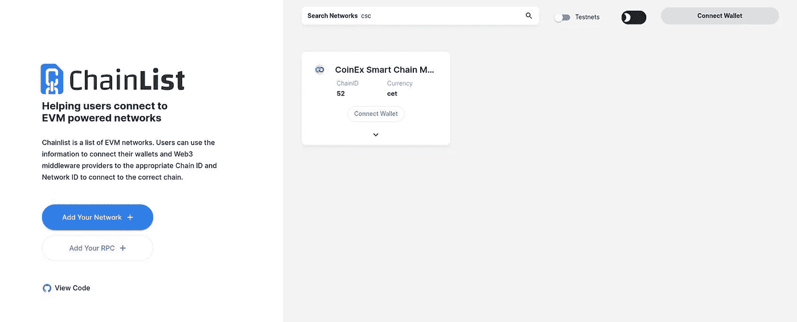

# 使用 Web3.js 在 Metamask 中添加 CSC 网络

> 原文：<https://medium.com/coinmonks/add-csc-network-in-metamask-using-web3-js-b8d6a00cffdb?source=collection_archive---------9----------------------->

嘿嘿嘿

0Xlive 在这里😃

也许你的用户不知道如何在元掩码中手动添加 CSC 网络，这将减少你的用户。在本教程中，我们将编写一个简单的函数，使用纯 js 自动将 CSC 网络添加到元掩码中，类似于链表



chainlist.org

首先，我们需要在终端类型中开始我们的项目:

```
touch network.js
```

上面的命令将创建一个名为 network.js 的文件。我们应该从 wallet 获得许可来将我们的 wallet 连接到 dapp。我们使用 Metamask 文档。

 [## RPC API |元掩码文档

### MetaMask 使用 ethereum.request(args)方法包装 RPC API。该 API 基于一个由所有…

docs.metamask.io](https://docs.metamask.io/guide/rpc-api.html#other-rpc-methods) 

## Web3 浏览器检测

要知道 metamask 已安装，请将此代码粘贴到 network.js 或浏览器控制台中:

```
if (typeof window.ethereum !== 'undefined') {
  console.log('MetaMask is installed!');
}
```

上面的代码检查元掩码，如果安装了将打印元掩码安装！。

> 交易新手？试试[加密交易机器人](/coinmonks/crypto-trading-bot-c2ffce8acb2a)或者[复制交易](/coinmonks/top-10-crypto-copy-trading-platforms-for-beginners-d0c37c7d698c)

## 连接到元掩码

要将 wallet 连接到 dapp，我们应该请求访问 wallet:

```
ethereum.request({ method: 'eth_requestAccounts' });
```

在 html 中创建按钮:

```
<button class="enableEthereumButton">Enable Ethereum</button>
```

完整的代码应该是这样的:

```
const ethereumButton = document.querySelector('.enableEthereumButton');
const showAccount = document.querySelector('.showAccount');

ethereumButton.addEventListener('click', () => {
  getAccount();
});

async function getAccount() {
  const accounts = await ethereum.request({ method: 'eth_requestAccounts' });
  showAccount.innerHTML = account;
}
```

我们去实现添加网络功能吧。

要添加链，我们应该创建接口:

```
interface AddEthereumChainParameter {
  chainId: string; // A 0x-prefixed hexadecimal string
  chainName: string;
  nativeCurrency: {
    name: string;
    symbol: string; // 2-6 characters long
    decimals: 18;
  };
  rpcUrls: string[];
  blockExplorerUrls?: string[];
  iconUrls?: string[]; // Currently ignored.
}
```

要将 coinex 智能链添加到元掩码，我们应该更改参数:

ChainId: 52

ChainName:Coinex 智能链 Mainnet

NativeCurrency[name]:CET

符号:CET

rpcUrls:https://rpc.coinex.net

区块探索规则:[https://coinex.net](https://coinex.net)

iconUrls:可以使用 anylink(可选)

MetaMask 严格验证该方法的参数，如果任何参数的格式不正确，它将拒绝请求。此外，在下列情况下，MetaMask 将自动拒绝请求:

*   如果 RPC 端点不响应 RPC 调用。
*   如果调用`eth_chainId`时 RPC 端点返回不同的链 ID。
*   如果链 ID 对应于任何默认元掩码链。

MetaMask 尚不支持本地货币不超过 18 位小数的链，但将来可能会支持

我们还可以实现切换链功能，从其他链切换到 csc:

```
try {
  await ethereum.request({
    method: 'wallet_switchEthereumChain',
    params: [{ chainId: '0x34' }],
  });
} catch (switchError) {
  // This error code indicates that the chain has not been added to MetaMask.
  if (switchError.code === 4902) {
    try {
      await ethereum.request({
        method: 'wallet_addEthereumChain',
        params: [
          {
            chainId: '0x34', //52 in hex
            chainName: 'Coinex Smart Chain',
            rpcUrls: ['[https:](https://rpc.coinex.net)//rpc.coinex.net'] /* ... */,
          },
        ],
      });
    } catch (addError) {
      // handle "add" error
    }
  }
  // handle other "switch" errors
}
```

祝贺🥳

现在，我们可以轻松地将 CSC 网络添加到元掩码中。

在下一个教程中，我们将使用 web3.js 和 metamask。