# 将分类帐硬件 Wallet 添加到元掩码

> 原文：<https://medium.com/coinmonks/adding-a-ledger-hardware-wallet-to-metamask-d8a633cbb82a?source=collection_archive---------3----------------------->

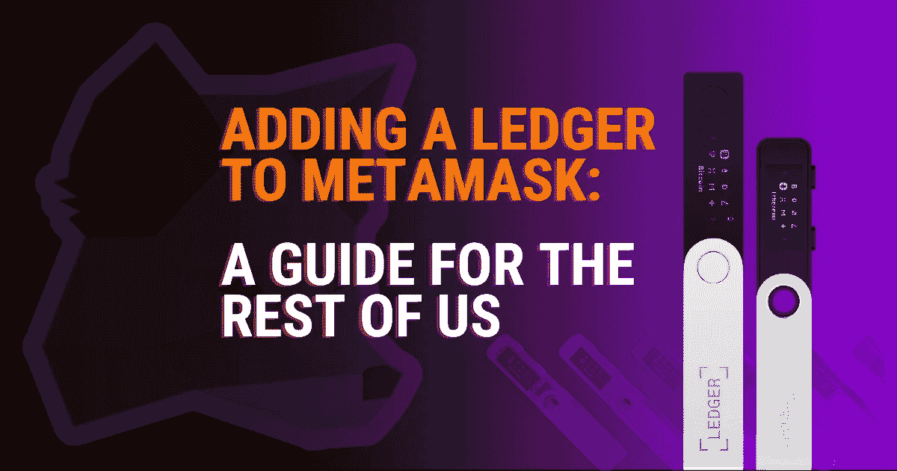

每天都有人问我“如何向 MetaMask 添加分类帐硬件钱包”？这篇文章试图为你回答这个问题。

在 defi 中，你突然有了几十万英镑的账户，你意识到 MetaMask 本身可能不够安全，无法满足你的需求，也无法让你晚上睡得安稳！我有 5 个滴水钱包和 5 个花园。加上我的动物农场位置，有猪和狗，部落，复仇女神，EMP 钱和蒸汽节点。你说吧。太多了。这篇深入的指南将有望以我典型的循序渐进的方式回答你的问题，并帮助你保护好自己的钱包。

让我们开始吧。

# 分类帐硬件钱包

出于本文的目的，我将使用我的一个旧的 Ledger 硬件钱包 Nano。我想我在 2017 年购买了这个钱包，当时我以 3800 美元的价格购买了 BTC，人们认为我是一个傻瓜，因为他们不明白当其他人都讨厌加密时你买，当他们都喜欢加密时你卖。不管怎样，不管你有哪种硬件钱包，这个指南都是一样的。我也会做一些假设。

1.MetaMask 已安装，并且您熟悉它作为浏览器中的钱包。如果没有，请阅读我在 [MetaMask 上的指南。](https://alttokenomics.com/metamask-the-right-way-a-step-by-step-guide/)

2.你拥有一个硬件钱包，并把它拿在手中。如果你还没有的话，你可以从 Ledger 那里买一个。不要从任何第三方来源购买！您可以使用下面的链接购买一本账簿。

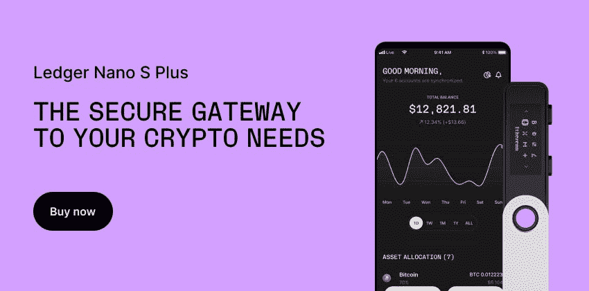

# 将元掩码 Wallet 迁移到分类帐硬件 Wallet

当您完成上述工作后，我们准备开始迁移您现有的 MetaMask wallet，将您所有的 defi 帐户迁移到您的分类帐硬件 wallet 中。如果您还没有写下并存储它，您需要打开元掩码并写下您现有的种子短语。您可以通过转到 MetaMask 来完成此操作。点击你的账户右上角，然后设置。

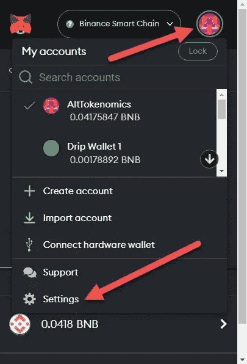

打开元掩码设置后，你需要选择安全与隐私，然后点击“显示秘密恢复短语”

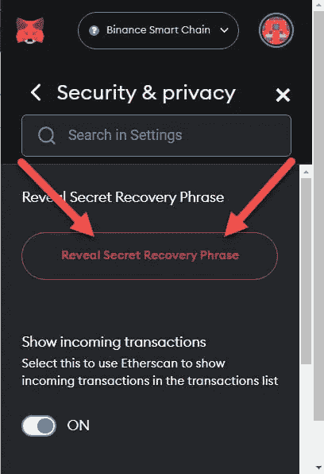

我用来储存各种钱包密码的系统是 excel。excel 模板中填写了我所有的短语。然后我把它从我的电脑上拿下来，用 Sandisk security 把它存储在 Sandisk USB 驱动器上。只有知道 3 个字的密码才能打开 u 盘。然后 u 盘被隐藏起来。

确保浏览您元掩码中的所有帐户，并记下每个帐户的钱包地址。例如在我的钱包里，我有 7 个钱包(账户)地址。每个都有名字，每个都有自己的地址。以后将分类帐连接到元掩码时，您将需要这些地址。这些是我的。

AltT = 0x 151 xxf5ab
滴滴 1 = 0x061xxx3E810
滴滴 2 = 0x321xxx68153
滴滴 3 = 0x8C1xxxB2CDE
滴滴 4 = 0xa8xxx70Be7f
名家 5 = 0xEE8xxx0CDE8
世家= 0x7A8xxxF442B

将它们都记在记事本上，因为您将需要在稍后的过程中参考它们。

# 我们想要实现什么

我们试图通过分类账硬件钱包实现的目标如下。

1.我们想使用 MetaMask wallet 的密钥将我们现有的 MetaMask wallet(其中包含您所有的滴灌和动物农场类型项目)迁移到 Ledger 中。

2.迁移完成后，我们希望从我们的计算机上删除这个元掩码 wallet，这样种子短语就不再存储在计算机上。

3.接下来，我们用新的密钥种子短语在我们的计算机上创建一个全新的元掩码钱包。这是我们与互联网的连接。我把我的叫做“热钱包”。

4.最后，我们将分类帐硬件钱包连接到这个新的元掩码帐户，这样我们的分类帐就隐藏在热钱包的后面。

这就是那四个步骤。

# 将元掩码密钥添加到分类帐

好了，让我们将我们的分类帐硬件钱包连接到我们的 PC。所以首先请将你的账本连接到你的电脑，你会看到这条信息。

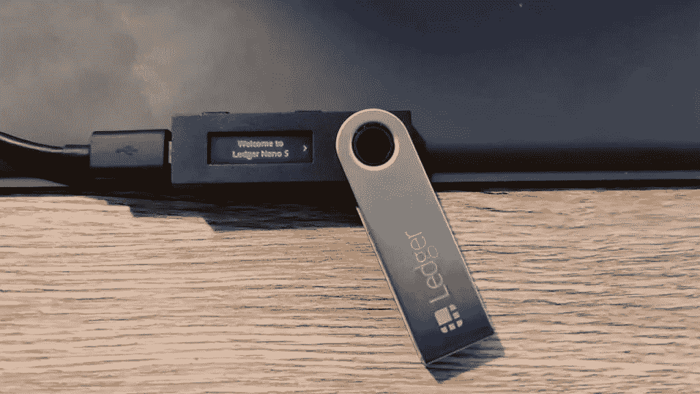

使用右上角的按钮向右滚动分类帐，直到出现此屏幕“从恢复短语恢复”。

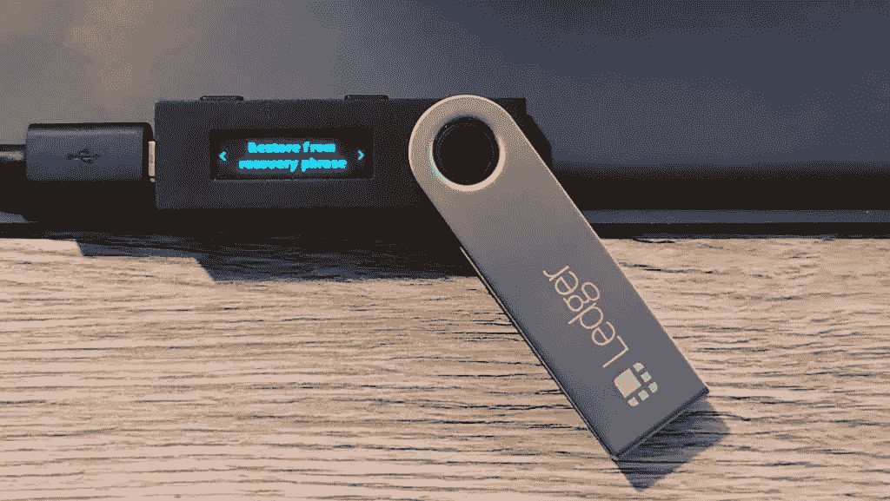

分类帐现在会要求您选择 pin 码。同时按下顶部的两个按钮来启动此过程。使用右按键向上滚动数字，使用左按键向下滚动。滚动数字，当你看到第一个数字时，你想同时按两个键来选择它。对 pin 码中的所有数字重复相同的过程。我设置了一个 4 位数的 pin 码，当小勾号出现时，我按下两个按钮来创建我的 pin 码。

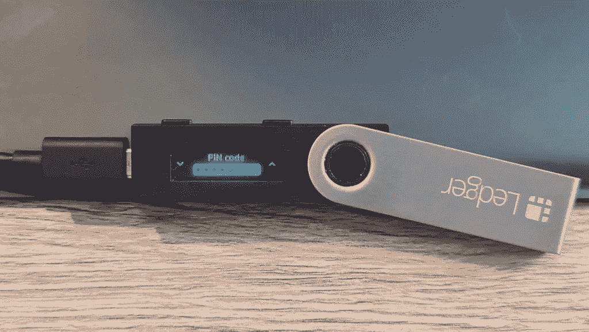

您的分类帐将要求您再次输入 pin 码并按下两个按钮进行确认。一旦你这样做了，你将被要求选择你的恢复短语的大小。对于元掩码，短语是 12 个词，因此向右滚动并选择这个词。

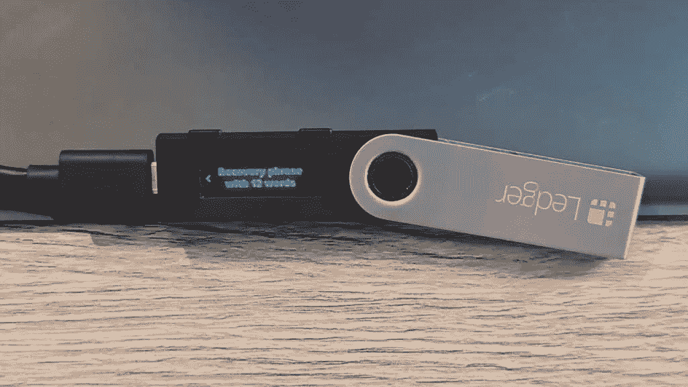

现在我们有输入每个单词的每个字母到分类帐的费力的任务！你必须滚动每一个字母，然后双击选择它。如果你犯了一个错误，有一个小 x 会删除这个字母。Ledger 非常好，因为它会在你输入几个字母后提示你单词。如果单词是正确的，双击按钮选择它。然后输入单词二。继续这个过程，直到你输入了所有的单词。

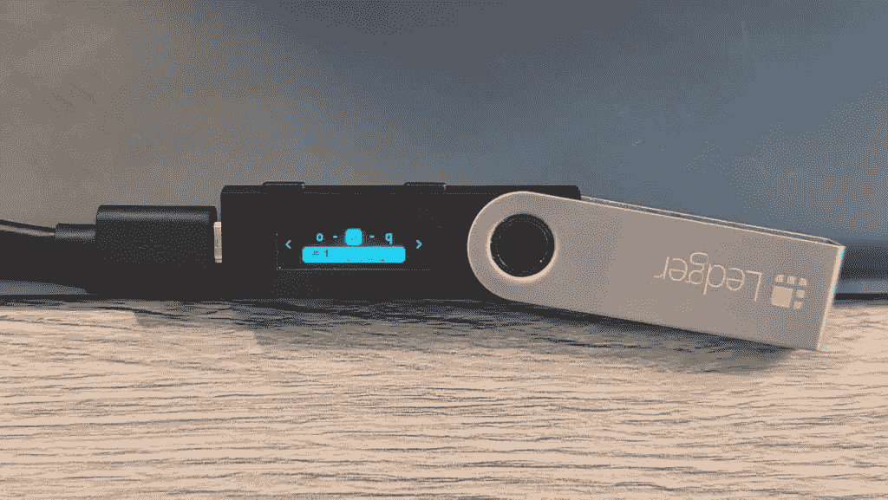

当你输入了所有的单词后，Ledger 会告诉你它正在处理，然后跳到“你的设备已经准备好了”

# 实时下载和安装分类帐

请转到分类帐并下载分类帐 Live，以便我们可以将分类帐连接到我们的计算机，并最终连接到我们的 MetaMask 钱包。因此，请点击此处下载莱杰直播。始终检查 URL 是否正确，以及您是否确实在真实的分类帐网站上。不要从官方分类帐网站以外的任何其他网站下载分类帐。

下载完成后，将其安装到您的机器上，然后打开它。您现在需要选择“开始”

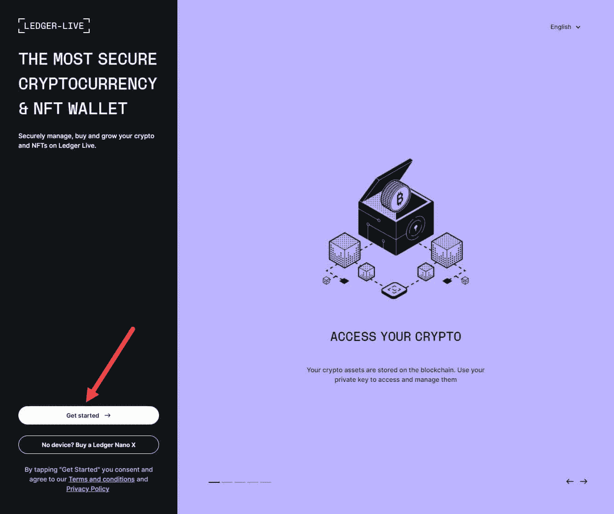

然后选择您的 Nano 类型。我的是 Nano S，所以我会选择第一个。

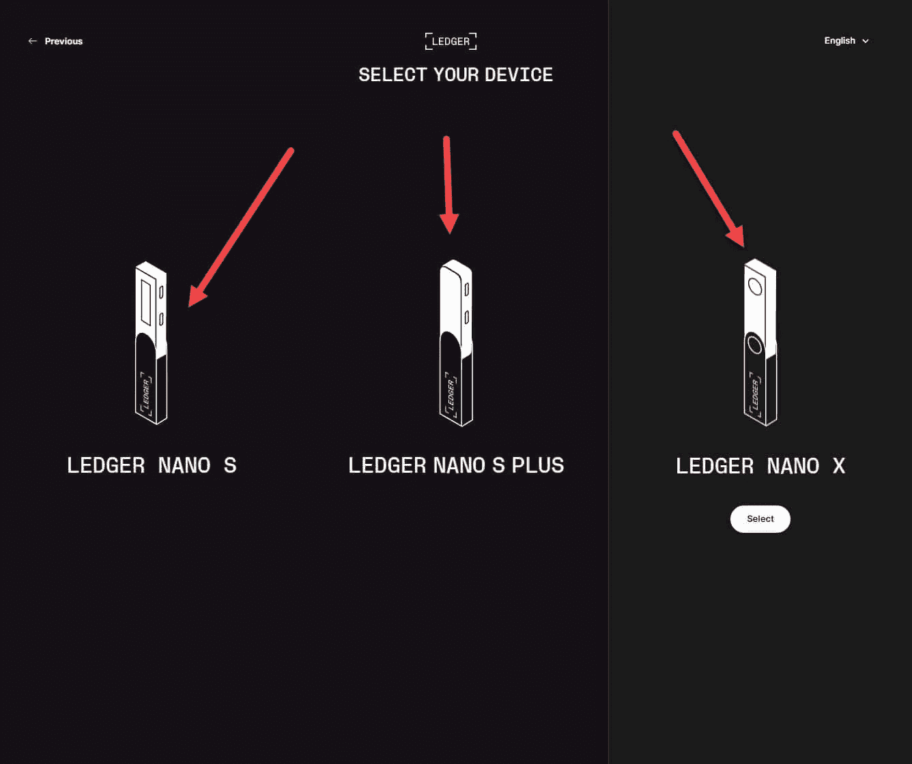

因为我们已经在 Nano 中输入了我们的秘密短语，所以我们可以在这里使用它。连接您的 Nano。

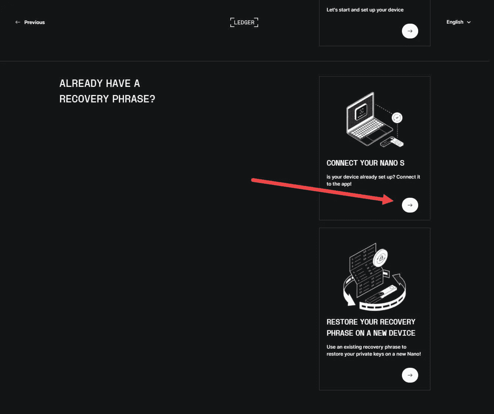

Ledger Live 现在想要连接并检查您的 Nano。所以按下“检查我的 Nano”

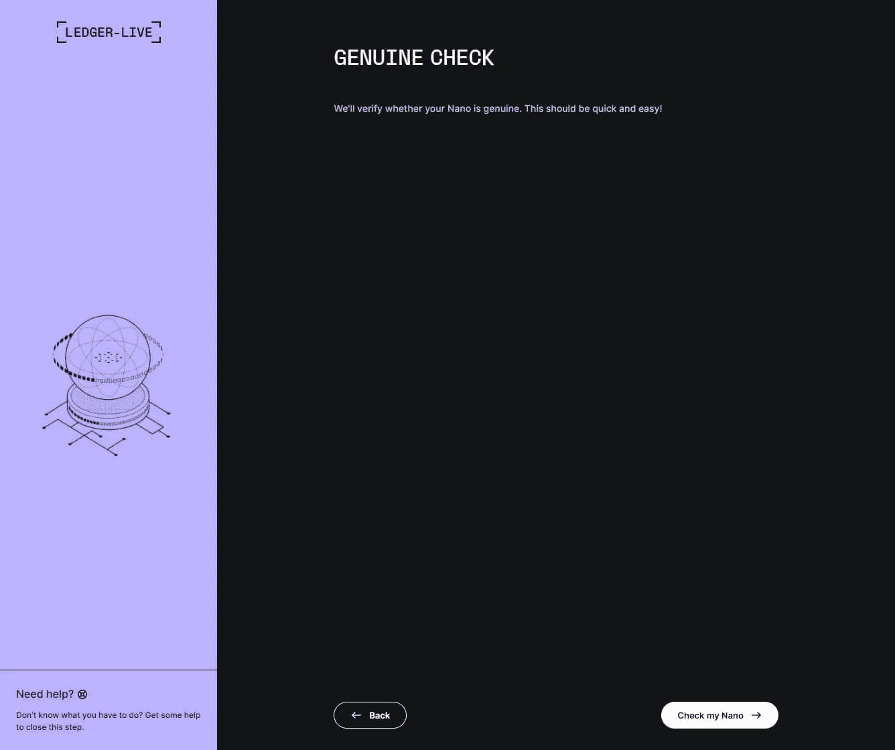

在你的账本上，会弹出这条信息。双击两个按钮，接受与 Ledger Live 的连接。

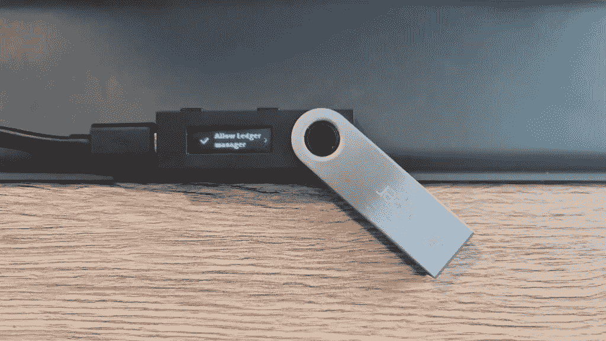

如果您的分类帐是真实的，此消息将会在分类帐 Live 中弹出。

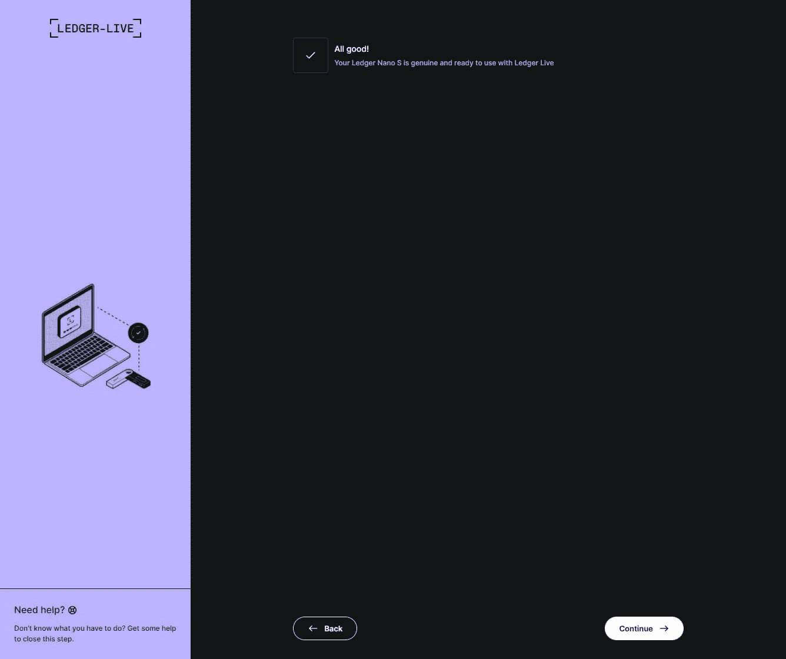

分类帐生活主帐户屏幕现在将加载，在我的情况下，它检测到我的分类帐是过时的，需要固件更新。如果需要，继续更新。

# 下载和安装固件

选择条款并选中标记为“我有我的恢复短语”的框，然后继续更新。

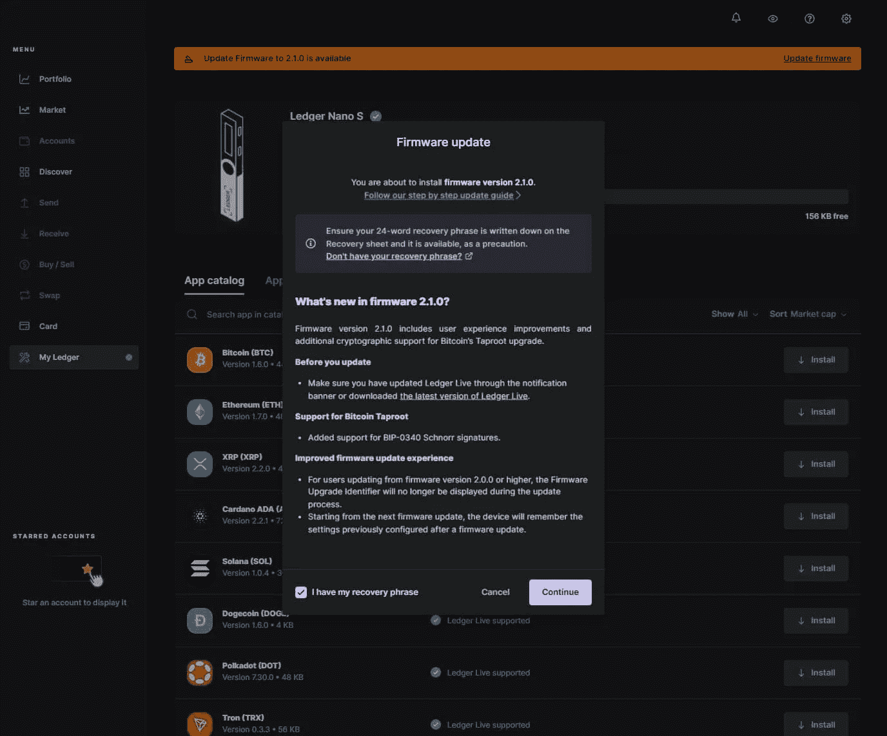

分类帐现在将下载并安装更新。

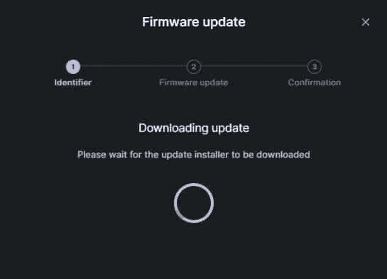

在此过程中，Ledger 会要求您验证 Nano 上的关键代码。再次向右滚动以验证代码，然后每次请求时用 pin 解锁您的 Nano。固件过程将在您的账本上完成，您将回到这里。

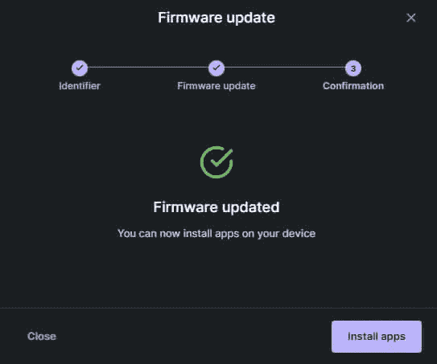

进入我的分类帐，选择安装应用程序，确定分类帐实时连接到您的纳米，然后安装 ETH 应用程序。

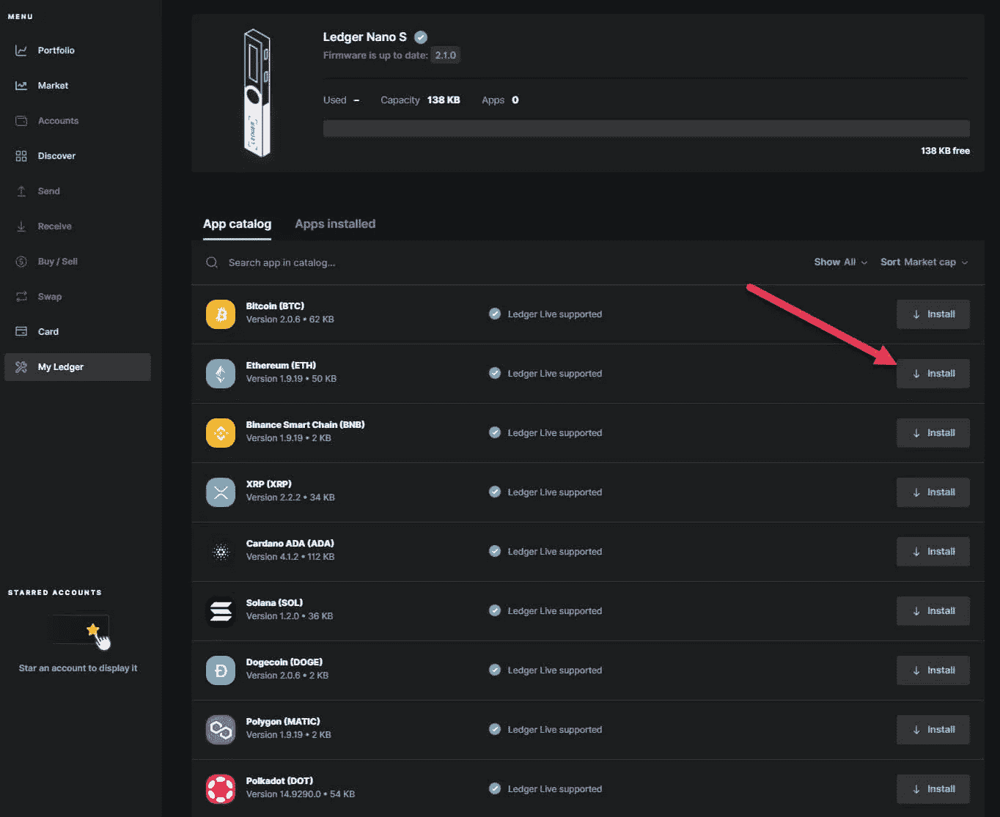

ETH 应用程序安装到您的分类帐后，我希望您打开 MetaMask 并选择“连接硬件钱包”

这将打开一个元掩码浏览器窗口，您可以在其中选择分类帐。当它被激活时，点击蓝色的继续按钮。确保 ETH 应用程序在您的分类帐上打开，否则此时您会收到一条错误消息。在 Chrome 中，你会在左上角看到第二个弹出窗口。只需在弹出窗口中选择设备，然后按 ok。

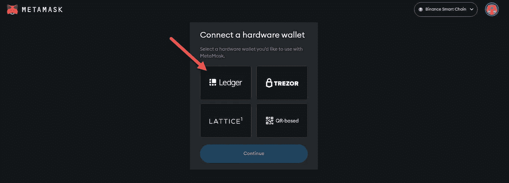

注意:在你这样做之前，你必须有分类帐实时关闭，否则你可能会得到错误 0x650f 你可以在元掩码上看到这个错误

Ledger Live 现在将打开并询问您是否要通过网桥连接。

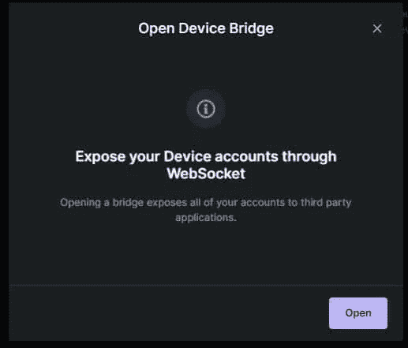

在此屏幕上选择打开。

这将弹出并要求您选择您的帐户。只有顶部的一个是我的，所以我们需要将 HD 路径连接设置从 Ledger Live 更改为 BIP44 standard。

在我换成 BIP44 之后，我所有的账户都出现了。这些都是我之前写下的账目。你可以按下一步查看更多，因为我有 7 个。

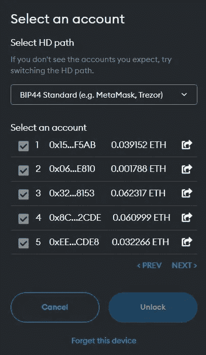

这个阶段到此为止。你所做的就是检查你的分类账上是否有这些账户，并且可以被看到。我们现在将在您的浏览器中创建新的元掩码钱包。

# 创建新的元掩码 Wallet 并使用分类帐

我现在要你打开浏览器，从你的机器上删除你当前的 MetaMask 钱包。你可以通过右击 Fox 图标并选择 remove from Chrome 来实现。在其他浏览器中也有类似的过程，只是要确保它被完全删除。

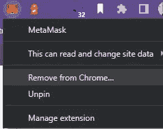

你现在要做的是从计算机中删除种子短语。现在，如果你被黑了，黑客将无法访问你的种子。你可以按照我的[元掩码指南](https://alttokenomics.com/metamask-the-right-way-a-step-by-step-guide/)在你的浏览器中重新安装元掩码钱包。总是从 MetaMask 本身下载。

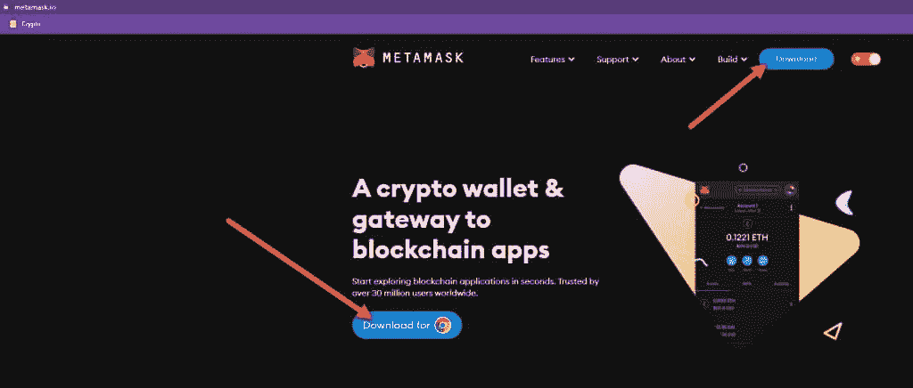

# 使用新的种子短语创建新的元掩码 Wallet

在这里，使用新的种子短语创建新的钱包是非常重要的。**不要使用你在账本上用过的种子短语**。

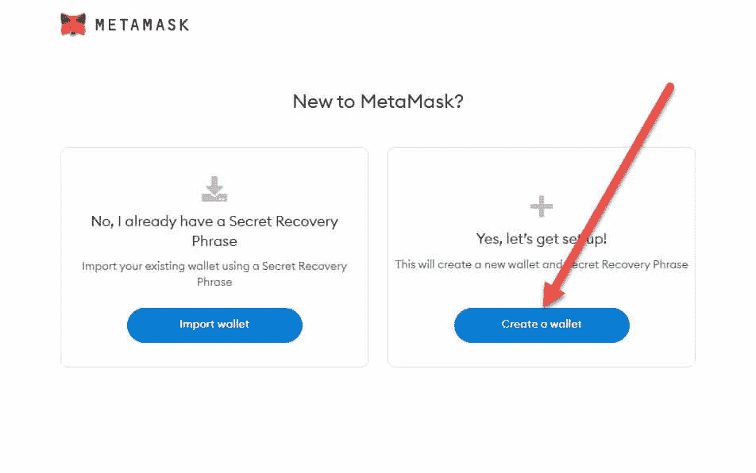

创建您的新钱包。记下新的种子短语，并将其添加到您的工作表中，或者以您选择的方式存储您的种子短语。将元掩码钱包固定在任务栏上，以便您可以看到它。现在，我们准备将我们的分类帐连接到这个新的 MetaMask 钱包。

# 将您的分类帐连接到您的新 MetaMask Hot Wallet

我们进展到哪了？

*   使用种子短语将我们的旧元掩码钱包添加到我们的分类帐中
*   将我们的分类帐连接到我们的元掩码，并检查我们可以看到所有的帐户
*   从我们的计算机中删除了旧的元掩码
*   在我们的计算机上创建了一个新的元掩码，并存储了新的种子短语
*   将我们的分类帐连接到这个新的元掩码，并检查我们是否可以使用它执行一些 Defi 交易

让我们继续将我们的分类帐连接到新的元掩码。与上面我们遵循的步骤相同。将您的分类帐连接到计算机，然后再次打开 ETH 应用程序。接下来，转到您的新元掩码并选择连接硬件钱包。不要忘记将连接协议更改为 BIP44。您还可以将网络添加到这个新的元掩码 wallet 和令牌中。

由于这是一个新的 MetaMask 钱包，您以前没有见过您的分类帐，现在您将有机会打开(解锁)存储在您分类帐中的帐户。

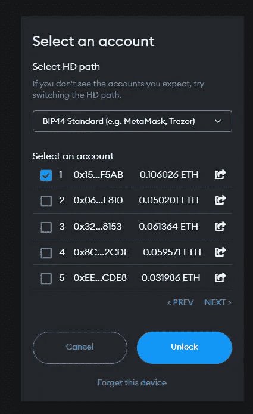

我在这里只打开第一个帐户，但是你可以打开所有的帐户，然后它们都会出现在你的元掩码中。所以打勾选择解锁。如你所见，我只打开了第一个。

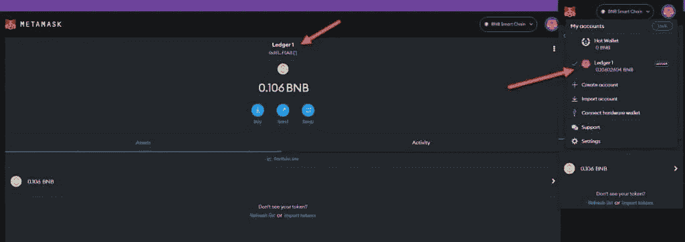

# 使用分类帐和元掩码执行事务处理

我现在已经解锁了我的第一个总帐帐户，并且它在我的新元掩码中可见。我现在可以去动物农场，像往常一样种植我的植物，我现在就要这样做。

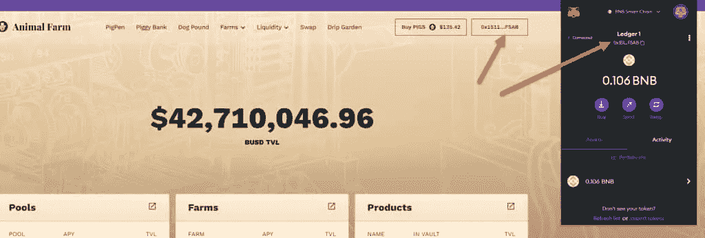

从昨天开始，我在这个钱包里放了 330000 英镑，但我需要按照 MetaMask 中弹出的消息中的说明操作。

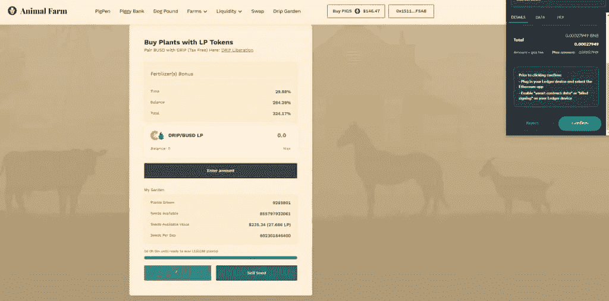

去你的账本，确保 ETH 应用程序是打开的。在 ETH 应用程序中向右滚动，直到看到以下消息

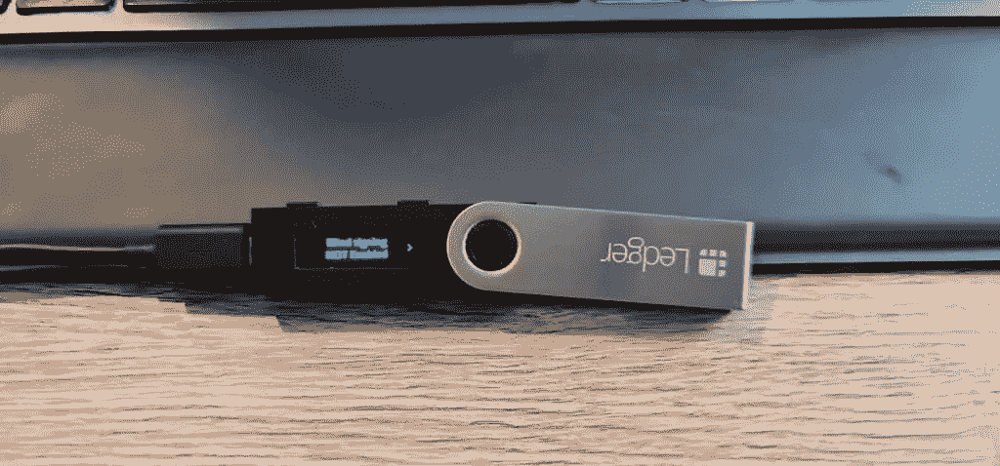

按下两个按钮以启用盲签名。

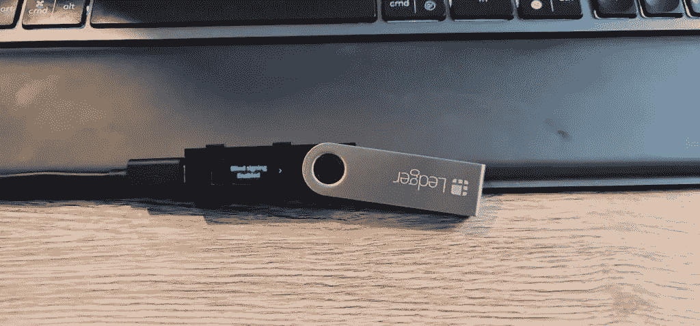

返回元掩码并按下交易上的确认按钮。我们现在必须在您的分类账上检查并确认这笔交易。你可以通过滚动你的分类账，检查交易细节的每一部分，直到你最后确认或拒绝。按两下确认键，交易就会完成。

从审核交易开始

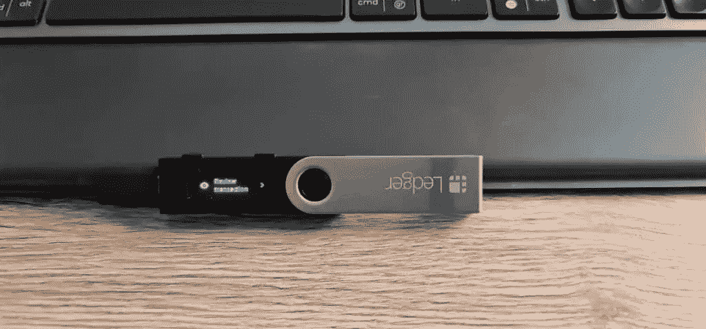

向右滚动，直到出现“接受并发送”消息，然后按下两个按钮。

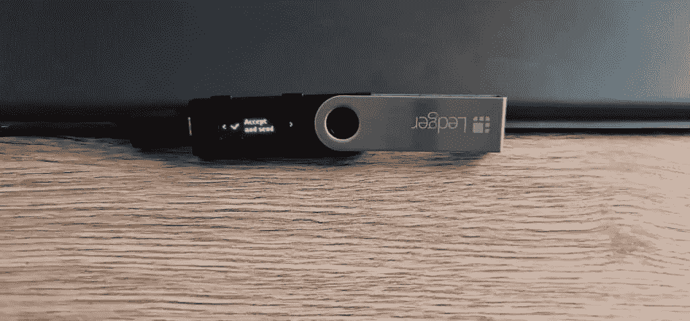

瞧，我们已经种好了植物。尽管现在每个人和他的狗都在卖植物来买猪(或者拿走$$$)但我并没有和我的花园或滴灌有任何关系。我在种植它们，所以我在滴灌时处于一个很好的位置。

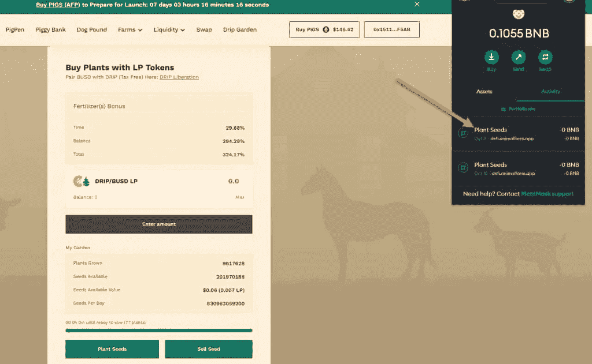

你完了。你也可以用 Ledger Live open 来做这件事，但对我来说，我不介意，我只是用 Ledger Live 来添加令牌，检查固件等。

快乐定义

注意:把你的种子短语放在分类账上可以阻止你在 crypto 中被黑的一种方式，但是还有其他方式。当然，

你不应该把你的种子短语给任何人。

> *我不是财务顾问。本文中的任何内容都不应被理解为投资建议。你必须 DYOR(做你自己的研究)无论是作者还是出版物都不承担任何责任或义务的任何投资，利润或损失，你可能会招致作为这一信息的结果。文章可能包含附属链接。谢谢你花时间阅读我的文章，如果你想订阅的话。我的文章和指南旨在帮助您浏览经常令人困惑的加密世界。*

马克@阿尔特

*原载于 2022 年 10 月 12 日***。**

> *交易新手？尝试[加密交易机器人](/coinmonks/crypto-trading-bot-c2ffce8acb2a)或[复制交易](/coinmonks/top-10-crypto-copy-trading-platforms-for-beginners-d0c37c7d698c)*