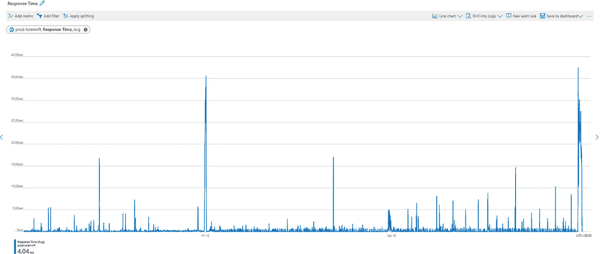
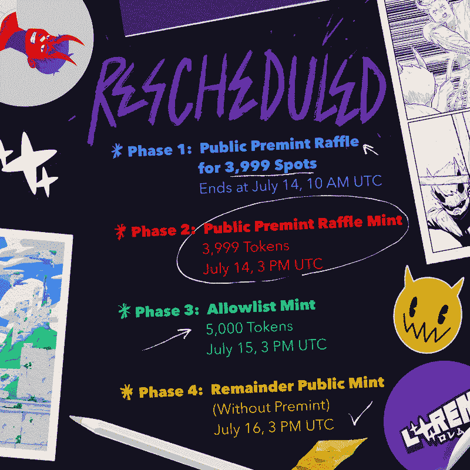
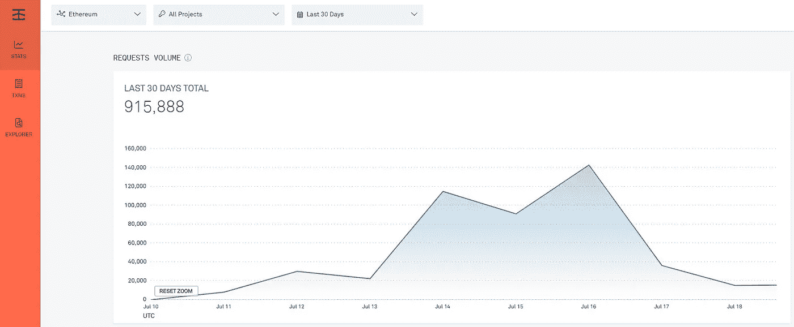
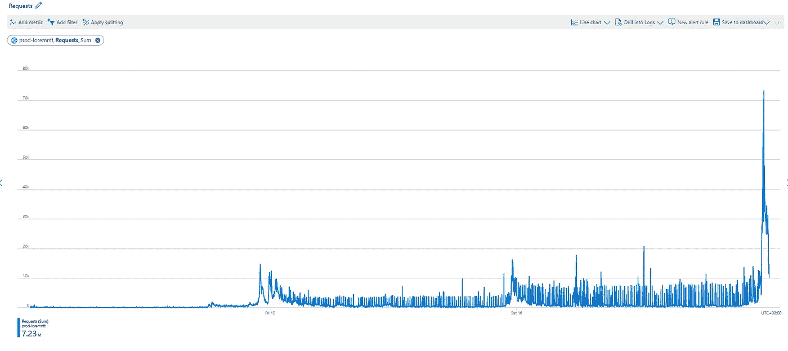
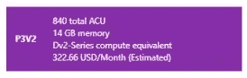
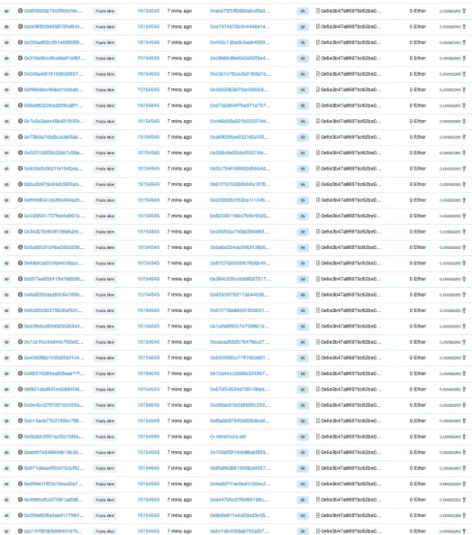

# 调整时间

> 原文：<https://medium.com/coinmonks/adjustmints-bff8ff59fd48?source=collection_archive---------18----------------------->

无观点的数据

Memory Percentage before & after Upgrade on LOREM website

概述 [LOREM](https://twitter.com/LOREMNFT) 的**原创**造币阶段

**50%公开造币，50%允许列表造币** 7.13 —公开造币#1
7.14 —允许列表
7.15 —剩余公开造币#2

LOREM 的合同最初也需要官方网站的自动签名，但在时间线运输公司造币之后，我们对合同进行了更新，并发布了新的时间表，如下所示。

**第一阶段:**注册奖金和抽彩

4 Phases of LOREM Mint

**第 2 阶段:**在 3，999 个没有超额分配**给那些注册并赢得 Premint 抽奖的人的**名额中，有 3，500 个名额是在第 2 阶段创造的。

Requests on Infura during all Mint Phases

在第 2 阶段和第 4 阶段，在 [Infura.io](https://infura.io/) 上，请求数量超过了我们网站上每 24 小时 10 万次的免费请求。我们要求 Infura 阅读“铸造”的数量，并阅读铸造阶段/状态的合同。

**第三阶段:**大约在。75000 铸造，AllowList 是由分配给不和谐的居民，合作伙伴和 OG 收藏的创始人朋友持有人，不管最近在该空间的活动。

Animations by [Sina](https://twitter.com/ImaginarySina)!

**第四阶段:**公共造币厂在造币厂开业前 6 小时转变为(特定项目的)持有人允许名单。快照**未**公布。

30 个项目超额分配了大约 85K(不可堆叠)钱包(参见合作伙伴和非合作伙伴列表的[不和谐](https://discord.gg/loremnft)历史记录),共分配了 25k 薄荷糖。下面显示了 LOREM 网站上的请求数量在第 4 阶段薄荷开放时达到近 75K 的峰值。

Requests on LOREM website during Phase 4

请求数量要求我们的 web 应用程序服务进行内存升级。

Azure Workload Tier

一些 bot mint 试图通过未公开的“公共 mint”下的合同使用相同的指定燃气费设置。

Cropped 72 failed txn in unopened Public Mint within a single minute

第 4 期 9899 的最后一次造币在开盘 30 分钟后结束。最后 100 个(代币 9900–9999)被保留为“公共领域”CC0 特征，并将对所有人公开。

我个人特别感谢你！

)(我)(们)(都)(不)(知)(道)(,)(我)(们)(还)(不)(知)(道)(,)(我)(们)(还)(是)(不)(知)(道)(,)(我)(们)(还)(是)(不)(知)(道)(,)(我)(们)(还)(是)(不)(知)(道)(,)(我)(们)(还)(是)(不)(知)(道)(,)(我)(们)(还)(是)(不)(知)(道)(,)(我)(们)(还)(是)(不)(知)(道)(,)(我)(们)(还)(是)(不)(知)(道)(道)(,)(我)(们)(还)(没)(有)(什)(么)(好)(感)(。

> 交易新手？试试[加密交易机器人](/coinmonks/crypto-trading-bot-c2ffce8acb2a)或者[复制交易](/coinmonks/top-10-crypto-copy-trading-platforms-for-beginners-d0c37c7d698c)