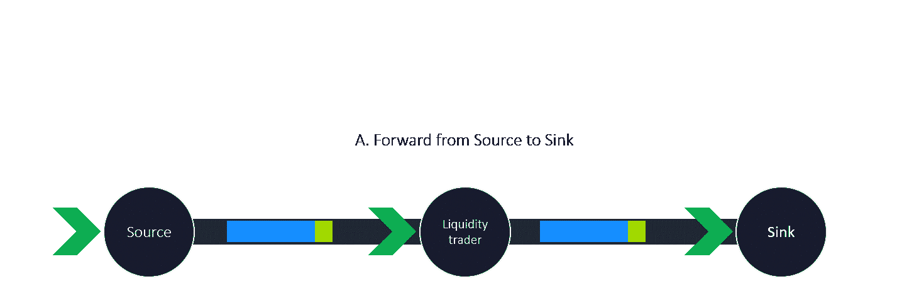
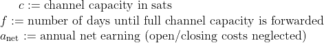
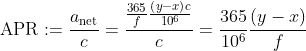

# 运行比特币闪电节点的冒险——第二部分:成长…

> 原文：<https://medium.com/coinmonks/adventures-in-running-a-bitcoin-lightning-node-part-2-growing-up-430c6efcd40?source=collection_archive---------3----------------------->

Photo by [Wes Carpani](https://unsplash.com/@wes_c?utm_source=medium&utm_medium=referral) on [Unsplash](https://unsplash.com?utm_source=medium&utm_medium=referral)

> 自从“潜力”系列的第一篇文章[运行比特币闪电节点的冒险——第一部分:觉醒……](/p/61345585acc3)以来，发生了很多事情:

1.  世界继续前进…谁知道呢，**希望**会更好！
2.  比特币确实死了……**又一次**！
3.  我的闪电节点沿着…嗯**如此之快**！

但是: ***我学了一吨！*** 尽管我很想分享，但这一切很难重现，而且可能过于详细。所以，下面是一些你可能还不知道的见解的简短总结:

1.  **寻找好的渠道同行**:我尝试了多种方式寻找好的同行。[闪电网+](https://lightningnetwork.plus/) 和[火环社区](https://satoshiradio.nl/ringoffire/)很好的找到了同行连接到**和**同时获得了入站流动性。然而，并不是所有来自这些联系的渠道都真的成功了，大约 80%的渠道到目前为止都不太顺畅。但另外 20%成了好的渠道同行。
    为了成为网络上唯一路径的一部分，我还玩弄了我自己的策略来连接由[终端](https://terminal.lightning.engineering/#/)排列的前 200 个节点，在那里我共享**最少数量的相同点**。然而，我猜当你的节点中心性不够高时，唯一路径本身并不会吸引很多路由。到目前为止，这种策略并没有产生有价值的渠道。
    到目前为止，最有效的方法就是向终端排名很高的同行(前 50 名)开放超过 3M sats 的频道，这些终端的收费政策符合你的收费政策。最近，我仔细观察了安博斯的岩浆。探索的额外选择！
2.  **自动化** [**收费-lnd**](https://github.com/accumulator/charge-lnd) **和** [**再平衡-lnd**](https://github.com/C-Otto/rebalance-lnd) **:** 最初，我应用了`proportional`收费-lnd 策略，该策略根据一个渠道对所有渠道的余额来设置费用(即，当渠道流动性为本地时低费用，当渠道流动性为远程时高费用)。重新平衡-lnd 在开始时仅手动应用**以观察哪些渠道可以以何种费用和金额重新平衡。几个星期后，我了解了渠道的流量和收费标准，以及哪些渠道可以以什么样的价格重新收费。随后，我对可预测的渠道采用了固定转让费的收费策略。此外，为了分散其他对等体的注意力以使用耗尽的信道(即，几乎所有的流动性都位于远处)来进行路由，并且为了避免转发尝试失败，可以将`max_htlc_msat`设置为低于可用本地余额的值(注意:通过观察该值的公开可见变化，可以猜测路由了多少容量，因此这可能是潜在的隐私问题)和/或将`base_fee_msat/fee_ppm`设置为非常大的值。**
3.  **Tor 及其连接性问题:如果您没有静态 IP，也不知道如何应用适当的 OpSec 来保护公共 IP 后面的节点，Tor 是很好的选择。然而，Tor 的稳定性并不总是一成不变的，可能会对节点的连接和路由行为产生负面影响。2022 年 6 月，一场持续的 [Tor 网络 DDoS 攻击](https://status.torproject.org/issues/2022-06-09-network-ddos/)导致可观察到的路由活动减少，通道禁用更加频繁，不幸的是，还导致我的 lightning node 的一些通道被迫关闭。为了避免 Tor 问题，我设置了我的节点用于混合模式(Clearnet 和 Tor)连接。这明显稳定了连接！然而，在混合模式下设置一个节点需要您足够精通技术。如果你对此感到不舒服，我可以推荐你调查一下最近的服务，比如隧道服务(注意隐私问题！).**

**好了，到目前为止，关于超短的洞察力，让我们得到一些真正的宝石…**

# **清盘源-汇策略**

**据我所知，没有既定的结构良好的策略分类来操作闪电路由节点。2021 年 3 月亚历克斯·博斯沃思(Alex Bosworth)的一次谈话的文字记录最接近于第一种分类形式。在他的演讲中，Alex 定义了七种类型的路由节点:乒乓；流动性电池；内向采购；流动性交易员；最后一英里；互换；数据经纪人。我在下文中描述的所谓的**清盘源-汇策略**是流动性交易者路由节点策略的具体形式:**

****

**Wind-up source-sink strategy of a lightning routing node**

**闪电路由节点的清盘源汇策略实现**盈利**转发收益的目标如下:**

****A.** 为一个**可靠的**(例如，静态的)**和有利可图的**x ppm 的路由费用建立一个**始终可用的转发机会**从源端向接收端的支付，**

****B.** 通过对 a **进行从源到汇通道的自动循环再平衡，可靠且显著降低 y ppm 的**再平衡费用(y < < x)。**

**培育有利可图的清盘源-汇战略应具备的条件:**

1.  ****长期源/汇渠道非常活跃，始终可用&通过可预测的费用政策大力推动源/汇节点。** *长寿- >节省开/关成本；始终可用&可预测:建立可靠性；非常灵敏的&强力推/拉- >以尽可能快的速度重复模式。***
2.  ****汇聚节点立即在汇聚通道**上拉出新的可用流出流动性(高吞吐量，通常从不发回任何 sat)。*尽可能快地重复这个模式。***
3.  **源/宿节点的转发(=再平衡)费用是高度可预测的。 *通过可预测的再平衡费用实现可靠性/盈利性。***
4.  **源(和接收器)节点连接良好。 *拥有众多潜在的再平衡路线*。**
5.  ****严重失衡时，源/宿节点不会关闭通道。** *可靠而有利可图地重复模式。***

**对于熟悉再平衡原则的人来说，这听起来是一个相当明显的策略。让我吃惊的是观察到…**

1.  **这种源-汇对是存在的，其中再平衡成本**比转发收益**低得多，高达 60%**
2.  **这种源-接收器对以其最简化和最简单的形式存在，这意味着源和接收器通道用于重新平衡操作，而不使用节点的**额外的**其他通道。因此，这种策略可以应用于两个通道，而不会干扰其他通道的行为。**

# **上紧式源汇策略如何找到源汇对？**

**那么，在哪里，如何找到这样的模式呢？根据我的经验，这里有一些一般性的建议:**

1.  ****观察你的渠道找到一个下沉的渠道**:
    ***a .****有没有一个下沉的渠道，定期拉你的流出流动性，却从来不送回来？
    ***b.*** 当你重新平衡到它的时候，你新获得的流出流动性充其量是立刻又被拉回来了吗？
    ***c.* 对于下沉渠道的各种平衡状态，你的下沉渠道的转发费用是如何变化的？它们的变化是可预测的吗？您能观察到重新平衡费用的上限吗？您可以设置该上限并立即重新平衡，或者至少非常快速可靠地重新平衡。
    ***d.*** 再平衡费的上限是否明显低于你那个渠道的转发费？
    **比这个可能是你上紧发条的源汇策略的一个候选汇道！*******
2.  *****观察候选接收器的转发和重新平衡路由:
    *a.*** 您是否有总是来自相同源通道的到候选接收器的转发？
    ***b.*** 您是否有经常从同一通道开始的重新平衡路线？

    **比这可能是一个候选的来源渠道，为您的发条源-汇战略！*****
3.  *****使用自动再平衡脚本验证您的源和汇候选者:
    *a.*** 为汇通道上的流出流动性确定一个良好的下限，使您能够不断再平衡，并且足以不断满足汇的需求。
    ***b.*** 为源渠道上的流入流动性确定一个良好的下限，该下限未被其他远期使用，并且足以持续满足汇的需求。
    ***c.*** 增强并应用您的重新平衡脚本(我使用基于 [rebalance-lnd](https://github.com/C-Otto/rebalance-lnd) 的扩展 bash 脚本)，以便每当您为源-接收器通道定义的下限有被突破的危险时，它们总是立即开始从源通道到接收器通道的重新平衡。你能用你的自动再平衡脚本在你的界限内持续提供源汇流吗？源汇流是否会持续更长时间(例如几天、几周)而不降低转发费用？你的再平衡路线和你在再平衡上的投资稳定吗？
    **如果所有答案都是肯定的，宾果！*****

# ***如何优化和扩大你的清盘源-汇战略？***

***考虑以下问题作为后续步骤:***

*   ***你能优化源汇流，使之不发生转发中断吗(因为通道暂时耗尽)？***
*   ***你能否通过不断调整`max_htlc`(在你的渠道容量或平衡受到阻碍的情况下)来进一步提高***
*   ***你能衡量水槽的需求吗？***
*   ***重新打开更大的源或接收器通道？***
*   ***重新开放更多通道到一个 sink 超级节点的节点(如果是 lightning 节点的复合)？***
*   ***您能从源节点扩展供应吗？***
*   ***你能扩展你的再平衡能力吗？我对过于激进地应用再平衡有点犹豫。但是目前，我的节点不断地发送重新平衡尝试**到目前为止没有任何问题。所以不要太害羞！*****

*****但是要小心谨慎:*****

*   *****不能保证源汇流和有利可图的再平衡的可能性持续下去！*****
*   *****积极的重新平衡可能会对您的节点(例如，许多过去的通道状态、CPU 周期、对任务控制的影响)或对您的路由对等体(对等体因为被许多传入的 HTLCs 打扰而关闭通道)产生负面影响。*****
*   *****找到一个没有其他对等体干扰的纯信源-信宿对并不容易，因为它们可能很少见。*****
*   *****如果闪电网络进一步成熟，从这种网络不平衡中获得的利润可能会减少。我不会仅仅在这一策略上大量投资。也应用其他盈利策略与其他渠道。*****

*****否则，啜饮果汁！*****

# *****结果*****

*   *****在过去的两个月里，我尽可能地采用了“上紧发条的源汇策略”,通过转发到汇，我的收入显著增加了！*****
*   *****根据利润范围 y-x ppm 和清盘模式随时间重复的速度，对我来说，这将产生 0.5%至 1%的下沉渠道年利率。但有了正确的源汇渠道，更大的 APR 应该是可能的！*****
*   *****准确地说，我的 APR 计算遵循以下定义:*****

********************

*****APR 公式显示了相关的内容:*****

1.  *****转运费 y 和再平衡费 x 之间的差额越大，APR 就越大。*****
2.  *****f 越小(即模式可以重复多快)，APR 越大。*****
3.  *****渠道容量不一定要大，只要大到足以维持上紧发条的源汇模式，而不会出现流动性短缺！*****

# *****已经对了，这次到此为止！*****

*****希望你觉得这篇文章很有见地！有问题就 Ping 我！敬请关注更多…*****

> *****交易新手？试试[加密交易机器人](/coinmonks/crypto-trading-bot-c2ffce8acb2a)或者[复制交易](/coinmonks/top-10-crypto-copy-trading-platforms-for-beginners-d0c37c7d698c)*****