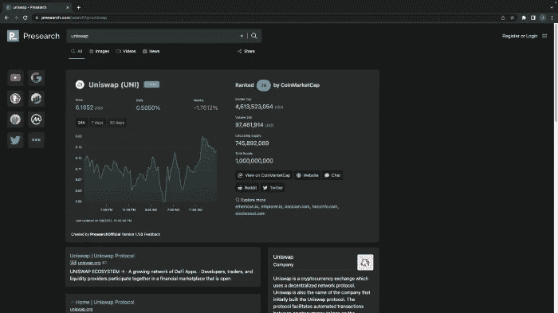
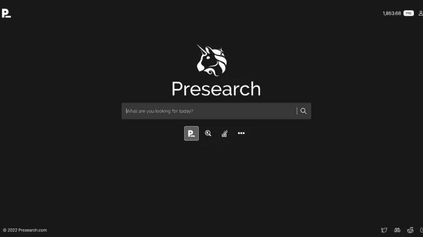

# 加密项目的广告补助

> 原文：<https://medium.com/coinmonks/advertising-grant-for-crypto-projects-3c5dd12e6512?source=collection_archive---------11----------------------->

Who Needs $100K free Marketing?

Presearch 为加密项目提供了广告资助。预搜索将给予 10 个合法的加密项目免费营销，每个价值 10 万美元。

我将向您介绍预搜索，然后我们将讨论:

*   谁有资格获得广告补助？
*   如果您赢得一项预研究资助，您将获得什么
*   当你需要申请预研资助时
*   去哪里申请营销资助
*   为什么你现在应该申请助学金

准备好超动力你的营销活动！

# 什么是预搜索？

Presearch 是唯一一个向注册会员提供搜索赚取奖励的分散式隐私搜索引擎。自 2017 年以来，该搜索引擎一直用于帮助人们在不收集或共享信息的情况下，从他们最喜欢的搜索引擎中聚合结果。

它每天有来自 100 多万月活跃用户的 400 多万次搜索，并为加密项目和小型企业提供低成本营销机会。谁有资格获得广告补助？

# 谁有资格获得广告补助？

任何加密项目都可以申请。有十个类别:

1.  隐私币
2.  第 1 层(L1)区块链
3.  第二层(L2)区块链
4.  挑战
5.  元宇宙和加麦菲
6.  NFTs
7.  Web3 平台(即 Lens、LBRY、Minds 等。)
8.  基础设施(即 Flux、Metamask、Rainbow、Akash、Uniswap 等。)
9.  稳定的硬币
10.  其他的

每个类别将有一个赢家。有些品类已经收到了很多申请，而 L1s 和 L2s 的竞争力较低。查看媒体上的预搜索公告。

 [## Presearch 启动 100 万美元的广告资助计划

### 为了帮助 10 个有价值的项目击败 crypto winter，Presearch 提供了 100 万美元的广告资助(每个项目 10 万美元)

news.presearch.io](https://news.presearch.io/presearch-launches-1-million-advertising-grant-program-666ff1afc120) 

# 如果您赢得一项预研究资助，您将获得什么

每位获奖者将获得价值 100，000 美元的免费营销，包括:

1.  5 万美元的关键词广告
2.  4.5 万美元的站点接管
3.  5K 美元的社会曝光率

这些都是获得跨多个平台曝光的独特机会。

## 5 万美元的关键词广告

Presearch 预计，每个项目都将从关键字赌注中获得超过 25，000 次点击。它将由 Presearch 的营销团队管理。

他们对每次搜索的点击量估价为 2 美元，与谷歌上的大多数加密关键词相比，点击量大约有 50-67%的折扣。

Example of position of placement for Uniswap

## 4.5 万美元的站点接管

网站接管将在两天内用您项目的徽标替换预搜索徽标。这是一个强大的品牌推广机会。您的徽标将在全球范围内被看到大约 400 万次。

他们对此的估价是每 1000 次点击 5.63 美元。他们有一个 5 天的错字，我认为会更好，但让你的标志在这么多人面前是强大的。鉴于真正的成本是免费的，你不能忽视这个品牌推广机会的价值。

## 5K 美元的社会曝光率

在 Twitter、Medium 和 YouTube 上讨论你的参与情况也将有助于提高你的曝光率。希望这将会给很多伟大的加密项目增加他们的追随者的机会，并为他们带来一些新的投资。

# 当你需要申请预研资助时

2022 年 9 月 30 日是申请预研资助的申请日。确保你在月底之前申请它。我正要告诉你去哪里申请。

# 去哪里申请营销资助

你应该去 https://presearchcommunity.typeform.com/Grant?typeform 申请。你必须回答几个问题，包括如何联系你和项目信息。

确保在 2022 年 9 月 30 日前提交资助申请。

# 为什么你现在应该申请助学金

许多企业的营销成本占收入的 8%，但加密项目通常依靠社区成员来营销他们的项目。现在你可以测试合法的营销活动。

这是一个很好的机会来确定是否花费金钱在 PPC 或 CPM 搜索引擎营销是值得的金融投资。

如果你觉得这个博客有帮助，别忘了喜欢它，订阅我的博客，并分享它。

# 也看看我的其他作品。

[**上翻**](https://www.upflip.com/blog) :关于商业的博客

[**布兰登的精神病院**](https://brandonsinsanitorium.com/) :电子商务

**品牌做得更好**:全面营销公司即将到来。

> 交易新手？尝试[加密交易机器人](/coinmonks/crypto-trading-bot-c2ffce8acb2a)或[复制交易](/coinmonks/top-10-crypto-copy-trading-platforms-for-beginners-d0c37c7d698c)