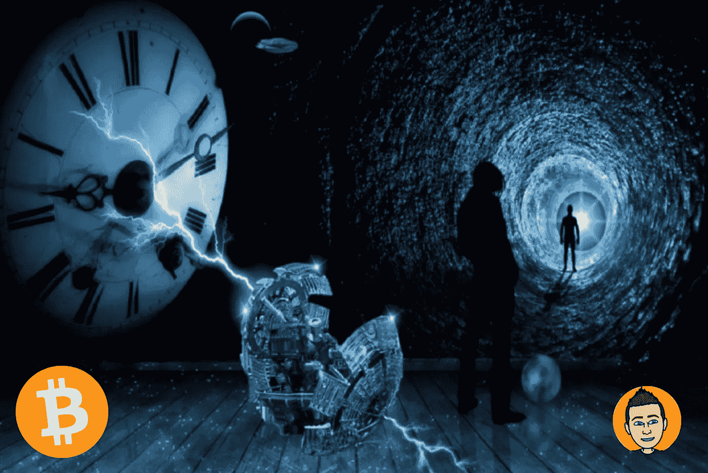

# 来自秘密时间旅行者的建议

> 原文：<https://medium.com/coinmonks/advice-from-a-crypto-time-traveler-a117ba3ecd17?source=collection_archive---------2----------------------->

跟上当前密码市场的发展是非常容易的。过于关注日常价格波动。试图找到下一个增长 100 倍的密码。试图一夜暴富。正是如此短暂的时间框架让熊市变得如此艰难。对于任何密切关注自己投资组合的人来说，看到它在短短几个月内下跌 80%或更多会…